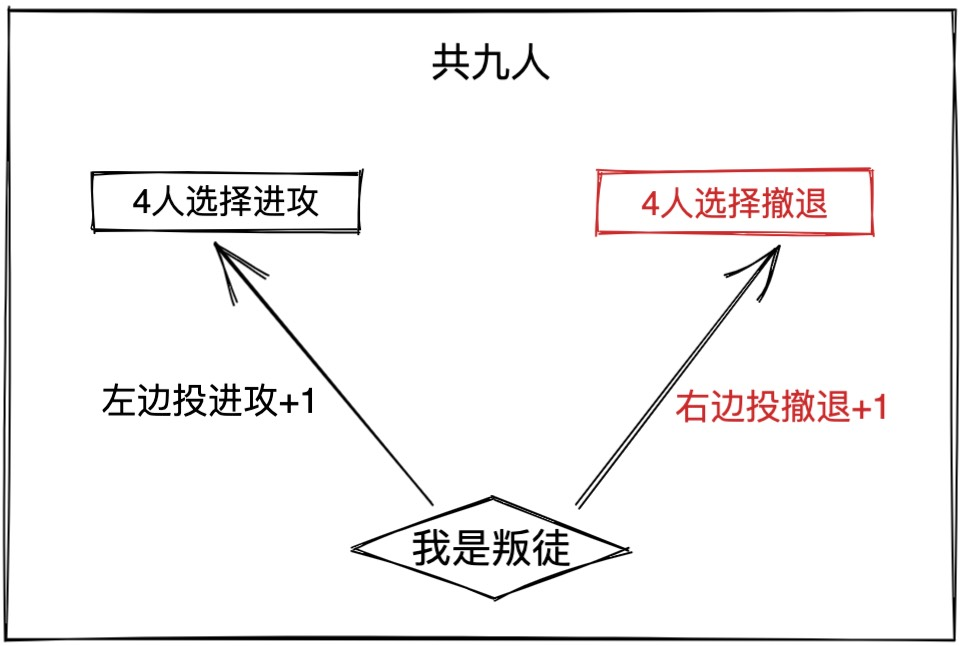
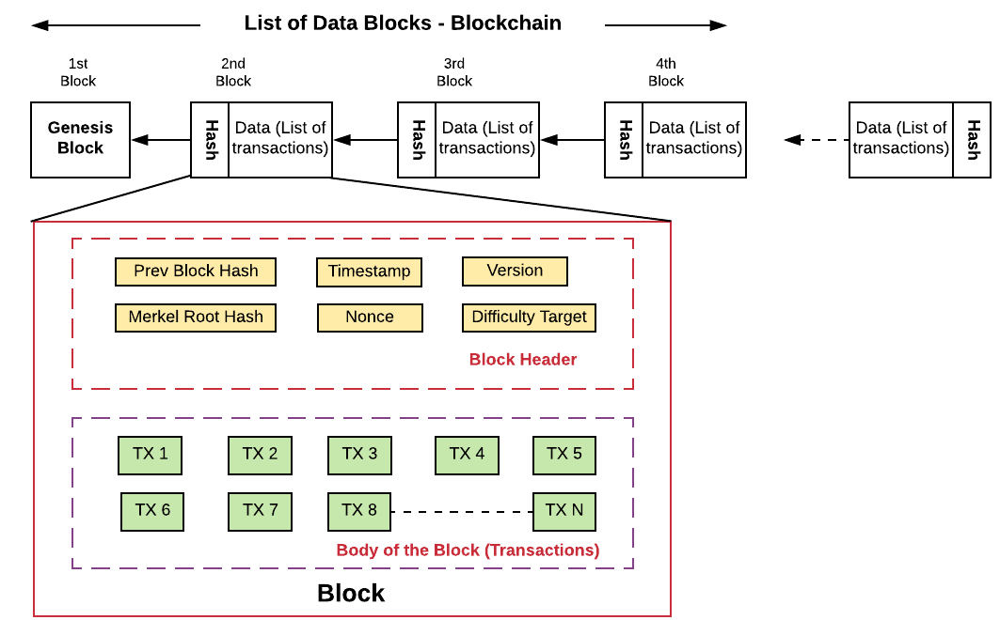
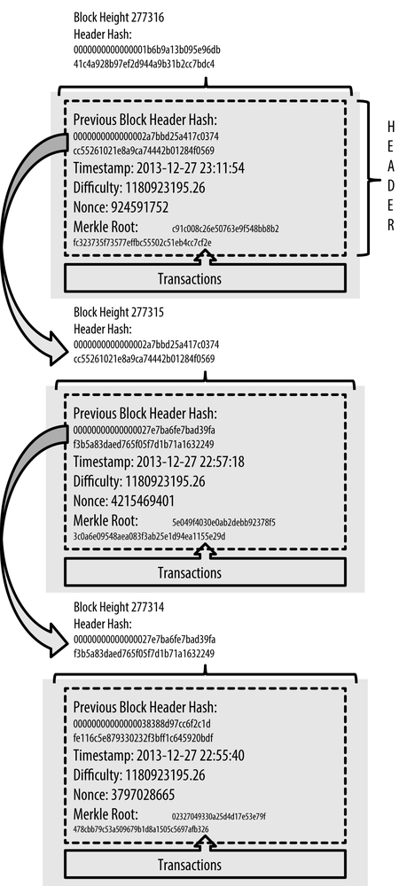
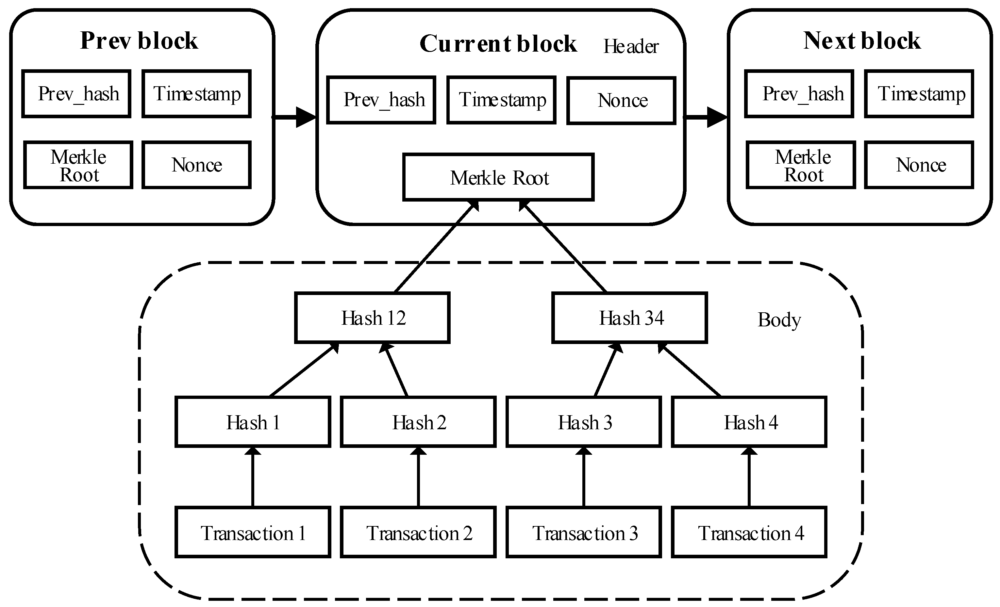
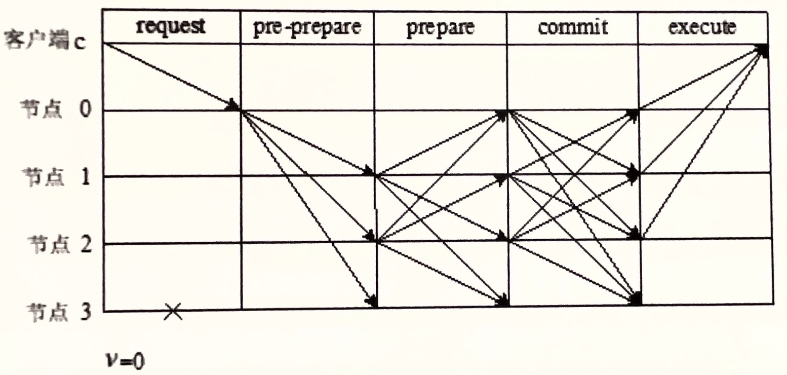
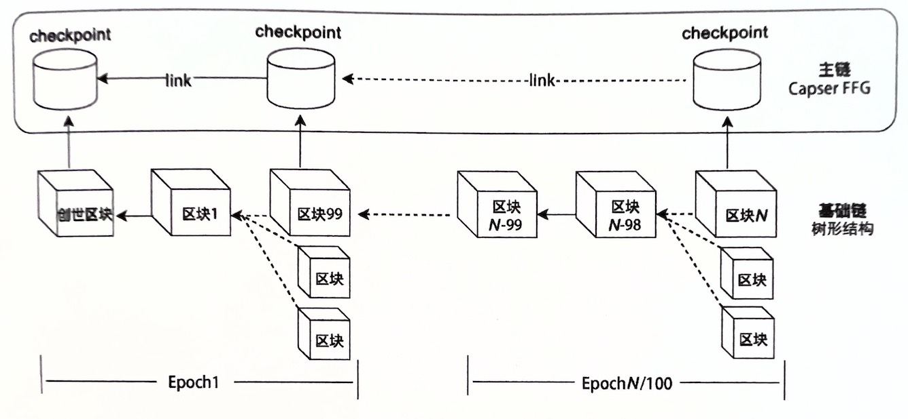
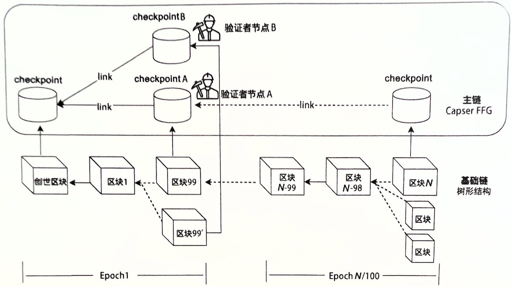

# 共识算法

共识算法是分布式系统中维护状态一致性的关键技术，广泛应用于各类系统，如分布式文件系统和分布式数据库。这些算法根据应用场景的具体需求而有所不同，特别是在公链和联盟链的应用中。

在公链中，共识算法需满足高扩展性，确保在节点动态加入网络的情况下，共识流程仍然有效运行，同时防御可能的拜占庭式攻击。由于 FLP 不可能性定理和 CAP 定理的限制，公链的共识算法通常无法提供绝对的一致性保证。

相比之下，联盟链的共识算法则侧重于实现强一致性和高性能。虽然对系统的可扩展性和防御拜占庭节点的攻击力度需求不如公链高，但联盟链仍需确保系统的稳定性和效率。

> 说明： 在本文档中，由于不是关键，所以没有对一致性（Consistency）和共识（Consensus）概念作严格区分，所以读者会看到这两个概念在同一个位置混用的情况。
> 笔者在此根据多方资料对这两个概念先进行解释：
> **一致性**：主要描述的是分布式系统多节点的情况，各节点中某一类元素在不同时刻的对外呈现的状态一致性。其中的「状态」的概念由所在系统定义，如数据库系统中的状态主要指的是数据在事务执行前后的状态。
> 一致性可以分为**顺序一致性、线性一致性、弱一致性**，其中线性一致性也叫做强一致性，最终一致性是弱一致性的特定状态。
> **共识**：主要描述的是分布式系统多个节点，彼此针对某一提案达成一致认识的**过程**。
> 可以大致认为，一致性描述的是**对外呈现**的结果状态，共识描述的是过程。

## 一、背景

### 1. 共识算法简史

共识算法是分布式系统的核心，用于确保不同节点间的数据一致性。下面是共识算法发展简史的概述：

1. 1978 年 - Jim Gray 在其论文中首次提出了**两阶段提交（2PC）**，这是早期尝试解决分布式数据一致性问题的方案。尽管 2PC 能解决一定的一致性问题，但它存在验证的阻塞和脑裂（网络分区）问题。
2. 1981 年 - Dale Skeen 进一步提出**三阶段提交（3PC）**，该算法改进了 2PC 的阻塞问题，但仍存在脑裂和单点故障的问题。
3. 1982 年 - Leslie Lamport 提出了**拜占庭将军问题**，这一理论引入了拜占庭错误的概念，展示了一致性问题的高复杂度，并在其论文中探索了在同步模型下的解决方案。
4. 1985 年 - F, L, P（Fischer, Lynch, Paterson）提出了 **FLP 不可能定理**，明确指出在一个异步网络中，如果至少有一个节点故障，就无法设计出完美的共识算法。
5. 1988 年 - Dwork, Lynch, Stockmeyer 引入了**部分同步模型**，这是一种介于同步和异步之间的网络模型，在该模型下可以在某种程度上绕过 FLP 定理的限制。
6. 1990 年 - Lamport 又提出了 **Paxos 算法** ，这是第一个旨在异步网络中保证安全，并且在网络变为同步时能确保一致性的共识算法。大量后续的共识算法如 Raft，都是基于 Paxos 的变体。
7. 1999 年 - Miguel Castro 和 Barbara Liskov 提出了**PBFT（实用拜占庭容错）**算法，大幅降低了拜占庭容错算法的运行复杂度，成为第一个实用的拜占庭容错算法。
8. 2008 年 - 中本聪发表比特币白皮书，首次提出了比特币概念，并将 **工作量证明（PoW）** 算法应用于区块链。此后，各种新型共识算法如权益证明（PoS）、授权证明（PoA）等相继出现，共识算法从传统分布式系统演化到专为区块链设计。

这一历史梳理不仅展示了共识算法的演变，还揭示了它们如何从解决传统分布式系统的一致性问题，演化到支持现代区块链技术的关键工具。

### 2. 早期数据库系统中的共识机制（分布式一致性方案）

在早期的数据库系统中，为了确保在多节点环境下的事务一致性，设计者们开发了一系列分布式一致性方案，其中最著名的是两阶段提交（2PC）和三阶段提交（3PC）。这些方案主要通过预写式日志机制来实现节点间的事务一致性及故障恢复。预写式日志是一种保证数据完整性的技术，通过在事务正式提交前记录数据的预期变更，确保即使在发生故障时也能恢复到一致的状态。

2PC 和 3PC 的设计初衷是处理节点因工作异常或网络问题而无响应的情况，而不是防御恶意节点的攻击。这意味着它们假设所有节点基本上是诚实的，只是可能会因为技术故障而无法完成其任务。因此，这些协议非常依赖于网络的可靠性和节点的正常运行，一旦遇到网络分区或节点故障，可能会导致事务处理的延迟或阻塞，这在现代分布式系统中可能是一个限制因素。

#### 2.1 两阶段提交（2PC）

在数据库系统中，两阶段提交（2PC）是一种广泛采用的协议，用于保障多个节点参与的事务的一致性。该方法由一个称为事务管理器（TM）的协调节点控制整个事务过程，负责与所有参与的资源管理器（RM）协作，确保事务要么完全提交，要么完全回滚。

**第一阶段**

- 事务管理器（TM）向所有资源管理器（RM）发送“准备好提交事务吗？”的询问。
- 各参与节点回应“是”（Yes）或“否”（No）。

**第二阶段**

- 如果所有参与节点的回应都是“Yes”，则 TM 向所有 RM 广播“提交（Commit）”指令。
- 如果任一节点回应“No”或未在规定时间内回应，则 TM 广播“回滚（Rollback）”指令。
- 完成指令后，参与节点向 TM 发送确认回应（Ack），TM 随后标记事务为已完成。

##### 优点

- 简单有效：2PC 协议结构简单，能够在同步通信系统中有效地保障事务的强一致性。
- 恢复能力：在节点发生故障时，系统会暂停服务，待节点恢复后，系统可继续运行并保持数据的一致性。

##### 缺点

- 阻塞问题：在第一阶段中，所有节点必须锁定其控制的资源，导致这些资源在事务提交期间无法被其他操作访问。
- 脑裂和恢复问题：

  - 在第二阶段，如果部分节点由于网络问题或 TM 故障未接收到指令，会导致临时的数据不一致。这种状态只能在节点与 TM 的通信恢复后才能解决。
  - 如果参与节点在发送完成事务的确认（Ack）之前故障，即使 TM 恢复，也无法确定事务的最终状态，必须等待所有参与节点恢复后才能解决。
- 单点故障：TM 作为中心节点，其故障会导致整个系统阻塞，直到 TM 恢复。

通过这种方式，两阶段提交确保了跨多个分布式节点的事务能够一致地提交或回滚，尽管它面临一些性能和可靠性挑战。

#### 2.2 三阶段提交

为了解决两阶段提交（2PC）中存在的阻塞和潜在的脑裂问题，三阶段提交（3PC）协议被开发出来。该协议通过引入额外的预提交阶段和参与者的超时机制来增强系统的鲁棒性，并使用预写日志来保障节点在故障后能从日志中恢复到正确的状态。

**第一阶段：询问提交**

- 协调节点向所有参与节点发送“CanCommit”指令以询问是否准备好提交事务，同时启动超时计时。
- 若在超时期限内未收到协调节点的下一步指令，参与节点将终止事务。

**第二阶段：预提交**

- 如果所有参与者都回答“Yes”，协调节点随后发出“PreCommit”指令。
- 参与者在将事务的 undo 和 redo 日志写入稳定存储后回复“Yes”或“No”，并在此之后启动另一个超时计时。
- 如果在此阶段超时未收到协调节点的最终指令，参与者将根据自己的预提交状态直接提交事务。

> 预提交是指参与者将事务的 undo 和 redo 日志写入本地的稳定存储介质，但不进行真正提交；同时这里的参与者超时后回滚是与两阶段提交的「阻塞等待」的不同之处。

**第三阶段：最终提交**

- 如果所有参与者在预提交阶段都回复“Yes”，协调节点则发出“DoCommit”指令。
- 参与者收到后执行最终提交，向协调者发送最终的确认响应（Ack）。
- 如果有参与者回答“No”或响应超时，协调节点会指示所有参与者根据 undo 日志回滚事务。

**注意点**

- 如果协调者在最后阶段宕机，那些未收到“DoCommit”指令的参与者将在超时后直接提交事务。
- 如果参与者在收到回滚指令后完成回滚，也需要向协调者发送确认响应（Ack）。

**优点**

- 减少阻塞：通过引入预提交阶段和参与者的超时机制，3PC 减少了参与者因等待协调节点的指令而产生的阻塞。
- 增强决策能力：参与者能根据自己的日志在超时情况下自主决定提交或回滚，增强了系统在协调节点故障时的独立性。

**缺陷**

- 潜在的数据不一致：在网络分区的情况下，已经进入预提交阶段的节点在超时后可能会提交事务，而未接收到预提交指令的节点则会回滚，导致数据不一致。即使网络恢复，新的协调者也难以判断事务的正确状态。

尽管三阶段提交提供了比两阶段提交更高的容错性，但它仍然不能完全解决所有分布式系统中的一致性问题。

#### 2.3 小结

两阶段提交（2PC）和三阶段提交（3PC）通常适用于同步通信的分布式系统。然而，在现实中，许多分布式系统是由通过异步通信方式相连的多个主机组成的集群。在这种异步系统中，常见的挑战包括通信故障、主机性能不足或网络拥堵等，这些因素都可能导致错误信息在系统内部错误地传播。

由于这些问题，传统的两阶段或三阶段提交协议可能不足以应对所有情况，尤其是在网络不可靠的情况下。因此，分布式系统需要依赖更加健壮的共识算法来构建容错协议，这些算法能够在默认不可靠的异步网络环境中确保各个主机之间达成一个安全且可靠的状态共识。

总的来说，为了在分布式系统中实现高效且可靠的状态同步和一致性保障，选择和实施适合的共识算法至关重要。这要求算法不仅能处理正常操作中的协调问题，还能在遇到网络延迟、节点故障等异常情况时保持系统的整体一致性和可靠性。

### 3. 拜占庭将军问题

在讨论拜占庭将军问题之前，重要的是要了解早期的分布式一致性方案如两阶段提交（2PC）和三阶段提交（3PC）的局限性。这些方案虽然模型简单，却存在明显的安全性缺陷，并且假设系统中不存在恶意节点，只能在诚实节点的环境中有效运作。

随着分布式系统的复杂性增加，特别是在可能包含恶意节点的环境中，需要更健壮的共识算法来处理这种情况。拜占庭将军问题正是这类研究的核心。这个问题描述了一种情况，其中系统中的一些节点可能会故意发送错误或矛盾的信息，从而破坏系统的一致性。

拜占庭将军问题是通过以下场景来说明的：若干将军各领一支军队围攻一个城市，他们只能通过信使传递信息。为了成功攻占城市，所有将军必须同意攻击或撤退的统一行动计划。然而，一些将军可能是叛徒，会故意发送虚假信息以迷惑其他忠诚的将军。解决这一问题的算法必须能确保即便存在叛徒，忠诚的将军们也能达成一致的决策。

理解拜占庭将军问题对于深入学习和应用共识算法是至关重要的，因为它展示了在存在潜在恶意行为的分布式系统中，如何设计能够抵抗这类攻击的算法。这一问题的解决方案也催生了多种拜占庭容错（BFT）算法，这些算法现在是构建安全可靠的分布式系统和区块链技术的基础。

拜占庭将军问题，是在 1982 年 Leslie Lamport、Robert Shostak、Marshall Pease 三位科学家的论文中提出的。下面贴出论文中的描述(来自维基百科)：

> 一组拜占庭将军分别各率领一支军队共同围困一座城市。为了简化问题，将各支军队的行动策略限定为**进攻或撤离**两种。因为部分军队进攻部分军队撤离可能会造成
> 灾难性后果，因此各位将军必须通过投票来达成一致策略，即所有军队一起进攻或所有军队一起撤离。因为各位将军分处城市不同方向，他们只能通过信使互相联系。
> 在投票过程中每位将军都将自己投票给进攻还是撤退的信息通过信使分别通知其他所有将军，这样一来每位将军根据自己的投票和其他所有将军送来的信息就可以知道
> 共同的投票结果而决定行动策略。

拜占庭将军问题的核心在于如何在可能存在叛徒的情况下，确保系统的一致性。这个问题通过一个示例来说明，其中涉及 9 位将军投票决定是否进攻或撤退，但其中可能包括叛徒。

假设这 9 位将军中有 1 位叛徒，剩余 8 位将军中均匀分布了进攻和撤退的投票（各 4 票）。在这种情况下，叛徒的策略可能是选择性地发送信息，以破坏忠诚将军之间的一致性。例如，叛徒可以对那 4 名投票进攻的将军发送信息称自己也投票进攻，同时对那 4 名投票撤退的将军发送信息称自己投票撤退。这种行为导致两个分组中的将军收到的投票信息不一致：

- 对于投票进攻的 4 名将军来说，他们将认为有 5 票支持进攻（包括叛徒的虚假支持），从而倾向于发起进攻。
- 同时，对于投票撤退的 4 名将军来说，他们将认为有 5 票支持撤退（同样包括叛徒的虚假支持），因此倾向于撤退。

这种信息的不对称和叛徒的操纵行为最终导致了军队行动上的不一致，破坏了整体的协同作战计划。这个例子清晰地展示了在分布式系统或区块链网络中，如果不通过有效的共识机制来防范和处理恶意行为，整个系统的稳定性和安全性都可能受到严重威胁。如下图



除了叛徒，还可能存在以下问题：

- 叛徒伪造其他将军身份投票
- 即使保证所有将军忠诚，也不能排除信使被敌人截杀或被间谍替换

因此很难通过保证人员可靠性及通讯可靠性来解决问题，只能通过收到的投票情况来做决定。

**问题建模**

在解决拜占庭将军问题的过程中，问题的建模是至关重要的一步。这一问题模型设定了一组将军，其中包括可能的叛徒，需要通过共识来决定共同的行动方案。关键在于找到一种算法，满足以下两个核心条件：

- A. 一致性决策：所有忠诚的将军必须达成相同的决策。
- B. 抵抗叛徒干扰：即使存在叛徒，也不能让他们影响忠诚将军做出错误的决策。

只有同时满足这两个条件，我们才能认为有效解决了拜占庭将军问题。在这方面，三位科学家在他们的论文中提出了两种解决方案：

1. 基于口头消息的协议
2. 基于书面消息的协议

**解法 1：基于口头消息的协议**

这种方案中，为了容忍 m 个叛徒的存在，系统必须至少包括 3m+1 个将军。该协议依赖于以下三个关键前提条件，以确保其正确执行：

- A1: 通信可靠性 — 所有发出的消息必须能被成功地传递到达目的地。
- A2: 身份验证 — 消息接收方必须能够准确地识别出消息的发送方是谁，确保消息的来源不能被伪造。
- A3: 消息丢失检测 — 必须能够检测到消息的丢失，并且有机制进行重发。

这些条件共同定义了一个严格的同步网络环境，其中所有将军之间能够进行直接的点对点通信。下面通过几个例子来简单地理解这个协议的基本思想：

1. n=3 个将军，m=1 个叛徒的情况：

   - 最坏情况：A 是叛徒并且是指令发出者，向 B 和 C 发送撤退指令（错误指令）。B 和 C 没有相互矛盾的信息来质疑 A 的指令，因此最终可能作出错误的撤退决策。
   - 一般情况 1：A 是叛徒并且是指令发出者，向 B 和 C 发送不同的指令。这会导致 B 和 C 收到彼此矛盾的信息，从而无法作出一致的决策。
   - 一般情况 2：A 是叛徒但不是指令发出者（B 是），B 向 A 和 C 发送进攻指令，A 向 C 传达撤退指令。C 收到矛盾指令，无法作出最终决策。
2. n=4 个将军，m=1 个叛徒的情况：

   - 最坏情况：A 是叛徒并且是指令发出者，向 B、C 和 D 发送错误指令 X。B、C 和 D 可能会由于没有足够的信息来识别错误而作出错误决策。
   - 一般情况 1：A 是叛徒并且是指令发出者，向 B 发送正确指令 X，向 C 和 D 发送错误指令 Y。这导致 B、C 和 D 收到混乱的信息，从而可能作出错误决策 Y。
   - 一般情况 2：A 是叛徒并且是指令发出者，向 B、C 和 D 发送不同的指令 XYZ。这导致 B、C 和 D 都收到不同的指令，无法作出最终决策。
   - 一般情况 3：A 是叛徒但不是指令发出者（B 是），B 向 A、C 和 D 发送正确指令 X，A 向 C 和 D 传达错误指令 Y。C 和 D 互相传达后，可以发现 A 的不一致行为，从而判断 A 是叛徒，最终能够作出正确的决策。

这些例子展示了在不同情况下，基于口头消息的协议如何应对可能的叛徒行为，并尝试确保所有忠诚的将军能够达成一致的决策。

**解法 2：基于书面消息的协议**

这种方案设计用于处理 n 个将军中最多有 m 个叛徒的情况，条件是 n 大于或等于 m。在基于口头消息的协议中，一个显著的弱点是它不能防止消息的伪造；如果叛徒能够伪造其他将军的消息且接收方无法识别这一点，那么在最坏的情况下，接收方可能会认为所有收到的消息都是伪造的。这会导致决策的瘫痪，因为将军们无法确定哪些信息是可信的，最终可能只能选择撤退。

为了克服这一挑战，“基于书面消息的协议”引入了消息签名的概念。在这个协议中，每条消息都附带有发送者的签名，接收者可以通过验证这些签名来确保消息的真实性。这种方法使得消息变得不可伪造。在现代计算机网络中，这相当于所有网络消息都附带节点的私钥签名，而其他节点则通过相应的公钥进行验证。

**拜占庭容错（BFT）**

拜占庭容错（BFT）是一种机制，如果能制定出一套方案，使得将军们仅通过评估他们收到的投票信息就能够决定自己的战略，那么这个系统就可以称之为实现了拜占庭容错。这意味着即使在存在恶意行为者的情况下，系统也能保持正常运作，做出正确的集体决策，确保整体的安全和效率。

> 拜占庭错误算是分布式系统中一个最极端的问题，某个算法解决了这个问题，就可以说这个共识算法是足够健壮的。

### 4. 共识系统的基本定义

#### 4.1 关于拜占庭缺陷和故障的 4 个定义

在分布式系统中，对缺陷和故障的定义有助于明确系统的设计和运行标准。以下是拜占庭缺陷和故障的四个主要定义，以及它们在共识系统中的作用和影响：

1. 拜占庭缺陷：这种缺陷的特点是其表现形式因观察者的不同角度而异，显示出不同的症状。这种缺陷的多变性和不可预测性使得它们特别难以处理。
2. 拜占庭故障：当拜占庭缺陷在需要共识的系统中出现，并导致系统服务丧失时，这种情况被称为拜占庭故障。拜占庭故障可能包括数据损坏、恶意软件的干扰，或是恶意节点的任意行为。
3. 宕机缺陷：这种缺陷导致系统中的进程停止运行，但不对系统产生其他副作用。宕机缺陷通常与系统的部分功能失效相关，但不涉及数据损坏或恶意行为。
4. 宕机恢复故障：类似于宕机缺陷，但区别在于当进程重启后，系统能够恢复正常运行，且不会对系统产生其他副作用。这种类型的故障强调了系统在故障后能够自我修复和恢复的能力。

在这样的系统中，一个正确的共识算法必须满足以下三个核心特性：

- 一致性：所有节点必须同意某个决策值，确保系统操作的整体一致性。
- 有效性（正确性）：被所有节点接受的决策值必须由这些节点中的至少一个提出，保证决策的合法性和相关性。
- 终止性（可结束性）：所有节点最终都能完成决策过程，确保系统不会无限期地等待而无法前进。

一致性保证了所有节点在决策上的一致；有效性确保了决策的实际意义和应用价值；而终止性则是确保系统能够持续运行和更新，避免因无法做出决策而陷入停滞。通常，我们将满足一致性和正确性的特性称为安全性（Safety），而满足可结束性的特性称为活性（Liveness）。这两个属性是评价一个分布式系统共识算法效能的关键指标。

### 5. 通信模型

在分布式系统中，有效的通信是系统性能和可靠性的关键因素。通信模型定义了消息传递的时效性及其对系统的限制。基本上，可以将通信模型分为三种类型：同步、异步和部分同步。

#### 5.1 同步模型

在同步通信模型中，所有节点间的通信延迟有一个预定义的上限。如果通信超过了这个上限，相关节点将被视为发生故障。这种模型提供了一种非常理想的环境，使得早期的分布式一致性算法能在较为简单和明确的条件下进行设计。同步模型假定了网络的可预测性，这在实际应用中往往难以实现，但它便于算法的理论分析和初步实现。

#### 5.2 异步模型

相比之下，异步通信模型不设定任何关于通信延迟的上限。在这个模型中，消息可能在任何未知的时间到达，或因为各种原因（如网络延迟、硬件故障等）延迟未到。这种模型更加贴近现实世界中的网络环境，因此在设计上更具挑战性和实用性。在异步模型中有效的共识算法，由于其健壮性，也必然适用于同步模型，但是同步模型下的算法不一定能够适应异步模型的不确定性。

> 在异步模型中设计一个完美的共识算法被证明是**不可能**的！

#### 5.3 部分同步模型

部分同步模型介于同步和异步之间，提供了一个更加灵活的框架。在这个模型中，系统可能在大部分时间内表现为异步，但偶尔会有同步的行为。这种模型尝试在理想的同步假设和现实的异步条件之间找到平衡，是很多现代分布式系统设计中的首选模型。

总体来说，选择哪种通信模型将直接影响共识算法的设计和系统的整体可靠性。每种模型都有其优势和局限性，理解这些差异对于开发和维护大规模分布式系统至关重要。

### 6. FLP 定理

1985 年，Fischer、Lynch 和 Patterson 三位科学家发表了论文，提出了著名的 FLP 定理，它是分布式系统领域的最重要定理之一。该定理给出了一个重要的结论：

> FLP 定理：在一个异步通信网络中，只要存在一个故障节点，就不存在一种完美的共识算法可以正确地终止（使所有节点达成一致）。

FLP 定理在理论计算机科学中是一个关键的结果，它揭示了在某种假设条件下共识算法面临的基本限制。这个定理是在一个比异步通信更理想的模型下得出的，该模型假设系统中不存在拜占庭错误，并且所有消息最终都会成功传递，不会丢失或重复。尽管这种通信模型比现实中的网络环境更为理想和可靠，FLP 定理却表明，即便在这样的环境下，如果允许任意时间停止某个节点或进程，那么无法保证所有共识算法都能达到终止性，即最终一致性。

这一结果的意义在于，它说明了在现实中更加复杂和不可靠的异步网络中，达成一致性的挑战更大。在这种背景下，现实网络中不仅可能遇到消息延迟，还可能面对网络分区（系统中部分节点网络不通，导致系统被划分为不同区域）和拜占庭错误等问题。

因此，为了实现实用的共识算法，设计者通常需要在模型假设上做出一定的妥协。例如，许多现代共识算法不再采用纯异步模型，而是选择部分同步模型，该模型允许系统在一定时间内处于异步状态，不要求立即达成共识，但预期网络最终会恢复到同步状态，届时可以迅速达成共识。这种方法虽然对系统的活性（即系统继续运行和做出决策的能力）有所影响，但只要能够在关键时刻保证系统的安全性，这种妥协仍是可接受的。

例如，Paxos 算法理论上可能出现活锁，即算法在特定情况下可能无法前进，但它保证了即使在活锁状态下，系统的状态是安全的。在实际应用中，一旦活锁问题被解决，系统就可以恢复正常，继续推进共识进程。这样的设计思路显示了在理论限制和实际应用之间寻找平衡的重要性。

> FLP 定理在论文中有其完整证明过程，非数学专业不易看懂，感兴趣者请自行查阅资料。

在设计共识算法时，考虑到现实中的技术和环境限制，各种算法通常需要在以下几个关键假设之间做出选择：

1. 故障模型:

   - 非拜占庭故障：假设故障仅限于节点宕机或失去响应，不包括恶意行为。
   - 拜占庭故障：假设包括节点可能出现的恶意行为，如数据篡改、发送虚假信息等。
2. 通信类型:

   - 同步：假设存在一个已知的最大通信延迟，超过该延迟的通信被认为是节点故障。
   - 异步：没有固定的通信延迟界限，消息可能在任何未知时间到达。
3. 通信网络连接:

   - 节点间的连接数，直接影响到信息的传播速度和网络的弹性。
4. 信息发送者身份:

   - 实名：参与节点的身份是公开和可验证的。
   - 匿名：参与节点可以隐藏自己的真实身份，增加了设计的复杂性和安全性。
5. 通信通道稳定性:

   - 可靠：通信通道稳定，消息传输可靠，不会丢失。
   - 不可靠：通信可能会丢失、受损或被篡改。
6. 消息认证性:

   - 认证消息：消息包含机制以确保内容的真实性，如数字签名。
   - 非认证消息：消息不包含额外的验证信息，接收方无法验证消息的真实性。

这些假设在共识算法的设计中起着决定性作用，不仅影响算法的复杂度和实现方式，还决定了算法能在哪种网络环境中有效运行。通过在这些假设中找到适当的平衡，可以设计出既安全又高效的共识算法。

### 7. CAP 定理

在 2000 年的 ACM PODC 会议上，加州大学伯克利分校的 Eric Brewer 教授首次提出了 CAP 猜想，这一猜想后来由 MIT 的 Seth Gilbert 和 Nancy Lynch 在 2002 年从理论上证明，因此成为了分布式计算领域公认的 CAP 定理。该定理阐述了在设计分布式系统时面临的关键权衡：一个系统不可能同时满足以下三个属性：

- 强一致性（Consistency）：确保所有节点在完成写操作后能返回最新的数据。若不是最新的数据，则返回错误。这种级别的一致性要求非常高，实际应用中往往采用更灵活、成本更低的一致性模型，如最终一致性。
- 可用性（Availability）：系统必须确保对客户端的每个请求都能在一定时间内给予响应，无论请求的结果如何，保证服务的持续可用。
- 分区容错性（Partition tolerance）：即使出现网络分区，部分节点之间失去通信，系统仍需能继续运行。

CAP 定理的核心观点是，在分布式系统的设计中，不可能同时完全实现这三个目标。因此，设计者需要根据系统的具体需求和环境条件作出选择和取舍。例如，由于网络分区在分布式环境中几乎是不可避免的，系统设计通常会围绕如何在一致性和可用性之间做出平衡。AWS 的 Dynamo 数据库选择了优先保证可用性而牺牲一部分一致性；相对地，谷歌的文件系统 GFS 则在某种程度上牺牲了可用性，以提高数据的一致性。这些设计选择反映了 CAP 定理对现代分布式系统架构的深远影响。

## 二、共识算法分类

共识算法作为区块链技术的核心组成部分，已经经历了四十年的发展历程。从最初的传统分布式一致性算法到如今区块链领域内多样化的共识算法，每种算法都有其特定的侧重点和适用环境。以下是从几个关键角度对共识算法进行的分类：

**容错类型**

共识算法按照其解决拜占庭错误的能力可以分为两类：

1. 拜占庭容错共识算法：包括 PBFT、PoW（工作量证明）、PoS（权益证明）、DPoS（委托权益证明）等。这类算法能够在节点可能存在恶意行为的环境中维持网络的一致性和安全。
2. 非拜占庭容错共识算法：如 Paxos、Raft 等。这些算法假设节点基本诚实，主要解决的是因网络故障或节点失效导致的问题。

在公链环境中，通常采用拜占庭容错算法，以抵御潜在的恶意攻击；而在联盟链中，则可以根据参与方之间的信任程度选择合适的算法。

**算法确定性**

共识算法按照其决策的确定性可以分为：

1. 确定性共识算法：如 Paxos、Raft、PBFT 等。这些算法一旦达成共识，其决策就是最终的，不存在回退的可能性。
2. 概率性共识算法：如 PoW、部分 PoS 等。这类算法达成的共识可能会在未来某个时间点被回退，但这种概率随时间延长逐渐趋近于零。

确定性共识算法通常用于需要高可靠性的系统，而概率性共识算法则常见于公链环境，其中对安全性和去中心化有更高的要求。

**选主策略**

共识算法在节点如何成为出块节点这一决策上也有所不同：

1. 选举类共识算法：如 Raft、PBFT。这些算法通过节点间的投票机制来选举出块节点，选举出的节点可以在多轮中连续作为出块节点。
2. 证明类共识算法：如 PoW、PoS。这些算法要求节点通过展示其计算能力或持有的货币量等方式来赢得出块的权利，通常每轮选举的出块节点都是不同的，以增强系统的公平性和安全性。

每种共识算法的选择不仅反映了技术和安全需求，还涉及到政治和经济因素，尤其是在公链如比特币或以太坊这类去中心化网络中。这些算法的设计和选择，显著影响了区块链系统的性能、安全性、以及用户的信任度。

## 三、传统分布式一致性算法

在区块链和其他分布式系统中，确保节点间一致性是关键挑战之一。存在一类特定的算法，通常被称为**非拜占庭容错共识算法**，这些算法不处理拜占庭错误（即节点的恶意行为），而是专注于解决节点可能的宕机或网络故障问题。这类算法广泛应用于需要高度一致性保障的系统，如数据库。

以下是一些著名的分布式一致性算法，它们在各种技术环境中确保数据一致性：

- 2PC（两阶段提交）
- 3PC（三阶段提交）
- Paxos
- ViewStamp Replication
- Zab
- Raft

这些算法各有其应用场景和优势。例如，2PC 和 3PC 广泛用于事务性数据库环境，确保事务在多个数据库副本之间正确提交或回滚。接下来，我们将深入探讨 Paxos 算法，这是一种高度关注在节点可能出现故障时如何维持系统一致性的算法。

### 1. Paxos

Paxos 是一种在异步模型下设计的共识算法，它能够保证系统的正确性和容错性。根据 FLP 定理，在纯异步系统中，只要存在节点故障，就不可能实现一个始终可终止的共识算法。因此，Paxos 算法在设计上做了权衡，牺牲了部分活性（Liveness），即在系统完全异步的状态下允许暂停共识过程，以确保系统的安全性（Safety）。这意味着只要系统中超过半数的节点能恢复到同步状态，Paxos 便能继续推动共识过程，实现决策的终结。

**Paxos 算法的关键特性：**

- 安全性：Paxos 确保所有非故障节点都会达成一致的决策，且这些决策必须由参与的节点中的某些节点提出，确保了系统的一致性。
- 无保证的终止性：虽然 Paxos 设计目的是最终达成一致，但在某些极端的异步条件下，可能不会达到最终决策的状态。这不保证算法在所有情况下都能迅速收敛至一个共识结果。
- 容错性：Paxos 可以容忍少于半数的节点出现宕机或故障。在这种情况下，剩余的健康节点仍然有能力达成共识，保持系统的运行。

Paxos 算法通过这些特性提供了一个强大的框架来处理分布式系统中的一致性问题，特别是在网络条件不稳定或节点可能不可靠的环境中。这种设计使得 Paxos 在理论和实践中都非常有价值，尽管它的复杂性有时会使实现和理解变得具有挑战性。

Paxos 算法，虽然最初被视为理论上的解决方案，随后却衍生出多个实用的变体，这些变体已被广泛应用于各种实际的系统中。Paxos 家族包括 Basic Paxos、Multi Paxos、Cheap Paxos、Fast Paxos 等一系列协议。每种变体针对不同的系统需求和性能考量进行了优化。

- Basic Paxos 主要处理单一决策值的一致性问题。
- Multi Paxos 扩展到连续的多值决策，提高了处理连续事务的效率。
- Raft 是基于 Multi Paxos 思想的变体，以其易理解性和易实现性而受到青睐。

**Basic Paxos 大致流程**

**角色定义**

- Proposer（提议者）：负责发起提案，希望被选为领导者（Leader）。Proposer 将提议值广播给 Acceptor，并收集他们的投票以决定最终的提议值。系统中可以同时存在多个 Proposer。
- Acceptor（接受者）：接收 Proposer 的提议值，并根据特定规则决定是否接受这个提议。
- Learner（学习者）：不直接参与投票，但需要知晓并遵循最终被选定的提议值。
- Leader（领导者）：从众多 Proposer 中选出的领导者，其提议值被系统其他成员遵守。

**初始设置**

每个参与节点需初始化以下几个关键值：

1. N<sub>a</sub>，V<sub>a</sub>：该节点接受的最大提案号及相应的提议值。
2. N<sub>h</sub>：该节点响应过的最大提案号。
3. MY<sub>n</sub>：该节点在当前共识轮中提出的提案号。

**阶段一：准备阶段**

在 Paxos 算法的准备阶段，流程开始于一个或多个节点的提议发起：

1. 提议发起：

   - 当一个节点（称为 Proposer）决定发起一个新的提案，它首先需要选择一个唯一的提案编号 MY<sub>n</sub>，确保此编号大于该节点之前响应过的任何提案编号 N<sub>h</sub>。
   - 接着，Proposer 向集群中的多数节点发送 Prepare 请求，请求格式为 Prepare(N)，其中 N 代表提案编号 MY<sub>n</sub>。
2. Acceptor 的响应：

   - 每个收到 Prepare 请求的节点（称为 Acceptor）首先检查请求中的提案编号 N。
   - 如果提案编号 N 小于或等于该 Acceptor 已经响应过的最大提案编号 N<sub>h</sub>（N ≤ N<sub>h</sub>），Acceptor 将向 Proposer 发送 Reject 消息，拒绝该提案。
   - 如果提案编号 N 大于 Acceptor 响应过的任何提案编号（N > N<sub>h</sub>），Acceptor 将执行以下操作：
     - 发送一个承诺消息 Promise(N<sub>a</sub>, V<sub>a</sub>)给 Proposer，其中 N<sub>a</sub>是该 Acceptor 之前接受的最大提案编号，V<sub>a</sub>是与 N<sub>a</sub>相关联的提议值。
     - 更新其内部记录的 N<sub>h</sub>至 N，表示承诺不再接受任何编号小于 N 的提案。
     - 如果该 Acceptor 从未接受过任何提案，它将发送 Promise(Null, Null)消息，表示其承诺是基于没有先前承诺的状态。

通过这种方式，Paxos 算法的准备阶段确保所有的 Acceptor 都对即将进行的提议投票过程有共同的理解，并为 Proposer 提供了关于集群当前状态的重要信息，从而支持其决策过程。这个阶段是建立共识过程中信任和一致性的基础。

**阶段二：接受阶段**

接受阶段是 Paxos 算法中的关键部分，涉及到提案的最终接受与否。这一阶段的目的是让提案获得足够的支持，从而确立一个共识值。以下是详细步骤：

1. 评估响应：

   - 如果 Proposer 从超过半数的节点收到了对其 Prepare(N)请求的正面响应，它将继续评估这些响应。
   - 从接收到的 Promise 消息中，Proposer 找出具有最大提案号的响应（Promise(N<sub>n</sub>, V<sub>n</sub>)），并选择与之相关的提议值 V<sub>n</sub>作为共识提议。
   - 如果所有响应中的提议值均为 Null，表明没有有效的先前提议，Proposer 则可选择一个新的提议值 V，并发起 Accept(N, V)请求。
   - 如果接收到任何 Reject 消息，这表明存在一个更高编号的提案已被提出。在这种情况下，Proposer 需回到阶段一重新发起新的 Prepare 请求，使用更高的提案号。
2. 处理 Accept 请求：

   - 当 Acceptor 收到 Accept(N, V)请求时，它将检查请求中的 N 与本地记录的最大响应编号 N<sub>h</sub>。
   - 如果 N 大于 N<sub>h</sub>，表明这个 Accept 请求有效，Acceptor 则同意这个请求，发送 Agree 响应给 Proposer，并更新本地的 N<sub>h</sub>和 N<sub>a</sub>为 N，V<sub>a</sub>为 V，表明已接受该提议。
   - 如果 N 小于或等于 N<sub>h</sub>，则 Acceptor 将拒绝这个请求并发送 Reject 消息给 Proposer，因为根据协议规则，Acceptor 不能接受编号小于或等于之前承诺过的提案号的提议。

这个阶段是确保提议得到足够多的接受并防止老旧提议干扰新的共识过程的关键。成功的话，这将为系统中的节点建立一个新的、被大多数节点接受的共识值，从而维护系统的整体一致性和稳定性。

**活锁问题**

在 Paxos 算法的接受阶段，一个常见的问题是活锁。活锁发生时，多个 Proposer 可能因为互相覆盖对方的提案（通过提出更高编号的提案）而导致系统无法进入稳定的共识状态。这主要是因为当 Proposer 收到 Reject 响应后，会重新发起带有更高提案号的 Prepare 请求，从而触发新一轮的共识尝试。如果多个 Proposer 并行工作，这种情况可以不断重复，从而使系统陷入一个循环，无法达到最终共识。

**解决活锁的策略包括：**

1. 固定 Proposer 选举：

   - 通过选择一个固定的 Proposer，可以减少提案号的竞争和相互覆盖，从而降低活锁的发生率。在这种设置中，只有一个选定的 Proposer 负责发起提案，其他节点则作为 Acceptor 参与共识过程。
2. 设置超时和随机化机制：

   - 给不同的 Proposer 设置不同的超时时间或随机化提案号的生成策略可以有效地减少同时发起提案的概率。通过这种方式，可以减少 Proposer 之间的直接竞争，允许系统有更多的机会达成一致。
   - 这种方法在异步网络环境中尤其有用，因为即使在网络延迟或其他不确定因素的影响下，这种随机化和超时设置也可以帮助避免提案的直接冲突。

尽管这些策略可以减轻活锁问题，但在纯异步网络中完全避免活锁仍是一个挑战。网络的不确定性和节点间的非同步交互可能导致系统需要额外的机制或更复杂的设计来应对这种状态。因此，设计一个高效且可靠的共识机制不仅需要考虑如何达成共识，还要考虑如何处理共识过程中可能遇到的各种异常情况。

**无法逃脱 FLP 定理**

FLP 定理揭示了在纯异步通信模型中，如果系统中存在节点故障，那么不可能保证所有的共识算法都能达到完全的终止性。这意味着在一些情况下，系统可能无法达成最终共识。Paxos 算法在面对这种理论限制时采取了一种平衡方法，尽管它不能完全克服 FLP 定理的限制，但通过一些设计选择，它尽可能地维护了系统的功能。

在系统运行于异步状态——比如因为网络故障或节点失效导致节点间无法有效通信时——以下是 Paxos 算法的响应机制：

1. 保证安全性（Safety）：

   - 当 Proposer 能从过半数的 Acceptor 接收到响应时，Paxos 确保这些响应是基于最新的、有效的共识尝试。这样即使在异步环境下，只要足够多的节点能响应，系统仍能保持一致性并达成共识。
   - 这种设计确保了任何已达成的共识都是正确的，即所有非故障节点在任何时候都同意同一个决策。
2. 活性（Liveness）的牺牲：

   - 如果 Proposer 无法从过半数的 Acceptor 获得响应，Paxos 不保证共识能立即完成。这种情况下，共识过程可能会进入停滞状态，直到网络通信恢复并且足够多的节点能够再次参与投票。
   - 这种停滞不是永久性的；一旦条件允许，共识过程可以恢复并最终达成。这种设计虽牺牲了一部分活性，但是在不稳定的网络环境中，它提供了对安全性的强保证。

Paxos 算法的这种处理方式，即在异步网络中牺牲部分活性以确保系统安全性，展示了在现实世界应用中如何接受理论限制并优化算法设计。这种权衡在设计需要高度可靠性的分布式系统时尤其重要，因为在这些系统中，维持数据的一致性和正确性是至关重要的。

**Paxos 优点**

Paxos 算法拥有多个显著优点，使其在分布式系统中作为一种可靠的共识机制得到广泛应用：

- **平等的共识机制**：Paxos 不设立任何节点为特权节点，确保了系统的民主性。在这个框架中，每个节点都有权发起提案，这消除了对任何单个节点的依赖，增强了系统的去中心化特性和鲁棒性。
- **有序的提案机制**：Paxos 通过独特的提案编号系统来排序提案，即使在多个 Proposer 同时提出不同的提案值时，也能通过这一机制确保所有提案最终能够收敛至一个共识值。这种排序确保了提案处理的一致性和系统状态的最终一致性。
- **多数派共识**：Paxos 算法的另一个关键优势是其对多数派的依赖，它不要求每一轮共识都必须获得所有节点的参与。只要超过半数的节点参与投票，共识即可推进。这种设计不仅提高了算法的效率，也增强了对故障的容忍能力。在实际应用中，即使面临网络分区等问题，Paxos 仍能保持系统的操作性和安全性，只要多数节点仍能正常通信。

这些特性使得 Paxos 算法在处理分布式系统中的一致性问题时，能够提供一个既安全又高效的解决方案，尤其适用于环境条件复杂且对一致性要求极高的场景。

**Paxos 缺点**

虽然 Paxos 算法为分布式系统中的一致性问题提供了有效的解决方案，它在处理异步网络环境下的一致性挑战时展示了强大的能力，但 Paxos 也具有一些显著的缺点：

- **复杂性**：Paxos 算法的理论基础和实现细节相对复杂，难以理解和部署。这种晦涩难懂的性质使得它在实际应用中可能遇到实施难题，特别是对于非专业的开发人员。
- **实用性挑战**：在实际操作中，Paxos 的复杂性可能导致实现上的错误和效率问题。因此，许多后续的共识算法设计都基于 Paxos 的核心理念进行简化和优化，以提高算法的可理解性和可操作性。
- **二次设计**：由于原始 Paxos 算法的这些限制，产生了多种基于 Paxos 原理的改良算法，旨在提供更为简洁和高效的解决方案。这些算法如 Raft、Chubby、Zookeeper 和 etcd，不仅继承了 Paxos 的核心优势，还各自增加了易于理解和实施的特性，使其在特定应用场景，如联盟链和私链中，得到了广泛的应用。

接下来的部分将重点介绍 Raft 算法，探讨其如何在保持 Paxos 核心优点的同时，提高了算法的易用性和可靠性，尤其是在联盟链和私链的应用中。

### 2. Raft

尽管 Paxos 算法对分布式一致性算法的发展产生了深远影响，并且奠定了理论基础，但由于其复杂性和难以理解的特性，它在实际应用中经历了一段较长时间的沉寂。直到 Chandra、Griesemer 和 Redstone 在 Chubby 中实施了 Paxos，这种分布式锁服务的实现使得 Paxos 开始广为人知并逐渐声名鹊起。即便如此，实现一个完整的 Paxos 系统仍然非常具有挑战性，这促使了多种 Paxos 变体的诞生，其中最为人熟知的是 Raft 算法。

Raft 是一种专门用于管理日志复制的一致性算法，旨在为真实世界的应用提供一个既可靠又易于理解的协议。它继承了 Paxos 的容错性和性能优势，但不同之处在于 Raft 将一致性问题划分为三个较为独立的子问题：领导选举、日志复制和安全性。这种结构化的方法不仅简化了问题，也增强了算法的可实施性和可理解性。在区块链技术中，Raft 算法也被用来处理记账共识，展示了其广泛的适用性和实用价值。

#### 2.1 Raft 基础概念

Raft 是一种共识算法，设计用于管理分布式系统中的日志复制，通过明确划分系统角色和任期管理简化了共识过程。在 Raft 中，节点根据其职责可以分为三种角色：

- **Leader：** Leader 负责处理所有客户端请求。如果 Follower 节点接收到客户端的请求，它会将请求转发给 Leader。当存在一个 Leader 时，系统中不会有 Candidate 节点。
- **Candidate：** Candidate 是在选举 Leader 阶段出现的临时状态。任何节点在检测到现有 Leader 故障或任期结束时可以成为 Candidate。
- **Follower：** 这是节点的默认初始状态。Followers 处于被动接收状态，不会主动发起请求。如果在选举期间 Follower 没有收到来自 Leader 的心跳信号，它将转变为 Candidate 状态，并参与 Leader 的竞选。

在 Raft 协议中，时间被划分为若干个“任期”（term），每个任期由一个独特的连续编号标识。每个任期开始时都会进行一次选举，如果某个 Candidate 赢得了多数票，则它将在该任期剩余时间内担任 Leader。如果选举结果未能明确产生一位 Leader，则系统将立刻进入下一个任期并重新进行选举。这种机制确保了系统的一致性和高可用性，同时也易于理解和实现，使得 Raft 成为处理分布式系统一致性问题的流行选择。

#### 2.2 过程详解

**阶段一：Leader 选举**

在 Raft 协议中，所有节点初始状态为 Follower。Follower 角色的节点会保持监听状态，接收来自 Leader 或 Candidate 的消息。Leader 负责维护自己的领导地位，通过向所有 Follower 定期发送心跳消息来实现。如果一个 Follower 在设定的周期（通常是 150~300 毫秒）内未收到心跳，它便会认为当前无有效的 Leader，并启动选举流程，自我提升为 Candidate。

选举过程中的具体步骤包括：

1. 启动选举：

   - Follower 首先增加自己的任期号，然后变更其状态为 Candidate。
   - 该 Candidate 为自己投票，并向其他节点发送 RequestVote 请求以寻求支持。
2. 选举结果：

   - 如果 Candidate 在当前任期内获得了超过半数节点的投票，它则胜出，成为新的 Leader。
   - 作为 Leader，它将开始定期向所有节点发送心跳消息，确认自己的领导地位并阻断可能的新选举。
3. 接收到心跳：

   - 在等待投票结果期间，Candidate 可能会收到新 Leader 的心跳消息。
   - 如果心跳消息中的任期号大于 Candidate 当前的任期号，Candidate 将承认新 Leader 的合法性并转变回 Follower 状态。
   - 如果心跳任期号不大于自己的任期号，Candidate 将继续保持 Candidate 状态并等待选举结果。
4. 选举超时：

   - 如果在一定时间内没有 Candidate 赢得选举，通常是因为多个 Candidate 同时竞争导致票数分散。
   - 此时，每个 Candidate 将在随机延时后再次发起选举，延时时间设置在 150~300 毫秒内，目的是减少同时触发的可能性，从而提高成功选举的几率。

通过这种机制，Raft 算法确保了系统在 Leader 失效时能迅速而有效地重新选举出新的 Leader，同时避免了长时间的领导空缺和选举冲突，增强了系统的稳定性和可靠性。

**阶段二：日志复制（对应区块链中的记账过程）**

一旦 Leader 被选出，它便开始处理来自客户端的请求。每个请求包含一条命令，这条命令需要通过状态机来执行。Leader 首先将命令添加到自己的日志中作为新的日志条目。随后，Leader 向其他 Follower 节点广播 AppendEntries 请求，这一请求包含日志条目的内容，要求 Follower 节点复制该日志条目。

当日志条目在所有节点上成功复制后，Leader 将其应用到自己的状态机，并向客户端反馈执行结果。如果在一定时间内 Follower 没有响应（可能由于崩溃、执行延迟或网络问题），Leader 将持续重发 AppendEntries 请求，直到所有 Follower 成功存储该日志条目为止。

一旦日志条目被大多数节点复制，该条目便达到了可提交的状态（Committed）。此时，Leader 记录下这个条目在日志中的最高序号，并在后续的 AppendEntries 请求（包括心跳消息）中包含这个序号，以通知其他节点该日志条目已经被提交。Follower 收到这个信息后，会将日志条目应用到自己的本地状态机中执行。

这个过程不仅确保了数据的一致性和完整性，还提高了系统的可靠性和效率，使得 Raft 算法特别适合处理区块链等需要高可靠性记账处理的分布式系统。

**阶段三：Leader 失联**

在日志复制阶段（阶段二），如果出现网络故障或网络分区事件，可能导致现任 Leader 无法与大多数 Follower 保持联系。在这种情况下，那些失去与 Leader 联系的 Follower 将触发新一轮的领导选举。

当网络问题解决并且连接恢复后，系统将依据 Raft 算法中定义的任期号规则来处理。具体来说，如果在 Leader 失联期间已经选出了新的 Leader，旧 Leader 在重新连接后将自动降级为 Follower。此外，旧 Leader 在失联期间所做的任何更新将被认为无效并需进行回滚，以确保系统状态的一致性。

随后，旧 Leader 将接受新 Leader 的指令，并更新其日志和状态机以匹配集群的当前状态。这个机制确保了即使在 Leader 暂时失联的情况下，整个系统也能保持运行和数据一致性，强化了 Raft 算法在处理网络问题和节点故障时的健壮性。

### 3. 传统分布式一致性算法小结

传统分布式一致性算法，特别是基于 Paxos 的共识协议，已经在许多分布式系统中得到广泛应用。这些系统包括但不限于 Chubby、Zookeeper 和 etcd 等，每个都在不同的环境中扮演关键角色。

- Chubby：谷歌的 GFS（Google File System）和 BigTable 等关键系统采用了 Chubby 的分布式锁协议来管理资源和状态的一致性，确保了这些系统的高可用性和数据一致性。
- Zookeeper：由 Yahoo 公司开发，已成为 Hadoop、OpenStack 和 Mesos 等分布式系统的标准部分。Zookeeper 提供可靠的分布式协调服务，通过维护配置信息、命名、同步以及提供组服务来简化这些系统的集群管理。
- etcd：是由 CoreOS 团队开发的，现在已成为 Kubernetes 的核心组件之一，主要用于保存和正确同步所有集群数据，确保集群状态一致。

尽管这些协议在传统的分布式系统中应用广泛，但在区块链技术场景中的出现相对较少。超级账本 Fabric 1.0 是一个例外，它采用了基于 Zookeeper 的 Kafka 作为排序引擎，显示了这些传统协议在新兴区块链技术中的潜在应用。

总体来看，这些基于 Paxos 的共识协议由于其强大的一致性保证和系统设计的灵活性，在分布式系统的构建中扮演了不可或缺的角色。它们为处理大规模系统中的一致性问题提供了有效的解决方案，尽管在区块链领域它们的应用仍在探索阶段。

## 四、区块链共识算法

传统分布式一致性算法只能运行在不存在拜占庭节点的场景中，如数据库备份、日志备份、分布式锁等。但是在区块链（公链）系统中，没有对节点加入做鉴权，所以

利益的驱使下一定会存在恶意节点，因此在选择区块链共识算法的时候，必然要考虑节点作恶的情况，如双花攻击、51% 算力攻击等。在进行区块链共识算法选择时，通常

根据两种思路选择：

1. 公链项目，考虑节点规模和安全性。通常选择能够容忍拜占庭故障的共识算法，如 PoW、Pos、DPoS 等；
2. 联盟链和私链项目，更考虑高性能和低延迟。通常选择经典 PBFT、Raft 等。

在公链项目中，因为存在拜占庭节点和节点规模较大的问题，只能采用最终一致性的共识算法，没法采用强一致性算法（如 Raft）。在联盟链和私链项目中，

通常对共识算法有强一致性和高性能需求，而且一般来说也不会出现拜占庭故障（节点加入要接受鉴权）。因此，在这个场景下可以考虑采用传统分布式一致性算法（非拜占庭容错共识算法）。

在 Hyperledger 的 Fabric 项目中，共识模块是被设计为可插拔的，支持 PBFT、Raft 等算法。目前在区块链项目中，比较常见的非拜占庭容错共识算法是 Raft。

### 1. PoW 共识算法

最早在 1993 年由 Cynthia Dwork 与 Moni Naor 在学术论文中提及，并于同年由 Markus Jakobsson 与 Ari Juels 正式提出。起初，PoW 主要是用于防止垃圾邮件的产生，2008 年，PoW 作为共识算法应用在比特币系统中。
比特币系统的一个重要概念是基于互联网的去中心化分布式账本，该账本以区块链形式保存，每个账本相当于账本页，区块中的信息主体就是交易内容。但是在去中心化系统中由谁来负责记账，这是一个难点，因为不可能允许每个节点都能同时记账，这会导致账本的不一致。因此需要达成由哪个节点获得记账权的共识。PoW 算法就是通过基于算力的随机性竞争记账的方式，来选出一个记账节点打包区块，然后向其他节点广播这个新增区块信息。从此解决去中心化系统中的记账一致性问题。
那么如何比拼算力？具体来说就是一份确认工作量的证明。节点需要消耗一定算力去计算以完成工作得出结果，然后交给验证方进行验证，验证工作是可以很快的。
举个例子，对于给定的一个字符串「blockchain」，给出的工作量要求是，可以在这个字符串拼接一个成为 Nonce 的整数字符串，然后对拼接后的整个字符串进行Sha-256 哈希运算，如果得到的哈希结果（十六进制）是以若干个 0 开头的，则验证通过。为了达到这个目标，需要不停的枚举 Nonce 值（一般来说是递增），没有任何技巧，然后对得到的字符串进行哈希运算。按照这个方式，需要经过 2688 次才能找到前三位均为 0 的哈希值；而要找到前六位均为 0 的哈希值，则需要进行约 62 万次计算。

上面的例子就是比特币中 PoW 的大致逻辑。其中，主要有三个要素：

- 工作量证明函数：不断枚举 Nonce 并哈希的过程，PoW 使用的哈希函数就是 Sha-256
- 区块：这道题的输入数据，代替上述字符串「blockchain」；区块由区块头和区块体组成。区块头为 80B，包含 4B 的版本号、32B 的上个区块的哈希值、32B 的

默克尔根哈希值、4B 的时间戳（当前时间）、4B 的当前难度值（实际存的是难度值转换后的目标哈希值,通常表示为 nBits）、4B 的随机数组成。区块体就是交易列表，其中第一笔交易是 CoinBase。

- 难度值：是比特币节点生成区块时的重要参考指标，它决定了节点大约需要经过多少次哈希运算才能产生一个合法区块。

#### 1.1 区块结构（多图说明，图源自互联网）







```
// 区块头结构：80字节
struct header_structure {      // BYTES   NAME
 uint32_t nVersion;            // 4       version
 uint8_t hashPrevBlock[32];    // 32      previous block header hash
 uint8_t hashMerkleRoot[32];   // 32      merkle root hash
 uint32_t nTime;               // 4       time
 uint32_t nBits;               // 4       target
 uint32_t nNonce;              // 4       nonce
};
```

#### 1.2 难度值

比特币的区块大约每 10 分钟生成一个，如果要在全网算力持续变化的过程中，让新区块产生速率保持不变的话，难度值就需要根据全网算力进行不断调整。

难度调整是在每个全节点中独立自动发生的。每 2016 个区块，所有节点都会按统一公式自动调整难度，这个公式是由前 2016 个区块的花费时长和期望时长比较得出的。

> 期望时长是 20160 分钟，即两周，是按每 10 分钟产生一个区块的速率计算得来的。

如果前 2016 个区块的花费时长比期望时长更短，则增加难度，否则减小难度。大致计算公式：

> 公式 1：新的难度目标值 = 旧的难度目标值 * 生成最近 2016 个区块所花费的实际时间 / 系统期望生成 2016 个区块的时间

注意，这个难度目标值越大，则难度越小，是反比，下面会说明目标值和难度的换算关系。

在比特币区块头中，难度值是一个 32B(256b)的数被压缩成一个 4B 的难度位 nBits 存储，所以区块头中存的

难度值实际是难度值转换后的目标哈希值，目标值的大小与难度值成反比，转换公式：

> 公式 2：目标哈希值(current_target)=最大目标值(difficulty_1_target) / 难度值(difficulty)

其中最大目标值是一个 32 字节恒定值，是比特币创世区块的 target 哈希值，比特币工作量证明的达成就是矿工计算出的区块哈希值必须小于目标哈希值。

**难度值表示：nBits、Target Threshold 和 Difficulty**

如果读者对比特币挖矿难度值有过研究，就会发现不同的资料/图片会使用这三个字段中的一个来表示难度值，上面的图片就是例子。下面进行这三个字段的详细解释。

**【nBits & Target Threshold】**

在区块头中直接存储的是 nBits 这个字段，占用 4 字节。nBits 是一个无符号的 32 位整数，它是将 32 字节的 **Target Threshold** 根据一个固定算法压缩得来，目的是节省空间。

而 **Target Threshold** 就是某一个区块头的最大哈希值，矿工多次计算得出的区块哈希只要小于等于它就说明打包的区块是一个有效的区块，就可以广播全网，

从而获得比特币奖励。

Target Threshold 压缩算法： nBits 的最高位的 1 个字节代表指数（exponent），低位的 3 个字节代表系数（coefficient）， 这个记法将工作量证明的 target 表示为系数/指数(coefficient/exponent)的格式。

计算难度目标 target 的公式为：target = coefficient * 256^(exponent – 3)，以区块[#277,316](https://www.blockchain.com/explorer/blocks/btc/0000000000000001b6b9a13b095e96db41c4a928b97ef2d944a9b31b2cc7bdc4)

为例，nBits=0x1903a30c（十进制为 419668748），则有 0x19 为幂（exponent ），而 0x03a30c 为系数（coefficient），所以这个区块的 target 值为：

```
target  = 0x03a30c * 256^(0x19 - 3)
        = 238,348 * 256^22
        = 22,829,202,948,393,929,850,749,706,076,701,368,331,072,452,018,388,575,715,328
```

十六进制为 `0x0000000000000003a30c00000000000000000000000000000000000000000000`,也就是说高度为 277316 的有效区块头的哈希值，要小于等于这个目标值。

而高度 277136 区块的 Hash 值实际为 `0x0000000000000001b6b9a13b095e96db41c4a928b97ef2d944a9b31b2cc7bdc4`（在上述区块链接中可查）。

**【Difficulty：难度值】**

Difficulty 的定义是为了使区块头的 SHA256 结果小于某个目标值（target），平均要尝试的计算次数。显然，随着矿机节点的不断加入，全网算力会不断增加，而为了使

出块时间保持在 10 分钟每块的速度，就必须增加 Difficulty。通过查询比特币的[创世区块](https://www.blockchain.com/explorer/blocks/btc/000000000019d6689c085ae165831e934ff763ae46a2a6c172b3f1b60a8ce26f) ，

可以得知创世区块的 Bits 为 486,604,799（十六进制为 0x1d00ffff），此时它的 Difficulty=1。根据 Bits，算出 target 为 0x00ffff * 256^26，即 `0x00000000ffff0000000000000000000000000000000000000000000000000000`，

说明有效哈希值必须小于等于它，而通过观察，要小于等于它，其实就是要求计算出的哈希值前 32 位必须是 0，因为 sha-256 的计算结果被认为是随机的，可以说，SHA256 的结果中的某一位的值，为 0 或为 1 的概率相同。

所以做一次计算，满足上述条件（前 32 位的值均为 0）的概率为 1 / (2^32)，也就是平均要做 2^32 次运算，才能找到这个值。

也就是说，1 Difficulty ≈ 2^32 次计算，那么这里就会有一个全网算力和全网难度的关系公式：

> 当前出块时间（约 10min）= 当前全网难度(Difficulty) * 2^32 / 当前全网算力(Hash rate)

下面简要描述一下出块时间的计算过程：

```
出块时间(单位：秒) ≈ difficulty_当前 * 2^32 / 当前全网算力
全网算力：全网比特币矿机算力总合
比如，网络中现在有1亿台比特币的挖矿机器，每台算力是10t，那么全网算力就是10亿T，换算一下单位就是100E算力即100Ehash/s，表示每秒可完成100E次hash(哈希值)计算。
```

本文编写时，时间是 2022 年 11 月 8 日 23:00 China Standard Time UTC+8:00，获取当前区块为[#762286](https://www.blockchain.com/explorer/blocks/btc/762286) ，

全网算力=[296.57EH/s](https://www.coinwarz.com/mining/bitcoin/hashrate-chart) ，则有

```
已知difficulty_762286 = 36,762,198,818,467.21（36*10^12≈36T）
可求#762286出块时间 = 36T * 2^32 / (296.57 * 10^18)
= 36 * 2^32 / (296.57 * 10^6)
= 36 * 4294 / 296.57
≈ 521s
```

另外，Difficulty 还可以与 Target 进行换算，公式为：

> Difficulty_当前区块 = target_创世区块 / target_当前区块

从比特币的 [创世区块](https://www.blockchain.com/explorer/blocks/btc/000000000019d6689c085ae165831e934ff763ae46a2a6c172b3f1b60a8ce26f)

中可以看到，Bits 为 486604799（十六进制为 0x1d00ffff）时，难度值（difficulty）为 1（**注意，区块头中并没有存储 difficulty 的字段**）。根据 Bits，

算出 target 为 0x00ffff * 256^26，即 `0x00000000ffff0000000000000000000000000000000000000000000000000000`。那么仍然以当前区块#762286 为例，

Bits 值为 386,377,746（十六进制为 0x1707A812），target 为 0x07A812 * 256 ^ (0x17-3)，计算其 Difficulty 如下：

```
difficulty_762286 = 0x00ffff * 256^26 / (0x07A812 * 256^20)
= (65535 / 501778) * 256^6
= 36,762,198,818,467.21
```

也就是 36T 左右，与上面链接中查询的 Difficulty 值匹配。

**难度调整**

如前所述，区块头目标 Hash 值（target）决定了难度（difficulty），进而影响比特币的出块时间。根据设计，比特币要保证平均每 10 分钟的区块生成速度，

这是比特币新币发行和交易完成的基础，需要在长期内保持相对稳定。难度调整公式就是前面的**公式 1**， 此外，要注意的是，难度的调整，

是通过调整区块头中的 Bits 字段来实现的，区块头中并没有直接存储全网难度（difficulty）的字段。

#### 1.3 最长链原则

比特币发展至今，全网矿工不计其数，那必然会有多个矿工同时挖出区块并在网络中广播的情况，此时区块链就会发生分叉。而**最长链原则**就是用来应对这个情况的。

> 最长链原则：选择一条最长的链作为主链，矿工挖矿与数据同步都以最长链为标准，如果存在长度相同的链，就从中随机选择一条进行挖矿。存在于在非主链上的区块中的交易，
> 在主链上都不作数，相当于进行了「回滚」。

因为可能分叉的缘故，通常需要等待额外几个区块生成以后，才可以认为当前交易成功写入主链，基本不可回滚。一般来说，在连续生成 6 个区块后，

则认为第一个区块中的交易很难被篡改，可以被认为完成确认。比特币系统中一笔交易的确认时间大约为 1 小时。

最长链原则作为识别主链的方式，被大部分共识算法采用，如 PoW、PoS、DPoS 等。

#### 1.4 PoW 算法实际应用问题

**【51% 算力攻击问题】**

根据前述章节，可以了解到 PoW 算法的核心就是机器的算力，当某人/组织拥有的算力资源足够高，他就拥有足够快的挖矿速度，即打包区块的速度。相当于主链的构建权在他手上。

当他的算力超过全网算力的 50%，那么根据最长链原则，他就拥有让当前主链「回滚」的能力，即他可以控制全部算力资源从较前的区块开始重新打包，以使后面的区块「回滚」。

这也相当于实现了【双花】。

不过，比特币系统发展至今，全网算力已经达到一个非常恐怖的级别，想要控制全网 50% 的算力在实际上几乎是不可行的，或者说所需的经济成本也非常高。并且在 51% 攻击行为被发现后，

还会引发币价下跌，从而导致攻击者自己的财产缩水，这是一种吃力不讨好的行为。

**【算力集中问题】**

随着计算机技术的进步，挖矿手段也发生了很大变化，大致经历了 CPU 挖矿、GPU 挖矿、GPU 集群挖矿、FPGA 挖矿、ASIC 挖矿、ASIC 集群挖矿（矿池），其中 GPU 运算能力是 CPU 的几百倍，

FPGA 是 GPU 的数十倍，ASIC 是 FPGA 的数千倍，多个 ASIC 矿机又可以组成矿池。

单个节点的算力飞速提升，需要使用更加专业的设备才能有效参与挖矿竞争。但这也使得挖矿成本提高，只有计算资源高度集中的矿池才能负担得起这种成本投入。据统计，

世界上规模排名前五的矿池掌握的计算资源占据比特币全网计算资源的一半以上。计算资源的集中，导致理想状态下的去中心化形式越来越难以满足，PoW 的共识的公平性、

去中心化程度开始被破坏。

**【资源消耗问题】**

大量矿机的投入需要消耗大量的电力，截至 2017 年，中国投入到比特币和以太坊挖矿的电力已经超过约旦、冰岛、利比亚等国家，在所有国家和地区的电力消耗排名第 71 为，

造成巨大的资源浪费。

**【吞吐量问题】**

使用 PoW 共识算法的系统，为了尽可能降低分叉概率，区块生成速度相对较慢，交易确认时间长。在比特币系统中，平均需要 10 分钟才能完成一次出块，又要再经过 1 小时才能完成交易确认，

交易吞吐量非常之低，难以满足实际需求。

#### 1.5 PoW 是否解决拜占庭将军问题

我们知道，由于公链系统的开放性，出现拜占庭节点是无法避免的，而 PoW 是如何「解决」拜占庭节点的呢？下面从两方面进行分析：

1. 51% 算力。也就是说，除非攻击者拥有 51% 及以上的算力资源时，才能对主链发起有效攻击。虽然达到这个条件需要一定的成本，但也不是不可能，所以这也可以说是概率问题。
2. 矿工激励。比特币通过矿工奖励机制来提升网络的安全性。矿工挖矿可以获得区块奖励以及记账手续费，使得矿工更希望维护网络的正常运行，任何破坏网络的行为都会损害矿工自身的权益。

因此，即使存在拥有 51% 算力的个人/组织，它们也很难有作恶动机。

如上分析，PoW 算法在理论上是存在拜占庭故障的，只是实际上由于成本和动机问题难以进行。另外，PoW 算法也是一个最终一致性共识算法，不是强一致性算法。对于企业应用，

需要有强一致性算法保证交易的正确性，而不是依靠概率。所以它不适合联盟链和私链。

### 2. PoS 共识算法

前面提到的 PoW 算法由于存在大量资源浪费，导致难以被更大规模的应用接受。对此，人们开始尝试使用股份（stake）作为标准进行记账权的竞争，所以诞生了权益证明（Proof of Stake，PoS）共识算法。

PoS 的思想起源于企业的股份制：一个人拥有的股份越多，其获得的股息和分红也就越高。如果采用这种方式进行区块链系统的维护，则不需要过多资源消耗，也能够使区块链资产有自然的通胀。

节点通过投入一定量的虚拟币参与共识，根据持币情况获得打包新区块的权利，并获得奖励。

本节介绍的是传统 PoS 算法，因为其本身具有一些缺陷，导致后来实际应用时会进行优化，或者说产生新的变体。

#### 2.1 基本概念

- 验证者：在 PoS 中，参与共识的节点被称为验证者节点（Validator）。任何拥有虚拟币的节点都可以通过发送特殊交易的方式，将部分虚拟货币转为股份，以成为验证者。完整的验证者节点集合由区块链系统维护。
- 币龄：为了描述持币情况，PoS 共识算法引入了币龄（Coinage）概念，表示持有部分虚拟货币的时长。当节点将虚拟币作为股份投入后，这部分虚拟币就开始积累币龄，

币龄计算方式：Coinage=k * balance * age; 币龄在使用对应虚拟币（用于区块生成或交易）后会被销毁。节点币龄越大，越容易生成区块。

#### 2.2 共识流程

PoS 算法在打包区块时，将同时考虑币龄和哈希计算难度，使得节点只需要消耗很少的计算资源就可以出块。

#### 2.3 实际应用问题

**【一、Nothing at Stake】**

也叫做无成本作恶。在 PoS 算法中，节点可以很低成本出块，所以无法压制大量分叉行为。

**【二、Long Range Attack】**

也叫长程攻击。指的是从创世区块开始，创建一条比当前主链还长的区块链，并篡改历史交易，用来代替主链。因此也叫历史覆盖攻击。典型的长程攻击有三种：

1. 简单攻击（Simple Attack）。攻击者通过缩短区块生成时间，从而以较快速度在分叉链上生成区块，依次成为最长链代替主链。这种攻击行为较为简陋，可以通过查询异常时间戳进行过滤。
2. 变节攻击（Posterior Corruption）。分叉链验证人通过获得旧验证人的私钥，在分叉链上加速完成超过主链长度的一种攻击方式。发展较长的区块链项目，可能已经更换了几轮验证人，

旧验证人的私钥依旧可以签署以前的旧区块，分叉链验证人可以通过购买、行贿或破解的方式获得旧验证人的私钥，从而签署合理的区块，达到加速的目的。

1. 权益流损（Stake Bleeding）。分叉链验证人通过延长在主链的区块生成时间，同时通过累计分叉链权益，以加快分叉链出块速度的攻击方式。

一般分叉链上的验证人也是原主链上的验证人，当他在原主链上获得出块机会时，验证人会通过某种方式延迟出块或不出块，为分叉链争取出块时间。从而逐渐超过主链长度。

**【三、冷启动问题】**

由于 PoS 共识算法中币龄越大的节点优先获得记账权，所以参与节点都希望囤积虚拟币，很少交易。这就造成了纯粹的 PoS 公链无法冷启动。因此，实际运行时，

一般采用 PoW 算法启动区块链系统，再切换到 PoW+PoS 方式，最后切换到完全的 PoS。在 2022 年 9 月 15 日，以太坊主网完成了从 PoW 向 PoS 过渡的阶段，也就是合并 Beacon 链。

#### 2.4 PoS 算法应用

- 点点币（Peercoin）是首个采用 PoS 算法的虚拟货币，它采用 PoW+PoS 的混合共识机制。
- 未币（NXT）是一个完全使用 PoS 算法的公链虚拟货币系统。
- Tendermint 区块链采用押金投票机制来避免无成本作恶问题，同时也能够在不超过 1/3 的拜占庭节点存在情况下保证共识一致性和正确性，是第一个能在理论上证明拜占庭容错的 PoS 协议。
- LPoS 协议。传统 PoS 的缺点是「穷节点」只有渺茫的机会获得记账权，意味着很多币少的节点没有动力运行，网络就基本由小部分大玩家维持。这样会导致网络的安全性变差，

因为一个安全的区块链系统需要大量节点参与，所以需要激励小权益节点参与记账。LPoS(Leased PoS)租借权益证明可以解决这个问题，它让权益人将自己的余额租借给别的节点来出块，

租借的代币仍然由权益者控制，可以在租借到期后花掉或转移。出块后的收益由租借人和出块者共享。Waves 是采用 LPoS 的区块链项目。

- DPoS 协议，下节中介绍。

### 3. DPoS 算法

不管是 PoW 还是传统 PoS 算法，随着项目发展，它们都逐渐具有一定的中心化特性，即拥有高算力或高代币余额的节点优先拥有记账权，DPoS 的出现解决了这个不足。

DPoS 最早由 BitShares、Steemit 以及 EOS 的创办人 Dan Larimer 在 2014 年提出并应用，他在区块链项目 BitShares 中实现了 DPoS 共识机制。

> DPoS 的设计者认为，从规模化角度看，PoW 和 PoS 算法都有走向委托制的倾向，存在中心化风险。因此，不如在一开始就设计好如何进行权益分配与权力制约，有利于系统更好的运行，
> 从而避免被动演化导致不可预期的结果。

DPoS 是目前看到的最快、最高效和最灵活（但不去中心化）的共识算法。委托权益证明（Delegated Proof of Stake, DPoS）利用权益人投票的权利来公平民主的解决共识问题。

DPoS 是一种基于投票选举的共识算法，有点像民主大会，持币人选出几个代表节点来运营网络， 用专业运行的网络服务器来保证区块链网络的安全和性能。

DPoS 机制中，不需要算力解决数学难题，而是由持币者选出谁做生产者，如果生产者不称职，就有随时有可能被投票出局，这也就解决了 PoS 的性能问题。

#### 3.1 DPoS 的优缺点

**优点**

- 不需要耗费能源和硬件设备；缩短了区块的产生时间和确认时间，提高了系统效率。
- DPoS 不需要挖矿，也不需要全节点验证，而是由有限数量的见证节点进行验证，因此简单、高效。

**缺点**

- 为了提高效率，DPoS 以代理人共识取代全网共识，因此时常被抨击与区块链去中心化的理念相违背。

#### 3.2 基本概念

**【候选人】**

只要满足基本条件就可以成为候选人，参与见证人竞选。在竞选之前，候选人需要注册独有的身份，这个身份将被用于节点选举。在与身份相关的结构中，将保留个人的状态信息及详细介绍，

以供投票人参考。

**【投票人】**

只要节点持有货币，就可以作为投票人根据自己设置的条件向自己认可的候选人投票。

**【见证人】**

见证人是直接负责打包区块的节点。

**【受托人】**

在早期的 DPoS 项目 BitShares 中，还有受托人（Delegates），它也是投票产生的，其主要功能是维护系统各项参数，如打包区块的时间间隔等。

而在后期的 DPoS 项目 EOS.io 中，只保留了见证人。

#### 3.3 共识流程

DPoS 的共识流程主要就是投票选出见证人，并由见证人轮流进行区块生成的循环流程。系统在每轮循环中都会重新统计候选人得票，并选出 N 个见证人，并把它们的排序打乱，

然后见证人轮流生成区块。在一个生成周期结束后，再重新进行见证人选举。在使用 DPoS 算法的不同项目中，会对具体流程做优化，下面只对相关主流程做大致说明。

**【候选人注册】**

候选人提供必要的信息标识以注册身份，以及提供接口使得外界可以获取到当前候选人状态。其次，候选人还需要提供个人介绍、网站等额外信息以供投票人参考。

此外，候选人注册支付一定费用，一般这笔费用是生成单个区块奖励的上百倍。所以候选人在成为见证人后，需要生成上千个区块才能达到收支平衡，这就防止了候选人不认真履行生成区块的责任。

**【投票】**

为了对候选人进行投票，每个投票人都会记录必要的信息，包括可信代表（Trusted Delegates）、非可信代表（Distrusted Delegates）等。可信代表用于记录投票人信任的代表节点；

非可信代表用于记录投票人不信任的代表节点。投票时，投票人可以从尚未成为见证人的可信代表中，选择最有可能成为见证人的节点投出支持票；或者从已经是见证人的非可信代表中，

选择其中一个进行反对。

此外，投票人还会根据候选人成为见证人后的表现进行评分，维护可见代表（Observed Delegates）的列表，并根据分数统计排名。对于一个 DPoS 区块链系统，由系统负责记录当前见证人的顺序，

后续每轮区块产生的顺序都与此相关。同时，社区会维护当前候选人的排名（Ranked Delegates），这个排名根据投票情况产生。

**【区块生成】**

DPoS 区块链系统的见证人顺序是公开的。每当候选人的排名更新时，见证人列表也会更新，并随后打乱顺序。根据当前的见证人顺序和当前时间，可以计算每个见证人生成下一个区块的时间表。

当达到某个时刻时，对应的见证人进行区块签发，其他节点也可以根据这个时间表进行验证。

### 4. PBFT 算法

由于应用于公链的 PoW 和 PoS 等算法的吞吐量低且交易确认延迟高等问题，无法在实时性要求高的场景中使用。而在联盟链场景中，节点数量相对较少，且对交易吞吐量以及交易确认的实时性要求高，

因此需要更合适的共识算法。PBFT 算法在 1999 年被提出，叫做「实用拜占庭容错」算法，它降低了拜占庭协议的运行复杂度，从指数级别降低到多项式级别。使得拜占庭协议在实际场景中应用成为可能。

PBFT 算法主要应用在节点较少，且要求高吞吐量的区块链系统中，如联盟链和私链。

PBFT 是一类状态机拜占庭协议，要求整个系统共同维护一个状态，所有节点采取的行动一致。算法中主要运行三类基本协议：一致性协议、检查点协议和视图更换协议。

我们主要关注支持系统日常运行的一致性协议。

#### 4.1 一致性协议

一致性协议要求客户端发出的请求在每个服务器节点上都按照一个确定的顺序执行。这个协议把服务器节点分为两类：1 个主节点和多个从节点。其中主节点负责将客户端的请求排序，

从节点按照主节点提供的顺序执行请求。所有节点在相同的配置下工作，该配置称为试图，主节点更换则视图随之变化。

一致性协议包含 5 个阶段：请求（Request）、序号分配（Pre-Prepare）、交互（Prepare）、序号确认（Commit）和响应/执行（Reply/Execute）。



上图中节点 3 是拜占庭节点，故意不与其他节点交互。

PBFT 假设系统有拜占庭节点数 f 个，所有节点至少为 3f+1。每个客户端的请求都会经过 5 个阶段，通过采用两两交互的方式在服务器之间达成共识后再执行客户端请求。

如果服务器在一段时间内都不能达成共识，则会触发视图更换协议（超时机制）。

**【1.Request（请求）阶段】**

客户端发生请求给主节点，请求消息 m=[op,ts,c-id,c-sig]，其中 op 是需要执行的操作，ts 是时间戳，c-id 是客户端 ID，c-sig 是客户端签名。时间戳是为了保证命令只被执行一次，

客户端的签名是方便客户认证和权限控制。

**【2.Pre-Prepare（序号分配）阶段】**

主节点会给请求分配一个序列号 sn，并构造 Pre-Prepare 消息[PP,vn,sn,D(m),p-sig,m]给其他从节点，其中 PP 表示 Pre-Prepare 消息，vn 是视图号，D(m)是消息摘要，

p-sig 是主节点签名，m 是客户消息。序列号是为了保证命令执行顺序，视图号让从节点记录当前视图，主节点签名是为了让从节点认证主节点身份，而消息摘要是为了保证消息没有篡改。

**【3. Prepare（交互）阶段】**

从节点接受 PP 消息，然后向其他从节点广播 Prepare 消息[P,vn,sn,D(m),b-id,b-sig]，其中 P 表示 Prepare 消息，b-id 是从节点 ID，b-sig 是从节点签名。

**【4. Commit（序号确认）阶段】**

从节点在收到 2f+1 个 Prepare 消息后，对视图内的请求和次序进行验证，然后广播 Commit 消息[C,vn,sn,D(m),b-id,b-sig]，其中 C 表示 Commit 消息。

**【5. Reply/Execute（响应）阶段】**

当各节点收到 2f+1 个 Commit 消息后，它们将执行操作并提交，同时把回复返回给客户端。回复消息是[R,vn,ts,b-sig]，R 是回复消息。客户端等待不同节点的回复，

若有 f+1 个回复一致，则接受该回复。

#### 4.2 PBFT 不违背 FLP 定理

仔细观察，会发现 PBFT 的设计包含了超时机制，相当于一种同步通信模型。在超时机制下，PBFT 能够保证安全性和活性。

#### 4.3 PBFT 的应用

PBFT 一般应用在需要强一致性的联盟链和私链场景中。例如，在 IBM 主导的超级账本项目中，PBFT 就是一个可选的共识协议。Fabric 0.6 版本自带 PBFT。

除了 PBFT，它还引入了基于 PBFT 的自用共识协议，目的是希望在 PBFT 基础之上能够对节点的输出也做好共识。

其他的拜占庭容错共识算法还有 Fab Paxos、XFS、Zyzzyva、SBFT 等。

#### 4.4 PBFT 小结

由于 PBFT 是强一致性算法，所以不可能出现分叉行为。不过相较于前面的共识算法，PBFT 的实现难度较高，对主节点有较高的负载压力，如果不考虑拜占庭行为，

则可以优先考虑 Raft 等轻量级的共识算法。

### 5. Casper 共识算法

#### 5.1 背景

由于工作量证明（PoW）算法面临的多项挑战，权益证明（PoS）共识算法于 2011 年 7 月在 Bitcointalk 论坛首次被提出。随着时间的推进，PoS 算法已经发展成两个主要的分支：

1. 基于链的权益证明（Chain-Based PoS）：

   - 这种形式的 PoS 算法在每个设定的时间段（例如，每 10 秒）通过伪随机方式选取区块提议者生成新区块。每个新区块必须指向链上已有的某个区块，从而随时间推移所有区块逐渐形成一条单一链。这种方式模拟了挖矿过程，但避免了传统 PoW 中的资源浪费，同时提高了共识的效率。Peercoin、Blackcoin 和由 Iddo Bentov 等人开发的项目采用了这种算法。
2. 基于拜占庭容错的权益证明（BFT-Based PoS）：

   - Tendermint 团队在 2014 年提出了这种结合了经典 PBFT 共识特性的 PoS 算法。它保留了以下核心特性：
     - 极短的最终确定时间（Finality）：通过两轮共识投票机制快速达成最终共识，一旦区块被确认，它便立即成为最终确定的，意味着区块是不可逆的并且安全地加入到链上。
     - 数学证明的安全性：该算法能够保证，只要超过三分之二的资产掌握在诚实参与者手中，无论网络条件如何，都可以确保最终确定的区块之间无冲突。

随着时间的发展，一系列基于 BFT 的 PoS 共识算法相继被开发，包括 Casper、Ouroboros 和 Algorand 等。这些算法不仅为区块链共识提供了新的方向，也为系统的可扩展性和环境友好性开辟了新径。

#### 5.2 基本介绍

随着权益证明（PoS）算法的兴起，以太坊逐渐转向这种共识机制。Casper 共识算法是最早由以太坊核心研究员 Vlad Zamfir 提出的，其名字来源于 20 世纪 90 年代的喜剧电影_Casper_。2017 年 10 月，以太坊创始人 Vitalik Buterin 又提出了另一种 Casper 共识算法。为了区分两者，前者被称为 Casper CBC（Correct-by-Construction），后者被称为 Casper FFG（Friendly Finality Gadget）。在以太坊内部，有两个团队分别研究这两种 Casper 共识算法。

##### 一、Casper CBC（Correct-by-Construction）

Casper CBC 是一组共识协议，目标是构建一个抽象但足够灵活的框架，以支持在其基础上逐步增加和构建协议的定义，并无缝集成所有理论证明和保证（如安全性和活性）。Vlad Zamfir 称这种方法为“构建中修正”（Correct-by-Construction），即在协议构建过程中确保其正确性。Casper CBC 是一种完全 PoS 化的共识算法。

##### 二、Casper FFG（Friendly Finality Gadget）

除了资源浪费和共识效率低的问题，PoW 还存在一个隐含问题，即没有明确的最终确定时间。具体来说，PoW 共识算法不能为任何非创世区块提供严格的数学证明以证明其正确性，只能提供一定的概率保证，确保已上链的交易不会因双花问题而逆转（因 51% 攻击的理论存在）。Casper FFG 共识算法就是为了解决这个问题而设计的。

Casper FFG 可以与任何具有树形结构的区块链协议配合使用，后者负责出块共识，前者用于显式地确定区块。FFG 确保最终确定的区块将不可逆转地上链且没有冲突，因此 FFG 是一种结合了 PoW 和 PoS 两者优势的共识算法。

为了安全、平稳地切换共识算法，以太坊 2.0 初期采用了 FFG 方案，以实现从 PoW 到完全 PoS 共识的渐进过渡。下文将重点介绍 FFG 的具体设计。

#### 5.3 FFG 基本概念

##### 一、Validator（验证者）

在 FFG 共识算法中，Validator（验证者）负责投票产生 checkpoint 区块。成为 Validator 需要通过智能合约在系统中存入最低限度的保证金。Validator 通过持续参与共识过程可以获得奖励，增加其保证金数额；相反，如果进行恶意行为，系统将减少其保证金以示惩罚。Validator 若想取回保证金，必须通过智能合约发出销毁命令。

##### 二、Finality（最终确定性）

达到最终确定性的交易或区块将不可逆转地上链，不存在回滚和冲突的可能性。

##### 三、Epoch（世代）

为降低 PoS 的 checkpoint 数量，FFG 算法将每 100 个区块划分为一个 Epoch。Validator 在每个 Epoch 的边界内对区块集合进行投票和验证。

##### 四、Checkpoint

在 FFG 算法中，Validator 会定期对 Epoch 边界内的区块进行投票。最终确定的区块将被虚拟机执行并写入账本，这些被选中的区块称为 checkpoint。所有的 checkpoint 最终会组成一颗 checkpoint 树（checkpoint-tree）。

#### 5.4 FFG 共识流程

下图是 Casper FFG 架构图，虚线代表中间隔了若干区块或 checkpoint。



FFG 可以与任何具有树形结构的区块链协议一起使用。如上图所示，基础链呈树形结构，每 100 个区块组成一个 Epoch。Validator 节点负责在每个 Epoch 的边界构造和达成 checkpoint 共识，从而实现显式的最终确定性。

在网络延迟或遭受攻击的情况下，基础链可能会产生分叉，即一个父区块可能会有多个子区块。FFG 假定基础链的共识协议拥有自己的分叉选择原则，所有 Validator 节点在每个 Epoch 边界也会运行一次分叉选择原则，以确定在哪个区块上构建 checkpoint。例如，上图中，区块 99 存在两个兄弟区块，这是分叉的情况，最终 Validator 选择了区块 99 来构建 checkpoint。

**【checkpoint 链分叉】**

由于网络延迟、攻击，甚至恶意 Validator 节点等问题，不同的 Validator 节点在运行基础链的分叉选择时可能会得到不同的结果，导致在同一高度的基础链上存在多个不同的 checkpoint。

如下图所示，创世区块对应一个 checkpoint，此后每 100 个区块的高度也会形成一个 checkpoint。Validator A 节点和 B 节点在同一高度发布了不同的 checkpoint。显而易见，这些 checkpoint 最终会形成一颗 checkpoint 树。

为了确保一致性，FFG 会在这棵 checkpoint 树中根据 LMD-GHOST 规则（Latest Message Driven Greediest Heaviest Observed Subtree）选择出一条路径，作为 checkpoint 主链。这样可以确保在分叉的情况下，系统依然能够达成共识并保持链的稳定性。



**FFG 中的共识**指的就是所有 Validator 节点形成对 checkpoint 主链的共识。针对 checkpoint 的投票验证过程，还有更多细节，限于篇幅，此处不再赘述。

读者如有兴趣可自行查阅 [FFG 论文](https://arxiv.org/abs/1710.09437) 。

#### 5.5 LMD-GHOST 协议

如前所述，不同的 Validator 节点可能会在同一区块高度发布不同的 checkpoint 区块，导致 checkpoint 链分叉，从而形成 checkpoint 树。由于长程攻击的风险，传统的最长链原则不再适用于 PoS 算法。因此，FFG 引入了 GHOST 协议来解决 checkpoint 的分叉问题。

LMD-GHOST（Latest Message Driven Greediest Heaviest Observed SubTree）是 FFG Validator 节点遵循的分叉选择规则。具体来说，在每个 Epoch 结束后，Validator 节点都会基于自己观察到的区块，采用贪心算法选取最重（即资产权重最高）的子树作为主链。

例如，在同一高度存在多个区块的情况下，Validator 节点会投票选择其中资产权重最高的区块作为 checkpoint。这一规则确保了系统能够在分叉的情况下仍然达成共识，并保持链的稳定性和安全性。

#### 5.6 实际应用

Casper FFG 在尽可能提供一致性的同时保证系统的活性，目前已在以太坊 2.0 中上线，其最终目标是过渡到完全的 PoS 共识（可能是 Casper CBC）。

## 五、共识算法总结

本教程详细讨论了传统分布式一致性算法和区块链场景中使用的共识算法。从解决拜占庭将军问题的经典入门，本文逐步深入到各种一致性协议和共识算法的复杂世界。

在分布式系统的早期，常见的一致性算法包括 2PC 和 3PC 等。这些算法虽然模型简单，适用于同步通信模型和非拜占庭环境，但在网络分区发生时常会遇到数据不一致的问题，这在生产环境中是不可接受的，因为它们在保证安全性（Safety）和活性（Liveness）之间缺乏平衡。

1990 年，Paxos 算法的出现标志着在异步网络中保证安全性的同时，能够在网络恢复同步后保持活性的共识模型的诞生。尽管 Paxos 方案在理论上具有划时代的意义，但实际应用较少，主要是因为其实现的复杂性。随后，基于 Paxos 的一系列变体算法如 Raft、Chubby、Zookeeper 和 etcd 被开发出来，以便于理解和实现。

1993 年，工作量证明（PoW）算法被提出，最初设计用于防止电子邮件垃圾，直到 2008 年比特币的出现，PoW 才广为人知。PoW 的核心优势在于通过解决计算密集型问题来增加作恶成本，并通过矿工奖励机制来降低系统中恶意节点的概率，支撑了去中心化的网络结构。然而，PoW 因其巨大的能源消耗而受到批评，这促使了权益证明（PoS）算法的发展，该算法利用持有者的股份作为参与记账的资本，减少了能源消耗。

尽管 PoW 和 PoS 提供了解决方案，但它们在实现中倾向于中心化并且处理速度较慢。为此，2014 年，委托权益证明（DPoS）算法应运而生。DPoS 通过选定少数代理进行共识，有效提高了系统的处理能力，达到了每秒 10 万笔交易。多个项目已经使用 DPoS 运行多年，证明了其作为一种可靠共识机制的有效性。

除此之外，1999 年提出的实用拜占庭容错（PBFT）算法解决了拜占庭容错的复杂性问题，尤其适用于联盟链和私链场景，这是因为它能够在一定的同步网络条件下运行，容忍不超过系统三分之一的恶意节点，同时提供出色的系统吞吐量，使其成为一种强一致性共识算法的典范。
