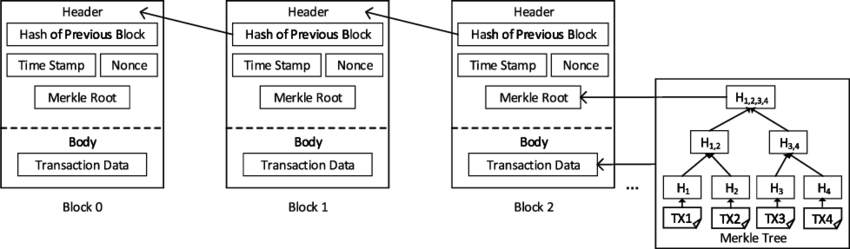
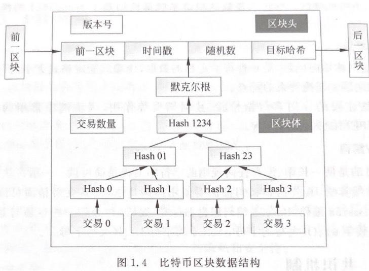
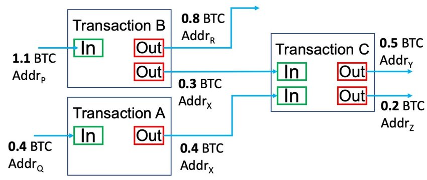
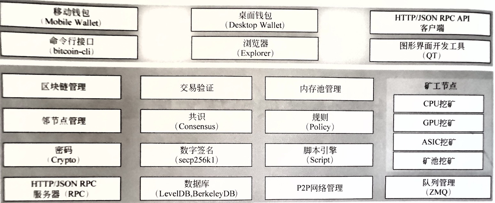
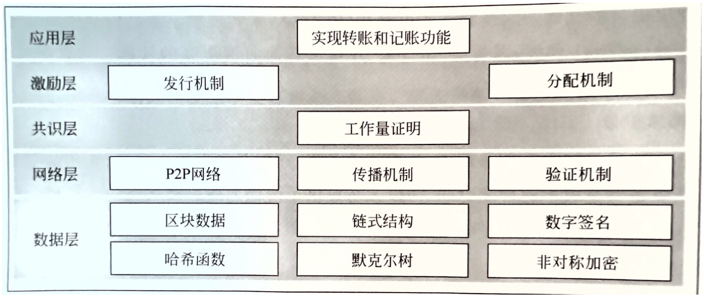

# 比特币技术细节

## 1. 四个关键设计

1. P2P 网络技术：比特币的点对点（P2P）网络技术是其核心组成部分之一，使其能够作为一个去中心化的数字货币系统运行。在比特币网络中，所有的交易和区块都通过 P2P 网络传播，这种网络结构意味着没有中央服务器。每个网络节点都在本地保存完整的交易记录，并参与网络的管理。
2. 分布式账本（区块链）：比特币通过分布式账本存储交易信息，没有中心机构，而是将数据存储在全网所有加入比特币网络的节点上。每个区块相当于一个小账本，记录了多笔交易信息和上一个区块的哈希地址。区块通过链式结构链接在一起，形成一个完整的账本体系。
3. 工作量证明（Proof of Work，记账权）：为了保证每个账本的一致性，比特币引入了工作量证明机制。网络中的节点需要完成系统提供的数学题（即进行耗费算力和时间的哈希计算）才能获得记账权。谁先完成计算并满足条件，就优先获得记账权。这一机制不仅确保了账本的一致性，还保障了区块链的安全。
4. 最长链原则：在传统交易中，由中心机构进行双花（双重支付）防护，但在区块链架构中，这一问题通过最长链原则来解决。同一笔钱的多次交易中，只有第一次交易有效，且这些交易不可能存在于同一个链条中。第二次交易所在区块一定是从主链上分叉出去的。由于记账权的竞争依赖于算力，而比特币系统中任意节点都可以竞争记账权，主链增长速度更快，分叉链条则较慢。最终，由于攻击者的算力无法与全网算力竞争，只有主链会被系统承认，从而解决双花问题。

## 2. 分布式账本（区块链的本体）

首先，我们需要了解账本（区块）是如何链接的。整个账本（即区块链）由一串使用密码学算法生成的区块（单个账本）连接而成。每个区块都包含多个交易记录，并按顺序相连形成链状结构，这就是区块链。

当矿工生成新区块时，需要根据前一个区块的唯一哈希值（称为区块哈希）、新的交易数据和一个随机数来计算新的区块哈希和随机数。每个区块都是在前一个区块数据的基础上生成的，这一机制确保了区块链数据的唯一性和完整性。

区块中的主要数据是一系列交易，第一条交易通常是 Coinbase 交易，即矿工的挖矿奖励，后续交易则是用户之间的交易。





## 3. 比特币分叉

在区块链中，分叉是指链条的分裂，主要分为硬分叉和软分叉。为什么会出现分叉？

比特币系统中的每个区块大小为 1MB，这限制了区块能够容纳的交易数量。比特币对单笔交易的大小没有具体限制，但一般来说一笔交易的大小为 250 字节，因此一个区块大约能容纳 4000 多笔交易。同时，比特币系统规定每 10 分钟产生一个新区块，由此计算得出，比特币系统每秒大约能处理 7 笔交易（4000 / 600 ≈ 7）。显然，对于全球范围内的用户来说，这个交易速度太慢了。

为了提高交易处理速度，人们提出了对比特币区块进行扩容的想法，这需要修改比特币软件代码，从而引发了分叉。

### 3.1 什么是分叉

在软件开发中，方案优化和 BUG 修复等原因导致软件进行升级是非常常见的现象。例如，手机应用等传统软件的升级非常简单，只需厂商发布，用户接受升级即可。

然而，对于比特币这样的去中心化系统，升级是非常困难的，需要协调网络中每个参与者。软件升级意味着运行逻辑的改变，在比特币中，升级必然会导致不同节点在一定时间内运行不同的版本，从而产生分叉。

分叉主要分为两种：软分叉和硬分叉。

### 3.2 硬分叉

例如，如果将区块大小从 1MB 扩容到 4MB，升级后的节点产生的 4MB 区块广播到网络中，那些旧节点会认为这个区块是非法的，不予认可。旧节点会继续基于原来的 1MB 区块链条生成新区块。由于新旧节点不兼容，主链就会发生分叉，从而产生第二条链。

> 注意：硬分叉后，新节点会认可旧节点产生的区块，但反之则否。

这种分叉是永久性的，只要旧节点不更新软件，原先的主链就不会消失，并且无法合并两条链，这就叫做硬分叉。

> 2017 年 8 月 1 日，区块扩容至 8M 导致比特币主链分叉出新的链条，形成了现在的 **BitCash(BCH)**。BCH 吸取以太坊分叉的教训，加入了双向重放保护，分叉后并没有出现资产损失等混乱情况。
> 自 2017 年 8 月 1 日 21:16:14（GMT+8），即区块高度 478,558 之后分离出的一个新的基于区块链的加密货币，旧链条仍然是比特币。
> 在 BCH 之后，又发生了多个分叉。理论上，任何参与比特币网络的节点（矿工）都可以分叉。

### 3.3 软分叉

软分叉是指比特币协议发生部分变化，但旧节点仍能接受新节点产生（挖出）的区块，并基于新区块继续添加旧区块。由于软分叉是向前兼容的，新旧节点仍然运行在同一条区块链上，不会产生两条链，因此对整个系统的影响相对较小。

到目前为止，比特币已经经历了多次软分叉，如 BIP-34、BIP-65、BIP-66 和 BIP-9 等。其中，比特币改进建议（Bitcoin Improvement Proposal, BIP）是指比特币社区成员针对比特币提出的一系列改进建议。

> 软分叉虽然对系统的影响较小，但是为了保证向前兼容，不能新增字段，只能在现有数据结构下修改，即可升级的内容非常有限。
> 同时，因为这些限制，软分叉一般升级方案比较复杂，复杂的方案往往更容易产生 BUG，并且可维护性很差。

## 4. 一些通用概念

### 4.1 矿工和挖矿

矿工是指那些参与到比特币网络中，利用算力不断尝试将新的交易打包成新区块的节点。这个打包过程就是所谓的“挖矿”。矿工们的动机来源于成功生成新区块后获得的比特币奖励。

### 4.2 挖矿过程(原理)

1. 打包交易：矿工从待确认交易的内存池中检索交易，并选择将其包含在区块中。矿工可以任意选择交易，甚至可以不选择任何交易（挖空块）。由于每个区块的容量有限（当前为 1MB），矿工无法无限制地选择交易。最合理的策略是根据手续费对待确认交易进行排序，然后从高到低尽量纳入最多的交易。
2. 构造 Coinbase：确定了包含在区块中的交易后，矿工可以统计本区块的手续费总额，并结合比特币的产出规则，计算自己在本区块中的收益。
3. 构造 hashMerkleRoot：对所有交易构造 Merkle 树，生成 hashMerkleRoot。
4. 填充其他字段：在构造了交易集合和 Coinbase 后，填充区块头的其他字段，形成完整的区块头。
5. Hash 运算：对区块头进行 SHA256D 运算（双重 SHA-256 加密）。
6. 验证结果：如果运算结果符合当前的难度目标，矿工会将新区块广播到整个网络，并开始挖下一个块；如果不符合难度要求，则根据一定策略改变区块头的某个字段后，再进行 Hash 运算并验证，直到找到符合难度目标的区块头为止。

> Coinbase 是什么：每个区块都会包含至少一个交易，第一笔交易就叫做 coinbase，每笔交易都包含了 input 和 output，正常交易的 input 是转账来源方的钱包地址，
> output 就是接收方的地址；而 coinbase 的 input 没有任何地址，只有 output 记录了给与矿工打包区块成功的奖励和手续费。Coinbase 是一笔特殊交易。

这个算法也叫做 **POW（Proof Of Work）**

合格的区块条件： **SHA256D(BlockHeader) < F(nBits)**

其中，SHA256D(BlockHeader)就是挖矿结果，F(nBits)是难度对应的目标值，两者都是 256 位，都当成大整数处理，直接对比大小以判断是否符合难度要求。

### 4.3 不断的计算哈希值（挖矿）

比特币系统规定，打包生成的新区块的区块哈希值必须小于给定的难度哈希值，才能被认为是有效的。区块哈希的计算方式如下：`block_hash = Sha256D(BlockHeader)`。区块头包含以下字段：`nVersion`、`hashPrevBlock`、`hashMerkleRoot`、`nTime`、`nBits`、`nNonce`。

- nVersion：比特币协议号，通常不会变化。
- hashPrevBlock：前一个有效区块的区块哈希。
- nBits：由全网决定，每 2016 个区块重新调整一次，算法固定。

这些字段相对固定，对于每个矿工都是一致的。矿工可以自由调整的字段是 `hashMerkleRoot`、`nTime` 和 `nNonce`。

- nTime：提供的修改空间有限，因为有效区块时间必须在前一个区块时间的范围内，太早或太晚都会被其他节点拒绝。矿工通常使用当前时间戳。
- nNonce：提供 2^32 种可能取值，主要用于调整以满足哈希值的难度要求。
- hashMerkleRoot：理论上提供 2^256 种可能，通过对包含在区块内的交易进行增删、调整顺序或修改 Coinbase 交易的输入字段来变化。

在 CPU 挖矿时代，主要通过不断累加 `nNonce` 值进行哈希计算，判断哈希值是否小于难度值，循环往复。进入矿机时代，`nNonce` 提供的 4 个字节已经不够用，搜索空间转向 `hashMerkleRoot`，从而提供更多的变化空间来满足挖矿需求。

### 4.4 动态调整的难度哈希

比特币网络的挖矿难度是动态调整的，以确保大约每 10 分钟产生一个新区块。难度值在每 2016 个区块（约两周）调整一次。如果平均区块生成时间小于 10 分钟，说明全网算力增加，难度会相应增加；反之，如果平均生成时间大于 10 分钟，说明全网算力减少，难度会相应降低。因此，难度会根据全网算力的变化动态调整。

比特币的工作量证明（PoW）机制因其形象地被称为“挖矿”。在同一时间，所有矿工都在计算下一个区块的哈希，努力找到一个符合当前难度要求的区块哈希值。挖矿难度取决于全网总算力的变化比例。

比特币挖矿技术已经从早期的 CPU 挖矿，发展到 GPU 挖矿，再到如今使用专用的 ASIC 芯片进行矿池挖矿。这个进化过程显著提升了挖矿效率，并进一步增加了挖矿的难度。

> 比特币设计时本来打算每 2016 个区块调整一次难度，也就是两周一次，但是由于第一版代码的一个 bug，实际调整周期是 2015 个区块。

## 5. 密码算法

比特币系统主要采用哈希算法（SHA-256 和 RipeMD160）来计算每个区块的唯一哈希值，确保区块信息无法被篡改。任何对区块信息的篡改都会导致其哈希值发生变化，无法通过其他节点的验证，从而被全网拒绝。因此，少部分节点的修改是无意义的。

此外，系统还采用非对称加密算法（ECDSA）用于数字签名，确保交易的真实性和安全性。

### 5.1 哈希算法

哈希算法，也称为散列算法或摘要/单向加密算法，是一种将任意长度的字节输入转换为固定长度输出的算法，且具有不可逆推性。一个优秀的哈希算法需要满足以下要求：

- 不可逆性：无法通过输出值逆推回输入值。
- 低碰撞率：不同的输入值产生相同输出值的概率极低。

这些特性使哈希算法在数据完整性和安全性方面发挥着关键作用。

#### 5.1.1 比特币中的 Merkle Hash

在区块头部中，有一个 MerkleRoot 字段。这个字段是通过对当前区块中所有交易记录的哈希值使用二叉树方式计算得出的。具体而言，将所有交易记录的哈希值两两组合，计算它们的哈希值，并不断重复这一过程，直到最终生成一个唯一的哈希值，这个值就是 MerkleRoot。MerkleRoot 通过这种简单的算法将一系列数据的哈希值汇总成一个单一的哈希值。

在每一层计算中，如果是偶数个交易哈希，每两个交易哈希通过 double_hash 方式合成一个，其中

> data = tx1_hash_str + tx2_hash_str
> double_hash(data)=sha256(sha256(data))

在区块头部，有一个 MerkleRoot 字段。MerkleRoot 是通过将区块内所有交易记录的哈希值以二叉树结构不断合并计算得出的。以下是详细的计算过程：

1. 检查交易数：如果交易总数为奇数，则复制最后一笔交易，以确保交易总数为偶数。
2. 转换字节序：将每笔交易的哈希转换为小端序（比特币中的交易数据都是以小端序处理）。
3. 拼接并哈希：将转换后的连续两个交易哈希拼接起来，然后计算两次哈希，即 `sha256(sha256(tx1_hash_str + tx2_hash_str))`，将结果作为父节点。
4. 重复步骤：不断执行以上步骤，直到只剩下一个哈希值，将其转换为大端序，即得到 MerkleRoot。

如果只有一笔交易，直接使用该交易的哈希作为 MerkleRoot。通过这种金字塔式的合成方式，最终总能计算出 MerkleRoot。

例如，读者可以以区块#80000 为例，计算其 MerkleRoot 并验证其与区块链浏览器上显示的一致性。

#### 5.1.2 MerkleRoot 的作用

通过计算过程可以看出，修改任何一笔交易哪怕一个字节，或者交换两笔交易的顺序，都会导致 MerkleRoot 验证失败，从而使整个区块无效。因此，MerkleRoot 记录在区块头部，用于确保交易记录的完整性、未损坏和未被修改。MerkleRoot 的优点包括：

- 验证数据的完整性：确认数据未经修改。
- 占用较小空间：方便存储和传输。
- 高效验证：数据格式高效，验证数据完整性只需几分钟。

MerkleRoot 不仅在区块链中应用广泛，还在其他软件中得到应用，如 Git、Amazon DynamoDB 和 Apache Cassandra 等。

#### 5.1.3 比特币中的 Block Hash

区块哈希，由区块头中的多个字段哈希计算后得出，所以一个区块自己的区块哈希并没有记录在区块头部。

区块头部的 Prev Hash 记录了上一个区块的 Block Hash，这样，可以通过 Prev Hash 追踪到上一个区块。由于下一个区块的 Prev Hash 又会指向当前区块，

这样，每个区块的 Prev Hash 都指向自己的上一个区块，这些区块串起来就形成了区块链。区块链的第一个区块（又称创世区块）并没有上一个区块，因此，

它的 Prev Hash 被设置为 00000000...000，部分区块链浏览器也将该字段显示为空，查看[创世区块](https://bitinfocharts.com/bitcoin/block/763148/000000000019d6689c085ae165831e934ff763ae46a2a6c172b3f1b60a8ce26f) 。

### 5.2 签名算法

数字签名算法用于确保消息的真实性和完整性，其主要作用包括：防伪造、防篡改、防抵赖。

1. 防伪造：由于私钥只有签名人自己知道，其他人无法伪造签名。
2. 防篡改：如果原始消息被篡改，对签名的验证将失败。
3. 防抵赖：验证通过后，可以确认消息由签名人发出，签名人不能否认自己发过这条消息。

签名算法通常采用非对称加密算法，包含一对公钥和私钥。私钥由发送方保管，公钥可以公开。公私钥的作用是互补的：公钥加密由私钥解密，私钥加密由公钥解密。

在加密场景中，使用公钥加密，私钥解密；而在签名场景中，使用私钥加密，公钥解密。

常见的非对称加密算法包括：RSA、Elgamal、背包算法、Rabin、D-H、ECC 椭圆曲线加密算法。

#### 5.2.1 数字签名在实际中的使用方法：

1. 签名：发送方首先对明文消息进行哈希计算，得到消息哈希值，然后使用私钥加密该哈希值，生成加密摘要（即签名）。发送方将加密摘要（签名）和明文消息一起发送给接收方。
2. 验证签名：接收方使用发送方提供的公钥解密加密摘要，得到消息哈希值。同时，接收方使用相同的哈希算法对明文消息进行哈希计算，并将计算得到的哈希值与解密得到的哈希值进行对比。如果两个哈希值一致，则消息未被篡改，且由发送方发出。

通过这种方式，数字签名算法可以有效保证消息的真实性、完整性和不可否认性。

> 签名过程也会用到哈希算法。

#### 5.2.2 比特币对签名算法的使用

比特币使用签名算法（ECDSA）来实现交易签名，同时也作为一套账户方案。具体过程如下：

用户使用私钥对自己发起的交易进行签名。网络中的节点（矿工）使用公钥（同时作为账户地址）来验证该交易数据是否有效或被篡改。通过这种方式，比特币网络能够确保交易的真实性和完整性，防止篡改和欺诈行为。

> 通过私钥可以推出公钥，用户如果丢失私钥，则失去公钥账户下的所有资产。

在比特币系统中，私钥用于签名交易，本质上是一个 256 位的大整数。公钥则通过 ECDSA 算法从私钥中计算出来，这一过程不可逆推，因此无需保存公钥。

可以用银行卡作比较：公钥相当于银行卡号（由两个 256 位整数编码成一个地址），私钥相当于密码（一个 256 位整数）。与银行卡不同的是，比特币中需要先生成私钥（密码），再计算出公钥（卡号），因此公私钥是一一对应的，无法修改私钥。

**匿名性**

比特币账本是全网公开的，任何人都可以根据公钥查询余额，但无法知道公钥的拥有者是谁，这体现了比特币的匿名特性。

**无限账户**

与传统银行账户不同，比特币网络没有账户的概念。任何人都可以从区块链中查询任意公钥对应的比特币余额，但不知道这些公钥的持有者。因此，用户可以生成任意数量的私钥-公钥对，公钥用于接收比特币，私钥是唯一能花费比特币的手段。钱包程序帮助用户管理这些私钥-公钥对。

**私钥编码**

由于私钥是一个 256 位整数，太长而难以记忆。比特币采用 Base58 编码对私钥进行编码，有非压缩和压缩两种编码格式，分别对应非压缩和压缩的公钥格式。

**推导公钥**

根据 ECDSA 算法，一个 256 位整数的私钥可以推导出两个 256 位整数（公钥），记作（x, y），这是非压缩公钥。根据 ECC 曲线特点，通过非压缩公钥（x, y）中的 x 可以推算出 y，但需要知道 y 的奇偶性。因此，非压缩公钥可以记录为压缩公钥 x'。压缩格式的公钥只保存 x，并在前面添加 02（y 为偶数）或 03（y 为奇数）前缀，得到一个 33 字节的压缩公钥数据 x'。压缩和非压缩公钥可以互相转换，但均不可反向推导出私钥。目前，非压缩公钥因其签名脚本数据较长，已很少使用。

**比特币地址（即收款地址）**

早期比特币系统直接使用公钥作为比特币地址（P2PK，pay-to-pubkey）。由于后来证实 ECDSA 算法存在安全隐患，可以通过公钥破解私钥，因此在 2010 年引入了一种新的交易类型 P2PKH（pay-to-pubkey-hash），即使用公钥的哈希值作为收款地址。

## 6. UTXO 模型（Unspent Transaction Outputs）

比特币采用了一种创新的账户余额模型，与常见系统中只记录某个账户余额的方式不同。这种模型被称为“未花费的交易输出”，简称 UTXO（Unspent Transaction Output），下面对此进行解释。

### 6.1 Input 与 Output

首先，每个区块由区块头和区块体组成。区块头包含比特币协议号、区块哈希、时间戳和上一区块哈希等字段信息；区块体则包含多笔交易信息。每笔交易由 n（n≥0）个输入（input）和 m（m≥1）个输出（output）组成：

- 输入（input）：包含 0 个或多个转账方比特币地址，以及对应的转出比特币数量。
- 输出（output）：包含 1 个或多个接收方比特币地址，每个地址对应一个转入的比特币数量。
- 每笔交易的输入之和等于输出之和。

**请看下图**



### 6.2 Coinbase

在区块体中，第一笔交易称为 Coinbase（也可称为铸币交易）。它是一笔特殊的交易，因为它没有输入（input），或是以 Coinbase 作为输入，只有输出（output），即矿工的比特币地址以及所获得的比特币奖励。

每个区块都有一笔 Coinbase 交易，这笔交易使矿工的比特币地址凭空增加比特币余额。

### 6.3 UTXO 交易过程

例如，如果我这个月打工赚了 1 万元，那么这笔交易的输入就是公司转出 1 万元，输出是我收到 1 万元。这很简单。然后我消费，比如买了一台电脑花费 6000 元，剩下 4000 元。在传统系统中，我的银行账户余额变成了 4000 元，后续的消费都是基于这个余额进行的，我也可以通过银行账户直接查询余额，这很方便。

但是在比特币系统中，没有类似银行账户的中央系统可以查询。这就是 UTXO 模型的作用。在这个模型中，我上述两笔交易的记录如下：

```
tx1： input：公司，1w，output：我，1w  （相当于我+1w）

tx2： input：我，1w  output-1：商场，6k （消费）
                    output-2:我，  4k （找零）
```

现在我的余额可以这样计算：+1 万元 - 1 万元 + 4000 元 = 4000 元。这实际上是将多笔交易的输入输出合并后的结果。在这个模型中，不允许将输出拆开消费。例如，在交易 1 中，我的输出是 1 万元，但我买电脑只需要 6000 元，那么我不能只输入 6000 元，必须从之前的交易中找到 ≥6000 元的输出作为这次交易的输入。当然，也可以合并多个之前的输出作为这次的输入，只要足够抵扣本次交易即可。简单来说，就是不能拆分花费，只能合并花费。

在交易 2 中可以看到，如果输入金额大于消费需要的输出金额，那么多余的金额会作为找零形成一个新的输出，这部分就称为未花费的交易输出（UTXO）。当这个输出被用作其他交易的输入时，它就不再是未花费的交易输出了。

**计算余额**

在比特币网络中，每笔交易的每个输出都是一定数量的不可分割的比特币，这些输出由全网共同验证，并可能被其持有者用作后续交易的输入。比特币全节点会追踪和统计网络中所有可用的未花费交易输出，这些交易输出被称为 UTXO 集合。当我们说某用户拥有多少比特币时，实际上指的是比特币网络中有多少 UTXO 可以被该用户控制的密钥使用。

这些 UTXO 可能分散在成千上万个区块和交易中。比特币钱包会帮我们收集和计算这些 UTXO，并将总额以账户余额的方式显示给用户。

可以看到，UTXO 模型完美适配了比特币这种去中心化的货币系统。

> 注意：交易输出可以是任意数量的 Satoshi（比特币最小计量单位）；Coinbase 只有输出，所以可以认为比特币网络是**先有输出**，再有输入的。

在任意时间点，现有的 UTXO 集合被称为 UTXO 集。比特币节点会追踪 UTXO 集，以确定哪些代币尚未花费，以及哪些用户可以花费它们。这一系统使比特币能够解决双重支付（Double Spend）问题，这个问题长期以来一直困扰着数字货币的实现。

### 6.4 UTXO 是如何创建的？

新的 UTXO 是通过花费现有 UTXO 创建的。每个比特币交易都由输入和输出组成。输入花费已有 UTXO，输出则创建新的 UTXO。那么，如果新的 UTXO 是通过销毁已有 UTXO 创建的，最初的 UTXO 又是怎么来的呢？

显然，最初的 UTXO 来源于 Coinbase 交易。每个 UTXO 的历史都可以追溯到一个或多个 Coinbase 交易的输出。

### 6.5 传统账户余额模型

这种模型更容易让人们理解，它类似于银行账户。银行系统直接存储每个账户的余额，并在交易时判断发起方的余额是否足够。

以太坊（Ethereum）就是采用账户余额模型的典型代表。以太坊还区分了外部账户和智能合约账户，但这里不做过多说明。

### 6.6 UTXO 与传统账户余额模型对比

1. 建模对象：UTXO 模型对资产进行建模，用户交易通过扣减分布在全网区块中与自己账户地址关联的未花费交易输出（UTXO）之和。余额模型则对账户进行建模，直接记录账户的余额。
2. 适用场景：UTXO 模型不存在账户当前状态的概念，可以称其为无状态模型，因此难以基于 UTXO 模型构建如智能合约等数字货币领域外的复杂应用。余额模型直接拥有账户余额状态等数据，便于进行丰富的编程应用。
3. 隐私性：UTXO 模型为用户提供了隐私优势。比特币用户可以将每个 UTXO 存储在不同的地址中分别处理，从而隐藏其持有的 UTXO 之间的联系。比特币的设计极大降低了生成新地址的难度。而在传统余额模型中，生成新账户非常麻烦，甚至不可行，迫使用户将全部或大部分资金存放在一个账户中。观察者可以直接查询这个账户的交易流水来获取信息。

## 7. 解决双花问题

**关键词解释：UTXO、区块时间戳、6 次确认、分叉及最长链原则**

1. UTXO：当一个用户接收比特币时，该金额被记录为未花费的交易输出（UTXO）并存储在区块链中。比特币系统记录每一笔未花费的交易输出。当一笔比特币交易被创建并广播到区块链网络后，接收到此交易信息的节点会对其进行验证，检查其是否存在于 UTXO 数据库中。如果交易输出已不存在于 UTXO 中，则验证失败。
2. 区块时间戳：当一个用户将 1 个比特币同时转账给两人时，只有一笔交易会成功。矿工会选择记录优先接收到的或手续费更高的交易。当交易被矿工记录到区块后，根据区块时间戳的大小来判断，最先被记录（时间戳较小）的交易为有效，其他记录了相同 UTXO 的交易的区块将被网络拒绝（因为该 UTXO 已被花费）。
3. 6 次确认：指在当前区块之后又有 5 个区块被计算出来并连接到区块链上，每一个区块都相当于对前一个区块的确认。区块链上每增加一个区块，就增大了前面区块被篡改的难度。通常认为，在 6 个区块确认之后，交易基本上无法被篡改，因此被认为是最终完成的交易。
4. 分叉及最长链原则：在同一时间段内，全网可能有多个节点同时计算出正确的随机数，即同时挖到矿。这些节点会将自己挖到的区块添加到本地区块链上，导致区块链分叉。矿工会在网络中广播自己打包好的区块，以便其他节点同步最新数据，并在最新的区块链上继续挖矿。由于同步需要时间，不同矿工看到这些区块的顺序会有所不同。矿工会复制先看到的区块，并在其基础上继续挖矿。最终，最长的链条会被确认为主链，其他分支链条上的节点将转换阵营，开始在较长的链条上工作，其他分叉出来的链将被网络抛弃。

## 8. 功能架构

### 8.1 功能架构图



### 8.2 区块链管理

区块链管理主要包括同步区块、接收区块、验证区块以及发现最长链的功能。当一个比特币全节点第一次加入比特币网络时，首先需要下载并验证整条区块链。随着时间的推移，比特币的区块容量不断增大，下载时间也会随之变长。

从 2014 年开始，区块链同步方式正式改为先从相邻节点下载区块头。相比于一个 1MB 的完整区块，区块头只有 80 字节，同步速度大大提高。区块头同步完成后，节点可以从不同节点同时更新不同区间的区块，这大大提高了整个区块链的同步速度。在同步过程中，节点会使用 CheckPoint 对特定区块的哈希进行验证。

### 8.3 交易验证

临近节点收到交易后，会对交易信息进行一系列验证，验证通过后再广播至网络，无效交易在第一个节点处就会丢弃。

### 8.4 交易内存池管理

节点将收到的合法交易放入本地内存池，准备将其放入一个区块中构成 Merkle 树以进行挖矿。挖矿时，节点会按照一定顺序从交易池中取出部分交易并打包进区块。交易的选择顺序由交易输入的时间和手续费共同决定。也就是说，存在时间越长的 UTXO 和交易手续费越高的交易，越优先被打包。

挖矿成功后，节点会将新区块广播到网络中，交给其他节点进行验证，同时从交易池中剔除已打包的交易。如果发生分叉，全节点会自动识别并同步最长链，同时抛弃本地的较短链，重新在最长链上进行挖矿。

### 8.5 邻节点管理

当一个比特币节点启动时，它需要发现比特币网络中的其他节点，并至少与一个节点相连才能正常使用。节点通过 8333 端口与一个已知节点建立 TCP 连接。发现新节点有两种方法：

1. 通过 DNS 种子：DNS 种子是提供比特币节点地址的 DNS 服务器。在 Bitcoin Core 软件配置中，自带了 5 个不同的 DNS 种子。
2. 添加已知节点的 IP：用户可以通过配置文件或控制台命令的方式，手动添加已知节点的 IP 地址。

### 8.6 共识管理

比特币在 P2P 模式下运行，因此共识管理非常重要。目前比特币使用的是 PoW（工作量证明）算法。未来，比特币社区计划将共识模块从比特币核心中分离出来，作为一个独立的模块进行管理。

### 8.7 规则管理

定义比特币所有节点都需要遵守的规则，只有遵守这些规则才能加入比特币网络正常运行。例如，比特币交易验证规则、区块验证规则等。

### 8.8 密码模块

比特币系统中广泛使用了密码学技术，主要用于比特币地址的生成和验证。系统使用了 SHA256 和 RIPEMD160 哈希算法，以及 Base58Check 编码。这些算法的代码存放在 `crypto` 子目录下。

### 8.9 签名模块

比特币采用椭圆曲线签名算法（ECDSA）来实现数字签名和生成公钥，使用的曲线是 secp256k1，因为该曲线比其他曲线具有更高的性能。这部分代码存放在 `secp256k1` 子目录下。

### 8.10 脚本引擎

比特币的脚本语言虽然非常简洁，只有 256 条指令，每条指令为 1 字节，且常用的只有几条，但它可以说是最早版本的智能合约，为以太坊提供了解决思路。以太坊虚拟机（EVM）是比特币脚本的一个扩展，为其增加了图灵完备性。目前，比特币脚本的代码放在 `script` 子目录下。

### 8.11 挖矿

在比特币的 PoW 算法中，挖矿是最核心的内容。其本质是全网矿工（任何具有一定算力的节点）进行双哈希运算的算力竞赛，争取记账权的过程。

最初，比特币的挖矿程序通过 CPU 进行，但随着矿工节点的增加，CPU 很快失去了优势，GPU 成为挖矿主力。随着比特币价值进一步提高，更专业的 FPGA 和 ASIC 设备相继出现。如今，市场上的矿机基本都是由 ASIC 组成的矿池。

### 8.12 HTTP/JSON RPC 服务端

比特币节点启动时，初始化程序 `init.cpp` 会启动 HTTP/JSON RPC 服务端。该组件对外提供 JSON RPC 接口，使外部程序能够通过这些接口控制比特币节点。然而，由于远程连接比特币节点存在极大风险，一般不推荐使用此方法。

### 8.13 数据库

比特币系统采用 BerkeleyDB 和 LevelDB 两种非关系型数据库。比特币钱包使用 BerkeleyDB，而 LevelDB 用于存储区块索引和 UTXO 记录。区块的原始数据则以.dat 文件形式存储在本地，而不是使用数据库存储。

### 8.14 ZeroMQ

比特币采用 ZeroMQ 作为消息队列管理和消息分发的工具。ZeroMQ 是一种基于消息队列的多线程网络库，它对套接字类型、连接处理、帧和路由的底层细节进行抽象，并提供跨越多种传输协议的套接字。

## 9. 系统架构

比特币系统是区块链 1.0 的典型应用，是第一个去中心化的数字货币系统。一般来说，区块链 1.0 数字货币系统系统架构分 5 层，如下图

### 9.1 系统架构图



### 9.2 数据层

数据层是以密码学为基础构建的以区块为单位的链状数据结构。每个区块都包括前一个区块的哈希值、当前时间戳以及最近一段时间的交易信息等内容。由于每个区块通过密码学证明的方式链接在一起，当区块链达到一定长度后，要修改某个历史区块中的交易就必须重构该区块及其后的所有区块及密码学证明，这在实际中是几乎不可能（或概率极低）发生的。

比特币使用的 PoW 共识算法及最长链原则要求攻击者拥有全网 51% 的算力才能成功替换现有主链。随着比特币系统的发展，其节点已遍布全球，拥有 51% 算力几乎不可能。即使有这种可能，攻击者为获得高算力资源付出的成本也将超过攻击获利。此外，一旦发生如此严重的攻击事件，比特币的价值必然暴跌，最终导致攻击者遭受最严重的损失。

### 9.3 网络层

比特币系统采用 P2P 网络架构。所有节点在系统中的地位一致，以扁平式的拓扑结构相互连接和交互，不存在任何中心化的特殊节点和层级结构。每个节点都承担网络路由、传播交易数据、验证区块数据、传播区块数据、发现新节点等功能。因此，比特币具有可靠、去中心化和开放性的特点。

### 9.4 共识层

在比特币的分布式架构中，各节点的数据一致性是必须考虑的问题，这也是共识层的作用。区块链技术的核心优势之一是能够在决策权高度分散的去中心化架构中，使各节点对区块数据的一致性达成共识。比特币区块链采用高度依赖算力的工作量证明（PoW）机制，来保证比特币网络分布式记账的一致性。

### 9.5 激励层

在比特币系统中，所有比特币都是通过奖励的方式赠予那些创造出有效区块的矿工。另一个激励来源是交易费，所有交易的手续费都会支付给将该交易打包进区块的矿工。只有具有合理的激励机制，矿工才会愿意提供更高的算力来维护比特币网络的稳定、安全，并防止欺诈交易。

### 9.6 应用层

目前，比特币的主要功能是作为数字货币，因此其应用层主要包括钱包，如在线钱包和硬件钱包。

## 10. 节点类型

尽管在比特币网络中，所有节点都是平等的，但比特币全节点账本已经接近 500GB（截至 2022 年 11 月 15 日），对于普通用户或移动端用户来说，包含全节点账本是不现实的。因此，根据用户选择的节点类型不同，每个节点代表不同的角色，提供不同的功能。通常，一个比特币全节点包括钱包、矿工、完整区块链和网络路由四种功能。总的来说，比特币有以下几种节点类型：

- 全节点：全节点存储比特币的完整账本数据，能够建立一个完整的 UTXO 数据库，独立进行所有交易和区块的验证和打包操作，不需要其他节点的帮助。全节点一般不进行挖矿，而是负责同步区块和提供网间路由服务。
- 矿工节点：矿工节点同样存储完整的账本数据，此外还负责将交易打包进区块。矿工节点与全节点的主要区别在于，矿工节点需要使用性能较好的硬件才能获得记账权，而全节点不需要，后者可以运行在一台普通笔记本上。
- 轻节点：也叫 SPV 节点（Simple Payment Verification）。SPV 节点运行特殊版本的软件，只下载区块头数据，所以同步数据的速度非常快，只需 10 多分钟，而全节点同步需要 1 天以上。SPV 节点的意义在于解决全账本逐渐庞大、钱包节点无法同步全账本的问题。SPV 过程通过请求全节点辅助完成交易验证工作。标准的 SPV 节点同样是去中心化的，随机连接全节点提供服务。需要注意的是，SPV 节点与市面上的轻钱包有所不同，后者通常通过请求交易所的中心化服务器来查验交易确认信息，因此存在交易所作恶的可能。

## 11. 创新技术

### 11.1 隔离见证（Segregated Witness）

#### 11.1.1 背景

**区块容量限制导致交易效率低**

比特币的区块大小限制为 1MB，这个空间能容纳的交易数量一般在 2000 到 4000 多笔，由于单个交易大小没有限制，导致单个区块能容纳的平均交易数量非常低。再加上区块的生成速度限制为 10 分钟一块，使得比特币网络的交易吞吐量非常低，约为每秒 7 笔。2015 年 7 月，比特币网络遭遇大量小额比特币交易攻击，导致网络被阻塞了几个小时，最后通过鱼池 F2Pool 生成了史上最大一笔比特币交易才得以解决。

如果用户想要快速确认交易，就必须支付更多手续费，否则可能需要等待约 1 小时才能完成确认。这种低交易效率导致用户体验非常差。

**区块扩容是提高交易效率的首要方案**

区块扩容是提高交易效率最简单粗暴的方式。扩容后，单个区块能够容纳更多交易，从而自然提高交易效率。区块扩容有两种方案：

1. **硬扩容：** 通过修改比特币代码直接提高区块容量，这种方式简单但粗暴。它必须说服比特币网络中超过半数的节点进行软件升级，才能算是一种有效方案。2018 年，由于强行扩容导致 BTC 硬分叉，产生了 BCH（Bitcoin Cash）。硬分叉是因为此方案有不少反对者，他们认为这不是一种有效方案，因为硬扩容到多少合适？将来随着网络中交易数量的增加，会不会又要面临扩容问题？所以，反对者认为应该从其他方向研究扩容方案。
2. **软扩容：** 通过向后兼容的方式修改比特币软件，不会导致硬分叉。然而，具体如何修改成为需要研究的问题，后来出现了「隔离见证」（SegWit）方案。

**交易延展性（Transaction Malleability）攻击**

交易延展性指的是在早期比特币设计中，可以在不改变交易输出或交易内容的情况下，更改交易 ID。这意味着，在交易被矿工写入区块之前，交易签名可以被更改。也就是说，一笔未被确认的比特币交易，可能被黑客造出两笔合法的交易。受影响的主要是交易所。虽然矿工最终只会确认一笔交易，并且交易的输出保持不变，但确认了修改后的交易 ID 会改变哈希值。由于哈希函数的特性，后续交易依赖于前面交易 ID 中的哈希值。因此，任何未确认的交易都是不安全的。交易延展性攻击会给那些追求快速确认的交易所造成巨大损失。

**隔离见证（SegWit）**

隔离见证主要是为了解决交易延展性问题提出的，后续小节中将详细介绍交易延展性攻击。

#### 11.1.2 基本概念

SegWit（Segregated Witness 的缩写）是一种改变区块数据存储结构的区块链扩容方案，需要 95% 的矿工节点进行软件升级才能完全激活。比特币核心开发人员 Pieter Wiulle 于 2015 年 12 月在 Scaling Bitcoin 会议上首次提出了这一想法。它于 2017 年 5 月 10 日在莱特币上激活，并于 2017 年 8 月 24 日在比特币上激活，区块高度为 481,824。SegWit 是目前比特币应对扩容较好的解决方案，主要思想是将区块中的签名信息隔离出来，实现变相扩容。

SegWit 在 BIP-141~145 中提出和改进，并在 Bitcoin Core v0.13.1 中首次发布。读者还可参阅官方发布的隔离见证升级指导。BIP（Bitcoin Improvement Proposal）是比特币软件改进建议，用于引入特征信息的比特币设计文档。

**Witness**（见证）在密码学中指的是**签名**，它可以证明事物的真实性。而在比特币中，witness 指的是交易输入中的解锁脚本（scriptSig），因为解锁脚本中包含签名信息，用以证明交易发起人可以使用对应的 UTXO。**Segregated**（隔离）指的是将解锁脚本从交易输入中分离出来，放在一个单独的数据结构中。矿工在打包交易时会验证这个新数据结构的有效性，以确保交易的合法性。

**隔离见证如何解决区块扩容**

一笔交易的平均大小是 250 字节，而解锁脚本就占用了一半的空间。通过将解锁脚本从交易中分离出来，区块可以容纳更多的交易笔数，从而间接达到区块扩容 2 倍的效果。

#### 11.1.3 带来的好处

- **解决交易延展性问题：** 计算交易 ID 时不再包括解锁脚本内容，使交易 ID 成为固定值，避免了交易 ID 被篡改的风险。
- **扩容：** 以前解锁脚本内容最长会占据超过交易数据 75% 的空间，严重压缩了区块可容纳的交易数量。现在分离出去后，相当于变相扩容了区块，增加了比特币的交易吞吐量。
- **增加脚本版本管理：** 引入隔离见证后，新的脚本结构中增加了版本号字段，类似于交易和区块，脚本也有了自己的版本号，使得脚本语言可以以一种向后兼容的方式进行升级。
- **优化签名算法：** 隔离见证降低了签名函数（CHECKSIG/CHECKMULTSIG）算法的计算复杂性。例如，一笔交易中可能有多笔输入，验证过程中需要多次验证签名，而验签需要多次执行哈希计算。随着交易输入的增加，验证交易所需时间几乎呈指数增长。引入隔离见证后，所需时间呈线性增长，大大提高了效率。
- **节省 SPV 节点空间：** 由于 SPV 节点不需要验证交易的有效性，只需验证交易的存在性即可。因此，SPV 节点不需要交易中的解锁脚本。去除这部分信息后，SPV 节点可以在同样的带宽下下载更多交易数据，节省了空间。
- **减少交易手续费：** 解锁脚本被单独存放后，交易数据进行了「瘦身」，交易费与交易大小挂钩，交易数据变小了，自然手续费也就降低了。

#### 11.1.4 隔离见证避免了交易延展性攻击

**什么是交易延展性（Transaction Malleability）？**

比特币交易 ID 是一个以交易明细作为输入的哈希值，交易明细包含解锁脚本、金额等信息。如果交易明细中发生任意细微修改，交易 ID 也会发生改变（从而改变 MerkleRoot 和区块哈希）。解锁脚本中包含了转款人的公钥和对上笔交易的签名信息，其中的签名信息是由私钥通过 ECDSA 算法计算而来。由于该算法可以**基于私钥生成多个有效签名**，理论上转款人（私钥拥有者）可以在发起一笔交易后，立即换一种方式生成该交易的签名（交易明细不变），然后再次发起交易。如果第二次发起的交易先于第一次被多数节点确认，第一笔交易就会被网络拒绝。

然而，第二笔交易并没有修改付款人、收款人以及金额信息，所以这笔交易实质上还是发生了，收款人已经收到比特币。此时，用第一笔交易的哈希 ID 去区块链浏览器中查询，结果会显示「查无此交易」，因为该交易已经被拒绝（**两笔交易引用了同一个 UTXO，但一个 UTXO 只能被成功引用一次**），这实际上就是双花攻击。

交易延展性攻击就是利用上述比特币交易缺陷展开的攻击，通常针对交易所。具体来说，攻击者首先启动一批 Sybil 节点（虚假节点）包围交易所节点，然后在交易所发起一个取现交易。当该交易离开交易所后，虚假节点立即修改该交易的签名（但不修改收款人）并广播修改后的交易到网络中。当修改后的交易被成功确认时，交易所发起的交易还没有收到确认消息。攻击者会要求交易所重新发起取现交易，谎称这笔取现交易在网络上「没有被通过」，然后重复上述攻击手段。

**隔离见证如何避免交易延展性攻击**

隔离见证通过将解锁脚本（包含签名信息）从交易明细中分离出来，计算交易 ID 时不再包括解锁脚本内容，使交易 ID 成为固定值。这样，即使解锁脚本被更改，交易 ID 也不会改变，从而避免了交易延展性问题，阻止了利用该缺陷进行的攻击。

> 通常来说，包围交易所节点的 Sybil 节点越多，攻击成功的概率就会越高。据说 Mt.Gox 事件就是因此攻击而引发的。

**隔离见证**通过将解锁脚本从交易中分离出去，使得脚本中的签名变化不会导致交易哈希 ID 改变，以避免了延展性攻击。

#### 11.1.5 工作方式

**【交易结构变化】**

隔离见证采用软分叉的方式来升级比特币全网节点。引入隔离见证前，交易数据结构大致包含以下几个字段：

> version, txins(交易输入数组), txouts(交易输出数组), locktime

引入隔离见证后，交易数据结构增加了几个字段：marker、flag、witness。其中，marker 和 flag 分别为固定值 0x00 和 0x01。重点是 witness 字段，它包含交易中所有的见证数据，witness 字段的数据结构如下：

> witness=witness_field_1, witness_field_2...witness_field_n

每个 txin 都有一个 witness_field，它是该输入的见证数据。如果一笔交易的输入是非隔离见证交易，那么该输入的 witness_field 字段为空，或表示为 0x00。

**【交易 ID 计算方法】**

首先，不管是否引入隔离见证，交易 ID 的计算方式如下：

> txid=double_sha256(version+txins+txouts+locktime), 只不过在隔离见证交易中，txin.scriptSig 字段为空。

引入隔离见证前，txins 包含见证数据，即包含签名的解锁脚本。引入隔离见证后，txins 中的见证数据（scriptSig）位置为空，留空而不删除正是一种向后兼容的方式。引入隔离见证后，每笔交易除了 txid 外，还定义了一个新的 wtxid，其计算方式如下：

> wtxid=double_sha256(verson+marker+flag+txins+txouts+witness+locktime)

**【区块头结构没有变化】**

区块头结构没有发生任何变化，因为区块头的变化会影响区块哈希的计算，会导致硬分叉。目前的区块头仍然包含如下字段：

> version, prev_block_hash, merkle_root, timestamp, nbits, nonce

**【增加一颗 witness merkle 树】**

在引入隔离见证前，解锁脚本包含在交易 ID 中，最终影响区块哈希。现在将其分离出去，如果不以某种方式进行约束，攻击者就可以构造大量包含无效签名的交易数据传播到网络中，造成网络拥堵。

想要保证 witness 不被修改其实很简单，只需效仿已有的 merkle 树构成。我们知道，merkle 树有一个根，其目的是为了保证所有叶子节点不被修改，因为一旦修改任一叶子节点，merkle 根也会改变，进而改变区块哈希。隔离见证的设计中也采用了这一方法，又构建了一颗 witness merkle 树，它是由所有交易的 wtxid 构成的 merkle 树，其生成方式与 txid 的 merkle 树完全一致。这样一来，就会多出一个 witness_merkle_root 字段。那么将这个字段放在何处才能既影响区块哈希的计算结果又不影响旧的共识规则呢？

直接在区块头中添加一个字段肯定是不行的，最简单的办法是放入某一笔交易中。所以，由矿工创建的 Coinbase 交易，就自然而然成了唯一的选择。最终，witness_merkle_root 放在了 Coinbase 交易输出的锁定脚本处。

> PS：将 witness_merkle_root 字段放在 Coinbase 交易输出中是非常丑陋的设计，因为两者毫无关系。但或许是为了不影响区块结构（影响共识规则），才作出如此妥协的设计。

**witness_merkle_root 避免了 DOS 攻击。** 该字段包含签名信息，如果修改签名，不会导致交易 hash 变化，但会导致区块 hash 变化（因为改变了 Coinbase 的 txout）。区块 hash 变化可能不再满足难度规则。这样一来，攻击者就无法构造大量无效签名的交易提交到网络中，导致网络拥堵。

**【如何使用 witness】**

引入隔离见证后，每笔交易的输入和输出中的脚本内容和格式，以及脚本的工作方式都发生了一些变化。下面进行详细说明。首先讲解传统的 P2PK 交易类型。为了便于阅读，将内容放在代码块中进行说明：

1. P2PKH 交易中的锁定/解锁脚本格式如下：

```
pk_script = OP_DUP OP_HASH160 <PubKey_HASH> OP_EQUALVERIFY OP_CHECKSIG
sig_script = <sig> <pubkey>
```

2. 对 P2PKH 交易引入隔离见证后，脚本格式如下：

```
pk_script = <version_byte> <witness_program>
sig_script = 空
witness = <sig> <pubkey>
```

- a. 这种新的交易类型被命名为 P2WPKH（pay-to-witness-pubkey-hash）。
- b. 其中 version_byte 代表后跟 witness_program 的版本号，目前是 0；增加了一个叫 witness_program（见证程序）的概念，本质上是一个字符串，只不过具体格式由交易类型决定。在 P2WPKH 中，它就是 pubkey_hash，实际算法是 ripemd160(sha256(pubkey))，hash160 也是指这个算法。
- c. witness 是新引入的存在于交易外的字段，用于存放之前解锁脚本的内容。

3. 给出一个示例如下：

```
pk_script = "0 92a0db923b3a13eb576a40c4b35515aa30206cba" （转十六进制：0x001492a0db923b3a13eb576a40c4b35515aa30206cba，其中00和14分别对应0和空格，空格先转ASCII码再转十六进制）
sig_script = 空
witness.sig="3044022064f633ccfc4e937ef9e3edcaa9835ea9a98d31fbea1622c1d8a38d4e7f8f6cb602204bffef45a094de1306f99da055bd5a603a15c277a59a48f40a615aa4f7e5038001"
witness.pubkey="03839e6035b33e37597908c83a2f992ec835b093d65790f43218cb49ffe5538903"
```

- a. 可以看到，P2WPKH 中的锁定脚本比 P2PKH 简单许多，它去掉了堆栈指令。

4. 那它是怎么运行的呢？（假设引用的 UTXO 也是隔离见证交易）

实际上很简单，新节点会先检查新交易中的 witness 字段，然后检查 UTXO 中的 pk_script 版本号后面的 pubkey_hash 是否和 witness.pubkey 的 hash 值匹配。若匹配，再使用 OP_CHECKSIG 指令检查签名和公钥是否有效。可以看出只是将整个脚本验证过程换一种方式进行。

5. 如何在新节点上引用不支持隔离见证的 UTXO?

显而易见，因为 witness 的格式和原来的 scriptSig 一致，所以直接将其与 pk_script 拼接起来执行即可。

6. 如何在未升级的旧节点上引用支持隔离见证的 UTXO

这类 UTXO 的 pk_script = <version_byte> <witness_program>。旧节点的工作方式仍然是将 sig_script 和 pk_script 拼接后执行，虽然前者没变，但后者发生了变化，执行结果是什么呢？先将其拼接起来看看：

```
concated_script = <sig> <pubkey> <version_byte> <witness_program>
```

- a. 拼接后的完整脚本没有任何指令，只有 4 个字符串参数。将它们按序入栈后，最终执行结果就是栈顶的值，即 witness_program（此处是 pubkey_hash）。只要结果非 0，软件就会认为是验证成功。
- b. 按照上一点描述，这样岂不是任何旧节点都能消费已经支持隔离见证的 UTXO？其实不然，因为支持隔离见证的比特币软件版本已经被全网 95% 以上的节点接受。这意味着只有剩下 5% 的旧节点会引用隔离见证的 UTXO，由它们打包出来的区块会很快被其他节点拒绝，因为无法通过 witness 验证。

然后讲传统的 P2SH 交易类型，同样将内容放在代码块中：

1. P2SH 交易中的锁定/解锁脚本格式如下（以 2-3 多重签名交易为例，即 3 个公钥中至少 2 个签名）：

```
redeem_script = 2 <Public KeyA> <Public KeyB> <Public KeyC> 3 OP_CHECKMULTISIG
pk_script = OP_HASH160 <hash160 hash of redeem_script> OP_EQUAL
sig_script = OP_0 <signature B> <signature C> <redeem_script>
```

2. 对 P2SH 交易引入隔离见证后，脚本格式如下：

```
redeem_script = 2 <Public KeyA> <Public KeyB> <Public KeyC> 3 OP_CHECKMULTISIG  （未变化）
pk_script = 0 <sha256 hash of redeem_script>
sig_script = 空
witness = OP_0 <signature B> <signature C> <redeem_script>
```

- a. 这种新的交易类型被命名为 P2WSH（pay-to-witness-script-hash）。
- b. 可以看出，这种交易把 sig_script 的内容转移到了 witness 字段存放，并且变换了 pk_script 的构成方式（去除指令以及修改哈希过程）。
- c. P2WSH 的 pk_script 使用了安全性更强的 sha256 算法，其输出是 32 字节，包含前面的 0 和空格总共 34 字节。虽然比之前的 P2SH 的 23 字节变长了，但提升了安全性，能够防御碰撞攻击。

理解了上述两种新的交易类型后，我们不禁还有一个疑问。那就是想要所有节点都进行升级基本是不大可能，在这种情况下未升级的 A 想给已升级隔离见证的 B 转账，该如何进行呢？

这就要提到又一种新的交易类型了：内嵌了 P2WPKH 的 P2SH，下面的代码块中进行详细说明：

1. A 尚未升级支持隔离见证，所以 A 发起的交易输出中的锁定脚本格式依然是旧的 P2SH（暂时只考虑 P2SH），但 B 提供的赎回脚本格式有变化，也就是说与旧 P2SH 相比，在这种交易类型中，由收款方提供的脚本 hash 收款地址的生成方式发生了一些变化，如下：

```
redeem_script = 0 <hash160 hash of Pubkey>  （构成发生了变化）
pk_script = OP_HASH160 <hash160 hash of redeem_script> OP_EQUAL
```

- a. 可见，锁定脚本中的 20 字节 hash 串的生成方式变为了：hash160(<0 hash160(recipient's Pubkey)>)

2. B 如何解锁 UTXO，B 的解锁脚本格式和 witness 字段如下：

```
sig_script = 0 <hash160 hash of redeem_script>  (注意这里非空，并且是赎回脚本的hash而不是公钥哈希)
witness = <signature> <Pubkey>
```

- a. 解锁过程：将 sig_script 和 pk_script 进行拼接，然后在堆栈中执行，这个执行过程仅验证公钥是否匹配。若匹配，再对 witness 中的签名进行验证（使用 OP_CHECKMULTISIG）。

既然 P2WPKH 可以嵌入 P2SH，那么 P2WSH 也可以嵌入 P2SH，下面简单描述几个字段的构成，不再详述过程：

```
redeem_script = 0 <sha256 hash of <Multi-Sig-And-PubKey>>  （构成发生了变化）
pk_script = OP_HASH160 <hash160 of redeem_script> OP_EQUAL
sig_script = 0 <sha256 of redeem_script>
witness = <Multi-Sig-And-PubKey>
```

综上所述，引入隔离见证后，比特币又新增了 4 种交易类型，分别是：

- [P2WPKH](https://github.com/bitcoin/bips/blob/master/bip-0141.mediawiki#p2wpkh)
- [P2WSH](https://github.com/bitcoin/bips/blob/master/bip-0141.mediawiki#p2wsh)
- [内嵌 P2WPKH 的 BIP16 P2SH](https://github.com/bitcoin/bips/blob/master/bip-0141.mediawiki#p2wpkh-nested-in-bip16-p2sh)
- [内嵌 P2WSH 的 BIP16 P2SH](https://github.com/bitcoin/bips/blob/master/bip-0141.mediawiki#p2wsh-nested-in-bip16-p2sh)

#### 11.1.6 带来的问题

1. 隔离见证是一个软分叉更新，因此许多节点不会立即更新软件。结果，网络中会同时存在新旧两种类型的 UTXO，即交易延展性问题可能仍然存在。
2. 隔离见证在一定程度上降低了比特币网络的安全性，因为能够执行完整区块验证的节点数量减少了，只有升级后的节点才能进行 witness 验证。
3. 隔离见证功能不可回退，一旦回退，新的 UTXO 将能够被任意旧节点消费，存在安全隐患。
4. 隔离见证解决了许多问题，同时也增加了不少代码复杂性，增加了潜在的 bug 风险，使整个网络变得更加复杂。

### 

---
