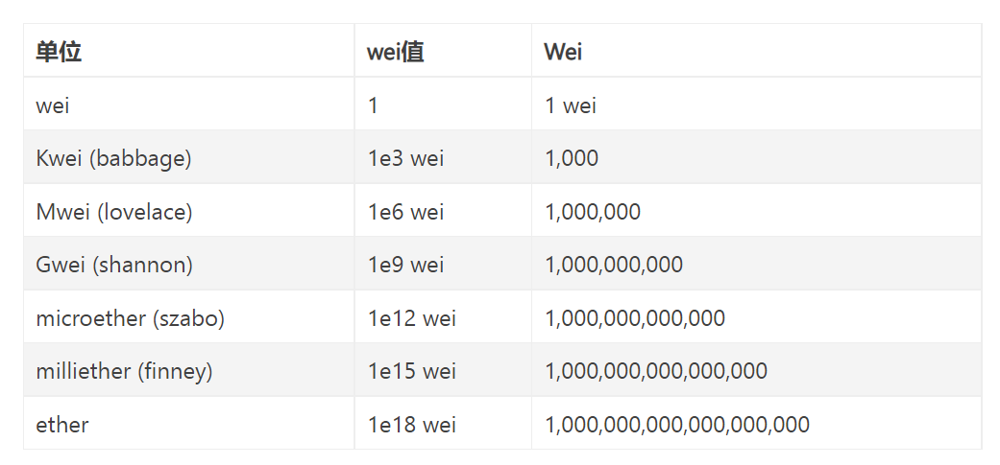

## 一、以太坊简介

以太坊是一款于 2015 年 7 月正式投入运行的著名区块链底层平台，它可以支持去中心化应用（DApp）的开发和运行，其功能类似于智能手机中的安卓或 iOS 系统对 APP 的支持。2016 年，以太坊因为“the DAO”事件进行了一次重大的硬分叉。

### 1. 背景

以太坊的概念最早于 2013 年底由《比特币杂志》的程序员兼联合创始人 Vitalik Buterin 在一篇白皮书中提出。该白皮书阐述了一种构建去中心化应用程序的新方法。在文中，Buterin 分析了比特币设计的优势与局限，特别强调了区块链技术不应仅限于加密货币。他提议使用一种图灵完备的语言开发应用程序，这些应用能够把现实世界的资产，如股票和财产，整合到区块链上。

### 2. 发展事记

- 2013 年底，以太坊的创始人 Vitalik Buterin 发布了初始白皮书，并召集包括联合创始人 Gavin Wood 和 Jeffrey Wilcke 在内的一批支持者启动了以太坊项目。
- 2014 年 1 月，以太坊在迈阿密举行的北美比特币会议上首次对外公开发布。
- 团队为了确保合适的基础设施和法律策略，决定将原定于 2014 年 2 月的以太币预售时间推迟。
- 2014 年 2 月，以太坊的社区、代码库、wiki 内容以及商业基础设施和法律策略得到逐步完善。Gavin Wood 和 Jeffrey Wilcke 开始全职投入以太坊的开发工作。
- 2014 年 4 月，Gavin Wood 发布了关于以太坊虚拟机的技术黄皮书，该文档后来成为以太坊技术的核心参考。以太坊客户端支持多种编程语言，包括 C++、Go、Python、Java、JavaScript、Haskell 和 Rust，显著优化了软件性能。
- 同年 7 月 24 日，以太坊启动了为期 42 天的以太币预售，共募集到 31531 个比特币，按照当时的汇率折合约 1843 万美元，成为当时全球第二大的众筹项目。预售中使用的比特币地址记录在比特币区块链浏览器中，最终售出的以太币数量为 60102216 枚。
- 2015 年 5 月，团队发布了最后一个测试网络（POC9，前已有 0 至 8 个版本），代号 Olympic。
- 2015 年 7 月，正式的以太坊网络 Frontier 上线，以太币 Ether 开始在多个交易所交易。创世区块包含 8893 笔交易，区块奖励为 5 个 Ether。
- 2016 年 7 月，由于 The DAO 事件，以太坊发生硬分叉，分化出 ETH 和 ETC 两个独立的区块链项目。
- 2017 年 3 月，包括 ConsenSys、CME 集团、康奈尔大学研究组、丰田研究院、三星 SDS、微软、英特尔、摩根大通、Cooley LLP、默克 KGaA、DTCC、德勤、埃森哲、Banco Santander 在内的多家区块链初创公司、研究小组和财富 500 强公司共同成立了企业以太坊联盟（EEA），联盟成员到 2017 年 7 月已超过 150 个，包括万事达卡、思科系统公司、俄罗斯联邦储蓄银行和丰业银行。
- 2018 年 1 月，以太币 Ether 成为市值仅次于比特币的全球第二大加密货币。
- 2021 年 3 月，Visa Inc.宣布开始使用以太坊结算稳定币交易。同年 4 月，摩根大通、瑞银和万事达宣布向 ConsenSys 投资 6500 万美元，以支持以太坊相关基础设施的构建。
- 2021 年，以太坊进行了两次重要升级，分别是 4 月的 Berlin 升级和 8 月的 London 升级。

#### The DAO 事件

The DAO，即 Decentralized Autonomous Organization（分布式自治组织），是一个以太坊上的 DApp。该项目在 2016 年进行众筹时，仅在 28 天内就筹集了 1150 万以太币，价值 1.49 亿美元，成为历史上最大的众筹项目之一。这个由德国以太坊创业公司 Slock.it 开发的项目，被设计为类似投资基金的组织，允许社区成员通过投票授权为以太坊项目提供资金。

然而，在 6 月 12 日，项目创始人之一 Stephan Tual 宣布发现了一个关于“递归调用 splitDAO 函数”的软件漏洞。到了 6 月 15 日，尽管漏洞尚未被修复，攻击者已经创建了利用该漏洞的合约，随后在 6 月 17 日开始了正式攻击。以太坊创始人 Vitalik Buterin 迅速通知了中国社区，告知 DAO 遭受黑客攻击。黑客利用“递归调用”的漏洞，不断从 the DAO 中提取资产，并创建了独立的 child DAO，价值近 6000 万美元的以太币被转移。

为应对这一危机，Buterin 迅速发布了《紧急状态更新：关于 the DAO 的漏洞》一文，详细解释了攻击细节和提出的解决方案。首先是一个软分叉，修改以太坊的共识协议，以确保所有新生成的区块得到网络全体节点的认同。这一措施将所有被盗的币“冻结”在特定地址上，从区块高度 1760000 开始，所有与 the DAO 及其 child DAO 相关的交易都被视为无效，以此阻止黑客进一步提取以太币。随后，通过一次硬分叉的操作，试图将这些以太币找回。

7 月 20 日，以太坊的硬分叉引人瞩目地完成了，中国的一个矿池成功从新链上挖出了第一个区块。这次分叉使得其中价值 4000 万美元的以太币成功转移至新地址，黑客所盗的币被有效“召回”。这次分叉无疑是一次力挽狂澜的行动，但未得到所有矿工的支持，最终导致以太坊分成两条链：一条是原链 ETC（以太坊经典），另一条是新分叉出的 ETH（现以太坊）。

这次分叉也在区块链行业内引发了广泛的争议和思考，尤其是关于区块链不可篡改性的核心原则。尽管硬分叉夺回了被盗币，也暴露了区块链在面对重大安全事件时可能需要违背这一原则的复杂性。

### 3. 升级计划

以太坊自发布初期以来，经历了多次硬分叉的重大升级，每次都对底层结构进行了显著的改变。以太坊的发展分为四个主要阶段，每个阶段都通过硬分叉实现：

- Frontier（边疆）：于 2015 年 7 月发布，这是以太坊的首个主网版本。Frontier 主要提供命令行界面，支持挖矿和交易，同时引入了智能合约的概念；
- Homestead（家园）：于 2016 年 3 月发布，分叉发生在区块高度 1,150,000。此次升级完善了 Solidity 语言，引入了 Mist 钱包，用户通过图形界面可以进行交易、编写和部署合约。此外，Homestead 是第一个包含以太坊改进提案（EIPs）的升级，涉及 EIP2, EIP7, EIP8 等提案；
- Metropolis（大都会）：包含三个阶段：

  - 拜占庭：于 2017 年 10 月 16 日在第 4,370,000 个区块激活。此分叉增加了 REVERT 操作符，加密方法的更新，难度计算的调整，推迟了难度炸弹，并调整了区块奖励从 5 个以太币减少到 3 个；
  - 君士坦丁堡：于 2019 年 2 月 28 日在第 7,280,000 个区块激活，主要包括智能合约功能的扩增和优化，难度炸弹的延后及挖矿奖励的减少；
  - 伊斯坦布尔：于 2019 年 12 月 8 日在第 9,069,000 个区块激活，此次更新包含多项优化和新功能；
- Serenity（宁静）：分为多个子阶段，每个阶段需要六到八个月完成，标志着以太坊进入 2.0 时代：

  - 0 阶段：已于 2020 年 12 月进行，引入了基于 PoS 共识机制（称为 Casper）的 Beacon 链和验证节点，这些功能试运行状态并与传统以太坊区块链并行运行，Casper 的实施意味着以太坊将逐步淘汰挖矿过程；
  - 1 阶段：已于 2022 年 9 月 15 日完成，主要实现了从 PoW 到 PoS 的过渡，此阶段被官方称为 Merge。最初计划着重于分片技术，但后续重心转向 Merge。未来的阶段仍在规划中，值得期待。

### 4. 以太坊 2.0

以太坊官方的定义：

- 以太坊 1.0：被称为“执行层”，主要负责交易的处理和执行；
- 以太坊 2.0：被视为“共识层”，它采用了 PoS（权益证明）作为共识机制。此外，2.0 版本还包括了一系列其他升级，例如增加交易吞吐量、引入分片技术和优化 EVM（以太坊虚拟机）架构等。

从 2020 年 12 月开始的第一个阶段，标志着以太坊正式步入 2.0 时代。在这个阶段，以太坊的共识算法已从 PoW（工作量证明）转变为 PoS。这一转变不仅提高了网络效率，还增强了其可扩展性和安全性。

## 二、如何使用以太坊平台

#### 1.谷歌扩展商店安装 metamask 插件

#### 2.设置密码

#### 3.获取平台根据密码生成的多个助记词组合

助记词相当于账户 + 密码，需要私密保存。可用来登录以太坊，以及恢复账户。

#### 4.注册&登录成功

此时已经拥有了一个 0 以太币（代号 ETH）的以太坊账户 Account_1，这个账户由一个唯一字符串地址，可以公开，相当于银行卡号，作为转账目标。

#### 5.使用测试网

点击插件展开的页面上方会显示 **Main Ethereum Network**，这表示目前显示的主网中 Account_1 地址的余额，想要增加余额需要根据当前以太币市场价格用法币购买获得。

为了测试，可以切换主网为其他测试网如 Rinkeby Test Network，然后进入网站给 Account_1 地址转账以太币。

> 在笔者测试时，所有展示的测试网中没有 Rinkeby Test Network，但有其他测试网，读者可根据 google 查询其他测试网如何为自己地址充值以太币。
> **注意**：通常测试网需要你输入的地址并不直接是以太坊地址，而是一个社交网站的包含了你以太坊地址的帖子链接，测试网会从链接中读取地址并转账，这是为了防范恶意行为者耗尽所有可用资金。

#### 6.油费（Gas fee，也叫矿工费）

以太币转账需要填写油费单价（gas price=gwei）和油费数量(gas limit)

> Gas fee= gas price * gas limit

gas price 也叫做 **Gwei** 表示 gas 最小单位，1Gwei 等于 0.000000001ETH(1ETH=10 亿 Gwei)。

> 收油费一方面是为了防止有一些黑客发布大量无意义的交易堵塞网络。由于发送交易收费，黑客就不会通过这种方式攻击网络，因为发送大量交易需要付出大量的费用；
> 另一方面也是作为矿工激励，毕竟区块能存放的交易数量是有限的，矿工可以自由挑选 gas 价格高的交易去打包，所以 gas 出价高的交易更快被全网确认。

**gas price（gwei）**

油费单价，根据网络情况变化，越高则交易完成速度越快。通常有个快-中-慢的推荐值，参考 [http://ethgasstation.info/](http://ethgasstation.info/)

**gas limit**

gwei 数量，愿意为一笔交易付出的最大 gas 数量，目的是防止网络拥堵时你的交易被一直处理消耗大量 eth，浪费钱财，如果以太坊网络长时间堵塞，那么矿工就会一直尝试

处理你的交易，一直消耗一定数量的 gas price，直到耗完 gas limit*price 这么多的手续费，**并且交易因为拥堵也不一定会成功**。

> 给一个帐户转账 eth 消耗的 gas limit 为固定 21000；

上述 metamask 是官方插件；也可以使用其他交易所提供的钱包，在转账以太币时，这些钱包可能允许你直接设置 gas 费用，而不用单独设置 limit 和 price。

## 三、以太坊核心概念

### 1. 账户和地址

在以太坊中，账户分为两种类型：外部账户和合约账户。

- 外部账户：由用户手动创建，并直接由私钥控制。外部账户的地址可视为账户的独特标识，类似于一个银行账户的账号，而私钥则相当于账户的密码，用于执行交易。此外，外部账户还包含如余额等状态信息。
- 合约账户：由外部账户创建，并受到部署的合约代码的控制，而不是私钥。合约账户的地址是通过合约创建者的地址以及该创建者发出的交易总数计算而得。与外部账户的主要区别在于，合约账户内部存储了智能合约的代码和相关数据。

这两种账户的设计为以太坊提供了灵活的交互方式，其中合约账户通过智能合约执行复杂的操作和交互，而外部账户则主要用于日常的交易和管理操作。

### 2. 消息和交易

在以太坊中，消息的概念在某种程度上类似于比特币中的交易，但存在几个关键区别：

- 以太坊的消息可以由外部账户或合约账户发送，而比特币的交易仅可由外部账户发起；
- 以太坊的消息可以在执行转账的同时传递额外信息，这使得信息能够被记录到区块链上；
- 如果以太坊消息的接收方是合约账户，它可以执行响应，这意味着以太坊的消息还包括函数调用的功能。

这种消息机制赋予合约账户和外部账户平等的权利，允许它们发送信息和创建新合约。

以太坊的交易则是一个包含签名的数据包，用于从一个账户向另一个账户转移以太币、调用合约方法或部署新合约。这些交易仅能由外部账户发起，通常包含以下内容：

- 消息的接收者；
- 确认发送者身份的私钥签名；
- 要转移的以太币数量；
- 交易中附带的数据；
- 以及两个关键参数：GasLimit 和 GasPrice。

GasLimit 是交易在执行过程中允许消耗的最大计算资源量，而 GasPrice 是每个计算步骤所需支付给矿工的费用。以太坊使用虚拟燃料 gas 来限制计算资源的消耗，其中，gas 作为执行交易各条指令的计量单位。如果在交易执行完成前 gas 耗尽，所有已改变的状态将被撤销，已消耗的 gas 不会退回，未消耗的 gas 则会退回到发起者账户。这一机制有效防止了代码的指数型爆炸和无限循环问题。

> 交易实际产生费用 = gas_used * gas_price

### 3. 区块结构

区块本质上是一个数据包，其功能是记录一段时间内所有发生的交易及其结果，作为对当前账本状态的一次共识确认。以太坊的区块主要由三个部分组成：区块头、交易列表和叔区块头。

- 区块头：包含了多项重要信息，如父区块的哈希值、叔区块的哈希值（uncles hash）、状态树根哈希（state root）、交易树根哈希（tx root）、收据树根哈希（receipt root）、时间戳、随机数等。
- 交易列表：由矿工从交易池中筛选并打包的一系列交易哈希构成，这些是在该区块生成期间被确认的交易。
- 叔区块头：指那些未能成为主链一部分但被主链区块引用的区块。每个主链中的区块最多可以引用两个叔区块。

这种结构设计不仅增加了网络的安全性，也提高了区块链的整体抗拒绝服务攻击（DoS）的能力，并有助于保持网络的去中心化。

### 4. 以太坊节点

以太坊是一个由多个节点组成的分布式系统，其中包括全节点和轻节点，其结构与比特币相似。

- 全节点：全节点同步并存储以太坊区块链的所有数据，包括区块头、区块体和交易列表等。这些节点持有完整的区块链数据，可以独立进行数据验证，无需依赖任何外部中介。
- 轻节点：轻节点则只同步区块头信息，并不存储完整的交易列表等数据。它们通过 Merkle 证明验证单笔交易的有效性，这种方式显著减少了所需的存储空间。

这两种节点的存在使得以太坊网络能够在保证安全和去中心化的同时，适应不同用户的需求和设备的性能限制。

### 5. 挖矿和共识

挖矿是矿工通过付出一定的努力（例如计算工作量）来竞争记账权的过程。这涉及将交易打包成区块，并将这些区块添加到区块链上。共识则是一组规则，用于确定哪个矿工节点获得了一次成功打包区块的资格。以太坊 1.0 使用了工作量证明（PoW）共识机制，而 2.0 版本开始过渡到权益证明（PoS）共识机制。下面是两种共识机制的核心原理、优点和缺陷的对比：

**【核心原理】**

- PoW（工作量证明）：通过寻找一个随机数并进行双哈希计算，目标是找到一个符合特定难度标准的值，这一过程主要考验算力。
- PoS（权益证明）：不仅考验算力，还依赖于持有的币的数量，持币越多，获得记账权的机会越大。

**【优点】**

- PoW：逻辑简单，实现容易；
- PoS：能够减少对算力资源的浪费，避免算力过度集中引起的中心化问题，并理论上能缩短达成共识的时间。

**【缺陷】**

- PoW：需要进行大量数学计算，导致资源浪费；存在 51% 攻击的风险以及算力集中问题；
- PoS：更容易产生分叉，交易确认需要更多区块；安全性和容错性未有像 PoW 那样的严格数学证明；还存在恶意囤积货币以争取记账权的问题。

这些机制的设计决定了以太坊网络的安全性、效率和去中心化程度。

### 6. 以太坊虚拟机

虚拟机通常是通过软件模拟的完整计算机系统，具备完整硬件系统的功能，并运行在隔离环境下，例如虚拟化物理机 VMware 和 Java 虚拟机等。

以太坊虚拟机（EVM）则专为以太坊区块链设计，它是智能合约的主要执行环境。EVM 在以太坊系统内部处理所有智能合约的运行，创建了一个类似容器的隔离环境，确保运行在 EVM 内部的代码无法接触外部网络、文件系统或其他进程。即使是智能合约之间的交互也受到严格限制。

EVM 采用简单的基于栈的架构，栈的最大深度为 1024，每个栈项（word）的大小为 256 位。这种设计是为了便于执行 Keccak-256 位哈希运算和椭圆曲线加密计算，确保了处理效率和安全性。

### 7. 数字资产

以太坊中的主要数字资产是其内置货币——以太币（代号 ETH，单位为 Ether）。以太币具有两个主要功能：一是用作数字货币进行流通，二是用于支付交易费用。与比特币的最小单位 satoshi 类似，以太币的最小单位是 wei，其中 1 Ether 等于 1018 wei。在以太坊的内部操作中，所有计量都以 wei 为单位。除了 wei，以太坊还使用其他几种计算单位，具体如下：

## 四、智能合约

#### 1.定义

智能合约是一段运行在以太坊系统中的代码，也称为代码合同，它能够执行与现实世界合同相似的约束性行为。智能合约特别适用于那些规则明确且一旦设定便不轻易修改的业务场景。例如，航班延误赔偿：智能合约可以自动查询航班系统中的延误时间，一旦发现延误达到预设的 N 小时，便自动向指定账户赔付以太币。

然而，智能合约不适合用于规则不明确或经常变动的业务，如汽车保险和人身医疗保险。这些业务涉及的情况复杂多变，往往需要人工判断具体情况及其严重性，难以通过程序自动执行。此外，一旦智能合约被部署并开始运行，它就无法撤销或停止。

#### 2.适用场景

智能合约的应用场景广泛，特别是在金融和商业领域，其透明性和自动执行的特性使其成为优化以下领域的理想工具：

- 金融-银行：自动化处理支付和清算活动，减少手续时间和出错可能。
- 金融-证券：自动化证券交易和管理流程，增加市场效率。
- 金融-众筹：确保资金的透明使用和自动分配，提高投资者信心。
- 金融-竞拍：通过智能合约自动执行竞拍规则，有效防止恶意竞拍和欺诈行为。
- 跨境贸易：简化跨境支付和关税处理，自动化合规性检查。
- 物流供应链：通过区块链技术记录和查询物品的供应链数据，从原材料到成品的每一个环节都能被追踪，增强供应链的透明度和可靠性。

这些场景展示了智能合约如何在确保交易安全性和效率的同时，还能降低运营成本和提高业务透明度。
