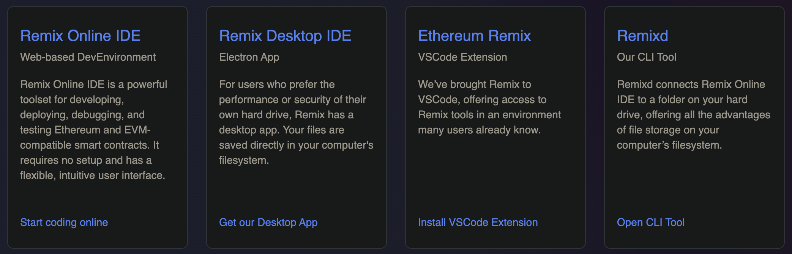
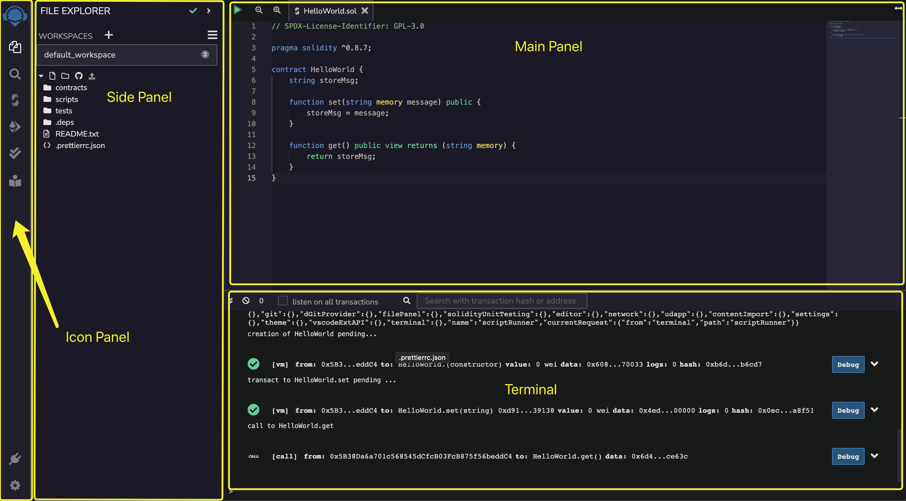
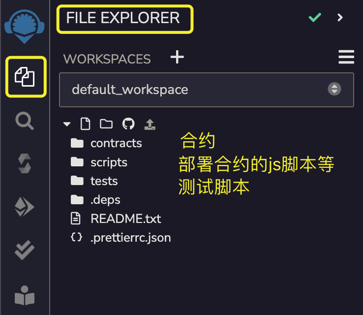
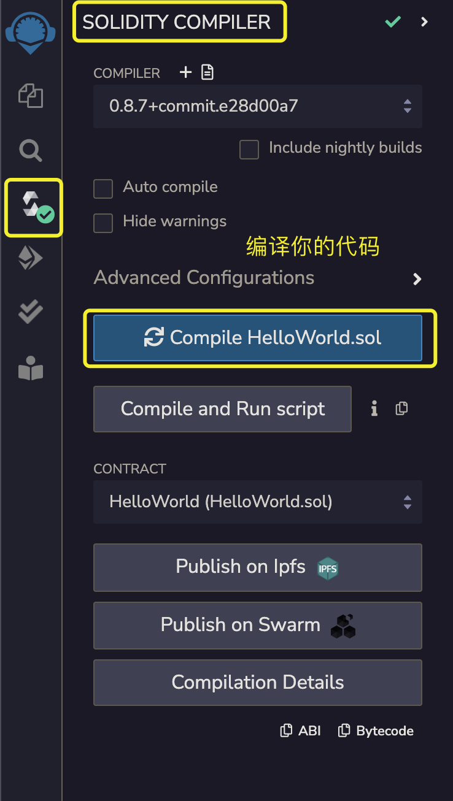
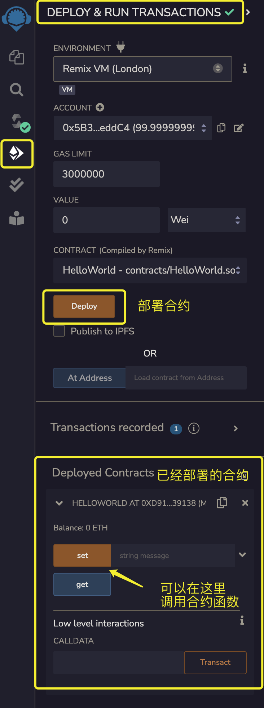

在本章节及后续所有教程中，我们将采用 Remix IDE 作为编译和开发平台。Remix 是一个开源的 Solidity 智能合约开发环境，它支持基本的编译、部署到本地或测试网络以及执行合约的功能。目前，Remix 提供四种不同的 IDE 开发工具，使你能够在自己的电脑或通过浏览器进行合约开发，具体包括：

1. Remix Online IDE：允许你在浏览器中开发合约，无需安装任何额外软件（我们将在接下来的示例中使用此方式，并推荐你在学习过程中也使用它）。
2. Remix Desktop IDE：使你能够在本地电脑上开发合约。
3. Remix VSCode 插件：通过 VSCode 上的 Remix 插件来进行开发。
4. Remixd：一个命令行工具，允许你通过 Remix Online IDE 管理和开发存储在本地电脑上的合约文件。

## Remix 界面

Remix IDE 的界面如下图所示：

Remix IDE 被划分为四个主要的面板，具体如下：

1. 图标面板（Icon Panel）：这个面板允许你查看文件目录、编译、部署等操作，主要用于控制侧边面板（Side Panel）。当你点击不同的图标时，侧边面板将相应切换显示不同的内容。
2. 侧边面板（Side Panel）：用于显示文件目录、编译、部署及文件搜索等的详细信息。
3. 主面板（Main Panel）：主要用于显示和编辑代码。
4. 终端面板（Terminal Panel）：显示合约的部署和执行交易的详细信息，并允许执行 JavaScript 脚本，如 web3.js、ethers.js 等。

### Icon Panel & Side Panel 交互

接下来，让我们详细了解一下图标面板（Icon Panel）和侧边面板（Side Panel）的主要交互操作。

首先介绍的是文件资源管理器（File Explorer）。在这个面板下，你可以看到包括合约、部署脚本以及测试脚本在内的代码目录列表。点击任何一个代码文件，文件就会在主面板（Main Panel）中打开，方便你开始编辑。在代码目录列表中，你会看到三个主要的文件夹：通常我们将智能合约代码放在 `contracts/` 文件夹，部署合约所需的 JavaScript 脚本放在 `scripts/`，而测试脚本则放置在 `tests/` 文件夹下。

第二个要介绍的功能是 Solidity 编译器（Solidity Compiler）。在这个面板下，你可以选择适合你项目的编译器版本，并对选定的代码文件进行编译。编译完成后，你将得到相应的 ABI（应用程序二进制接口）和 Bytecode（字节码文件）。Bytecode 是用于部署到以太坊虚拟机（EVM）的二进制文件。有了 ABI，不同的二进制程序就能够知道如何互相调用。ABI 在智能合约之间的相互调用或通过 JavaScript 调用合约时非常关键。在未来的章节中，我们将进一步探讨关于 ABI 的更多细节，以及它与 API（应用程序接口）的区别。目前，你只需理解 ABI 是使合约间交互成为可能的关键技术即可。

第三个要介绍的功能是部署与运行交易（Deploy & Run Transactions）。在这个面板中，你可以将你的合约部署到区块链上，并与已部署的合约进行交互。该面板还提供了选择部署环境的选项，包括各种测试网络和公链。此外，你还可以切换使用的账户等设置。

在这个面板中，你可以指定函数的参数，执行函数，并接收函数的返回值。你在与合约进行交互时将频繁使用此功能。总的来说，所有与合约部署和交互相关的操作都可以通过这个面板完成。

其他几个面板，如单元测试、搜索和插件管理等，目前还不是我们学习的重点，因此我们将不在此详细介绍它们。你可以自行尝试使用这些功能以获得更多的实践经验。

**小结：**

在本节中，我们学习了 Remix IDE 的基本界面和一些简单的交互操作。我们了解了如何将合约、JavaScript 脚本和测试脚本放置到正确的目录中。我们还掌握了如何编译合约、部署到区块链，并与部署后的合约进行交互。接下来，我们将正式开始深入学习 Solidity 的相关内容。
