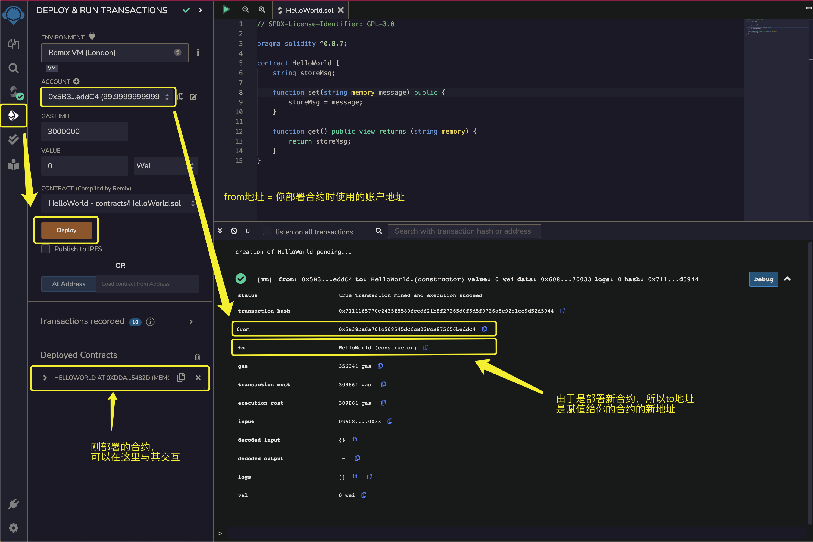
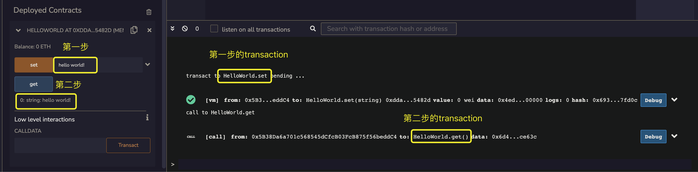

就像学习任何其他编程语言的入门一样，我们将通过编写一个简单的“Hello World”程序来介绍 Solidity 的基本语法。这不仅帮助我们熟悉语言结构，还是检验编译器、开发和运行环境是否正确安装的常用方法。

Hello World 合约
接下来的例子展示了一个基础的“Hello World”智能合约，该合约包含两个函数。一个是 `set` 函数，用于接收输入并将字符串存储在名为 `storeMsg` 的变量中；另一个是 `get` 函数，用于从 `storeMsg` 变量中检索并返回存储的字符串。这种结构简明扼要，非常适合初学者理解智能合约的基本操作。

```javascript
// SPDX-License-Identifier: GPL-3.0

pragma solidity ^0.8.17;

contract HelloWorld {
    string storeMsg;

    function set(string memory message) public {
        storeMsg = message;
    }

    function get() public view returns (string memory) {
        return storeMsg;
    }
}
```

你可能会好奇，为什么我们不像在 C 或 Python 中那样，直接打印一个"Hello World"字符串。原因在于，Solidity 并不能像其他编程语言那样自动运行代码。Solidity 代码的执行需要由某个账户或其他合约触发，并且必须支付足够的 Gas 费用才能执行其函数。因此，要测试这个"Hello World"程序，我们必须主动与之互动才能观察到执行结果。这种设计体现了智能合约在区块链上运行的独特性质。

## 部署合约

根据之前的教程，使用 Remix IDE 进行编译后，我们将进入“Deploy & Run Transactions”面板，点击“Deploy”按钮进行部署。部署完成后，我们可以在“Terminal”面板和“Deployed Contract”窗口中看到新的记录出现。

首先查看“Terminal”面板，展开信息后，可以看到关于我们部署合约的一些详细信息，包括合约部署的状态信息（status）、发起部署的账户（from）、新部署的合约地址（to）、使用的 Gas 等信息。此处我们可以确认合约部署状态显示为成功。

因此，我们可以在“Deployed Contract”窗口中找到我们刚刚部署的合约。在下一小节中，我们将介绍如何与这个“Hello World”合约进行交互。



## 合约交互

如下图所示，我们通过两个步骤与合约进行交互，并执行了两笔交易，每笔交易都需支付相应的 Gas 费用：

- 第一步： 调用 `set("hello world!")` 函数，将字符串 "hello world!" 写入到 `storeMsg` 状态变量中。
- 第二步： 调用 `get()` 函数，从状态变量 `storeMsg` 中检索并返回字符串 "hello world!"。



至此，我们已成功与合约交互，并通过 `get` 函数获得了返回的 "hello world!" 字符串。大型合约的开发同样遵循这一基本模式和流程。随着我们对区块链技术理解的加深，将能够开发出越来越复杂的合约。

## 小结

在本节中，我们介绍了一个简单的 Hello World 合约，并展示了如何部署并与之交互。在接下来的章节中，我们将深入学习更多关于 Solidity 的合约结构、数据结构和控制结构等内容。如果你想了解更多，可以查阅相关章节。
