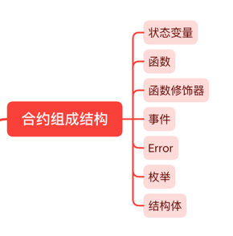

在 Web3 世界中，你可能已经与许多合约进行了交互。你可能会好奇这些合约是由哪些基本结构组成的，以及在编写合约时，我们是如何将这些结构组合起来的。本节将概述智能合约的七大基本组成结构及它们之间的相互关系。

合约的七大组成结构有:



## 一个典型的合约

为了更清楚地介绍各个组成结构的功能和外观，我们将通过一个示例来进行说明。下面展示的是一个名为“Owner”的合约，其主要功能是记录谁是合约的所有者。通过这个合约，你可以获取、更改或者移除所有者的信息。

```javascript
// SPDX-License-Identifier: GPL-3.0

pragma solidity ^0.8.17;

contract Owner {

    // 结构体
    struct Identity {
        address addr;
        string name;
    }

    // 枚举
    enum State {
        HasOwner,
        NoOwner
    }

    // 事件
    event OwnerSet(address indexed oldOwnerAddr, address indexed newOwnerAddr);
    event OwnerRemoved(address indexed oldOwnerAddr);

    // 函数修饰器
    modifier isOwner() {
        require(msg.sender == owner.addr, "Caller is not owner");
        _;
    }

    // 状态变量
    Identity private owner;
    State private state;

    // 下面的都是函数
    
    // 构造函数
    constructor(string memory name) {
        owner.addr = msg.sender;
        owner.name = name;
        state = State.HasOwner;
        emit OwnerSet(address(0), owner.addr);
    }

    // 普通函数
    function changeOwner(address addr, string calldata name) public isOwner {
        owner.addr = msg.sender;
        owner.name = name;
        emit OwnerSet(owner.addr, addr);
    }

    // 普通函数
    function removeOwner() public isOwner {
        emit OwnerRemoved(owner.addr);
        delete owner;
        state = State.NoOwner;
    }

    // 普通函数
    function getOwner() external view returns (address, string memory) {
        return (owner.addr, owner.name);
    }

    // 普通函数
    function getState() external view returns (State) {
        return state;
    }
}
```

上述 Solidity 合约实现了一个基本的 `owner` 管理功能，允许设置、管理和删除合约的 `owner`。它包括了多种组成元素，如结构体、枚举、事件、函数修饰器、状态变量和函数。接下来，我们将逐一解析这些组成结构，以更深入地理解每个部分的作用和相互关系。

### 结构体

结构体是一种数据类型，它允许将多个字段组合成一个集合。这种结构体可以用于定义更复杂的数据类型，使得数据组织和处理更为高效和有序。

```javascript
struct Identity { // 结构体
    address addr;
    string name;
}
```

- `Identity` ：它是一个结构体，包含了 `owner` 的地址和姓名两个字段。

### 枚举

枚举是一种数据类型，用于定义一组固定的命名常量，将名称与整数值关联起来。使用枚举可以提高代码的可读性和可维护性，使得代码中的意图更加明确。

```javascript
enum State { // 枚举
    HasOwner,
    NoOwner
}
```

- `State` ：它是一个枚举，定义了两个状态 `HasOwner` 和 `NoOwner` 。

### 事件

事件在 Solidity 中是一种特殊的功能，用于记录合约执行过程中的关键活动。它们相当于 Solidity 的日志系统。这些事件一旦被触发，就可以通过与合约连接的客户端进行访问和监听，从而使外部系统能够轻松跟踪合约的活动。

```
// 事件
event OwnerSet(address indexed oldOwnerAddr, address indexed newOwnerAddr);
event OwnerRemoved(address indexed oldOwnerAddr);
```

- `OwnerSet`：当 `owner` 被设置成新 owner 时触发
- `OwnerRemoved`：当 `owner` 被删除时触发

### 函数修饰器

函数修饰器可以被用来修饰函数的行为。

```
modifier isOwner() { // 函数修饰器
    require(msg.sender == owner.addr, "Caller is not owner");
    _;
}
```

- `isOwner` ：它是一个函数修饰器，只允许合约的 `owner` 调用被它修饰的函数。

### 状态变量

状态变量是用于存储合约的持久状态的变量。这些变量被永久记录在区块链上，并且可以在合约的执行过程中被读取或修改。状态变量是合约存储和管理数据的关键组件，确保数据的持久性和可访问性。

```
Identity private owner;  // 状态变量
State private state;     // 状态变量
```

- `owner`：它是一个 `Identity` 类型的变量，表示合约的 owner
- `state`：它是一个 `State` 类型的变量，表示合约的当前状态

### 函数

函数是定义在智能合约中的一组逻辑块，它们规定了合约能够执行的具体操作。这些函数可以接受参数，并根据这些参数计算并返回结果。此外，函数可以被其他合约调用，使得合约之间可以互相交互和协作。

```
// 构造函数
constructor(string memory name) {
    owner.addr = msg.sender; 
    owner.name = name;
    state = State.HasOwner;
    emit OwnerSet(address(0), owner.addr);
}

// 普通函数
function changeOwner(address addr, string calldata name) public isOwner {
    owner.addr = msg.sender; 
    owner.name = name;
    emit OwnerSet(owner.addr, addr);
}

// 普通函数
function removeOwner() public isOwner {
    emit OwnerRemoved(owner.addr);
    delete owner;
    state = State.NoOwner;
}

// 普通函数
function getOwner() external view returns (address, string memory) {
    return (owner.addr, owner.name);
}

// 普通函数
function getState() external view returns (State) {
    return state;
}
```

**该合约定义了五个主要函数，具体如下：**

- constructor(string memory name)：这是合约的构造函数，它在合约部署时自动执行。此函数将当前调用者设为 owner，并将合约的状态设置为 `HasOwner`。
- changeOwner(address addr, string calldata name)：用于修改 owner。
- removeOwner()：用于删除 owner。
- getOwner()：返回 owner 的地址和名称。
- getState()：返回合约的状态。

**主要操作包括：**

- 在合约部署时，调用构造函数 `constructor(string memory name)` 来设置 owner。
- 使用 `changeOwner(address addr, string calldata name)` 来修改 owner。
- 通过 `removeOwner()` 来删除 owner。
- 所有关键操作都通过函数修饰器 `isOwner` 进行保护，确保只有 owner 才能执行这些操作。
- 合约还包含辅助函数，如 `getOwner` 和 `getState`，这些函数用于查询 owner 的信息和合约的状态。
- 此外，合约定义了两个事件：`OwnerSet` 和 `OwnerRemoved`，它们分别在 owner 被设置或删除时触发。这些事件可以被外部系统监听，从而做出响应。

## 小结

1. 状态变量: 存储在合约中的变量，用于记录合约的持续状态。在本例中，定义了私有状态变量 `owner` 和 `state`。
2. 函数: 合约中定义的可执行代码块。本例包括构造函数 `constructor` 和其他函数 `changeOwner`、`removeOwner`、`getOwner` 以及 `getState`。
3. 函数修饰器: 用于修改函数行为的声明，这在函数定义前使用。在本例中，使用了 `isOwner` 修饰器以确保只有所有者可以执行某些操作。
4. 事件: 用于记录合约操作的日志，这有助于外部监听并追踪合约的活动。本例中引入了 `OwnerSet` 和 `OwnerRemoved` 事件。
5. 错误处理: 在合约中定义的错误处理机制，用于管理执行过程中的异常情况。
6. 结构体: 用于定义更复杂的数据类型。本例中创建了 `Identity` 结构体来存储额外信息。
7. 枚举: 用于定义一组命名常量，提高代码的可读性和维护性。本例中使用了 `State` 枚举来描述合约的不同状态。
