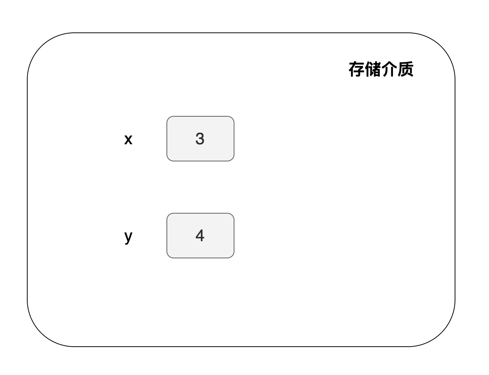
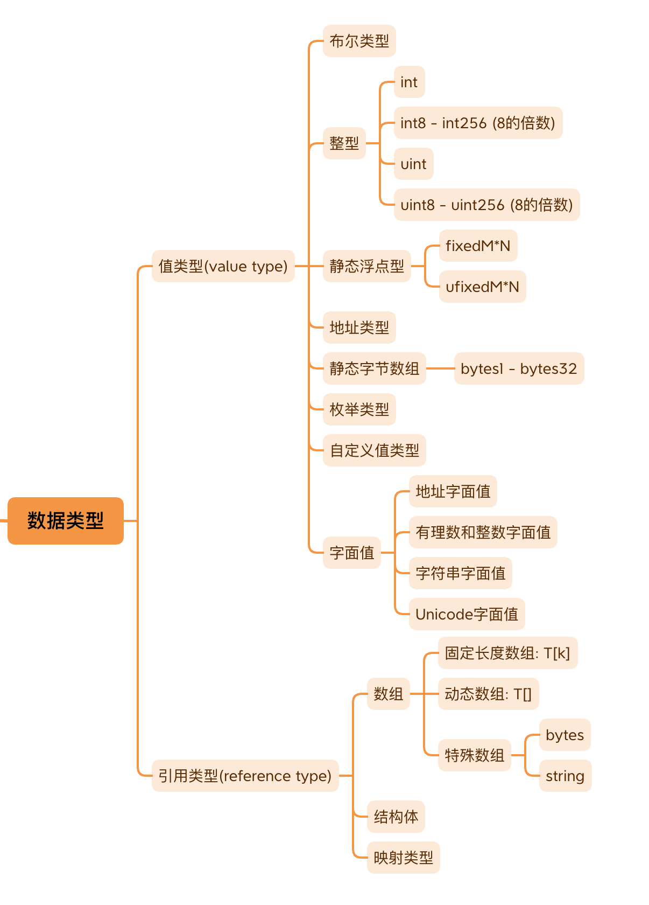

在合约开发中，经常需要记录一些关键的状态数据，如 Token 余额、合约的 Owner 等。这些数据存储在何处？答案是：它们被存储在变量中，我们可以对这些变量执行各种运算操作。在 Solidity 语言中，变量作为存储数据的容器。

如果你熟悉初等代数，你会理解表达式 `x=3`, `y=4` 的含义——这表示将数值 3 赋给变量 x，将数值 4 赋给变量 y。Solidity 中定义合约变量的方式也是类似的。例如，下面的表达式中定义了两个变量：一个是 `x`，其值为 3；另一个是 `y`，其值为 4。这种方式简单直观地展示了如何在 Solidity 合约中设置和使用变量。

```
uint x = 3;
uint y = 4;
```
我们说过变量是用来存储数据的容器，所以它们会在存储介质里面占据一定的空间。如下面所示：



数据类型
在上面的示例中，我们定义了两个变量，它们的数据类型均为 `uint`。Solidity 是一种静态类型语言，这意味着你必须为每个变量指定一个具体的类型。这种类型指定帮助确保数据的一致性和代码的安全性。你可以为变量指定下面的类型:



## 数据位置

我们之前提到，变量是存储在某种介质上的。在传统应用程序中，数据可能存储在内存或硬盘上。存储在内存中的数据是易失的，程序一旦退出运行，这些数据就会消失。而存储在硬盘上的数据是持久的，当程序再次运行时，这些数据会被重新读取。同样地，在智能合约中，也存在不同的数据存储位置，这些位置决定了数据的持久性。

Solidity 中有三种数据存储位置，分别指定变量的存储方式：

- **storage：** 数据永久存储在区块链上，通常用于状态变量。
- **memory：** 数据存储在内存中，是临时的，当函数调用结束后数据就会消失。
- **calldata：** 数据存储在一个专门用于存放函数参数的区域，这也是临时的。

在这些存储位置中，标记为 `storage` 的数据位置通常关联到我们所说的“状态变量”，它们的数据是永久记录在区块链上的。这种机制确保了区块链数据的不可变性和合约状态的持续性。

## 声明与定义

在很多资料中，你可能会看到“声明”（declaration）和“定义”（definition）这两个概念的区分。一般来说，声明是指为变量指定名字和数据类型的过程，而定义则不仅包括指定名称和数据类型，还包括为变量分配存储空间和赋予初始值。

然而，在我们接下来的讨论中，我们不会特别区分这两个概念。我们会交替使用“声明”和“定义”，主要是因为在编写智能合约的上下文中，这种区分并不会对我们的工作产生重大影响。过于严格地区分这两者可能反而会使文章变得更难理解。

在 Solidity 中，一旦变量被声明，如果没有手动初始化，它会自动被赋予一个默认的初始值，这通常称为“零值初始化”。因此，不论变量是否被显式初始化，它最终都会拥有一个初始值。这就是为什么在 Solidity 的环境下，区分声明与定义不是特别必要的原因。
