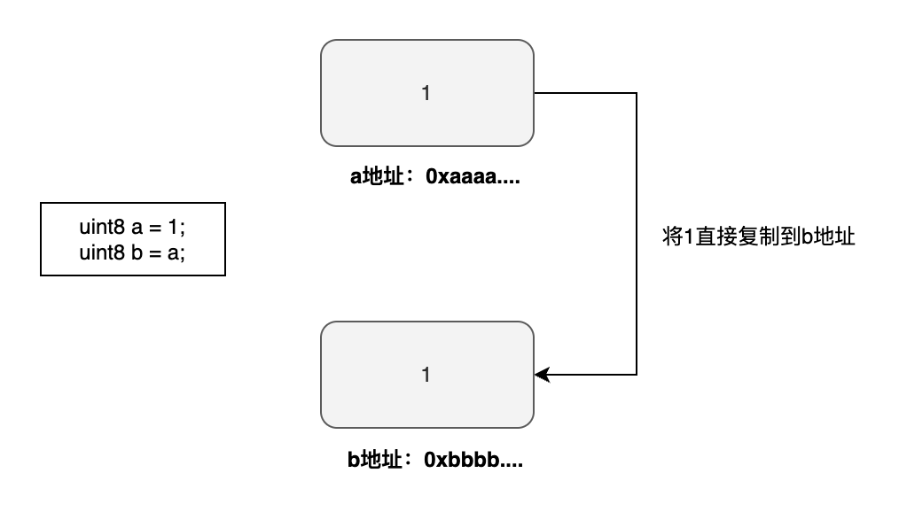
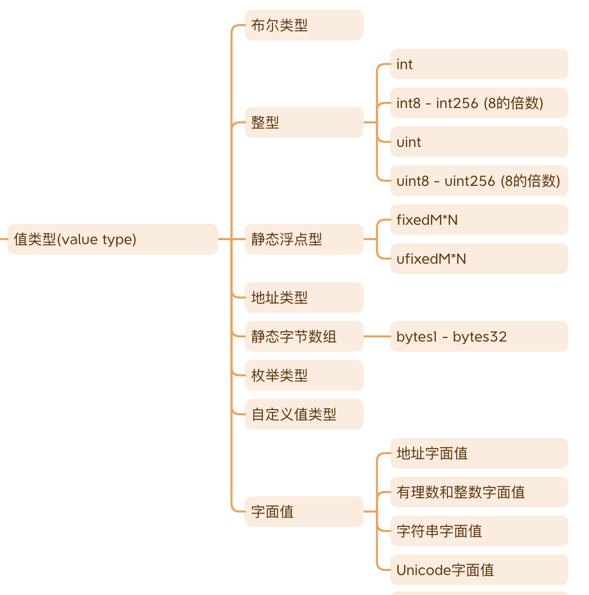
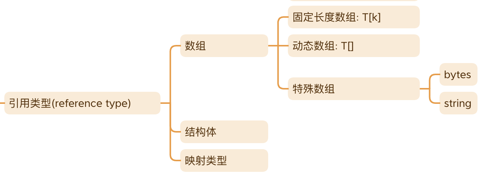
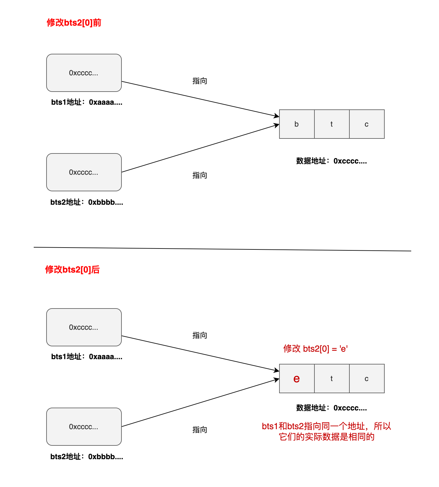

智能合约在本质上是计算机程序，因此它能够处理多种不同的数据类型，每种类型都有其特定的表示方式和操作方法。在 Solidity 中，基于参数传递的方式，数据类型可以分为两大类：「值类型」和「引用类型」。

- 值类型：这类类型的数据在传递时会被复制，每次传递都是一个独立的副本。
- 引用类型：相对于值类型，引用类型的数据在传递时不复制其本身，而是传递对原始数据的引用。

## 值类型

「值类型」的变量直接存储实际的数据内容。当这类变量进行赋值或传递参数时，操作总是以值传递的形式进行，即数据内容被直接拷贝到新位置。因此，赋值之后的变量与原始变量完全独立，彼此之间没有任何影响。这种机制确保了数据的独立性和安全性，在操作过程中避免了意外的数据修改。

示例：值传递

```
uint8 a = 1;
uint8 b = a;
```



### **值类型列表**

下面列出了 Solidity 中绝大部分的「值类型」。这些类型中包括了在其他编程语言中也常见的类型，如布尔类型、整型和枚举类型等。同时，也包括了一些 Solidity 特有的类型，如静态浮点型、静态字节数组和自定义值类型等。



## 引用类型

「引用类型」的变量存储的是**数据的地址**，而不是数据本身。因此，当这种类型的变量进行赋值或参数传递时，传递的是数据的地址（按引用传递）。这种方式允许直接操作存储地址指向的数据，而不是创建数据的副本，从而在处理大量数据或复杂数据结构时提高效率。

### 引用类型列表

Solidity 中的引用类型主要分为三类，每种类型都有其特定的用途和结构：

- **数组：** 这是由相同类型的变量组成的集合，允许存储多个数据项。
- **结构体：** 由不同类型的变量组成的集合，使得可以在单一结构中组合多种数据类型。
- **映射类型：** 由键值对组成的集合，允许通过键来快速访问或修改对应的值。



这三种引用类型我们都有单独的章节进行讨论，可以参看这些章节了解详细内容。

### 引用传递（_pass by reference_）

传递数据地址的方法通常被称为「引用传递」（pass by reference）。在这种方法中，赋值或参数传递时传递的是数据的地址，而不是数据本身。

在下面的示例中，我们定义了两个字节数组 `bts1` 和 `bts2`。在代码的第二行，通过赋值 `bts2 = bts1`，`bts2` 和 `bts1` 都开始指向同一个数据地址。因此，当修改其中任何一个数组的内容时，另一个数组的内容也会相应地发生变化，因为它们共享同一个存储位置。这展示了引用传递如何在实际应用中工作，以及它如何影响关联变量的值。

```
bytes memory bts1 = "btc";
bytes memory bts2 = bts1;

console.log("bts1: %s", string(bts1)); // bts1: btc
console.log("bts2: %s", string(bts2)); // bts2: btc

bts2[0] = 'e'; //这里只改了bts2[0]的值，但是你会发现bts1[0]的值也会跟着变动

console.log("bts1: %s", string(bts1)); // bts1: etc
console.log("bts2: %s", string(bts2)); // bts2: etc
```

下面的图示更形象地解析了出现这种效果的原因：



现在我们已经理解了什么是引用类型以及什么是引用传递。但是，所有引用类型是否总是通过引用传递呢？答案是：并不是。引用类型数据是通过「值传递」还是「引用传递」，这实际上取决于一个重要的因素「数据位置修饰符」。

在我们专门讨论「数据位置」的章节中，我们将详细解释有哪些不同的数据位置，以及在何种情况下引用类型采用「值传递」和何种情况下采用「引用传递」。这将帮助你更好地理解数据如何在 Solidity 合约中被处理和传递。

## 小结

1. 数据类型分类：Solidity 中的数据类型主要分为值类型和引用类型。
2. 值类型：这类变量直接存储实际的数据内容。当这些变量在赋值或传递参数时，进行的是值传递，即数据的直接拷贝。
3. 引用类型：这类变量存储的是数据的存储地址。在赋值或传递参数时，进行的是引用传递，即地址的拷贝。不过，这也受到数据位置（datalocation）的影响。
4. Solidity 中的值类型：包括布尔类型、整型、枚举类型、静态浮点型、静态字节数组、自定义值类型等。
5. Solidity 中的引用类型：包括数组、结构体、映射类型。
6. 值与引用的行为差异：在函数内部修改引用类型变量的值会影响到原始变量，而修改值类型变量则不会影响原始数据。
