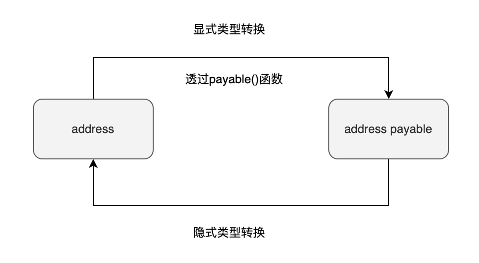
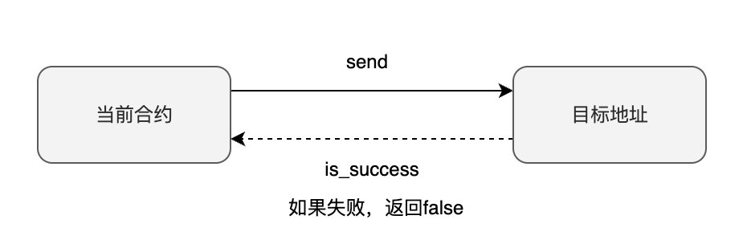
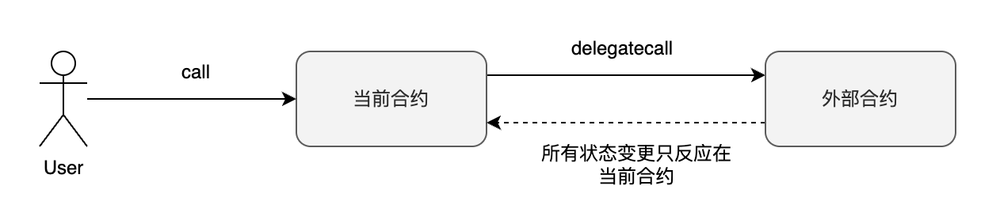

地址类型（address）是 Solidity 独有的一种类型，用于存放账户地址。在给其他账户转账或与其他合约交互时，需要使用地址类型。类似于向他人银行账户转账时需要知道对方的账户号码，Solidity 的地址类型也扮演着类似的角色。

Solidity 的地址类型用关键字 `address` 表示。它占据 20 字节（160 位），默认值为 `0x0`，表示空地址。地址类型可以细分为两种：

- `address`：普通地址类型（不可接收转账）
- `address payable`：可收款地址类型（可接收转账）

这两种地址类型的主要区别在于，`address payable` 能接受转账，而 `address` 不能。接下来，我们将先介绍如何定义地址类型的变量，然后再解释为什么要区分这两种地址类型。

## 定义地址类型变量

我们可以按照下面的格式定义地址类型变量：

定义地址类型变量

```
address addr = 0x690B9A9E9aa1C9dB991C7721a92d351Db4FaC990;
address payable addr_pay = payable(0x8306300ffd616049FD7e4b0354a64Da835c1A81C);
```

上面我们定义了两个地址类型变量：`addr` 和 `addr_pay`，并将它们直接初始化为一个地址常量（也称地址字面值）。在 Solidity 中，使用地址字面值初始化地址类型变量时，不需要加 `""` 或者 `''`。

注意到在定义 `addr_pay` 时，我们使用了一个 `payable()` 函数，这是用来将地址字面值显式转换为 `address payable` 类型的。下面会有一个小节专门讨论地址类型的转换。

## 为什么要区分 address 和 address payable

到现在为止，我们已经了解了地址类型的基本作用是存放账户地址。但是，我们仍有一个疑问：address 和 address payable 看起来区别不大，为什么要区分它们？直接统一使用 address 类型，想要转账就转账，不想转账就不转不就可以了吗？

Solidity 之所以要进行这样的区分，是为了提高合约的安全性，避免 Ether 转入某些合约后无法转出，导致资金永远被锁住。

首先，我们需要了解 Solidity 中账户有两种类型：外部账户（externally owned address，简称 EOA）和合约账户（contract address，简称 CA）。EOA 是我们在 MetaMask 上创建的那些账户，而 CA 是在部署合约后生成的合约地址。

当我们将 Ether 转入 EOA 后，只要我们控制了 EOA 的私钥，就可以将 Ether 再转出来。然而，CA 账户情况则不同。CA 账户是由合约控制的，合约只能执行其定义过的操作。因此，我们必须在合约中实现一个函数，定义如何将账户中的 Ether 转出，否则这些 Ether 会被永远锁在 CA 账户中。

因此，每次向 CA 账户转账时，我们都必须问自己：这个合约是否已经定义了转出 Ether 的逻辑。使用 address payable 明确告诉编译器你已确认转账到该地址是安全的。这不仅提高了合约的安全性，也更方便开发者进行调试。

## 类型转换

`address` 和 `address payable` 之间可以互相进行类型转换。主要遵循两条规则。

1. `address payable` 可以隐式地被转换成 `address`
2. `address` 需要显式地使用 `payable(addr)` 函数转换成 `address payable`



隐式类型转换(`address payable` TO `address`)

```
address payable addr_pay = payable(0x8306300ffd616049FD7e4b0354a64Da835c1A81C);
address addr = addr_pay; _// 隐式类型转换_
```

显式类型转换(`address` TO `address payable`)

```
address addr = 0x690B9A9E9aa1C9dB991C7721a92d351Db4FaC990;
address payable addr_pay = payable(addr); _// 显式类型转换_
```

## 成员变量

地址类型有三个成员变量，分别为：

- `balance` ：该地址的账户余额，单位是 Wei
- `code` ：该地址的合约代码，EOA 账户为空，CA 账户为非空
- `codehash` ：该地址的合约代码的 hash 值

获取成员变量值

下面展示了如何获取地址的成员变量。其中 `this` 代表的是当前合约。

```
function get_balance() public view returns(uint256) {
     return address(this).balance; _//获取地址账户余额_
}

function get_code() public view returns(bytes memory) {
    return address(this).code; _//获取合约代码_
}

function get_codehash() public view returns(bytes32) {
    return address(this).codehash; _//获取合约代码的hash值_
}
```

## 成员函数

地址类型有五个成员函数：

- transfer(uint256 amount)：向指定地址转账，失败时抛出异常（仅 `address payable` 可以使用）。
- send(uint256 amount)：与 `transfer` 函数类似，但失败时不会抛出异常，而是返回布尔值（仅 `address payable` 可以使用）。
- call(...)：调用其他合约中的函数。
- delegatecall(...)：与 `call` 类似，但使用当前合约的上下文来调用其他合约中的函数，修改的是当前合约的数据存储。

### transfer

**函数签名**

```
transfer(uint256 amount)
```

`transfer 函数用于向目标地址转账，可以指定转账数量 amount，单位为 Wei。如果发送失败，函数会直接 revert。执行此操作的 Gas 固定为 2300。需要注意的是，transfer 函数仅 address payable 类型可以使用。`


### send

**函数签名**

```
send(uint256 amount) returns (bool)
```

`send` 函数用于向目标地址转账。可以指定转账数量为 `amount`，单位为 Wei 。如果发送失败，函数会返回 `false` 。与 `transfer` 的区别在于，`send` 返回 `false` 而 `transfer` 直接 `revert`。执行此操作的 Gas 同样固定为 2300。需要注意的是，`send` 函数仅 `address payable` 类型可以使用。



#### transfer 和 send 应该使用哪一个

在转账时，应该选择使用 `transfer` 还是 `send` 呢？一般而言，我们建议一律选择 `transfer`。因为 `transfer` 是对 `send` 的改进，其目的是在转账失败时立即终止交易。相比之下，使用 `send` 时需要检查返回值以确认转账是否成功，再进行后续处理。如果忽略了这个检查，可能会导致合约受到攻击的风险。

然而，根据最新的分析（截至 2023 年 1 月），这两个函数都被认为存在安全性问题，因此不建议继续使用。更为安全的方法是使用 `call` 函数进行转账。

### call

**函数签名**

```
call(bytes memory) returns (bool, bytes memory)
```

使用 `call` 函数，你可以与合约地址进行交互，调用其函数，或者直接向其转账。`call` 函数返回两个值。第一个是布尔值，用于显示函数调用是否成功。第二个是 `bytes memory` 类型，表示调用对方合约返回的结果。

与 `send` 和 `transfer` 不同的是，`call` 函数可以指定 Gas。通过 `call` 函数，我们也可以向其他地址转账。具体的操作方法将在 `call` 函数的独立章节中进行详细讨论。


### delegatecall

**函数签名**

```
delegatecall(bytes memory) returns (bool, bytes memory)
```

Delegatecall 是实现代理模式的一种方式。通过使用 delegatecall，你可以使当前合约使用给定地址的代码，同时继续使用当前合约的存储（如状态变量、账户余额等）。"Delegate"一词意味着委派，即让另一个合约代表当前合约执行特定操作。例如，合约 A 可以委派合约 B 执行某些操作，而 B 合约只是代理执行这些操作，最终的状态变更都记录在合约 A 上。

基于 delegatecall 的这种特性，OpenZeppelin 提出了代理模式，使得合约升级变得可能。我们将在单独的章节中详细探讨 delegatecall 及其应用。



### [staticcall](https://eips.ethereum.org/EIPS/eip-214)

`staticcall 与 call 非常相似。它们唯一的区别在于 staticcall 不会修改合约的状态（包括当前合约和被调用的外部合约）。如果在调用过程中发生状态更改（如修改状态变量或更改账户余额），则交易会被立即终止。引入 staticcall 提高了合约的安全性，因为一旦使用 staticcall，就可以确保调用任何外部合约的函数都不会对状态产生影响。在引入 staticcall 之前，需要通过阅读外部合约的代码来确认这一点。`


## 小结

1. Solidity 中的地址类型用于进行转账和与其他合约交互。
2. 地址类型由关键字 address 表示，占据 20 字节（160 位）。其默认值为 0x0。
3. 地址类型分为普通地址类型和可收款地址类型。
4. 可收款地址类型能够接收转账，而普通地址类型则不能。
5. 使用 payable() 函数可以将地址字面值显式转换为可收款地址类型。
6. 成员变量 balance 可以获取地址的余额。
7. 函数 transfer() 允许向指定地址进行转账。
8. 函数 send() 类似于 transfer()，但如果转账失败则会抛出异常。
9. 函数 call() 可以调用其他合约中的函数。
10. 函数 delegatecall() 与 call() 类似，但使用当前合约的上下文来调用其他合约中的函数。
11. 函数 staticcall() 也类似于 call()，但不允许改变状态变量的操作。
12. 函数 transfer() 和 send() 只能在 address payable 类型中使用。
