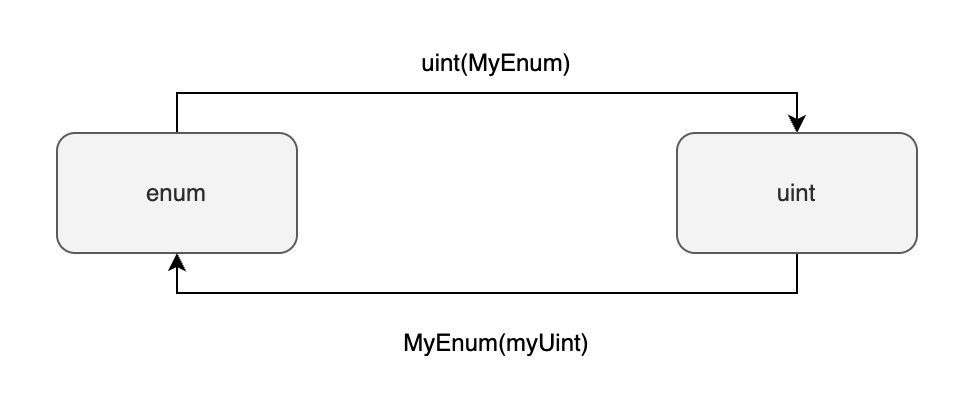

枚举是一种组织和收集有关联变量的方法。我们逐一列举变量可能的取值，将它们收集在一起，并为它们取一个统一的名称，这样就定义了一个枚举类型。举例来说，当你开发一个链游时，也许需要根据键盘输入的上下左右来控制游戏角色的动作。这时，你可以定义一个名为 ActionChoices 的枚举类型，其中包含上下左右四个有限的取值。

Solidity 的枚举类型与 C 语言中的相似，都是一种特殊的整型。它定义了一组名称和整数值之间的对应关系，内部表示为从 0 开始的正整数。

## 定义枚举类型

枚举类型的定义方式如下所示：

定义枚举值类型

```
enum ActionChoices { 
    GoLeft,     _// 底层表示为 0 _
    GoRight,    _// 底层表示为 1_
    GoUp,       _// 底层表示为 2_
    GoDown      _// 底层表示为 3_
}
```

## 为什么使用枚举类型

使用枚举类型可以增强代码的类型安全性和可读性。因为枚举类型的变量只能取有限的几个预定义值，一旦赋予了其他值，编译器就会在编译期间报错。

举个例子，如果你用 uint8 类型来表示上下左右的动作，而不小心将 999 传递进去，合约可能会出现无法预料的问题。然而，使用枚举类型就能避免这样的情况。

此外，枚举类型还能提高代码的可读性。例如，使用 ActionChoices 比使用 uint8 更容易理解变量所代表的含义。

## 访问枚举值

你可以通过 `.` 操作符来访问枚举类型的某个枚举值。例如：

使用枚举值

```
ActionChoices choice = ActionChoices.GoLeft;
```

## 枚举类型的最大最小值

枚举类型是一种特殊的整型，因此你可以获取枚举类型的最大值和最小值：

- type(NameOfEnum).max：枚举类型的最大值
- type(NameOfEnum).min：枚举类型的最小值

获取枚举类型的最大最小值

```
type(ActionChoices).max; _// ActionChoices.GoDown ，也就是3_
type(ActionChoices).min; _// ActionChoices.GoLeft ， 也就是0_
```

## 枚举类型与整型的互相转换

枚举类型可以和任何整型进行互相转换：

- `uint(MyEnum)` 将枚举类型转换成 `uint`
- `MyEnum(myUint)` 将 `uint` 转换成枚举类型



枚举类型与整型的互相转换

```
function enumToUint(ActionChoices c) public pure returns(uint) {
    return uint(c);
}

function uintToEnum(uint i) public pure returns(ActionChoices) {
    return ActionChoices(i);
}
```

## 枚举类型作为函数参数或返回值

如果枚举类型仅在当前合约中定义，那么外部合约在调用当前合约时得到的枚举类型返回值会被编译器自动转换成 uint8 类型。因此，外部合约看到的枚举类型实际上是 uint8 类型。这是因为 ABI（应用二进制接口）中不存在枚举类型，只有整型，所以编译器会自动进行这种转换。

例如，在下面的示例中，函数 getChoice 的返回值是 ActionChoices 类型。编译器会自动将其更改为 uint8 类型，因此外部合约看到的返回值类型是 uint8 类型。

```
_// SPDX-License-Identifier: GPL-3.0_
pragma solidity ^0.8.17;

contract Enum {
    enum ActionChoices { 
        GoLeft,     _// 0_
        GoRight,    _// 1_
        GoUp,       _// 2_
        GoDown      _// 3_
    }

    ActionChoices choice;

    _// 因为ABI中没有枚举类型，所以这里的"getChoice() returns(ActionChoices)"函数签名_
    _// 会被自动转换成"getChoice() returns(uint8)"_
    function getChoice() public view returns (ActionChoices) {
        return choice;
    }
}
```

## 小结

1. 枚举类型是一种整理相关变量的方法。
2. Solidity 的枚举类型类似于 C 语言，都是一种特殊的整型。
3. 使用枚举类型可以提高代码的类型安全性和可读性。
4. 可以通过点操作符来获取枚举类型的特定枚举值。
