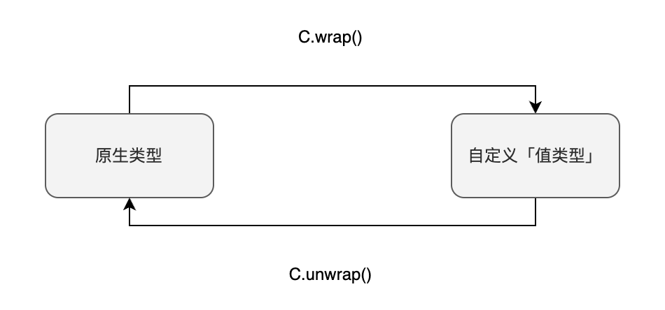

"自定义值类型"（User Defined Value Types）是用户定义的一种"值类型"。与之类似的另一种自定义类型是结构体，不过结构体是引用类型，我们稍后会详细介绍。"自定义值类型"类似于别名，但并不等同于别名。别名与原类型完全相同，只是名称不同。然而，"自定义值类型"则不具备原始类型的操作符（如 +、-、*、/等），其主要价值在于提高类型安全性和代码可读性。

「自定义值类型」的定义
通过 `type C is V` 可以定义新的"自定义值类型"，其中 C 是新定义的类型，V 必须是 Solidity 的原生类型。例如，下面的例子定义了两种新类型：

**定义 USER-DEFINED VALUE TYPE**

```
type Weight is uint128;
type Price  is uint128;
```

原生类型指的是 Solidity 本身定义的，比如：int, uint, bytes32 等等。不能是由原生类型衍生出来的类型。

## 「自定义值类型」有什么好处

### 提高类型安全性

使用"自定义值类型"可以增强代码的类型安全性。例如，下面的代码中会出现编译错误 "TypeError: Operator + not compatible with types UserDefinedValueType.Weight and UserDefinedValueType.Price."，因为 Weight 和 Price 是不同的类型，不能进行算术运算。这种情况下，类型安全性得到了提升，避免了直接使用 uint128 类型可能导致的误用。

提高类型安全性

```
Weight w = Weight.wrap(10);
Price  p = Price.wrap(5);
Weight wp = w+p; _//编译错误_
Price  pw = p+w; _//编译错误_
```

### 提高代码可读性

提升代码的可读性就显而易见了，举例来说，在前面的例子中，当你看到 w 是 Weight 类型时，就能直观地理解 w 代表的是重量；而当看到 p 是 Price 类型时，则明白 p 所表示的是价格。

## 类型转换

自定义值类型和原生类型之间没有隐式类型转换，那么我们应该如何进行类型转换呢？我们可以通过显式调用下面两个转换函数来实现：

- C.wrap：将原生类型转换成自定义值类型。
- C.unwrap：将自定义值类型转换成原生类型。



「自定义值类型」与原生类型之间的类型转换

```
Weight w = Weight.wrap(100);
uint128 u = Weight.unwrap(w);
```

## 「自定义值类型」不继承操作符

请注意，“自定义值类型”不会继承原生类型的操作符，包括 + - * / 等。例如，在下面的示例中，编译器将报错："TypeError: Operator + not compatible with types UserDefinedValueType.Weight and UserDefinedValueType.Weight."

```
Weight w1 = Weight.wrap(10);
Weight w2 = Weight.wrap(20);
Weight sum = w1+w2; _// 编译器报错_
```

如果你确实需要对 `Weight` 实现加法运算，那么你必须自己定义一个新的函数，例如：

「自定义值类型」需要自定义函数来代替操作符

```
function add(Weight lhs, Weight rhs) public pure returns(Weight) {
  return Weight.wrap(Weight.unwrap(lhs) + Weight.unwrap(rhs));
}
```

## 小结

1. 自定义值类型是用户自定义的值类型，类似于别名，但并不等同于别名。
2. 可以通过 type C is V 来定义新的自定义值类型。
3. 使用自定义值类型可以提高代码的类型安全性和可读性。
4. 不同自定义值类型之间不能进行算术运算。
5. 自定义值类型和原生类型之间没有隐式类型转换，需要使用强制类型转换进行转换。
