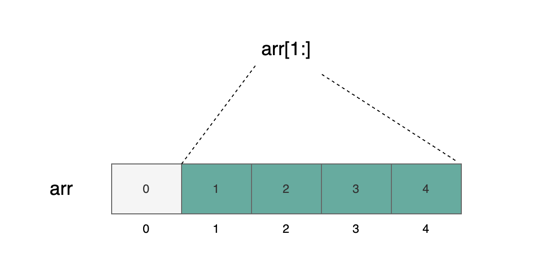

数组切片（array slice）是建立在数组基础上的一种视图（view）。其语法形式为 arr[start:end]。这个视图包含的是从索引 start 到索引 end-1 的元素。与数组不同的是，切片是没有具体类型的，也不会占据存储空间。它是一种方便我们处理数据的抽象方式。

## 多种数组切片表示方式

如图所示，底层数组 arr 包含了五个元素 [0, 1, 2, 3, 4]。在 arr[1:4] 中，被涂成墨绿色的部分表示一个视图，总共包含了三个元素。根据之前的定义，我们知道 start=1，end=4。因此，这个视图包含了从索引 1 到索引(4-1)=3 的元素。


start 和 end 可以被省略。如果省略了 start，则视图将包含从索引 0 到索引 end-1 的元素：


如果省略了 end，则视图将包含从索引 start 到数组末尾的元素：



如果 `start` 和 `end` 都省略了，那么会包含 `arr` 所有元素：


## 数组切片示例

下面展示了一个数组切片截取字符串前 4bytes 的示例：

数组切片截取字符串前 4BYTES

```
_// 如果输入"abcdef"，将会输出"abcd"_
function extracFourBytes(string calldata payload) public view {
    string memory leading4Bytes = string(payload[:4]);
    console.log("leading 4 bytes: %s", leading4Bytes);
}
```

## 数组切片只能作用于 calldata

CAUTION

目前只能对 calldata 使用数组切片。memory 和 storage 都不可以使用。在 Solidity 中，仅能对 calldata 进行数组切片操作。若尝试在 memory 或 storage 中使用，编译将会报错。由于 calldata 数据不可更改，因此无法对数组切片的值进行修改。

```
uint[5] storageArr = [uint(0), 1, 2, 3, 4];
function foo() public {
    uint[3] storage s1 = storageArr[1:4]; _// 编译错误，不能对 storage 位置的数组进行切片_

    uint[5] memory memArr = [uint(0), 1, 2, 3, 4];
    uint[3] memory s2 = memArr[1:4]; _// 编译错误，不能对 memory 位置的数组进行切片_
}
```
