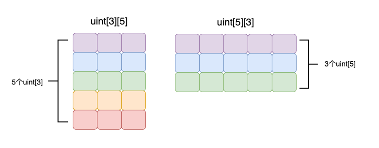

在前面的章节中，我们学习了数组，了解到数组是由同类型元素组成的集合。到目前为止，我们只接触了一维数组。现在，想象一下，如果你的合约不仅管理一种 NFT，而是同时管理多种 NFT。例如，你可能同时拥有多个 Crypto Punk 和多个 Bored Ape。


如果将所有 NFT ID 放在同一个一维数组中，显然并不合适，因为 Crypto Punk 和 Bored Ape 可能都有相同的 ID，如 1001、1002、1003 等。在这种情况下，你可能会希望对它们进行分组。可以使用一个数组专门记录 Crypto Punk 的 NFT ID，另一个数组专门记录 Bored Ape 的 NFT ID。以下是一个示例：

```
_// 分别记录两种NFT ID_
uint[3] memory cryptoPunk = [uint(1001), 1002, 1003];
uint[5] memory boredApe = [uint(1001), 1002, 1003, 2001, 2002];
```

这种方法虽然解决了我们当前的问题，但它并不适合长远考虑。例如，如果将来想要购买新类型的 NFT，现有的合约已部署且无法修改，这就意味着无法灵活地新增 NFT 种类。因此，这种方法存在局限性。在这种情况下，我们可以采用多维数组来更加完美地解决这个问题，使得合约能够灵活应对不同类型的 NFT 的添加。

## 多维数组的声明

多维数组也是同类型元素的集合。只不过它在这个基础上再分组而已。例如，我们可以创建一个二维数组，如下所示：

```
uint[3][3] memory arr;
```

我们也可以创建一个三维数组，如下所示：

```
uint[3][3][3] memory arr;
```

多维数组也有静态和动态之分：

- **静态多维数组** (_static multi-dimensional array_)
- **动态多维数组** (_dynamic multi-dimensional array_))

### 静态多维数组的声明

假设 `T` 是一种类型，那么静态多维数组的声明格式如下：

```
T[col][row] DataLocation arrName;
```

在 Solidity 中，定义多维数组时，`DataLocation` 表示数据的位置，而 `arrName` 是你为这个数组起的任意名称。此外，`row` 和 `col` 分别定义了多维数组的行数和列数。例如，`uint[3][5]` 声明了一个具有 5 行 3 列的多维数组。如果你熟悉其他编程语言，你会发现 Solidity 在声明多维数组时的格式与其他语言恰好相反。例如，在 C 语言和 JavaScript 中，声明一个 5 行 3 列的多维数组的格式应该是 `uint[5][3]`。这一点需要特别注意，尤其是在遍历多维数组时，很容易将行列搞反。



在 Solidity 中，多维数组的声明需要从右往左解读。例如，`uint[2][3][4]` 包含了 4 个 `uint[2][3]` 静态数组。进一步分解，每个 `uint[2][3]` 代表包含了 3 个 `uint[2]` 的静态数组，依此类推。

**注意**

Solidity 在声明多维数组时，"行"和"列"的顺序与 C 语言、JavaScript 等其他语言相反。

```
uint[3][5] memory arrMem;
uint[3][5] storage arrStorage;
```

在 Solidity 中，静态多维数组的大小必须在编译时预先确定。这意味着你不能使用变量来设定多维数组的尺寸。例如，以下的代码是非法的，因为它试图使用变量来定义数组大小：

```
uint size = 2;
uint[size][size] memory arr; _// 非法，size 是变量，其值无法再编译期确定_
```

### 动态多维数组的声明

假设 `T` 是一种类型，那么动态多维数组的声明格式如下：

```
T[][] DataLocation arrName;
```

在声明动态多维数组时，`DataLocation` 指定数据的存储位置，而 `arrName` 是你为这个数组指定的任意名称。尽管动态多维数组没有预设的行和列，其行为与静态多维数组相似。这意味着在声明时，其行和列的顺序与其他编程语言相反，因此我们需要从右向左阅读动态多维数组的声明。

声明动态多维数组

```
uint[][] memory arrMem; _// 行列数任意的动态多维数组_
uint[][3] memory arrMem2; _// 行为3，列任意的动态多维数组_
uint[][] storage arrStorage; _// 行列数任意的动态多维数组_
```

## 多维数组的初始化

### 静态多维数组的初始化

静态多维数组的初始化和静态一维数组的初始化差不多

#### 零值初始化

当你声明一个静态多维数组而不进行手动初始化时，所有元素将会自动进行零值初始化。这意味着，每个元素都将被赋予其类型的默认值。这种自动初始化确保数组中的每个元素都处于一个预定义的初始状态，避免了未初始化数据可能导致的不确定行为。

零值初始化静态多维数组

```
uint[2][3] memory arr; _//所有元素都是0_
```

#### 多维数组字面值初始化

你可以使用“多维数组字面值”来初始化静态多维数组。这种字面值的格式为 `[[..], [..]]`，允许你直接指定各维度的值。例如，可以定义为 `[[1, 2, 3], [4, 5, 6]]` 或者包含字符串的 `[['str1', 'str2', 'str3'], ['str4']]` 等。下面的示例展示了如何使用多维数组字面值初始化一个静态多维数组：

多维数组字面值初始化静态多维数组

```
_//必须使用uint(1)和uint(4)显式地将「数组字面值」第一个元素的类型转换成uint_
uint[3][2] memory arr = [[uint(1), 2, 3], [uint(4), 5, 6]];
```

正如一维数组一样，多维数组字面值的“基础类型”（base type）由其第一个元素的类型决定。因此，为确保类型一致性，我们需要对第一个元素进行类型转换，例如使用 `uint(1)` 和 `uint(4)`。

如果未强制将第一个元素转换成与所定义数组的基础类型相同（在上面的示例中为 `uint`），则编译器会报错。以下是一个示例：

```
_// 编译报错，类型不匹配_
uint[3][2] memory arr = [[1, 2, 3], [uint(4), 5, 6]];
```

另外一个重要的注意点是定义的「多维数组」的维度必须与「多维数组字面值」的维度完全一致，否则编译过程中会报错。如下面例子所示：

定义的「多维数组」的维度必须跟「多维数组字面值」的维度一致

多维数组定义的维度是 2*3，但是字面值中的 `[uint(4)]` 缺少两个元素

```
uint[3][2] memory arr = [[uint(1), 2, 3], [uint(4)]]; _//编译错误 _
```

动态多维数组初始化
初始化动态多维数组需要使用 `new` 关键字，且所有元素会进行「零值初始化」，即所有元素都会被赋予默认值。下面是如何初始化一个整型动态多维数组的示例：

动态多维数组初始化

初始化了一个 2*3 的动态多维数组，元素值被初始化为零值

```
uint[][]  storageArr;
function initArray() public {
    uint n = 2;
    uint m = 3;
    for(uint i = 0; i < n; i++){
        storageArr.push(new uint[](m));
    }
}
```

请记住，静态数组的长度是固定的，因此它不支持 `push` 或 `pop` 函数。假设你定义了一个数组 `uint[][3] storageArr`，它包含 3 个 `uint[]` 动态数组。这里的 3 是固定的，所以你不能对 `storageArr` 执行 `storageArr.push(new uint[])`。以下是一个非法操作的示例：

静态数组长度不可改变，不可 `push` , `pop`

```
uint[][3] storageArr;
function invalidPush() public {
    uint k = 2;
    storageArr.push(new uint[](k)); _// 编译错误_
}
```

尽管 `storageArr` 是一个静态数组，其长度不可变，但是因为 `storageArr[0]` 是一个 `uint[]` 动态数组，你可以对其使用 `push` 方法。这意味着你可以在动态数组中添加元素。例如：

动态数组可以 `push` , `pop`

```
uint[][3] storageArr;
function validPush() public {
    storageArr[0].push(999); _// 合法_
}
```

如果动态多维数组定义在 `storage` 中，你也可以使用字面值进行初始化。这种方式简化了数组的设置过程，特别是当你需要一开始就给数组赋予具体的值时。例如：

```
uint[][] storageArr = [[uint(1), 2], [uint(3), 4]]; _// 动态数组只有在storage位置才能用数组字面值初始化_
```

下标访问
多维数组的下标访问与一维数组相似，使用的操作符也是 `[]`，并且下标索引从 0 开始。这意味着你可以通过连续使用方括号来访问多维数组的各个层级。例如：

多维数组的下标访问

```
uint[3][2] memory arr = [[uint(1), 2, 3], [uint(4), 5, 6]];
arr[0][0] = 1;
arr[1][1] = 2;
```
