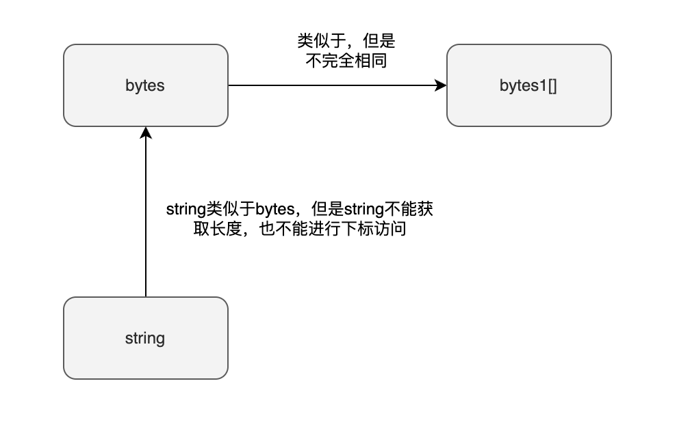
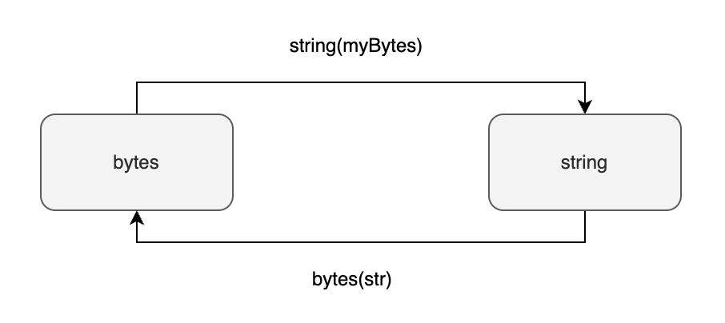

在前文中，我们探讨了静态字节数组，这种数组的长度是固定的，最多只能包含 32 个字节。但是，如果需要存储超过 32 个字符，或者想要一个长度可变的数组怎么办呢？此时，我们可以采用动态字节数组（dynamically-sized byte array）。动态字节数组实际上是一种特殊的数组类型，其特性在于其长度可以根据需要调整。

值得注意的是，动态字节数组属于引用类型（reference type），这与静态字节数组的值类型（value type）有本质的不同。这种区别意味着动态字节数组在内存中的处理方式与静态字节数组不同，为开发者提供了更灵活的数据处理选项。

## 动态字节数组与静态字节数组的区别

动态字节数组与静态字节数组有几点区别：

1. 长度的确定性：静态字节数组的长度在编译时就已经固定，不可更改；而动态字节数组的长度则是可变的，可以根据需求调整。
2. 长度限制：静态字节数组的长度范围为 1 至 32 字节，这是一个硬性的限制；相对地，动态字节数组则没有这样的长度限制。
3. 数据类型：动态字节数组是引用类型，即它们在内存中存储的是数组地址；而静态字节数组则是值类型，直接在内存中存储数据。

如果您的应用场景中字节数组的长度不会变化且长度不超过 32 字节，推荐使用静态字节数组。这样做不仅效率更高，还可以节省 Gas 消耗。对于其他需要灵活调整数组大小的场景，则应考虑使用动态字节数组。

动态字节数组的种类
在 Solidity 编程语言中，存在两种动态字节数组类型：`bytes` 和 `string`。这两种类型虽然在功能上类似，但在内存和调用数据（calldata）的存储效率上有显著差异。

- `bytes` 类型类似于一个 `bytes1[]` 数组，但其在内存（memory）和调用数据（calldata）中的存储更为紧凑。在 Solidity 的存储规则中，如 `bytes1[]` 这样的数组会要求每个元素占据 32 字节的空间或其倍数，不足 32 字节的部分会通过自动填充（padding）补齐至 32 字节。然而，对于 `bytes` 和 `string` 类型，这种自动填充的要求并不存在，使得这两种类型在存储时能更加节省空间。
- `string` 类型在内部结构上与 `bytes` 类型基本相同，但它不支持下标访问和长度查询。换言之，尽管 `string` 和 `bytes` 在存储结构上一致，它们提供的接口却有所不同，以适应不同的用途。

总结来说，`bytes` 和 `string` 提供了在动态数据处理上更高的存储效率，尤其适合于处理大量数据的场景，而避免了不必要的内存浪费。



## bytes 与 string 的互相转换

在 Solidity 中，`bytes` 和 `string` 类型可以通过显式转换实现相互转换。这一功能特别适用于那些需要在两种格式之间灵活切换的场景。具体的转换方法如下：

- 使用 `bytes(str)` 可以将 `string` 类型转换为 `bytes` 类型。这一转换方法可以让您将字符串直接转化为字节序列。
- 使用 `string(myBytes)` 可以将 `bytes` 类型转换成 `string` 类型。这允许您把字节序列转换回人类可读的文本格式。

这种转换是显式的，意味着您需要在代码中明确指定转换的发生，以确保数据类型的正确处理和程序的可读性。



`bytes` 转 `string`

```
bytes memory bstr = new bytes(10);
string memory message = string(bstr); _// 使用string()函数转换_
```

`string` 转 `bytes`

```
string memory message = "hello world";
bytes memory bstr = bytes(message); _//使用bytes()函数转换_
```

string 不能进行下标访问，也不能获取长度
在 Solidity 中，虽然 `string` 类型在本质上是一个字符数组，但它目前不支持下标访问和获取长度的操作。这意味着与其他数组类型不同，您不能通过索引来访问 `string` 中的单个字符，也无法直接查询 `string` 的长度。这些限制要求开发者在处理字符串数据时采用不同的方法或转换为更灵活的数据类型如 `bytes`，以进行更复杂的操作。

```
string str = "hello world";
uint len = str.length; _// 不合法，不能获取长度_
bytes1 b = str[0]; _// 不合法，不能进行下标访问_
```

你可以将 `string` 转换成 `bytes` 后再进行下标访问和获取长度

将 `string` 转换成 `bytes` 后再进行下标访问和获取长度

```
string str = "hello world";
uint len = bytes(str).length; _// 合法_
bytes1 b = bytes(str)[0]; _// 合法_
```
