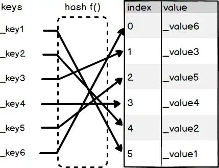

在 Solidity 中，映射类型（mapping）提供了一种非常有效的键值对存储机制，允许您通过键（key）快速访问对应的值（value）。这种类型特别适用于需要快速检索数据的场景，例如跟踪和管理用户的特定数据。

假设您想要为用户分发空投，并允许他们查询自己是否有空投份额。一种实现方式是使用数组，其中每个元素都是一个结构体，包含用户地址和其应得的空投 Token 数量。这样的实现可以表述如下：

数组存放空投用户列表

```
struct AirDrop {
    address to;
    uint amount;
}

AirDrop[] airDrop;
```

在实现用户查询空投份额的功能时，一种方法是直接遍历我们之前定义的数组。具体操作如下：每当用户发起查询时，系统会检查数组中每个元素的用户地址与查询用户的地址是否相匹配。

这个过程涉及到遍历整个数组，并逐一比对里面结构体的 `userAddress` 字段与用户提供的地址是否一致。如果找到一个匹配的地址，那么就可以返回相应的空投 Token 数量给用户。如下面所示：

用户查看是否有空投

```
AirDrop[] airDrop;
function getAirDropAmount(address addr) public view returns(uint) {
    for(uint i = 0; i < airDrop.length; i++) {
        if(airDrop[i].to == addr) {
            return airDrop[i].amount;
        }
    }
    return 0;
}
```

尽管通过遍历数组来查询用户的空投份额是一种可行的方法，但这种方式存在明显的效率问题。每次用户查询时都必须遍历整个数组，这在用户数量较多时特别低效。

为了提高查询效率，可以采用映射（mapping）类型来存储空投数据。映射允许在常数时间内直接访问用户的空投份额，大大减少了查找所需的时间。这是因为映射直接通过键（在这种情况下是用户的地址）来访问对应的值（空投 Token 数量），而不需要像数组那样逐一检查每个元素。

什么是映射类型
映射类型在 Solidity 中存储键（key）和值（value）的对应关系，这类似于数学函数的概念，即 `f(x) = y`，其中给定 `x`（键）可以得到 `y`（值）。在映射类型中，一旦提供了键，就能迅速定位并检索对应的值。

映射的底层实现使用了类似哈希表（HashTable）的数据结构。如你可以想象，这个过程中，存在一个数组，它存储所有的值。这里的 `Index` 是数组的索引，即值存储的具体位置。键通过一个哈希函数 `f(key)` 进行处理，生成一个索引 `Index`，这个索引直接指向数组中值的存储位置。通过这个索引，我们可以直接从数组中取出相应的值，如下图所示的过程：

1. 键（Key）输入：用户输入一个键。
2. 哈希函数处理：键通过哈希函数转化为一个数组索引。
3. 索引定位：使用这个索引直接在数组中找到对应的值。
4. 值（Value）输出：从数组中取出值，完成检索。



可以看到在映射类型里，我们可以通过 Hash 运算很快地找到 value 所在的位置，而不需要遍历整个数组。大大提高了存取效率。

## 映射类型变量的声明

接下来我们看看如何声明一个映射类型的变量。其声明格式如下：

```
mapping(KeyType => ValueType) varName;
```

在 Solidity 中，映射类型的声明涉及键（KeyType）和值（ValueType）。键的类型（KeyType）必须是内置的值类型，如 `uint`、`string`、`bytes` 等。重要的是要注意，键不能是数组、结构体或其他映射类型等引用类型。

值的类型（ValueType）则可以是任意类型，包括数组、结构体等。此外，变量名（varName）可以由开发者自由命名，以符合具体的应用需求。

例如，如果您想要声明一个用于记录用户空投数额的映射，可以按以下方式声明：

映射类型记录空投数额

```
mapping(address => uint) airDrop;
```

## 如何使用 key 存取 value

如果你想通过 `key` 来存取对应 `value` ， 可以使用 `[]` 操作符。

使用 [] 操作符

新增一个键值对

```
airDrop[0xaaaaa...] = 100;
```

通过 key 获取 value

```
unit amount = airDrop[0xbbbb...];
```

## 映射类型只能声明在 storage

Solidity 仅允许映射类型声明在 `storage` 。声明在其他数据位置都会报错。

映射类型不能声明为除了 `storage` 之外的位置

```
mapping(address => uint) memory myMap; _// 编译错误_
```

## 映射类型作为入参和返回值时，函数可见性必须是 private 或 internal

在 Solidity 编程中，函数的可见性（visibility）决定了函数可以在哪些上下文中被调用。关于映射类型在函数参数和返回值中的使用，有特定的规则依据函数的可见性不同而变化：

- 当函数的可见性设置为 `public` 或 `external` 时，你不能在函数的参数（入参）或返回值中使用映射类型。
- 如果函数的可见性是 `private` 或 `internal`，则允许在入参和返回值中使用映射类型。

如果你还不熟悉什么是函数的可见性，这部分内容可能稍显复杂，可以选择先跳过。

以下示例演示了如何根据函数的可见性使用映射类型：

映射类型作为入参和返回值时，函数可见性必须是 `private` 或 `internal`

```
_// 编译错误，映射类型作为入参和返回值时，函数可见性必须是 private 或 internal_
function invalidDeclaration(mapping(address => uint) storage myMap) public {} 

_// 编译错误，映射类型作为入参和返回值时，函数可见性必须是 private 或 internal_
function invalidDeclaration(mapping(address => uint) storage myMap) external {}

_// 合法_
function validDeclaration(mapping(address => uint) storage myMap) private {} 

_// 合法_
function validDeclaration(mapping(address => uint) storage myMap) internal {}
```

## 映射类型可以与数组，结构体互相嵌套

在之前的章节中，我们已经探讨了结构体和数组的互相嵌套。实际上，Solidity 中的三种引用类型——数组、结构体和映射类型——都可以进行互相嵌套。这种能力大大增强了数据结构的复杂性和灵活性。

以映射类型为例，我们可以利用它来建立特定键与值之间的关系。例如，下面的代码示例展示了如何使用映射类型建立 ISBN 编号与 `Book` 结构体之间的对应关系。这样，当我们拥有一个 ISBN 时，就能够迅速找到与之对应的 `Book` 实体：

结构体与映射类型互相嵌套

```
struct Book {
    uint isbn;
    string title; _// 书名_
    uint price;   _// 价格_
}

mapping(uint => Book) lib; _// 从 ISBN 到 Book 的映射关系_
```

## 映射类型的其他特性

Solidity 的映射类型具备一些独特的特性，这些特性在使用时需要特别注意：

1. 无 `length` 属性：与数组不同，映射类型没有内置的 `length` 属性，这意味着你不能直接查询映射中元素的数量。
2. 无法直接遍历：映射类型不能直接进行遍历，因为它们不存储键的列表或顺序。

因此，如果你需要知道映射中有多少元素，或者需要遍历映射中的所有元素，你将需要自己实现这些功能。通常，这可以通过在映射外维护一个数组来记录所有的键来实现，从而允许遍历和统计。
