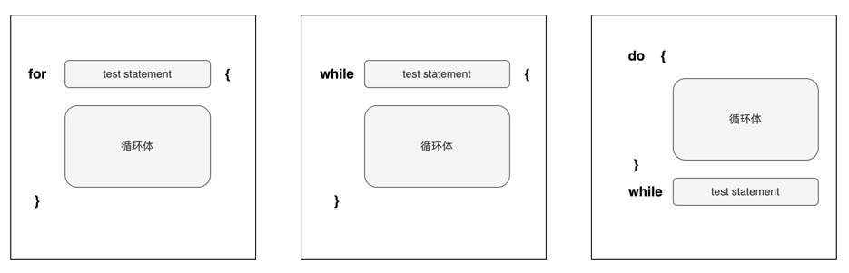

想象一下，如果我们要计算 `1+2+3` 的和，这很简单：

```
uint256 sum = 1+2+3;
```

但是如果我们要计算 `1+2+3+…+100000` 呢。直接在合约里面写出这个表达式是不可能的。为了避免重复劳动，我们就可以用到循环。Solidity 提供了三种循环：

- [「for 循环」](https://solidity-dusky.vercel.app/docs/solidity-basic/for)
- [「while 循环」](https://solidity-dusky.vercel.app/docs/solidity-basic/while)
- [「do-while 循环」](https://solidity-dusky.vercel.app/docs/solidity-basic/do-while)

本节我们将会介绍 `do while` 循环。

## do while 循环语法

Solidity 的 `do while` 循环语法规则也与 C 语言，Javascript 基本相同，其语法如下：

```
do {
    _// 循环体_
} while(test-statement);
```

我们可以看到 `do while` 循环和 `while` 循环非常类似，里面都有两个两个表达式，只不过这两个表达式的上下位置交换了：

- 循环体
- test-statement

`do while` 循环区别于 `while` 循环的地方是，它的循环体**至少会执行一遍**。然后才会执行 `test-statement` 判断是否为 `true` 。如果是则把循环体再执行一遍。如果 `test-statement` 为 `false` ，那么退出循环并继续执行余下的代码。

`do while` 循环, 从 1 加到 N

```
function sumToN(uint16 n) public pure returns(uint16) {
    uint16 sum = 0;
    uint16 i = 1; 

    do {
        sum += i;
        i++; _// 修改循环变量的值_
    } while(i <= n); _// 检查是否还满足循环条件_
    
    return sum;
}
```

## for, while, do while 应该选哪个

我们在 `while` 循环章节已经讨论过 `for` 循环和 `while` 循环并没有太大的区别，更多的是不同的场景下其中一个比另外一个看起来更加简洁而已。



`do-while` 循环与 `for` 和 `while` 循环存在一个明显的区别：`do-while` 循环保证了循环体至少被执行一次，即使循环条件一开始就不满足。相反，`for` 和 `while` 循环在条件不满足时可能一次都不执行。因此，当你需要确保循环体至少执行一次时，使用 `do-while` 循环是更自然、更清晰的选择。使用它并非必须，但它可以让控制逻辑看起来更直观，代码更简洁。

总的来说，`for`、`while` 和 `do-while` 三种循环在功能上相似，都能完成重复执行代码的任务。`for` 和 `while` 循环在使用上比较相似，可以根据个人偏好或代码的清晰度来选择。而 `do-while` 循环通常用在至少需要执行一次循环体的场景中。选择合适的循环类型可以根据具体的应用场景和代码可读性的需求来决定。
