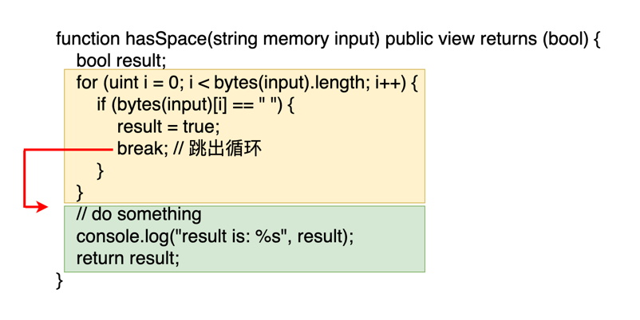

在之前的课程中，我们已经学习了三种循环：`for`、`while`、和 `do-while`。有时，我们可能会发现没有必要完整地执行所有循环迭代。例如，在检查一个字符串中是否包含空格的场景中，一旦发现第一个空格，我们就可以立即得出结论，无需继续遍历整个字符串。在这种情况下，`break` 关键字就显得非常有用。

在 Solidity 中，`break` 关键字允许我们在满足特定条件时提前退出循环。这不仅可以提升程序的执行效率，还可以减少不必要的计算开销。无论是在 `for`、`while` 还是 `do-while` 循环中，`break` 都可以有效地使用。

下面的函数用来检查一个字符串里面是否含有空格。里面是一个从 `0` 到 `input.length` 的循环。一旦发现有空格就马上设置 `result=true` 并跳出循环。这样就不需要遍历整个字符串的每一个字符。

```
function hasSpace(string memory input) public view returns (bool) {
    bool result;
    for (uint i = 0; i < bytes(input).length; i++) {
        if (bytes(input)[i] == " ") { _// 检查当前字符是否是空格_
            result = true;
            break; _// 如果当前字符是空格，跳出循环_
        }
    }
    _// do something_
    console.log("result is: %s", result);
    return result;
}
```

下图更形象展示了 break 的行为。黄色框代表的循环代码块，绿色代表的是循环外的代码块。当执行到 break 的时候会跳出黄色框，然后直接进入绿色框的代码继续执行。



## break 只会跳出一层循环

当你在编写包含多重循环的程序时，理解 `break` 关键字的行为尤为重要。在多层循环结构中，`break` 关键字只会退出它所在的当前循环层，而不会影响到外层的循环。这意味着一旦 `break` 在内层循环中被执行，程序将退出该内层循环，并继续执行外层循环的下一次迭代。

看看下面的例子以更好地理解这个概念：

```
function breakOnlyOneLoop() public view {
    for(uint i = 0; i < 10; i++) {
        for(uint j = 0; j < 10; j++) {
            break;
            console.log("this statement would never execute");
        }
        console.log("continue excuting this statement after the inner loop break");
    }
}
```
