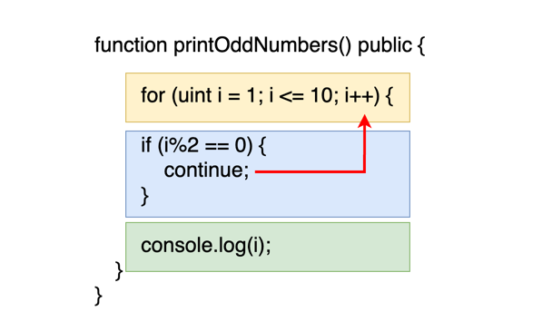

在上一节中，我们详细学习了 `break` 关键字的用法，它允许我们在特定条件下提前退出循环，从而减少不必要的计算开销。本节，我们将探讨另一个与 `break` 经常一起使用的关键字——`continue`。

在 Solidity 中，`continue` 关键字的作用是终止当前循环迭代的剩余部分，直接跳转到下一次迭代的开始。这个关键字主要用于在循环过程中跳过不符合特定条件的数据，使我们能够专注于处理感兴趣的数据。

以下是一个使用 `continue` 关键字的 Solidity 函数示例，该函数用于打印从 1 到 10 的奇数：

打印 1 到 10 的奇数

在这个函数中，我们将会打印 1 到 10 的奇数。在循环体内，我们使用了一个条件判断语句 `i%s==0` 来检查当前数字是否是偶数。如果是，就使用 `continue` 跳过本轮循环，并开始下一轮循环；否则，就打印输出当前数字。这样，我们就可以在循环中跳过某些数据，从而只处理我们感兴趣的数据

```
function printOddNumbers() public {
    for (uint i = 1; i <= 10; i++) {
        if (i%2 == 0) { _// 如果是偶数，跳过本次循环_
            continue;
        }
        console.log(i); _// 如果是奇数，就打印输出_
    }
}
```

下面的描述更形象地阐释了 `continue` 关键字在循环中的行为。当循环执行到 `continue` 语句时，它会立即停止执行循环体中位于 `continue` 之后的代码（即在示意图中的蓝色和绿色框内的内容）。然后，控制流直接跳转到循环的迭代语句，通常是 `i++`（位于黄色框内），这一迭代语句位于循环体的结束部分。

完成迭代后，循环继续执行，重新评估循环的条件，如果条件仍然满足，就再次进入循环体开始新一轮的迭代。这样，通过 `continue`，我们能够忽略掉某些不需要处理的情况，直接进入下一次循环迭代，有效地控制循环的执行流程。



## 小结

1. `控制循环行为: break和continue都是关键字，用于在循环中控制执行流。`
2. 功能区分:

   - `break`: 用于立即退出当前的整个循环，有助于减少不必要的计算和时间开销，特别当已达成循环目的时。
   - `continue`: 用于跳过当前循环的剩余部分，快速进入下一次迭代。这允许循环忽略后续的代码执行，直接进行下一轮的条件判断。
3. `优化数据处理: continue关键字特别适用于筛选循环中的数据，允许程序专注于处理有意义或感兴趣的信息，而忽略不相关的数据。`
