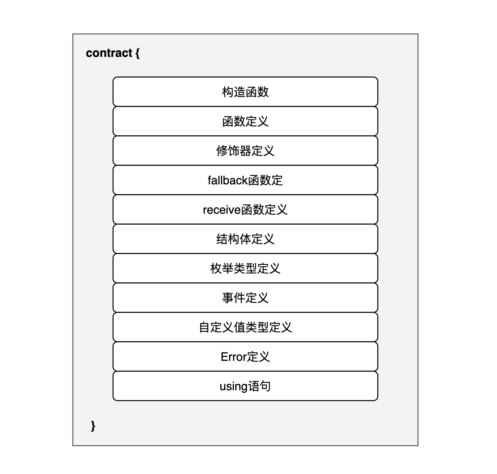

在 Solidity 中，合约类似于其他编程语言中的类（class），它拥有自己的成员属性和成员函数。例如，一个去中心化交易所可以被实现为一个合约，借贷平台的功能也可以通过合约来实现。你可以使用 `contract` 关键字来定义一个新的合约：

```
contract myContractName {
    _// members_
}
```

## 合约组成结构

下图展示了合约的组成结构:



在 Solidity 中，合约由多个组成部分构成，每个部分承担不同的角色和功能，类似于将多种积木以不同的方式组合起来构建复杂的结构。以下是各个组成成员的具体作用：

- 构造函数：用于初始化合约的状态，只在合约创建时执行一次。
- 函数：包含一组逻辑代码块，负责执行合约的主要功能，可以被外部或内部其他函数调用。
- 修饰器：用于修改或限制函数的行为，增强函数的复用性和安全性。
- fallback 函数：当调用合约的函数不存在时执行的特殊函数，用于处理意外的函数调用或额外的数据。
- receive 函数：专门用来接收以太币（Ether）转账的特殊函数，当合约被发送以太币且未调用任何函数时触发。
- 结构体：自定义的数据类型，用于组织和存储多个不同类型的数据项。
- 枚举类型：定义有限个数值的集合，用于提高代码的可读性和增强类型安全。
- 事件：用于记录合约中发生的特定操作，类似于日志功能，便于外部监听和响应合约的活动。
- 自定义值类型：允许用户定义新的值类型，可以基于现有的 Solidity 类型，增强代码的清晰度和效率。
- Error：定义可能在函数执行中抛出的错误，这些错误可以被捕获和处理，增强合约的安全性和稳定性。
- using 语句：使当前合约能够使用指定库中定义的函数或类型，无需显式调用，简化代码并增强功能。

通过合理利用这些组件，开发者可以构建功能强大且灵活的智能合约，满足各种去中心化应用的需求。
