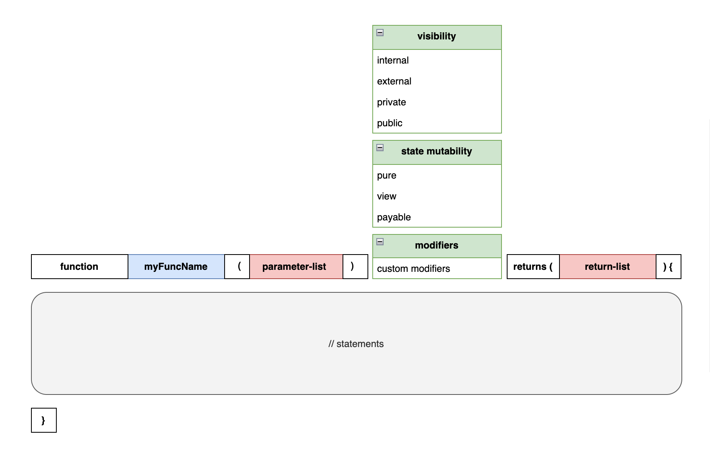

在 Solidity 中，函数是智能合约的核心组件之一，包含一组执行特定操作或行为的逻辑代码块。它们定义了合约可以执行的各种功能，是构建合约的基础。例如，一个借贷合约可能会包含多个函数来处理不同的金融操作，如提供资金（`supply`），借出资金（`borrow`），和还款（`repay`）等。每个函数都封装了实现这些操作所需的逻辑，允许合约用户在区块链上执行复杂的交互。

## 函数声明

我们先来看一个简单函数声明的例子：

两数之和

实现了一个 `add` 函数，对两个数相加求和

```
function add(uint lhs, uint rhs) public pure returns(uint) {
    return lhs + rhs;
}
```

我们一个字段一个字段地看看这个函数声明中每个部分的含义。


在 Solidity 中，函数的声明需要遵循一定的语法规则，以确保函数的正确定义和预期行为。以下是一个函数声明的详细解析：

- `function`：函数声明以关键字 `function` 开始。
- `add`：这是函数的名称，用于标识这个特定的函数。
- `(uint lhs, uint rhs)`：这是函数的输入参数列表，包含两个参数：`lhs` 和 `rhs`，它们都是无符号整型（`uint`）。
- `public`：这是函数的可见性修饰符。`public` 表示该函数可以被合约内部的其他函数以及外部调用。
- `pure`：这是函数的状态可变性修饰符。`pure` 表示该函数不会读取或修改合约的状态。
- `returns(uint)`：这定义了函数的返回类型，本例中为一个无符号整型（`uint`）。
- `{ return lhs + rhs; }`：这是函数的主体部分，包含实际要执行的逻辑。在此例中，函数逻辑是返回两个参数 `lhs` 和 `rhs` 的和。

此函数的主要作用是接收两个无符号整数参数 `lhs` 和 `rhs`，并返回它们的和。由于这个函数被标记为 `public` 和 `pure`，它可以被外部调用，同时保证不会更改或依赖于合约的状态，确保了其执行的纯净性和安全性。

## 函数声明语法

看完了上面的例子，我们现在再来看函数声明的语法就一目了然了。下图表示了函数声明应该包含的内容：



- `function`：所有函数声明必须以关键字 `function` 开始，标识这是一个函数。
- `myFuncName`：函数的名称，用于在合约中唯一标识这个函数。
- `(parameter-list)`：函数的输入参数列表，列出所有参数及其类型。这部分是可选的，取决于函数是否需要输入参数。
- `visibility`：函数的可见性修饰符，决定了函数的访问范围。可选的值包括 `internal`（仅限合约内部和继承的合约）、`external`（仅限外部调用）、`private`（仅限当前合约）、`public`（无限制访问）。
- `state mutability`：函数的状态可变性，表明函数是否会修改或读取合约的状态。选项包括 `pure`（不读取也不修改状态）、`view`（只读状态不修改）、`payable`（可以接收以太币）。这是可选的。
- `modifiers`：函数修饰器，用于增加额外的行为或验证逻辑。这是可选的。
- `returns (return-list)`：指定函数返回值的类型，适用于函数需要返回数据时。可以声明多个返回值。这部分也是可选的。
- `{ // statements }`：函数的主体，包含实际执行的代码块。

图示中的 `state-mutability, modifiers, parameter-list, return-list` 都是可选的。所以函数声明可以是下面这样：

函数声明示例

```
_// 仅指定 visibility_
function f1() public {}

_// 指定 visibility 和 state-mutability_
function f2() public pure {}

_// 指定 visibility 和 state-mutability_
function f3() public view {}

_// 指定 visibility 和 state-mutability，函数有一个入参_
function f4(uint a) public pure {}

_// 指定 visibility 和 state-mutability，函数有一个入参和一个返回值_
function f5(uint a) public pure returns(uint) {}

_// 指定 visibility 和 state-mutability，函数有多个入参和多个返回值_
function f6(uint a, uint b, uint c) public pure returns(uint, uint, uint) {}

_// 指定 visibility 和 modifier_
function f7(uint a) external onlyOwner {} _// onlyOwner 修饰器需要事先定义_
```

## 参数列表

你可以为函数提供零或多个参数。多个参数可以使用逗号进行分割。如下所示：

```
_// 提供0个参数_
function foo() public {};

_// 提供1个参数_
function foo(uint a) public {};

_// 提供多个参数_
function foo(uint a, uint b, uint c) public {};
```

## 返回值列表

你可以为函数提供零或多个返回值。多个返回值可以使用逗号进行分割。如下所示：

```
_// 提供0个返回值_
function foo() public {};

_// 提供1个返回值_
function foo() public returns(uint) {};

_// 提供多个返回值_
function foo() public returns(uint, uint, uint) {};
```

## 函数可见性

在 Solidity 中，函数的可见性（visibility） 是一个关键的属性，它定义了其他合约和账户能否访问当前合约的函数。Solidity 函数有四种可见性可以选择： `public` , `private` , `internal` , `external`。

## 函数状态可变性

在 Solidity 中，函数状态可变性指的是函数是否有能力修改合约的状态。默认情况下，函数被认为是可以修改合约状态的，即它们可以写入或更改合约中存储的数据。在某些情况下，如果你希望明确地限制函数不改变合约状态，提高合约的安全性和可读性，你可以使用状态可变性修饰符来实现这一点。Solidity 有三种函数状态可变性可以选择：`view` , `pure` , `payable`。

## 函数修饰器

修饰器在 Solidity 中扮演着重要的角色，它们用于修改或增强函数的行为。通过在函数执行前进行预处理和验证操作，修饰器可以确保函数在合适的条件下执行。例如，修饰器可用于验证函数的输入参数是否符合预定规范，或确认调用者是否拥有执行特定操作的权限。

使用修饰器的主要优势包括提高代码的复用性和增强代码的可读性。将常用的逻辑封装在修饰器中可以避免在多个函数中重复相同的代码，使得合约结构更加清晰，同时也便于维护和更新。
