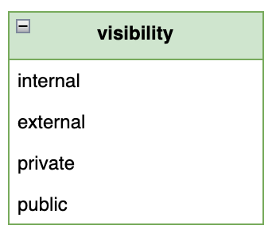
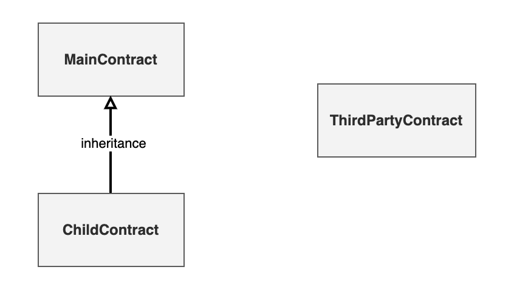
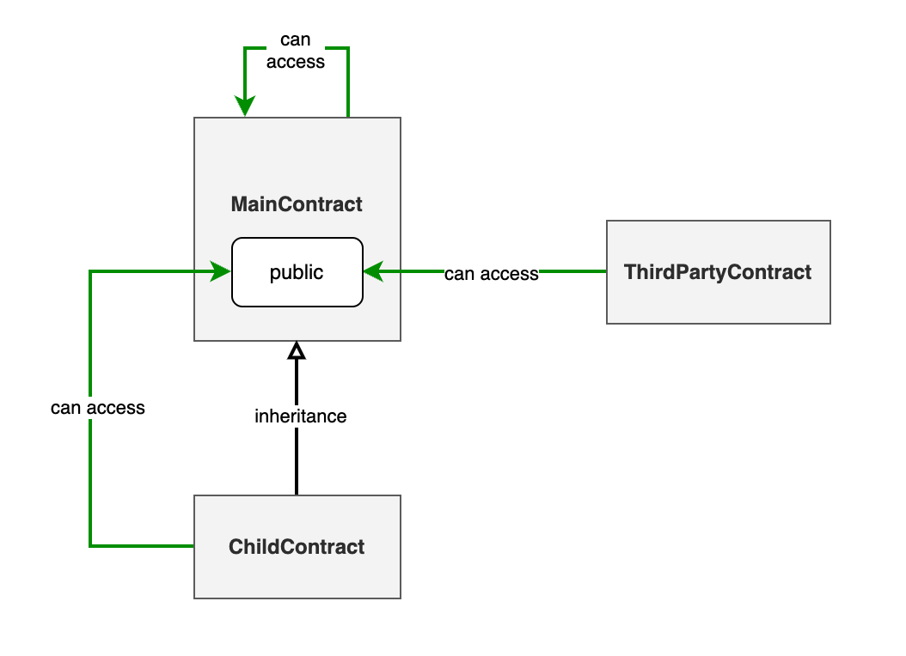
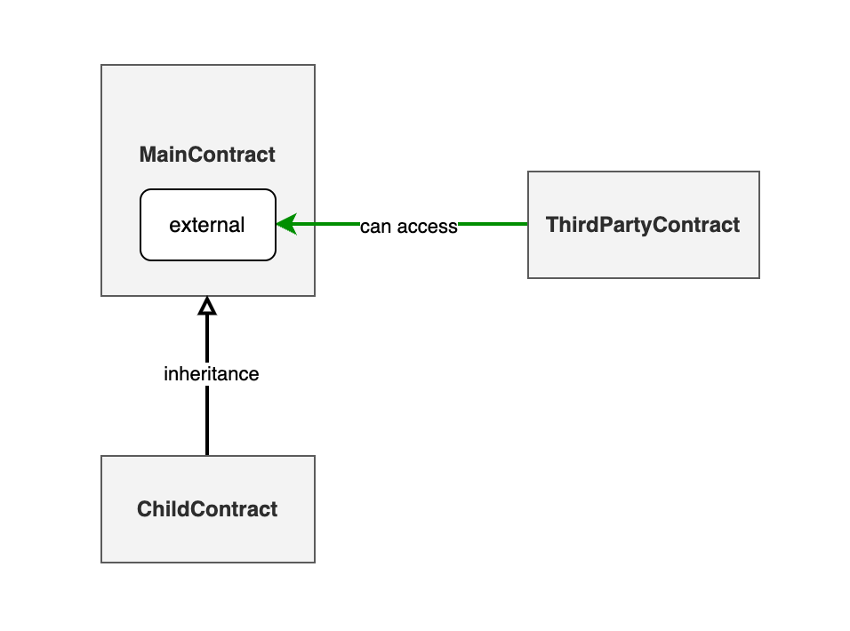
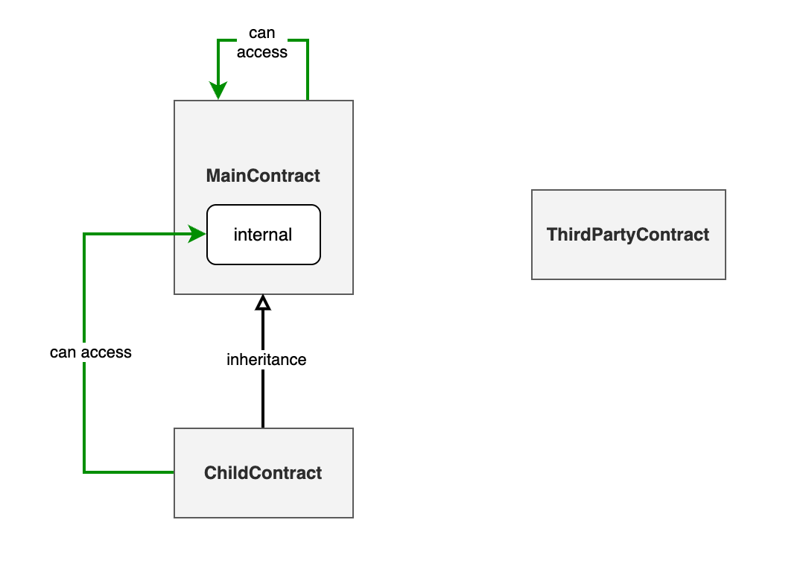
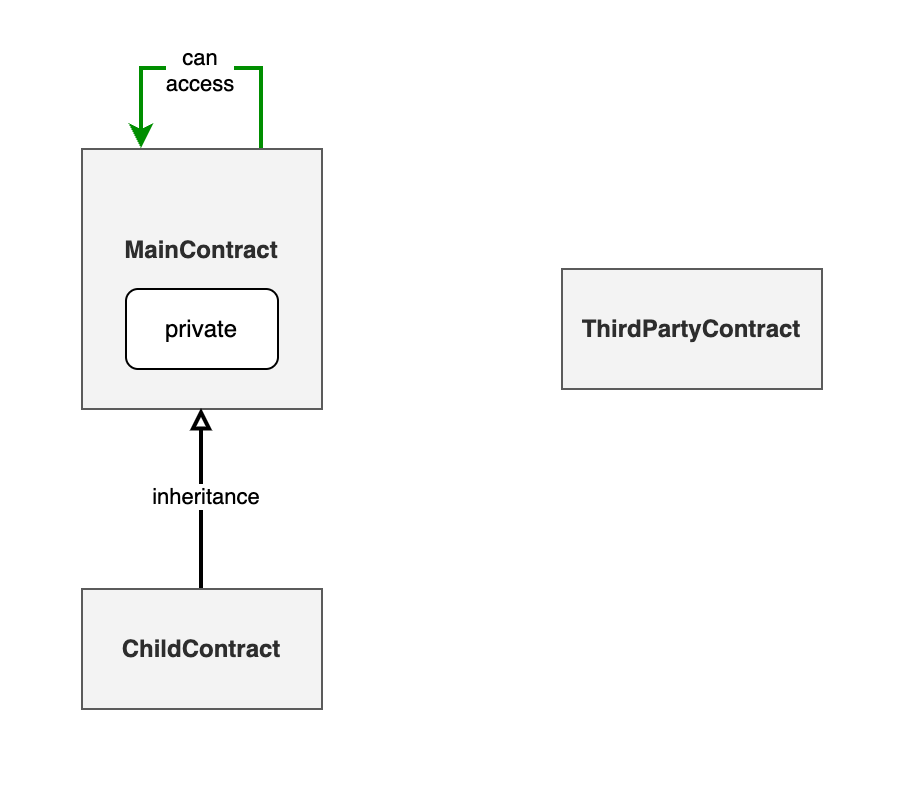

为了增强合约的安全性，Solidity 提供了一套机制来限制合约中变量和函数的访问范围。这被称为“可见性（visibility）”，指的是其他合约是否可以访问当前合约中的变量或函数。通过明确指定哪些合约可以访问特定的成员，开发者能够有效地控制合约的交互界面和隐私级别。通过合理应用这些修饰符，开发者可以精确控制合约成员的交互界限，从而提高合约的模块化和安全性。例如，敏感操作或关键数据可以设置为 private，而只需要外部接口的函数可以声明为 external，以优化交互效率和 gas 消耗。

Solidity 支持四种可见性修饰符：



在 Solidity 中，正确设置变量和函数的可见性修饰符是保证智能合约安全性和功能正确性的关键。以下是变量和函数可用的可见性修饰符及其具体含义：

### 变量的可见性修饰符

- `public`：变量可以被当前合约内部以及外部访问。对于 `public` 变量，Solidity 自动创建一个访问器函数，允许外部合约也可以读取这些变量。
- `private`：变量只能被定义它的合约内部访问。即使是派生合约也无法访问 `private` 变量。
- `internal`：变量可以被当前合约以及所有派生自该合约的“子合约”访问，但不能被外部合约直接访问。

### 函数的可见性修饰符

- `public`：函数可以在当前合约内部和外部被访问。这是函数默认的可见性级别，如果没有指定其他修饰符。
- `external`：函数只能从合约外部被调用。这种修饰符通常用于那些不需要在合约内部调用的函数，可优化 gas 消耗。
- `private`：函数仅限于在定义它的那个合约内部被调用，不可在任何外部合约或派生合约中访问。
- `internal`：函数可以在定义它的合约内部以及所有派生自该合约的子合约中被调用，但不能从外部合约调用。

## 合约分类

在深入讨论可见性之前，我们需要了解如何根据合约之间的关系对它们进行分类。这是因为可见性直接影响不同类型的合约如何访问“当前合约”的数据和函数。基于可见性对不同合约访问权限的影响，合约通常可以被分为三个主要类别：

1. 主合约（当前合约内部）：这是正在被我们讨论或编写的合约本身。在主合约内部，所有成员（变量和函数）通常都是可访问的，除非它们被标记为 `private`。
2. 子合约（继承自当前合约的合约）：这些合约是从主合约派生出来的。子合约可以访问主合约中标记为 `internal` 或更宽松访问级别的成员，但不能访问 `private` 成员。
3. 第三方合约（外部合约）：这类合约与当前合约没有继承关系。它们只能访问当前合约中标记为 `public` 或 `external` 的成员。



简单来说，子合约是从主合约继承而来的，它们共享某些特性和行为。而第三方合约则与主合约及子合约没有任何继承关系，可以看作是完全独立的实体。如果将主合约和子合约比作一个家庭的成员，那么第三方合约就像是外面的陌生人。

重要的是要理解，我们所讨论的访问限制都是从主合约（当前合约）的视角出发的。这意味着，当我们编写主合约时，使用的可见性修饰符决定了哪些外部实体（子合约或第三方合约）可以访问主合约中的哪些变量和函数。这样的设置帮助合约开发者确保数据安全，同时允许一定程度上的灵活性和扩展性。

### 主合约

主合约其实就是一个普通合约，内部定义了很多变量和函数。这些变量和函数可能有不同的可见性。主合约可以访问自己内部可见性为 `private` , `internal` , `public` 的任何变量和函数。

```
_// 主合约可以访问自己内部可见性为 private, internal, public 的变量和函数_
contract MainContract {
    uint varPrivate;
    uint varInternal;
    uint varPublic;

    function funcPrivate() private {}
    function funcInternal() internal {}
    function funcExternal() external {}
    function funcPublic() public {}
}
```

### 子合约

子合约继承了主合约。继承的语法是 `Child is Parent` 。关于继承有关的详细介绍，我们会在 「Solidity 进阶」进行介绍。子合约允许访问主合约中可见性为 `internal` ， `public` 的函数。

```
contract ChildContract is MainContract {
    function funcChild() private {
        funcInternal(); _// 子合约可以访问主合约中可见性为internal，public的函数_
        funcPublic(); _// 子合约可以访问主合约中可见性为internal，public的函数_
    }
}
```

### 第三方合约

第三方合约是一个普通合约。可以通过主合约的地址来与主合约进行交互, 其交互语法如下所示。第三方合约可以访问主合约中可见性为 `external` ， `public` 的函数

```
contract ThirdPartyContract {
      function funcThirdParty(address mainContractAddress) private {
            MainContract(mainContractAddress).funcExternal(); _// 第三方合约可以访问主合约中可见性为external，public的函数_
            MainContract(mainContractAddress).funcPublic(); _// 第三方合约可以访问主合约中可见性为external，public的函数_
      }
}
```

## 可见性对于合约访问的限制

我们已经提到，可见性就是合约变量和函数的可访问性。那么可见性对每种类型合约的访问限制是什么呢？本小节将会展开讨论。

### public

可见性为 `public` 的变量和函数可以被任何合约访问。也就是可以被 `MainContract` , `ChildContract` , `ThirdPartyContract` 访问。如下图所示：



### external

可见性为 `external` 的函数只能被第三方合约访问。也就是只能被 `ThirdPartyContract` 访问。注意变量是没有 `external` 修饰符的。如下图所示：



### internal

可见性为 `internal` 的变量和函数可以被主合约和子合约访问。也就是可以被 `MainContract` , `ChildContract` 访问。如下图所示：



### private

可见性为 `private` 的变量和函数只能被主合约访问。也就是只能被 `MainContract` 访问。如下图所示：


