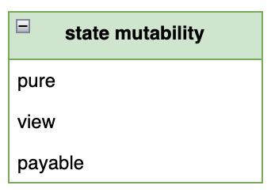

合约函数在区块链上的主要作用通常涉及修改状态，如转账、更新状态变量或触发事件等。然而，并非所有函数都需要这种能力；某些函数可能仅仅提供辅助作用，例如进行计算或返回某些值，而不应该改变合约的状态。为了明确标示这些函数不应修改合约状态，你可以使用状态可变性修饰符（state mutability modifiers）。

状态可变性修饰符有几种类型，包括 `pure` 和 `view`：

- `pure` 修饰符用于那些不会读取或修改合约状态的函数。例如，一个纯粹执行数学计算并返回结果的函数应该被标记为 `pure`。
- `view` 修饰符适用于那些只读取但不修改状态的函数。这种类型的函数可能会返回合约中某个状态变量的值，但不会对其进行更改。

正确使用这些修饰符不仅能提高合约的安全性和可读性，还有助于 Debug 过程，因为它们确保函数行为与开发者的意图一致。如果一个被标记为 `pure` 或 `view` 的函数尝试修改合约状态，Solidity 编译器将抛出错误，防止潜在的逻辑错误影响合约执行。这种机制强制开发者更加精确地规划函数的角色和行为，从而提高整个合约的稳健性和效率。

Solidity 提供了三个状态可变性修饰符：



- `view`：这种类型的函数仅能查询合约的状态，而不能对状态进行任何形式的修改。简而言之，`view` 函数是只读的，它们可以安全地读取合约状态但不会造成任何状态改变。
- `pure`：`pure` 函数表示最严格的访问限制，它们不能查询也不能修改合约状态。这类函数只能执行一些基于其输入参数的计算并返回结果，而不依赖于合约中存储的数据。例如，一个计算两数相加的函数可以被标记为 `pure`。
- `payable`：`payable` 修饰符允许函数接收以太币（Ether）转账。在 Solidity 中，函数默认是不接受以太币转账的；如果你的函数需要接收转账，则必须明确指定为 `payable`。这是处理金融交易时必不可少的修饰符。

## 怎样才算查询合约状态

在 Solidity 中，查询合约状态涉及到多种操作，这些操作可以直接读取或者间接影响合约存储的数据。为了更好地理解和规范这些操作，以下是被明确定义为查询合约状态的五种行为：

1. 读取状态变量：直接访问合约中定义的任何状态变量。
2. 访问余额：使用 `address(this).balance` 或 `<address>.balance` 来获取合约或任何地址的当前以太币余额。
3. 访问区块链特性：通过 `block`，`tx`，`msg` 等全局变量的成员访问区块链的特定数据。例如，`block.timestamp` 获取区块的时间戳，`msg.sender` 获取消息发送者的地址。
4. 调用非 pure 函数：任何未明确标记为 `pure` 的函数调用。即便函数本身没有修改状态，但如果它没有被标记为 `pure`，调用它仍被视为状态查询。
5. 使用内联汇编：特别是那些包含某些操作码的内联汇编，这些操作码可能会读取或依赖于链上数据。

## 怎样才算修改合约状态

在 Solidity 中，明确哪些行为会修改合约状态是至关重要的，这有助于开发者理解合约的行为，并确保安全地进行合约操作。以下是被认定为修改了合约状态的八种主要行为：

1. 修改状态变量：直接改变存储在合约中的任何状态变量的值。
2. 触发事件：在合约中发出事件，这通常用于记录合约活动，尽管本身不改变任何存储的状态变量，但被视为状态改变，因为它改变了链上的日志。
3. 创建其他合约：通过合约代码创建新合约实例。
4. 使用 `selfdestruct`：销毁当前合约，并将剩余的以太币发送到指定地址。
5. 通过函数发送以太币：包括使用 `transfer` 或 `send` 方法发送以太币。
6. 调用非 `view` 或 `pure` 的函数：调用任何可能改变状态的函数，如果函数未明确标记为 `view` 或 `pure`，则默认可能修改状态。
7. 使用低级调用：如 `call`、`delegatecall`、`staticcall` 等。这些低级函数允许与其他合约交互，并可能导致状态变化。
8. 使用含有特定操作码的内联汇编：特定的汇编代码可能直接修改状态，例如直接写入存储或执行控制合约资金的操作。

## view 函数

如果你的函数承诺不会修改合约状态，那么你应该为它加上 `view` 修饰符。如下所示：

`view` 函数

```
uint count;
function GetCount() public view returns(uint) {
    return count;
}
```

关于 `view` 函数的更详细介绍，可以参见「view 函数」一节。

## pure 函数

如果你的函数承诺不需要查询，也不需要修改合约状态，那么你应该为它加上 `pure` 修饰符。如下所示：

`pure` 函数

```
function add(uint lhs, uint rhs) public pure returns(uint) {
    return lhs + rhs;
}
```

关于 `pure` 函数的更详细介绍，可以参见「pure 函数」一节。

## payable 函数

函数默认是不能接受 Ether 转账的。如果你的函数需要接受转账，那么你应该为它加上 `payable` 修饰符。如下所示：

`payable` 函数

```
function deposit() external payable {
    _// deposit to current contract_
}
```
