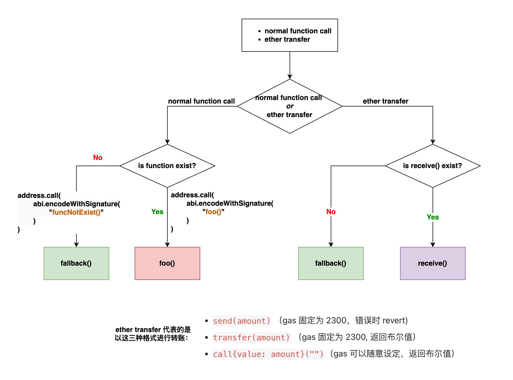

# 转换文档

`fallback` 函数是 Solidity 中的一种特殊函数，用于在调用的函数不存在或未定义时充当兜底。顾名思义，`fallback` 在中文中有回退、兜底的意思。类似于没有带现金时可以使用银行卡付款。需要注意的是，这里所说的“匹配不到”、“不存在”、“没有定义”都指的是同一个意思。

`fallback` 函数可以在以下两种情况下兜底：

- `receive` 函数不存在（因为没有定义）
- 普通函数不存在（因为没有定义）

简而言之：

- 当需要用到 `receive` 函数时，如果它没有被定义，就使用 `fallback` 函数兜底。
- 当调用的函数在合约中不存在或没有被定义时，也使用 `fallback` 函数兜底。

下面的图示描述了 `fallback` 函数的兜底机制，其中左半部分描述了普通函数的兜底，右半部分描述了 `receive` 函数的兜底：



## 兜底 receive 函数不存在的情况

我们在“`receive` 函数”一节已经讨论过，`receive` 函数只能在合约接受纯转账（`msg.data` 为空）时被触发，例如通过以下方法进行转账：

- `send(amount)`：Gas 固定为 2300，错误时会 revert。
- `transfer(amount)`：Gas 固定为 2300，返回布尔值。
- `call{value: amount}("")`：Gas 可以随意设定，返回布尔值。

当使用上述三种方法之一进行转账时，交易的 `msg.data` 为空。因此，理论上应该触发 `receive` 函数。如果合约没有定义 `receive` 函数，那么 `fallback` 函数将自动作为兜底函数被调用。如果 `fallback` 函数也没有定义，那么交易将失败并 revert。


## 兜底普通函数不存在情况

这种情况比较好理解，就是字面上的意思。如果你调用了一个合约里面没有定义的函数，比如说 `funcNotExist()` 那么 `fallback` 函数就会自动被调用。


## 示例：receive 和 fallback 函数被调用场景

下面的示例展示了 `receive` 和 `fallback` 函数被调用的场景。极力推荐你自己进行尝试一下。可以留意一下注释内容进行操作。

`receive` 和 `fallback` 函数被调用场景

```
_// SPDX-License-Identifier: GPL-3.0_

pragma solidity ^0.8.17;

contract Callee {
    event FunctionCalled(string);

    function foo() external payable {
        emit FunctionCalled("this is foo");
    }

    _// 你可以注释掉 receive 函数来模拟它没有被定义的情况_
    receive() external payable {
        emit FunctionCalled("this is receive");
    }

    _// 你可以注释掉 fallback 函数来模拟它没有被定义的情况_
    fallback() external payable {
        emit FunctionCalled("this is fallback");
    }
}

contract Caller {
    address payable callee;

    _// 注意： 记得在部署的时候给 Caller 合约转账一些 Wei，比如 100_
    _// 因为在调用下面的函数时需要用到一些 Wei_
    constructor() payable{
        callee = payable(address(new Callee()));
    }

    _// 触发 receive 函数_
    function transferReceive() external {
        callee.transfer(1);
    }

    _// 触发 receive 函数_
    function sendReceive() external {
        bool success = callee.send(1);
        require(success, "Failed to send Ether");
    }

    _// 触发 receive 函数_
    function callReceive() external {
        (bool success, bytes memory data) = callee.call{value: 1}("");
        require(success, "Failed to send Ether");
    }

    _// 触发 foo 函数_
    function callFoo() external {
        (bool success, bytes memory data) = callee.call{value: 1}(
            abi.encodeWithSignature("foo()")
        );
        require(success, "Failed to send Ether");
    }

    _// 触发 fallback 函数，因为 funcNotExist() 在 Callee 没有定义_
    function callFallback() external {
        (bool success, bytes memory data) = callee.call{value: 1}(
            abi.encodeWithSignature("funcNotExist()")
        );
        require(success, "Failed to send Ether");
    }
}
```
