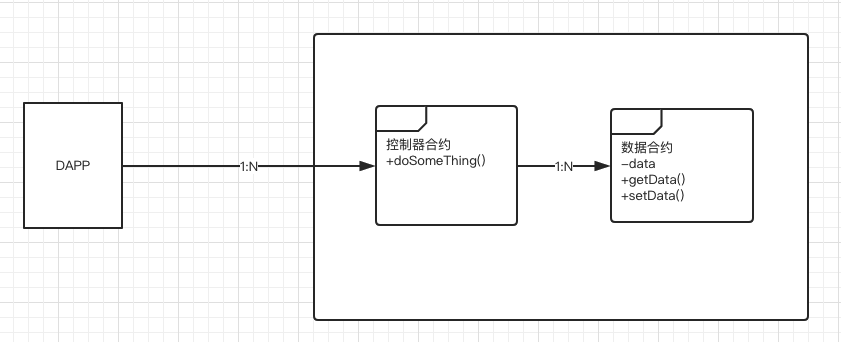
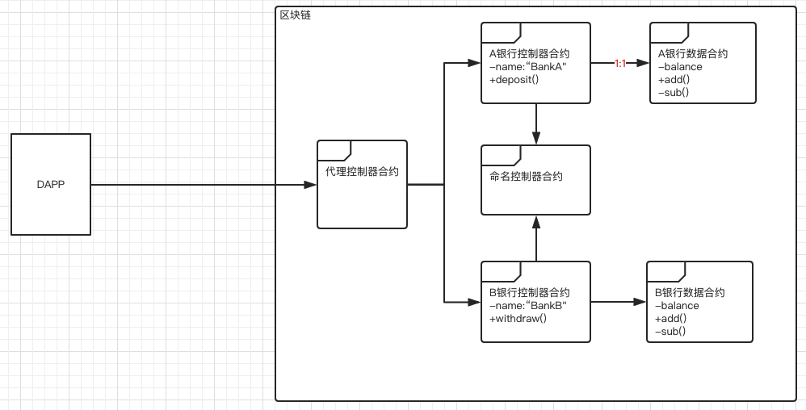
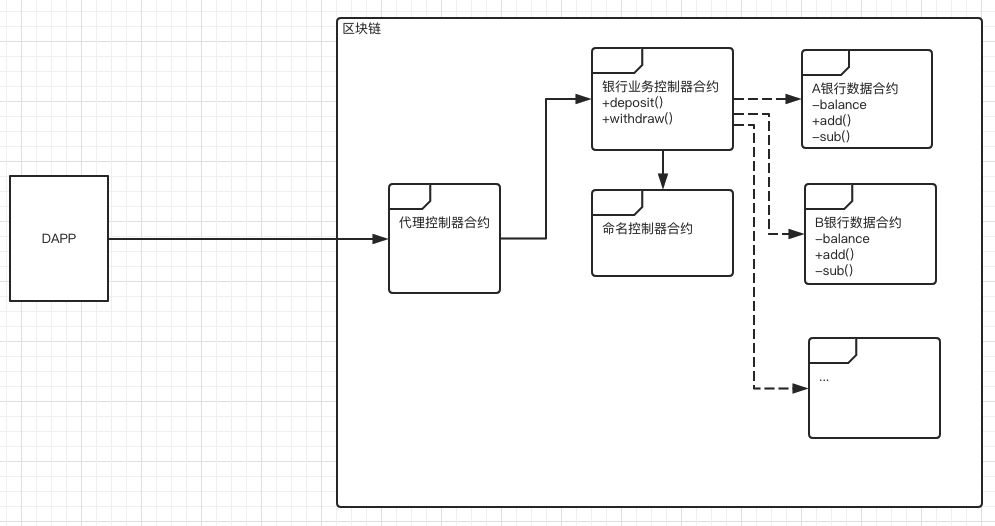
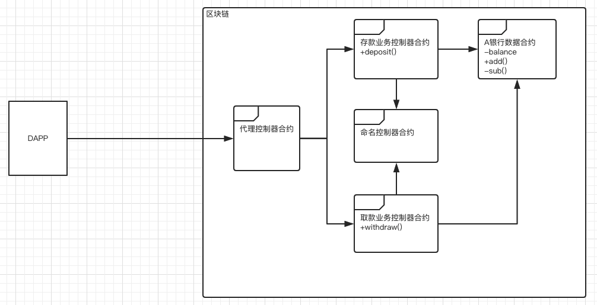
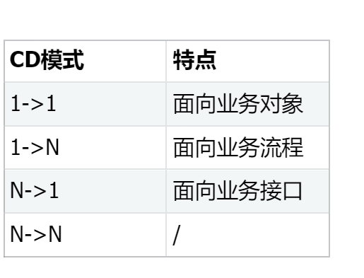
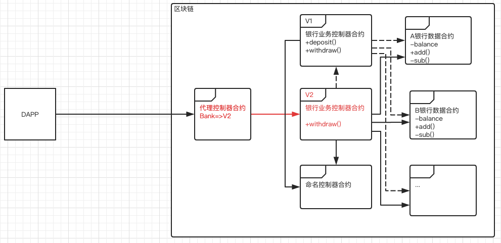
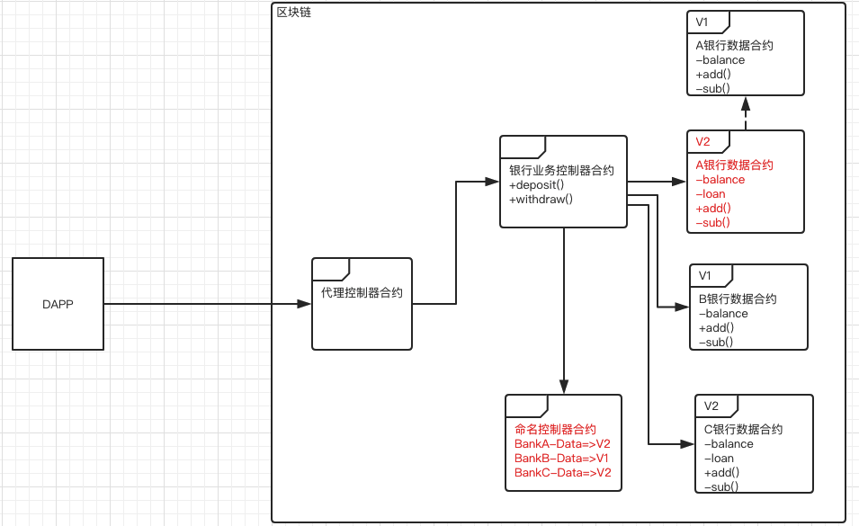
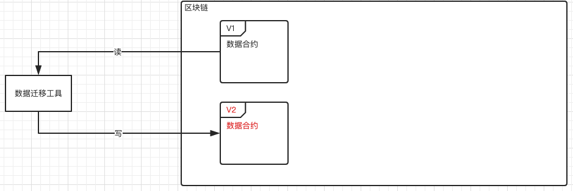

以太坊虚拟机（EVM）是当前区块链行业中应用最为广泛的虚拟机。它支持的智能合约语言是图灵完备的，拥有丰富的特性，包括各种基础类型（布尔值、整数、地址、字符串、枚举等）、复杂类型（结构体、映射、数组等）、以及面向对象的特性，如复杂的表达式、控制结构和接口继承。

由于其强大的智能合约语言，原本在现实世界中的复杂商业逻辑和应用可以在区块链上轻松实现。然而，需要注意的是，尽管公有链可以通过合理的 GAS 机制自我保护，而联盟链可以采用其他机制替代 GAS 计算和代币化来保障 EVM 沙盒安全，但由于区块链的运行机制，智能合约的运行即使是异常运行也会在所有区块链节点上独立重复执行。因此，无论是在公有链还是联盟链上运行智能合约都是非常昂贵的操作（包括运算资源和存储资源）。

另外，智能合约与传统应用程序的一个主要区别在于，一旦发布到区块链上，智能合约就无法篡改。即使智能合约中存在 Bug 需要修复或者业务逻辑发生变化，也无法直接在原有合约上修改并重新发布。因此，在设计之初就需要考虑合理的升级机制。

总而言之，智能合约的实现目标包括：完备的业务功能、精简的代码逻辑、良好的模块抽象、清晰的合约结构、合理的安全检查和完备的升级方案。

智能合约的生命周期主要包括设计、开发、部署、运行、升级和销毁阶段。在接下来的内容中，将主要从设计阶段和升级阶段出发进行一些梳理和总结。

## 一、**最佳实践**

从业务视角来看，智能合约只需要处理两件事情。首先是定义数据的结构和读写方式，其次是处理数据并向外提供服务接口。

为了更好地实现模块抽象和合约结构分层，我们可以将这两个方面分开处理。这样做不仅可以在合约代码层面上将业务控制逻辑和数据分离，而且在复杂的业务逻辑场景中经过实践验证，这种处理方式被认为是当前最佳的模式。

这种模式通常被称为 CD（Controller-Data）模式。它将合约分为两类：控制器合约（Controller Contract）和数据合约（Data Contract）。

控制器合约通过访问数据合约获取数据，并对其进行逻辑处理，然后将处理后的数据写回数据合约。它专注于数据的逻辑处理和对外提供服务。根据处理逻辑的不同，常见的控制器合约类型包括命名空间控制器合约、代理控制器合约、业务控制器合约和工厂控制器合约等。通常情况下，控制器合约不需要存储任何数据，而是完全依赖外部输入来访问数据合约。在特殊情况下，控制器合约可以存储某个固定的数据合约地址或者命名空间（通过命名空间在运行时获取合约地址）。

数据合约专注于定义数据结构和提供数据的读写原始接口。为了实现数据统一访问管理和数据访问权限控制的目标，最好将数据读写接口仅暴露给相应的控制器合约，禁止其他方式的读写访问。

基于这种模式，我们可以遵循自上而下的分析方式，从对外提供的服务接口开始设计各种类型的控制器合约，然后逐步过渡到所需的数据模型和存储方式，最终设计各种类型的数据合约。这样可以相对快速地完成合约架构的设计。

## **二、实用设计案例**

在 CD 模式下，根据控制器合约与数据合约之间的操作关系，从逻辑上归结为四类：

1. 控制器合约与数据合约 1->1
2. 控制器合约与数据合约 1->N
3. 控制器合约与数据合约 N->1
4. 控制器合约与数据合约 N->N

假设一个业务场景：将全国所有银行的业务和信息上链。

### **2.1 控制器合约与数据合约: 1->1**

假设全国只有两家银行，A 银行和 B 银行。A 银行只有存款业务，B 银行只有取款业务。一种可能的设计是这样的：

代理控制器合约：面向 Dapp，是所有业务合约的入口，提供命名空间服务并映射命名空间到合约地址。它使得 Dapp 对链上合约升级导致的地址变更无感知。例如，Dapp 可以通过简单的请求（“BankA”，deposit，args）对 A 银行进行存款操作，对 B 银行进行取款操作（“BankB”，withdraw，args）。代理控制器合约的实现通常是区块链底层内置的、固化的，或者是极少变更的业务。

命名控制器合约：面向链上合约，提供命名空间服务并映射命名空间到合约地址。它使得链上合约可以在运行时根据命名获得实际的合约地址。例如，A 银行控制器合约向命名控制器合约请求（“BankA-Data”），可以获得 A 银行数据合约地址，使得 A 银行控制器合约可以在运行时访问 A 银行数据合约。命名控制器合约与代理控制器合约的主要区别在于服务对象的不同：代理控制器合约面向 Dapp，而命名控制器合约面向链上合约。此外，命名控制器合约包含版本控制设计（下文第 3.2 节介绍），可以根据需要配合灰度策略的实施。

A 银行控制器合约：提供存款服务接口 deposit。部署初始化时已明确身份为 “BankA”，并且可以在运行时通过命名控制合约获取 “BankA” 的数据合约 “BankA-Data” 的地址。

A 银行数据合约：保存了 A 银行的当前余额，并提供 add 和 sub 接口给 A 银行控制器合约来更新余额信息。

B 银行控制器合约：提供取款服务接口 withdraw。部署初始化时已明确身份为 “BankB”，并且可以在运行时通过命名控制合约获取 “BankB” 的数据合约 “BankB-Data” 的地址。

B 银行数据合约：保存了 B 银行的当前余额，并提供 add 和 sub 接口给 B 银行控制器合约来更新余额信息。

对 A 银行的存款请求流程如下：

1. Dapp 指定代理控制器合约地址，并请求存款交易（“BankA”，deposit，money）。
2. 代理控制器合约在运行时获取 “BankA” 对应的 A 银行控制器合约地址，并向 A 银行控制器合约请求存款交易（deposit，money）。
3. A 银行控制器合约的 deposit 接口向命名控制器合约请求 A 银行数据合约 “BankA-Data” 的地址，并访问 A 银行数据合约的数据，然后执行存款业务逻辑，并返回结果。
4. 结果依次返回给 Dapp。

### **2.2 控制器合约与数据合约: 1->N**

假设全国有 N 家银行，所有银行都有存款业务和取款业务，并且业务流程都是一样的。一种可能的设计是这样的：

这个设计与上述 2.1 不同之处在于，将存款服务接口和取款接口都集中归结到银行业务控制器合约内部。这意味着任何银行的存款和取款业务都由银行业务控制器合约统一处理，处理逻辑上不再区分是 A 银行还是 B 银行，只是在数据访问时需要根据输入参数的不同来确定访问不同的银行数据合约。

此外，与 2.1 相比，对于 Dapp 而言，在发出请求时只需将请求发送到固定的 “Bank”，而不需要具体关心某个银行。

另外，由于银行有很多个，并且它们的存储结构都相同，因此可以设计一个银行数据合约的工厂控制器合约，负责生成新的数据合约并实现模板化。

对 A 银行的存款请求流程如下：

1. Dapp 指定代理控制器合约地址，并请求存款交易（“Bank”，deposit，“BankA”，money）。
2. 代理控制器合约在运行时获取 “Bank” 对应的银行业务控制器合约地址，并向银行业务控制器合约请求存款交易（deposit，“BankA”，money）。
3. 银行业务控制器合约的 deposit 接口向命名控制器合约请求 A 银行的数据合约 “BankA-Data” 的地址，并访问 A 银行数据合约的数据，然后执行存款业务逻辑，并返回结果。
4. 结果依次返回给 Dapp。

### **2.3 控制器合约与数据合约: N->1**

假设全国有 N 家银行，所有银行都有存款业务和取款业务，并且业务流程都是一样的，但是由于业务逻辑较为复杂，出于模块化维护的需要，需要将存款业务和取款业务做分拆。一种可能的设计是这样的：

这个设计与上述 2.2 不同之处在于，将存款服务接口和取款服务接口分别拆分到了不同的业务控制器合约中。这意味着不同的业务逻辑从模块上做了清晰的划分。对于 Dapp 而言，在发出请求时需要明确指定所对应的业务接口。

对 A 银行的存款请求流程如下：

1. Dapp 指定代理控制器合约地址，并请求存款交易（“deposit”，“BankA”，money）。
2. 代理控制器合约在运行时获取 “deposit” 对应的存款业务控制器合约地址，并向存款业务控制器合约请求存款交易（“BankA”，money）。
3. 存款业务控制器合约的 deposit 接口向命名控制器合约请求 A 银行的数据合约 “BankA-Data” 的地址，并访问 A 银行数据合约的数据，然后执行存款业务逻辑，并返回结果。
4. 结果依次返回给 Dapp。

### **2.4 控制器合约与数据合约: N->N**

此类情况可以拆解为上面三种情况的组合。不再赘述。

### **2.5 总结**

从 Dapp 视角考虑，可以总结如下：

## **三、升级**

在 CD 模式下，在业务逻辑变更需要升级合约的情况下，根据控制器合约与数据合约的升级关系来划分，可以归纳为以下三种情况：

在升级过程中，还需要考虑是全量升级还是灰度升级？如果是灰度升级，灰度策略是怎么样的？另外，在多链场景和单链场景、跨链场景，升级过程是否有不同？多链场景的灰度策略如何考虑？新旧版本数据能否共存？如果需要数据迁移，如何做到无缝迁移?

下面以最为常见的 1->N 场景来介绍不同的升级情况。

### **3.1 控制器合约升级，数据合约不升级**

如图所示，银行业务控制器合约从 V1 升级到 V2，而其他合约和接口无需更新。假设 V2 版本相对于 V1 版本只升级了 withdraw 接口。在这种情况下，V2 版本的银行业务控制器合约需要执行以下步骤：

1. 继承 V1 版本的银行业务控制器合约。
2. 增加一个指向 V1 版本链上合约地址的成员变量。
3. 增加一个 withdraw 开关接口，允许外部账户通过普通交易来操作 V2 版本合约的启停灰度策略。
4. 重载 withdraw 接口，升级对应的接口逻辑。在业务逻辑真正执行之前，自定义实现灰度策略（如针对特定用户或一定比例用户的灰度）。

   - 在打开灰度开关的情况下，如果请求未命中灰度策略，则直接透传参数调用 V1 版本的合约接口。V2 版本的 withdraw 接口不做额外工作。

完成 V2 版本合约的工作后，可以发布一个普通交易：先部署 V2 版本的银行业务控制器合约，然后将其地址更新到代理控制器合约中，将“Bank”映射到 V2 版本合约地址上，完成控制器合约的升级。

如果需要回退版本，只需发布一个普通交易，将代理控制器合约的“Bank”映射到 V1 版本合约地址上。

对于多链场景，根据业务需求判断链与链之间的灰度策略，并重复单链场景的升级步骤。跨链场景则需根据跨链两端情况制定升级方法。

对于业务发起端的 Dapp，无需感知升级。对 A 银行的存款请求与 2.2 中相同，仍然以（“Bank”，deposit，“BankA”，money)方式发出请求。

综上所述，灰度策略定义在新版本的控制器合约中，无需数据迁移，业务无感知，服务无需停止，实现无缝升级。

### **3.2 控制器合约不升级，数据合约升级**

如图所示，A 银行数据合约从 V1 升级到 V2。而其他合约和接口无需更新。假设 V2 版本相对于 V1 版本只增加了新字段 loan，并且假设银行业务控制器合约原本已支持 V2 版本的 A 银行数据合约（如果需要升级银行业务控制器合约，则属于 3.3 节的情景，在此不做描述）。

此时，V2 版本的 A 银行数据合约需要执行以下步骤：

1. 继承 V1 版本的银行数据合约。
2. 增加一个新字段 loan，并实现相关数据接口。

需要注意的是，命名控制器合约具有以下重要设计：

- 命名控制器合约通过访问命名数据合约来存储和访问数据（为了方便描述，并未在图中显示），因此命名控制器合约的升级可参考 3.1 节的方法。
- 命名数据合约保存了 name=>mapping(version=>address)的映射表。
- 命名数据合约保存了 name=> 当前有效 version 的映射表。
- 命名控制器合约提供了对命名数据合约中 name 进行遍历的接口。
- 命名控制器合约提供了对命名数据合约映射表的变更接口。

完成 V2 版本数据合约后，可发布一个普通交易：先部署 V2 版本的 A 银行数据合约，并完成从 V1 版本数据合约到 V2 版本数据合约的数据迁移（数据迁移方法将在第 4 节描述）。然后将 V2 版本数据合约地址注册到命名控制器合约，并更新 BankA-Data 映射的当前有效 version 为 V2。至此，A 银行数据合约的 V2 版本升级完成。

若需回退版本，只需发布一个普通交易，将命名控制器合约的 BankA-Data 映射的当前有效 version 设置为 V1。

对于业务发起端的 Dapp，无需感知升级。对 A 银行的存款请求与 2.2 中相同，仍然以（“Bank”，deposit，“BankA”，money)方式发出请求。

对于 B 银行，由于其数据合约未升级，因此相关业务请求仍访问 B 银行数据合约的 V1 版本。对于历史版本的数据合约，可根据业务需要决定是否升级。在某些特殊场景下，若需升级所有历史版本数据合约，可利用命名控制器合约的遍历功能，对所有数据合约执行类似的升级。新加入的 C 银行可直接使用最新版本 V2 的数据合约，按正常流程完成部署与注册，无需额外操作。

得益于命名控制器合约的版本控制设计，即使存在新老版本数据合约并存的情况下，业务控制器类合约仍能正常运行。对于由于业务发展和版本升级而可能带来的命名数据合约存储量膨胀，可能导致性能下降的情况，可通过本节所述的数据迁移与升级方法解决。

以上为单链场景的升级方法。在多链场景中，根据业务需求决定链与链之间的灰度策略，重复单链场景的升级步骤。对于跨链场景，需根据跨链两端具体情况制定升级方法。

综上所述，得益于命名控制器合约的版本控制设计，灰度策略可以由业务方灵活选择，业务无感知，服务无需停止，实现无缝升级。

### **3.3 控制器合约升级，数据合约升级**

此种情况下，实质是 3.1 与 3.2 两种情况的混搭。

因此根据具体情况，拆解成参考 3.1 和 3.2 场景方法来执行即可。

## 四、**数据迁移**

如 3.2 节所描述，在数据合约升级的场景，某些情况需要处理历史数据在新旧合约之间的迁移。迁移的方法有如下三种，各有特点。

### **4.1 硬编码迁移法**

硬编码迁移法指的是，新版本的数据合约中保存一个指向旧版本数据合约的合约地址，新版本数据合约保存的是增量的数据内容。

这样相当于新版本合约保留了一份旧版本数据的指针，当新版本需要使用旧数据的时候，直接调用旧数据合约地址对应数据接口即可。这样，新旧版本数据合约可以并存，即使是在异常情况下，数据被误写到了旧版本合约上，它依然可以被新版本所访问到。

这个方法的优点是：新旧合约可以同时并存，不增加区块链存储压力，简单灵活，较强的升级容错能力。缺点：持续不断的版本升级会导致形成较长的链式逻辑关系，维护成本较高。

### **4.2 硬拷贝迁移法**

硬拷贝迁移法指的是，新版本和旧版本之间切断逻辑关系，利用外部迁移工具，将旧版本数据逐步拷贝到链下，再从链下重新存储到新版本合约的过程。

这个方法的优点是：无历史包袱。缺点是：大幅度增加区块链存储压力；数据迁移工具需要适配不同的数据合约，开发成本较高；迁移过程需要停止服务，否则容易出现脏数据；数据量大时，耗时长，操作复杂，容易出错，基本无法实操。

### **4.3 默克尔树迁移法**

默克尔数迁移法要点如下：

1. 利用智能合约语言的面向对象的继承特性，使得新版本合约存储结构完全兼容旧版本合约存储结构。
2. 利用智能合约在区块链上的 storage 树原理，使得新版本合约的 storeage 树直接从旧版本合约上衍生。无需显式的迁移过程。
3. 利用区块链交易的原子性，使得新版本合约的部署、数据迁移、升级，原子完成。

这个方法拥有前面两个方法的所有优点，且简单高效，安全，实操性强。缺点：需要区块链底层功能特性的支持。
