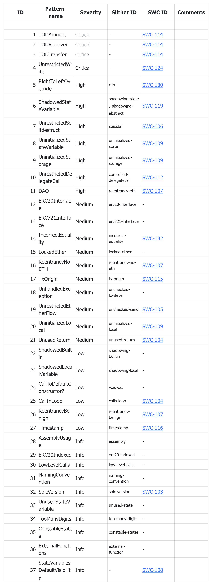

# Slither

## 一、概述

Slither 是一个用 Python 3 编写的智能合约静态分析框架，具备以下功能：

- 自动化漏洞检测：提供超过 30 项漏洞检查模型，包括但不限于重放攻击、未初始化变量、重入攻击等。完整的模型列表可在 [https://github.com/crytic/slither#detectors](https://github.com/crytic/slither#detectors) 查看。
- 自动优化检测：Slither 能够检测编译器可能遗漏的代码优化项，并提供优化建议。
- 代码理解：Slither 能够生成合约的继承拓扑图、合约方法调用关系图等，帮助开发者深入理解代码结构。
- 辅助代码审查：用户可以通过 API 与 Slither 进行交互，从而进行更加灵活和深入的代码审查。

## 二、Slither 运行流程

Slither 的工作方式如下所述：

1. 智能合约源代码通过 solc 编译后，生成 Solidity 抽象语法树（AST），作为 Slither 的输入。
2. 经过信息恢复（数据整合）处理，Slither 生成合约的继承图、控制流图（CFG）以及合约中函数列表。
3. 经过 SlithIR 转换，Slither 将合约代码转换为 SlithIR，这是一种内部表示语言。其目的是通过简单的 API 实现高精度分析，支持污点和值的跟踪，从而支持检测复杂的模型。
4. 在代码分析阶段，Slither 运行一组预定义的分析，包括合约中变量、函数的依赖关系，以及变量的读写和函数的权限控制等。
5. 经过 Slither 的核心处理后，即可提供漏洞检测、代码优化检测和代码理解等输出。


## 三、使用

## 3.1 安装

Slither 支持 pip、源码编译和 docker 三种安装方式。
**pip 安装**

```
pip3 install slither-analyzer
```

**源码编译**

```shell
**$ **git clone https://github.com/crytic/slither.git && cd slither
**$ **python3 setup.py install
```

**docker 安装**

```bash
docker pull trailofbits/eth-security-toolbox
```

在安装时，会有大量的依赖安装，这里建议使用 docker，不容易出错。

docker 安装后运行使用命令：
`docker run -it -v /Users/aa/go/src/six-days/blockchain:/contract trailofbits/eth-security-toolbox`
其中 -v 是指将本地的磁盘目录映射到容器中。

## 3.2 合约漏洞检测

**检测合约**

```
pragma solidity ^0.5.0;
**contract** **Suicidal**{**function** **kill**() **public**{selfdestruct(msg.sender);
    }
}
```

**漏洞分析**
合约有一个 public 类型的 kill 方法，任何人都能够销毁合约，属于 SWC-106 问题。

**运行命令**
`slither overflow_simple_add.sol --solc /usr/bin/solc-v0.5.0 --json res.json`
其中：

- --solc 参考可以指定编译版本。
  如果不指定的话也可以使用 `solc-select` 命令设置默认的编译版本，
  `solc-select -l` 查看已有的编译版本；
  `solc-select 0.5.0` 配置编译版本为 0.5.0。
- --json 可以指定输出结果为 json

更多命令详见：
[https://github.com/crytic/slither/wiki/Usage](https://github.com/crytic/slither/wiki/Usage)

**运行结果**


从结果中可以看到，共从 46 个检测模型中检测出 3 个问题，其中红色的就是合约销毁问题。

## 3.3 合约继承关系

Slither 有一个功能我非常喜欢，对于复杂合约的关系梳理尤其有帮助，那就是输出合约的继承关系。使用该功能的命令如下：
`slither evidence/EvidenceVoteSaveHandler.sol --print inheritance-graph`
运行结果是一个 dot 格式的关系描述，可以使用 graphviz 工具转成图片格式。
下图是一个存证合约的继承关系图。


# Mythril

## 一、Mythril 是什么

Mythril 是一个以太坊官方推荐的智能合约安全分析工具，使用符合执行来检测智能合约中的各种安全漏洞，在 Remix、Truffle 等 IDE 里都有集成。

其包含的安全分析模型如下。

> SWC 是弱安全智能合约分类及对应案例，[https://swcregistry.io/](https://swcregistry.io/)


## 二、Mythril 安装

Mythril 是使用 python 开发的，可以使用 pip3 和 docker 方式安装。

**1、pip3-Mac OS 安装**

```bash
brew update
brew upgrade
brew tap ethereum/ethereum
brew install leveldb
brew install solidity
pip3 install mythril
```

**2、pip3-Ubuntu 安装**

```bash
_# Update_
sudo apt update

_# Install solc_
sudo apt install software-properties-common
sudo add-apt-repository ppa:ethereum/ethereum
sudo apt install solc

_# Install libssl-dev, python3-dev, and python3-pip_
sudo apt install libssl-dev python3-dev python3-pip

_# Install mythril_
pip3 install mythril
myth --version
```

**3、docker 安装**

```bash
# Pull the latest release of mythril/myth
docker pull mythril/myth
```

## 三、Mythril 使用

成功安装 Mythril 后，您可以使用命令 `myth -h` 来查看帮助文档。如果您是通过 Docker 安装的，则查看帮助的命令为：
`docker run mythril/myth -h`

## 1、Mythril 命令

通过帮助命令，可以看到 Mythril 的命令有：

- analyze (a): 用于分析智能合约。
- disassemble (d): 将合约拆解，返回合约对应的 Opcodes。
- pro (p): 使用 Mythril 专业版（需付费）。
- list-detectors: 列出可用的安全检测模型。
- read-storage: 通过 RPC 读取指定地址的存储插槽。
- leveldb-search: 从本地 leveldb 中检索。
- function-to-hash: 计算合约方法的函数标识码。
- hash-to-address: 将哈希值转换为以太坊地址。
- version: 显示 Mythril 的版本号。

这里以一个简单的整型溢出合约为例，执行 `analyze ` 检查命令，看看能不能检测出整数溢出问题。
**合约地址**
[https://swcregistry.io/docs/SWC-101#overflow_simple_addsol](https://swcregistry.io/docs/SWC-101#overflow_simple_addsol)

**漏洞分析**
漏洞是一个加法的整型溢出问题，add 方法中，初始时 balance =1，此时 deposit 输入值为 uint256 的最大值 2**256-1，计算得到的 balance 为 0

```
pragma solidity 0.4.24;
**contract** **Overflow_Add** {**uint** **public** balance = 1;
**function** **add**(**uint256** deposit) **public** {
        balance += deposit;
    }
}
```

**运行命令**

```bash
docker run -v /Users/aaa/go/src/six-days/ethereum-contracts:/contract mythril/myth analyze  /contract/bec.sol --solv 0.4.25 --solver-timeout 60  --execution-timeout 60 -o json -t 3
```

其中：

- solv 是指定 solidity 编译版本
- solver-timeout solidity 版本下载超时时间
- execution-timeout，执行超时时间
- o 输出格式，可选 text/markdown/json/jsonv2
- t 交易个数

**运行结果**
运行结果如下图所示，检测出了 swc 101 漏洞。


## 2、交易数-t 参数

在漏洞检测中，有一个极其重要的参数 `-t`（或 `--transaction-count`，即交易数），值得特别提及。

在执行 `analyze` 时，Mythril 将在一个特制的 EVM 虚拟机中执行合约，默认的交易数为 2。对于大多数漏洞（如整数溢出），这已经足够发现问题了。

需要注意的是，每个交易可能具有多个有效的最终状态。在理论上，要探索的状态空间与交易数量成指数关系，因此交易个数越大，执行时间也越长。Mythril 在处理多个交易时，通过分析程序路径中读写状态变量的过程关联关系，可以缩小交易数量，从而提高分析效率。

如 Mythril 官方提供的 KillBilly 合约例子。代码如下(源码来自：[https://gist.github.com/b-mueller/2b251297ce88aa7628680f50f177a81a#file-killbilly-sol](https://gist.github.com/b-mueller/2b251297ce88aa7628680f50f177a81a#file-killbilly-sol)
)。

```
pragma solidity ^0.5.7;

contract KillBilly {
        bool public is_killable;
        mapping (address => bool) public approved_killers;

        constructor() public {
                is_killable = false;
        }

        function killerize(address addr) public {
                approved_killers[addr] = true;
        }

        function activatekillability() public {
                require(approved_killers[msg.sender] == true);
                is_killable = true;
        }

        function commencekilling() public {
            require(is_killable);
                 selfdestruct(msg.sender);
        }
}
```

在这个合约中要想销毁合约，需要先调用 `killerize ` 方法，为调用者授权，在调用 `activatekillability ` 方法，将 is_killable 变量设置为 true，最后调用 `commencekilling ` 方法消耗合约。
也就是说，要想检测出访问控制不当造成的合约销毁（SWC-106）漏洞，至少需要执行 3 个交易。

**指定交易数为 2**

```bash
docker run -v /Users/aaa/go/src/six-days/blockchain:/contract mythril/myth a /contract/killbilly.sol -t 2
```

运行结果如下所示。


**指定交易数为 3**

```bash
docker run -v /Users/aaa/go/src/six-days/blockchain:/contract mythril/myth a /contract/killbilly.sol -t 3
```

运行结果如下所示。


可以看到，此时 swc 106 漏洞已被发现。

## 四、总结

自以太坊问世以来，智能合约安全问题层出不穷，给项目方和用户带来了巨大的损失。Mythril 安全检查工具能够有效检测 SWC 中的一些安全漏洞，为智能合约的安全性提供了一定的保障。

然而，在使用 Mythril 工具时，我们也要注意，工具并非万能。对于一些深藏或者测试用例复杂的漏洞，Mythril 很难进行有效检测。举例来说，著名的 ERC20 合约 BEC 由于整数溢出而导致资金归零的漏洞（[https://swcregistry.io/docs/SWC-101#bectokensol](https://swcregistry.io/docs/SWC-101#bectokensol%EF%BC%89%EF%BC%8CMythril)[），Mythril](https://swcregistry.io/docs/SWC-101#bectokensol%EF%BC%89%EF%BC%8CMythril) 并未能检测出该溢出漏洞。

# Securify

Securify 2.0 是以太坊智能合约的安全扫描器，由 <u>以太坊基金会</u> 和<u>ChainSecurity</u>支持。 Securify 背后的核心 <u>研究</u> 是在苏黎世联邦理工学院的<u>安全、可靠和智能系统实验室进行的。</u>

它是流行的 Securify 安全扫描程序的后继者（[您可以在此处](https://github.com/eth-sri/securify)[找到旧版本](https://github.com/eth-sri/securify)）。

## **特征**

- 支持 37 个漏洞（<u>见下表</u>）
- 实现用 Datalog 编写的新颖的上下文相关静态分析
- 分析以 Solidity >= 0.5.8 编写的合约

## **Docker 运行**

构建容器：

```
sudo docker build -t securify .
```

运行容器：

```
sudo docker run -it -v <contract-dir-full-path>:/share securify /share/<contract>.sol
```

注意：要通过 Docker 使用与 不同的 Solidity 版本运行代码 `0.5.12`，您需要修改 `ARG SOLC=0.5.12` 顶部的变量 `Dockerfile` 以指向您的版本。使用正确的版本构建后，您不应遇到错误。

## **安装**

## **先决条件**

以下说明假设已安装 Python。除此之外，Securify 还需要在系统上安装 `solc`、和 ：`soufflegraphviz`

### Solc

```
sudo add-apt-repository ppa:ethereum/ethereum
sudo apt-get update
sudo apt-get install solc
```

### **Souffle**

按照此处的说明进行操作：<u>[https://souffle-lang.github.io/download.html](https://souffle-lang.github.io/download.html)</u>

_请不要选择不稳定的版本，因为它可能随时崩溃。_

### **图形可视化/点**

```
sudo apt install graphviz
```

## **设置虚拟环境**

安装先决条件后，我们可以设置 python 虚拟环境，从中运行该项目中的脚本。

在项目的根文件夹中，执行以下命令来设置并激活虚拟环境：

```
virtualenv --python=/usr/bin/python3.7 venv
source venv/bin/activate
```

验证 `python` 版本实际上是 `3.7`：

```
python --version
```

放 `LD_LIBRARY_PATH`：

```
cd <securify_root>/securify/staticanalysis/libfunctors
export LD_LIBRARY_PATH=$LD_LIBRARY_PATH:`pwd`
```

最后，通过从文件夹运行以下命令来安装项目的依赖项 `<securify_root>`：

```
pip install --upgrade pip
pip install -r requirements.txt
pip install -e .
```

现在您已准备好开始使用 secure 框架。

请记住：在执行框架的脚本之前，您需要使用以下命令激活虚拟环境：

```
source venv/bin/activate
```

## **用法**

## **分析合同**

目前 Securify2 仅支持平面合约，即不包含导入语句的合约。

要分析本地合约，只需运行：

```
securify <contract_source>.sol [--use-patterns Pattern1 Pattern2 ...]
```

或者使用 Etherscan.io API 从区块链下载：

```
securify <contract_address> --from-blockchain [--key <key-file>]
```

_请注意，您需要 Etherscan.io 的 API 密钥才能使用此功能。_

要根据特定严重性级别分析合同，请运行：

```
securify <contract_source>.sol [--include-severity Severity1 Severity2]
securify <contract_source>.sol [--exclude-severity Severity1 Severity2]
```

要获取所有可用的模式，请运行：

```
securify --list
```

## **支持的漏洞**



Securify 不会检查以下 Slither 模式，因为它们是由 Solidity 编译器（版本 0.5.8）检查的：

- `constant-function`
- `deprecated-standards`
- `pragma`

以下 SWC 漏洞不适用于 pragma >=5.8 的 Solidity 合约，因此 Securify 不会检查：

- SWC-118（构造函数名称不正确）
- SWC-129（+= 的用法）
