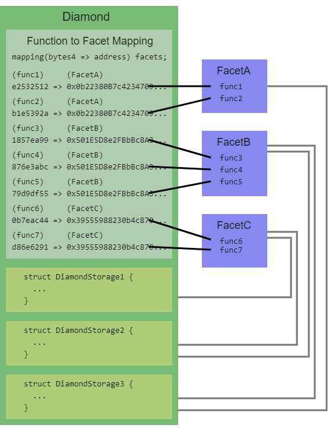

# ERC20

### **标准 ERC20 接口**

- 3 个查询

  - `balanceOf`: 查询指定地址的 Token 数量
  - `totalSupply`: 查询当前合约的 Token 总量
  - `allowance`: 查询指定地址对另外一个地址的剩余授权额度
- 2 个交易

  - `transfer`: 从当前调用者地址发送指定数量的 Token 到指定地址。
    - 这是一个写入方法，所以还会抛出一个 `Transfer` 事件。
  - `transferFrom`: 当向另外一个合约地址存款时，对方合约必须调用 transferFrom 才可以把 Token 拿到它自己的合约中。
- 2 个事件

  - `Transfer`
  - `Approval`
- 1 个授权

  - `approve`: 授权指定地址可以操作调用者的最大 Token 数量。

```
// SPDX-License-Identifier: MIT
pragma solidity ^0.8.17;
interface IERC20 {
    // 1个授权
    function approve(address spender, uint256 amount) external returns (bool);
    // 2个事件
    event Transfer(address indexed from, address indexed to, uint256 amount);
    event Approval(
        address indexed owner,
        address indexed spender,
        uint256 amount
    );
    // 2个交易
    function transfer(address recipient, uint256 amount)
        external
        returns (bool);
    function transferFrom(
        address sender,
        address recipient,
        uint256 amount
    ) external returns (bool);
    // 3个查询
    function totalSupply() external view returns (uint256);
    function balanceOf(address account) external view returns (uint256);
    function allowance(address owner, address spender)
        external
        view
        returns (uint256);
}
```

### **ERC20 标准合约实现**

```
// SPDX-License-Identifier: MIT
pragma solidity ^0.8.17;
interface IERC20 {
    // 1个授权
    function approve(address spender, uint256 amount) external returns (bool);
    // 2个事件
    event Transfer(address indexed from, address indexed to, uint256 amount);
    event Approval(
        address indexed owner,
        address indexed spender,
        uint256 amount
    );
    // 2个交易
    function transfer(address recipient, uint256 amount)
        external
        returns (bool);
    function transferFrom(
        address sender,
        address recipient,
        uint256 amount
    ) external returns (bool);
    // 3个查询
    function totalSupply() external view returns (uint256);
    function balanceOf(address account) external view returns (uint256);
    function allowance(address owner, address spender)
        external
        view
        returns (uint256);
}
contract ERC20 is IERC20 {
    // 状态变量
    string public name;
    string public symbol;
    uint8 public immutable decimals;
    address public immutable owner;
    // uint256 public immutable totalSupply; // 不增加总量
    uint256 public totalSupply; // 总价总量
    mapping(address => uint256) public balanceOf;
    mapping(address => mapping(address => uint256)) public allowance;
    // 函数修改器
    modifier onlyOwner() {
        require(msg.sender == owner, "not owner");
        _;
    }
    // 构造函数
    constructor(
        string memory _name,
        string memory _symbol,
        uint8 _decimals,
        uint256 _totalSupply
    ) {
        owner = msg.sender;
        name = _name;
        symbol = _symbol;
        decimals = _decimals;
        totalSupply = _totalSupply;
        balanceOf[msg.sender] = _totalSupply;
        emit Transfer(address(0), msg.sender, _totalSupply);
    }
    // 1个授权
    function approve(address spender, uint256 amount) external returns (bool) {
        allowance[msg.sender][spender] = amount;
        emit Approval(msg.sender, spender, amount);
        return true;
    }
    // 2个交易
    function transfer(address recipient, uint256 amount)
        external
        returns (bool)
    {
        balanceOf[msg.sender] -= amount;
        balanceOf[recipient] += amount;
        emit Transfer(msg.sender, recipient, amount);
        return true;
    }
    function transferFrom(
        address sender,
        address recipient,
        uint256 amount
    ) external returns (bool) {
        // msg.sender 也就是当前调用者，是被批准者
        allowance[sender][msg.sender] -= amount;
        balanceOf[sender] -= amount;
        balanceOf[recipient] += amount;
        emit Transfer(sender, recipient, amount);
        return true;
    }
    // 1个铸币 - 非必须
    function mint(uint256 amount) external onlyOwner returns (bool) {
        totalSupply += amount;
        balanceOf[msg.sender] += amount;
        emit Transfer(address(0), msg.sender, amount);
        return true;
    }
    // 1个销毁 - 非必须
    function burn(uint256 amount) external returns (bool) {
        totalSupply -= amount;
        balanceOf[msg.sender] -= amount;
        emit Transfer(msg.sender, address(0), amount);
        return true;
    }
    // 转移 owner 权限等其他一些操作均是看各自业务，非必需的
}
```

# ERC721 和 ERC1155

## **ERC721 标准**

### **场景说明**

非同质化代币（NFT）用于以唯一的方式标识某人或者某物。 此类型的代币可以被完美地用于出售下列物品的平台：收藏品、密钥、彩票、音乐会座位编号、体育比赛等。 这种类型的代币有着惊人的潜力，因此它需要一个适当的标准。ERC-721 就是为解决这个问题而来！

所有 NFTs 都有一个 `uint256` 变量，名为 `tokenId`，所以对于任何 ERC-721 合约，这对值 `contract address, tokenId` 必须是全局唯一的。 也就是说，去中心化应用程序可以有一个“转换器”， 使用 tokenId 作为输入并输出一些很酷的事物图像，例如僵尸、武器、技能或神奇的小猫咪！

### **合约代码**

```
// SPDX-License-Identifier: MIT

pragma solidity ^0.8.0;

/**
 * @dev ERC165 标准的接口 https://eips.ethereum.org/EIPS/eip-165
 * https://eips.ethereum.org/EIPS/eip-165#how-interfaces-are-identified
 */
interface IERC165 {
    /// @notice 查询合约是否实现接口
    /// @param interfaceID ERC-165 中指定的接口标识符
    /// @dev 接口标识在 ERC-165 中指定。此功能需要低于 30,000 gas。
    /// @return 如果合约实现了 interfaceID 且 interfaceID 不是 0xffffffff，则为 true，否则为 false
    function supportsInterface(bytes4 interfaceID) external view returns (bool);
}

/// @title ERC-721 Non-Fungible Token Standard
/// @dev See https://eips.ethereum.org/EIPS/eip-721
///  Note: the ERC-165 identifier for this interface is 0x80ac58cd.
interface IERC721 is IERC165 {
    /**
     @dev 当任何 NFT 的所有权通过任何形式发生变化时，需要触发该事件。
     当 NFT 创建（`from` == 0）和销毁（`to` == 0）时会触发此事件。
     例外情况：在合约创建期间，可以创建和分配任意数量的 NFT，而不会发出 Transfer。
     在任何形式的资产转移时，该 NFT如果有批准地址将重置为无。
    */
    event Transfer(
        address indexed _from,
        address indexed _to,
        uint256 indexed _tokenId
    );

    /**
     * 当 NFT 的批准地址被更改或重新确认时，它会发出。
     * 零地址表示没有批准的地址。
     * 当 Transfer 事件发出时，这也表明该 NFT 如果有批准地址被重置为无。
     */
    event Approval(
        address indexed _owner,
        address indexed _approved,
        uint256 indexed _tokenId
    );

    /// @dev 当为所有者启用或禁用操作员时，它会发出。 运营者可以管理所有者的所有 NFT。
    event ApprovalForAll(
        address indexed _owner,
        address indexed _operator,
        bool _approved
    );

    /// @notice 所有者的 NFT 数量
    /// @dev 分配给零地址的 NFT 被认为是无效的，并且该函数抛出有关零地址的查询。
    /// @param _owner 查询余额的地址
    /// @return `_owner` 拥有的 NFT 数量，可能为零
    function balanceOf(address _owner) external view returns (uint256);

    /// @notice 找到 NFT 的所有者
    /// @dev 分配给零地址的 NFT 被认为是无效的，并且对它们的查询确实会抛出异常。
    /// @param _tokenId NFT 的标识符
    /// @return NFT所有者的地址
    function ownerOf(uint256 _tokenId) external view returns (address);

    /// @notice 将 NFT 的所有权从一个地址转移到另一个地址
    /// @dev Throws unless `msg.sender` is the current owner, an authorized
    ///  operator, or the approved address for this NFT. Throws if `_from` is
    ///  not the current owner. Throws if `_to` is the zero address. Throws if
    ///  `_tokenId` is not a valid NFT. When transfer is complete, this function
    ///  checks if `_to` is a smart contract (code size > 0). If so, it calls
    ///  `onERC721Received` on `_to` and throws if the return value is not
    ///  `bytes4(keccak256("onERC721Received(address,address,uint256,bytes)"))`.
    /// @param _from NFT的当前所有者
    /// @param _to 新 owner
    /// @param _tokenId 转移的 NFT
    /// @param data 没有指定格式的附加数据，在调用 _to 时发送
    function safeTransferFrom(
        address _from,
        address _to,
        uint256 _tokenId,
        bytes calldata data
    ) external payable;

    /// @notice 将 NFT 的所有权从一个地址转移到另一个地址
    /// @dev 这与具有额外数据参数的其他函数的工作方式相同，只是此函数只是将数据设置为“”。
    /// @param _from NFT的当前所有者
    /// @param _to 新 owner
    /// @param _tokenId 转移的 NFT
    function safeTransferFrom(
        address _from,
        address _to,
        uint256 _tokenId
    ) external payable;

    /// @notice 转移 NFT 的所有权——调用者有责任确认 `_to` 能够接收 NFTS，否则它们可能会永久丢失
    /// @dev Throws unless `msg.sender` is the current owner, an authorized
    ///  operator, or the approved address for this NFT. Throws if `_from` is
    ///  not the current owner. Throws if `_to` is the zero address. Throws if
    ///  `_tokenId` is not a valid NFT.
    /// @param _from NFT的当前所有者
    /// @param _to 新 owner
    /// @param _tokenId 转移的 NFT
    function transferFrom(
        address _from,
        address _to,
        uint256 _tokenId
    ) external payable;

    /// @notice 更改或重申 NFT 的批准地址
    /// @dev The zero address indicates there is no approved address.
    ///  Throws unless `msg.sender` is the current NFT owner, or an authorized
    ///  operator of the current owner.
    /// @param _approved 新批准的 NFT 控制器
    /// @param _tokenId NFT 批准
    function approve(address _approved, uint256 _tokenId) external payable;

    /// @notice 启用或禁用对第三方（“操作员”）的批准以管理所有 `msg.sender` 的资产
    /// @dev 发出 ApprovalForAll 事件。 合同必须允许每个所有者有多个操作员。
    /// @param _operator 添加到授权运营商集中的地址
    /// @param _approved 如果运营商获得批准，则为 True，如果撤消批准，则为 false
    function setApprovalForAll(address _operator, bool _approved) external;

    /// @notice 获取单个 NFT 的认可地址
    /// @dev 如果 _tokenId 不是有效的 NFT，则抛出。
    /// @param _tokenId NFT寻找批准的地址
    /// @return 此 NFT 的批准地址，如果没有则为零地址
    function getApproved(uint256 _tokenId) external view returns (address);

    /// @notice 查询一个地址是否是另一个地址的授权操作员
    /// @param _owner 拥有 NFT 的地址
    /// @param _operator 代表所有者的地址
    /// @return 如果 _operator 是 _owner 的批准运算符，则为真，否则为假
    function isApprovedForAll(address _owner, address _operator)
        external
        view
        returns (bool);
}
```

## **ERC1155 标准**

### **场景说明**

用于多种代币管理的合约标准接口。单个部署的合约可以包括同质化代币、非同质化代币或其他配置（如半同质化代币）的任何组合。

它的目的很单纯，就是创建一个智能合约接口，可以代表和控制任何数量的同质化和非同质化代币类型。 这样一来，ERC-1155 代币就具有与 ERC-20 和 ERC-721 代币相同的功能，甚至可以同时使用这两者的功能。 而最重要的是，它能改善这两种标准的功能，使其更有效率，并纠正 ERC-20 和 ERC-721 标准上明显的实施错误。

### **合约代码**

```
// SPDX-License-Identifier: MIT

pragma solidity ^0.8.0;

/**
 * @dev ERC165 标准的接口 https://eips.ethereum.org/EIPS/eip-165
 * https://eips.ethereum.org/EIPS/eip-165#how-interfaces-are-identified
 */
interface IERC165 {
    /// @notice 查询合约是否实现接口
    /// @param interfaceID ERC-165 中指定的接口标识符
    /// @dev 接口标识在 ERC-165 中指定。此功能需要低于 30,000 gas。
    /// @return 如果合约实现了 interfaceID 且 interfaceID 不是 0xffffffff，则为 true，否则为 false
    function supportsInterface(bytes4 interfaceID) external view returns (bool);
}

/**
    @title ERC-1155 Multi Token Standard
    @dev See https://eips.ethereum.org/EIPS/eip-1155
    Note: The ERC-165 identifier for this interface is 0xd9b67a26.
 */
interface IERC1155 is IERC165 {
    /**
        @dev Either `TransferSingle` or `TransferBatch` MUST emit when tokens are transferred,
        including zero value transfers as well as minting or burning (see "Safe Transfer Rules" section of the standard).
        The `_operator` argument MUST be the address of an account/contract that is approved to make the transfer (SHOULD be msg.sender).
        The `_from` argument MUST be the address of the holder whose balance is decreased.
        The `_to` argument MUST be the address of the recipient whose balance is increased.
        The `_id` argument MUST be the token type being transferred.
        The `_value` argument MUST be the number of tokens the holder balance is decreased by and match what the recipient balance is increased by.
        When minting/creating tokens, the `_from` argument MUST be set to `0x0` (i.e. zero address).
        When burning/destroying tokens, the `_to` argument MUST be set to `0x0` (i.e. zero address).
    */
    event TransferSingle(
        address indexed _operator,
        address indexed _from,
        address indexed _to,
        uint256 _id,
        uint256 _value
    );

    /**
        @dev Either `TransferSingle` or `TransferBatch` MUST emit when tokens are transferred,
        including zero value transfers as well as minting or burning (see "Safe Transfer Rules" section of the standard).
        The `_operator` argument MUST be the address of an account/contract that is approved to make the transfer (SHOULD be msg.sender).
        The `_from` argument MUST be the address of the holder whose balance is decreased.
        The `_to` argument MUST be the address of the recipient whose balance is increased.
        The `_ids` argument MUST be the list of tokens being transferred.
        The `_values` argument MUST be the list of number of tokens (matching the list and order of tokens specified in _ids)
        the holder balance is decreased by and match what the recipient balance is increased by.
        When minting/creating tokens, the `_from` argument MUST be set to `0x0` (i.e. zero address).
        When burning/destroying tokens, the `_to` argument MUST be set to `0x0` (i.e. zero address).
    */
    event TransferBatch(
        address indexed _operator,
        address indexed _from,
        address indexed _to,
        uint256[] _ids,
        uint256[] _values
    );

    /**
        @dev 必须在批准第二方/运营商地址管理所有者地址的所有令牌时启用或禁用（没有事件假定禁用）
    */
    event ApprovalForAll(
        address indexed _owner,
        address indexed _operator,
        bool _approved
    );

    /**
        @dev 必须在为令牌 ID 更新 URI 时发出。
        URI 在 RFC 3986 中定义。
        URI 必须指向符合“ERC-1155 元数据 URI JSON 模式”的 JSON 文件。
    */
    event URI(string _value, uint256 indexed _id);

    /**
        @notice Transfers `_value` amount of an `_id` from the `_from` address
                to the `_to` address specified (with safety call).
        @dev Caller must be approved to manage the tokens being transferred
        out of the `_from` account (see "Approval" section of the standard).
        MUST revert if `_to` is the zero address.
        MUST revert if balance of holder for token `_id` is lower than the `_value` sent.
        MUST revert on any other error.
        MUST emit the `TransferSingle` event to reflect the balance change (see "Safe Transfer Rules" section of the standard).
        After the above conditions are met, this function MUST check if `_to` is a smart contract (e.g. code size > 0). If so,
        it MUST call `onERC1155Received` on `_to` and act appropriately (see "Safe Transfer Rules" section of the standard).
        @param _from    Source address
        @param _to      Target address
        @param _id      ID of the token type
        @param _value   Transfer amount
        @param _data    Additional data with no specified format, MUST be sent unaltered in call to `onERC1155Received` on `_to`
    */
    function safeTransferFrom(
        address _from,
        address _to,
        uint256 _id,
        uint256 _value,
        bytes calldata _data
    ) external;

    /**
        @notice 将 `_ids` 的 `_values` 数量从 `_from` 地址转移到指定的 `_to` 地址（使用安全调用）。
        @dev Caller must be approved to manage the tokens being transferred out of the `_from` account (see "Approval" section of the standard).
        MUST revert if `_to` is the zero address.
        MUST revert if length of `_ids` is not the same as length of `_values`.
        MUST revert if any of the balance(s) of the holder(s) for token(s) in `_ids` is lower than the respective amount(s) in `_values` sent to the recipient.
        MUST revert on any other error.
        MUST emit `TransferSingle` or `TransferBatch` event(s) such that all the balance changes are reflected (see "Safe Transfer Rules" section of the standard).
        Balance changes and events MUST follow the ordering of the arrays (_ids[0]/_values[0] before _ids[1]/_values[1], etc).
        After the above conditions for the transfer(s) in the batch are met, this function MUST check if `_to` is a smart contract (e.g. code size > 0). If so,
        it MUST call the relevant `ERC1155TokenReceiver` hook(s) on `_to` and act appropriately (see "Safe Transfer Rules" section of the standard).
        @param _from    Source address
        @param _to      Target address
        @param _ids     每个令牌类型的 ID（顺序和长度必须匹配 _values 数组）
        @param _values  每种代币类型的转账金额（顺序和长度必须匹配 _ids 数组）
        @param _data    没有指定格式的额外数据，必须在调用 _to 上的 `ERC1155TokenReceiver` 钩子时原封不动地发送
    */
    function safeBatchTransferFrom(
        address _from,
        address _to,
        uint256[] calldata _ids,
        uint256[] calldata _values,
        bytes calldata _data
    ) external;

    /**
        @notice 获取帐户令牌的余额。
        @param _owner  令牌持有者的地址
        @param _id     ID of the token
        @return        请求的代币类型的所有者余额
     */
    function balanceOf(address _owner, uint256 _id)
        external
        view
        returns (uint256);

    /**
        @notice 获取多个账户/代币对的余额
        @param _owners 代币持有者的地址
        @param _ids    ID of the tokens
        @return        请求的令牌类型的 _owner 余额（即每个 (owner, id) 对的余额）
     */
    function balanceOfBatch(address[] calldata _owners, uint256[] calldata _ids)
        external
        view
        returns (uint256[] memory);

    /**
        @notice 启用或禁用对第三方（“操作员”）的批准以管理所有调用者的令牌。
        @dev 必须在成功时发出 ApprovalForAll 事件。
        @param _operator  添加到授权运营商集中的地址
        @param _approved  如果运营商获得批准，则为 True，如果撤消批准，则为 false
    */
    function setApprovalForAll(address _operator, bool _approved) external;

    /**
        @notice 查询给定所有者的操作员的批准状态。
        @param _owner     The owner of the tokens
        @param _operator  授权操作员的地址
        @return           如果操作员被批准则为真，否则为假
    */
    function isApprovedForAll(address _owner, address _operator)
        external
        view
        returns (bool);
}
```

# ERC1967

**ERC-1967：代理存储插槽 **

_ 代理存储其委托的逻辑合约地址以及其他代理特定信息的一致位置。_

## 抽象的

委托**代理合约**广泛用于可升级性和节省燃气费。这些代理依赖于称为 using 的**逻辑契约** `delegatecall`（也称为实现契约或主副本） 。这允许代理在代码委托给逻辑合约时保持持久状态（存储和平衡）。

为了避免代理和逻辑合约之间的存储使用冲突，逻辑合约的地址通常保存在特定的存储槽中（例如 `0x360894a13ba1a3210667c828492db98dca3e2076cc3735a920a3ca505d382bbc` 在 OpenZeppelin 合约中），保证永远不会被编译器分配。该 EIP 提出了一组标准槽来存储代理信息。这使得像区块浏览器这样的客户端能够正确地提取这些信息并向最终用户显示这些信息，并且逻辑合约可以选择性地对其采取行动。

## 动机

委托代理被广泛使用，作为支持升级和降低部署的 Gas 成本的一种手段。这些代理的示例可以在 OpenZeppelin Contracts、Gnosis、AragonOS、Melonport、Limechain、WindingTree、Decentraland 等中找到。

然而，缺乏用于获取代理逻辑地址的通用接口使得不可能构建作用于该信息的通用工具。

一个典型的例子是区块浏览器。在这里，最终用户希望与底层逻辑合约交互，而不是与代理本身交互。拥有从代理检索逻辑合约地址的通用方法允许块浏览器显示逻辑合约的 ABI，而不是代理的 ABI。浏览器检查合约在不同槽位的存储，以确定它是否确实是代理，在这种情况下，它会显示有关代理和逻辑合约的信息。例如，`0xa0b86991c6218b36c1d19d4a2e9eb0ce3606eb48` Etherscan 上的显示方式如下：


另一个例子是逻辑合约，它明确地根据它们被代理的事实采取行动。这使得他们有可能触发代码更新作为其逻辑的一部分。公共存储槽允许这些用例独立于所使用的特定代理实现。

## 规格

代理监控对于许多应用程序的安全至关重要。因此，必须能够跟踪实施和管理时段的更改。不幸的是，跟踪存储槽的变化并不容易。因此，建议任何更改这些槽的函数也应该发出相应的事件。这包括初始化，从 `0x0` 第一个非零值开始。

建议的代理特定信息存储槽如下。根据需要，可以在后续 ERC 中添加更多用于附加信息的槽位。

### 逻辑合约地址

存储槽 `0x360894a13ba1a3210667c828492db98dca3e2076cc3735a920a3ca505d382bbc` （通过 获得 `bytes32(uint256(keccak256('eip1967.proxy.implementation')) - 1)`）。

保存该代理委托的逻辑合约的地址。如果使用信标代替，则应为空。对此槽的更改应该通过事件通知：

```
**event** Upgraded(**address** **indexed** implementation);
```

### 信标合约地址

存储槽 `0xa3f0ad74e5423aebfd80d3ef4346578335a9a72aeaee59ff6cb3582b35133d50`（通过 获得 `bytes32(uint256(keccak256('eip1967.proxy.beacon')) - 1)`）。

保存该代理所依赖的信标合约的地址（后备）。如果直接使用逻辑地址，则应为空，并且仅当逻辑合约槽为空时才应考虑。对此槽的更改应该通过事件通知：

```
**event** BeaconUpgraded(**address** **indexed** beacon);
```

信标用于将多个代理的逻辑地址保存在单个位置，允许通过修改单个存储槽来升级多个代理。信标合约必须实现以下功能：

```
function implementation() returns (address)
```

基于信标的代理合约不使用逻辑合约槽。相反，他们使用信标合约槽来存储它们所附加的信标的地址。为了了解信标代理使用的逻辑契约，客户端应该：

- 读取信标的地址为信标逻辑存储槽；
- 调用 `implementation()` 信标合约上的函数。

信标合约上的函数结果 `implementation()` 不应取决于调用者 ( `msg.sender`)。

### 管理员地址

存储槽 `0xb53127684a568b3173ae13b9f8a6016e243e63b6e8ee1178d6a717850b5d6103` （通过 获得 `bytes32(uint256(keccak256('eip1967.proxy.admin')) - 1)`）。

保存允许升级该代理的逻辑合约地址的地址（可选）。对此槽的更改应该通过事件通知：

```
**event** AdminChanged(**address** previousAdmin, **address** newAdmin);
```

## 基本原理

该 EIP 标准化了逻辑合约地址的**存储槽**，而不是代理合约上的公共方法。这样做的理由是，代理永远不应该向最终用户公开可能与逻辑合约的功能发生冲突的功能。

请注意，即使具有不同名称的函数之间也可能会发生冲突，因为 ABI 仅依赖于函数选择器的四个字节。这可能会导致意外错误，甚至被利用，其中对代理合约的调用返回与预期不同的值，因为代理拦截了调用并用它自己的值进行应答。

来自 Nomic Labs 的_以太坊代理中的恶意后门：_

> _代理合约中任何选择器与实现合约中的选择器匹配的函数都将被直接调用，完全跳过实现代码。_
> _由于函数选择器使用固定数量的字节，因此始终存在冲突的可能性。这对于日常开发来说不是问题，因为 Solidity 编译器会检测到合约内的选择器冲突，但是当选择器用于跨合约交互时，这就会变得可利用。冲突可能会被滥用来创建看似良好的合约，但实际上隐藏了后门。_

代理公共函数具有潜在的可利用性，这一事实使得有必要以不同的方式标准化逻辑合约地址。

对所选存储槽的主要要求是编译器决不能选择它们来存储任何合约状态变量。否则，逻辑合约在写入自己的变量时可能会无意中覆盖代理上的此信息。

在合约继承链线性化之后，Solidity 根据变量声明的顺序将变量映射到存储：第一个变量被分配到第一个槽，依此类推。动态数组和映射中的值是例外，它们存储在键和存储槽串联的哈希中。 Solidity 开发团队已确认新版本中将保留存储布局：

> _由于存储指针可以传递给库，因此存储中状态变量的布局被认为是 Solidity 外部接口的一部分。这意味着对本节中概述的规则的任何更改都被视为语言的重大更改，并且由于其关键性质，在执行之前应非常仔细地考虑。如果发生此类重大更改，我们希望发布一种兼容模式，在该模式下编译器将生成支持旧布局的字节码。_

Vyper 似乎遵循与 Solidity 相同的策略。请注意，用其他语言编写的合同或直接以汇编语言编写的合同可能会发生冲突。

它们以这样的方式选择，因此保证它们不会与编译器分配的状态变量冲突，因为它们依赖于不以存储索引开头的字符串的散列。此外，`-1` 还添加了偏移量，因此无法知道哈希的原像，从而进一步减少了可能的攻击机会。

## 参考实现

```
_/**
 * @dev This contract implements an upgradeable proxy. It is upgradeable because calls are delegated to an
 * implementation address that can be changed. This address is stored in storage in the location specified by
 * https://eips.ethereum.org/EIPS/eip-1967[EIP1967], so that it doesn't conflict with the storage layout of the
 * implementation behind the proxy.
__ */_**contract** ERC1967Proxy **is** Proxy, ERC1967Upgrade {_/**
     * @dev Initializes the upgradeable proxy with an initial implementation specified by `_logic`.
     *
     * If `_data` is nonempty, it's used as data in a delegate call to `_logic`. This will typically be an encoded
     * function call, and allows initializing the storage of the proxy like a Solidity constructor.
__     */_**constructor**(**address** _logic, **bytes** **memory** _data) **payable** {assert(_IMPLEMENTATION_SLOT **==** **bytes32**(**uint256**(keccak256("eip1967.proxy.implementation")) **-** 1));_upgradeToAndCall(_logic, _data, false);}_/**
     * @dev Returns the current implementation address.
__     */_**function** _implementation() **internal** **view** **virtual** **override** **returns** (**address** impl) {**return** ERC1967Upgrade._getImplementation();}}_/**
 * @dev This abstract contract provides getters and event emitting update functions for
 * https://eips.ethereum.org/EIPS/eip-1967[EIP1967] slots.
__ */_**abstract** **contract** ERC1967Upgrade {_// This is the keccak-256 hash of "eip1967.proxy.rollback" subtracted by 1
_    **bytes32** **private** **constant** _ROLLBACK_SLOT **=** 0x4910fdfa16fed3260ed0e7147f7cc6da11a60208b5b9406d12a635614ffd9143;_/**
     * @dev Storage slot with the address of the current implementation.
     * This is the keccak-256 hash of "eip1967.proxy.implementation" subtracted by 1, and is
     * validated in the constructor.
__     */_**bytes32** **internal** **constant** _IMPLEMENTATION_SLOT **=** 0x360894a13ba1a3210667c828492db98dca3e2076cc3735a920a3ca505d382bbc;_/**
     * @dev Emitted when the implementation is upgraded.
__     */_**event** Upgraded(**address** **indexed** implementation);_/**
     * @dev Returns the current implementation address.
__     */_**function** _getImplementation() **internal** **view** **returns** (**address**) {**return** StorageSlot.getAddressSlot(_IMPLEMENTATION_SLOT).value;}_/**
     * @dev Stores a new address in the EIP1967 implementation slot.
__     */_**function** _setImplementation(**address** newImplementation) **private** {require(Address.isContract(newImplementation), "ERC1967: new implementation is not a contract");StorageSlot.getAddressSlot(_IMPLEMENTATION_SLOT).value **=** newImplementation;}_/**
     * @dev Perform implementation upgrade
     *
     * Emits an {Upgraded} event.
__     */_**function** _upgradeTo(**address** newImplementation) **internal** {_setImplementation(newImplementation);**emit** Upgraded(newImplementation);}_/**
     * @dev Perform implementation upgrade with additional setup call.
     *
     * Emits an {Upgraded} event.
__     */_**function** _upgradeToAndCall(**address** newImplementation,**bytes** **memory** data,**bool** forceCall) **internal** {_upgradeTo(newImplementation);**if** (data.length **>** 0 **||** forceCall) {Address.functionDelegateCall(newImplementation, data);}}_/**
     * @dev Perform implementation upgrade with security checks for UUPS proxies, and additional setup call.
     *
     * Emits an {Upgraded} event.
__     */_**function** _upgradeToAndCallSecure(**address** newImplementation,**bytes** **memory** data,**bool** forceCall) **internal** {**address** oldImplementation **=** _getImplementation();_// Initial upgrade and setup call
_        _setImplementation(newImplementation);**if** (data.length **>** 0 **||** forceCall) {Address.functionDelegateCall(newImplementation, data);}_// Perform rollback test if not already in progress
_        StorageSlot.BooleanSlot **storage** rollbackTesting **=** StorageSlot.getBooleanSlot(_ROLLBACK_SLOT);**if** (**!**rollbackTesting.value) {_// Trigger rollback using upgradeTo from the new implementation
_            rollbackTesting.value **=** true;Address.functionDelegateCall(newImplementation,abi.encodeWithSignature("upgradeTo(address)", oldImplementation));rollbackTesting.value **=** false;_// Check rollback was effective
_            require(oldImplementation **==** _getImplementation(), "ERC1967Upgrade: upgrade breaks further upgrades");_// Finally reset to the new implementation and log the upgrade
_            _upgradeTo(newImplementation);}}_/**
     * @dev Storage slot with the admin of the contract.
     * This is the keccak-256 hash of "eip1967.proxy.admin" subtracted by 1, and is
     * validated in the constructor.
__     */_**bytes32** **internal** **constant** _ADMIN_SLOT **=** 0xb53127684a568b3173ae13b9f8a6016e243e63b6e8ee1178d6a717850b5d6103;_/**
     * @dev Emitted when the admin account has changed.
__     */_**event** AdminChanged(**address** previousAdmin, **address** newAdmin);_/**
     * @dev Returns the current admin.
__     */_**function** _getAdmin() **internal** **view** **returns** (**address**) {**return** StorageSlot.getAddressSlot(_ADMIN_SLOT).value;}_/**
     * @dev Stores a new address in the EIP1967 admin slot.
__     */_**function** _setAdmin(**address** newAdmin) **private** {require(newAdmin **!=** **address**(0), "ERC1967: new admin is the zero address");StorageSlot.getAddressSlot(_ADMIN_SLOT).value **=** newAdmin;}_/**
     * @dev Changes the admin of the proxy.
     *
     * Emits an {AdminChanged} event.
__     */_**function** _changeAdmin(**address** newAdmin) **internal** {**emit** AdminChanged(_getAdmin(), newAdmin);_setAdmin(newAdmin);}_/**
     * @dev The storage slot of the UpgradeableBeacon contract which defines the implementation for this proxy.
     * This is bytes32(uint256(keccak256('eip1967.proxy.beacon')) - 1)) and is validated in the constructor.
__     */_**bytes32** **internal** **constant** _BEACON_SLOT **=** 0xa3f0ad74e5423aebfd80d3ef4346578335a9a72aeaee59ff6cb3582b35133d50;_/**
     * @dev Emitted when the beacon is upgraded.
__     */_**event** BeaconUpgraded(**address** **indexed** beacon);_/**
     * @dev Returns the current beacon.
__     */_**function** _getBeacon() **internal** **view** **returns** (**address**) {**return** StorageSlot.getAddressSlot(_BEACON_SLOT).value;}_/**
     * @dev Stores a new beacon in the EIP1967 beacon slot.
__     */_**function** _setBeacon(**address** newBeacon) **private** {require(Address.isContract(newBeacon), "ERC1967: new beacon is not a contract");require(Address.isContract(IBeacon(newBeacon).implementation()),"ERC1967: beacon implementation is not a contract");StorageSlot.getAddressSlot(_BEACON_SLOT).value **=** newBeacon;}_/**
     * @dev Perform beacon upgrade with additional setup call. Note: This upgrades the address of the beacon, it does
     * not upgrade the implementation contained in the beacon (see {UpgradeableBeacon-_setImplementation} for that).
     *
     * Emits a {BeaconUpgraded} event.
__     */_**function** _upgradeBeaconToAndCall(**address** newBeacon,**bytes** **memory** data,**bool** forceCall) **internal** {_setBeacon(newBeacon);**emit** BeaconUpgraded(newBeacon);**if** (data.length **>** 0 **||** forceCall) {Address.functionDelegateCall(IBeacon(newBeacon).implementation(), data);}}}_/**
 * @dev This abstract contract provides a fallback function that delegates all calls to another contract using the EVM
 * instruction `delegatecall`. We refer to the second contract as the _implementation_ behind the proxy, and it has to
 * be specified by overriding the virtual {_implementation} function.
 *
 * Additionally, delegation to the implementation can be triggered manually through the {_fallback} function, or to a
 * different contract through the {_delegate} function.
 *
 * The success and return data of the delegated call will be returned back to the caller of the proxy.
__ */_**abstract** **contract** Proxy {_/**
     * @dev Delegates the current call to `implementation`.
     *
     * This function does not return to its internal call site, it will return directly to the external caller.
__     */_**function** _delegate(**address** implementation) **internal** **virtual** {**assembly** {_// Copy msg.data. We take full control of memory in this inline assembly
_            _// block because it will not return to Solidity code. We overwrite the
_            _// Solidity scratch pad at memory position 0.
_            calldatacopy(0, 0, calldatasize())_// Call the implementation.
_            _// out and outsize are 0 because we don't know the size yet.
_            **let** result **:=** delegatecall(gas(), implementation, 0, calldatasize(), 0, 0)_// Copy the returned data.
_            returndatacopy(0, 0, returndatasize())**switch** result_// delegatecall returns 0 on error.
_            **case** 0 {revert(0, returndatasize())}**default** {**return**(0, returndatasize())}}}_/**
     * @dev This is a virtual function that should be overridden so it returns the address to which the fallback function
     * and {_fallback} should delegate.
__     */_**function** _implementation() **internal** **view** **virtual** **returns** (**address**);_/**
     * @dev Delegates the current call to the address returned by `_implementation()`.
     *
     * This function does not return to its internal call site, it will return directly to the external caller.
__     */_**function** _fallback() **internal** **virtual** {_beforeFallback();_delegate(_implementation());}_/**
     * @dev Fallback function that delegates calls to the address returned by `_implementation()`. Will run if no other
     * function in the contract matches the call data.
__     */_**fallback**() **external** **payable** **virtual** {_fallback();}_/**
     * @dev Fallback function that delegates calls to the address returned by `_implementation()`. Will run if call data
     * is empty.
__     */_**receive**() **external** **payable** **virtual** {_fallback();}_/**
     * @dev Hook that is called before falling back to the implementation. Can happen as part of a manual `_fallback`
     * call, or as part of the Solidity `fallback` or `receive` functions.
     *
     * If overridden should call `super._beforeFallback()`.
__     */_**function** _beforeFallback() **internal** **virtual** {}}_/**
 * @dev Library for reading and writing primitive types to specific storage slots.
 *
 * Storage slots are often used to avoid storage conflict when dealing with upgradeable contracts.
 * This library helps with reading and writing to such slots without the need for inline assembly.
 *
 * The functions in this library return Slot structs that contain a `value` member that can be used to read or write.
__ */_**library** StorageSlot {**struct** AddressSlot {**address** value;}**struct** BooleanSlot {**bool** value;}**struct** Bytes32Slot {**bytes32** value;}**struct** Uint256Slot {**uint256** value;}_/**
     * @dev Returns an `AddressSlot` with member `value` located at `slot`.
__     */_**function** getAddressSlot(**bytes32** slot) **internal** **pure** **returns** (AddressSlot **storage** r) {**assembly** {r.slot **:=** slot}}_/**
     * @dev Returns an `BooleanSlot` with member `value` located at `slot`.
__     */_**function** getBooleanSlot(**bytes32** slot) **internal** **pure** **returns** (BooleanSlot **storage** r) {**assembly** {r.slot **:=** slot}}_/**
     * @dev Returns an `Bytes32Slot` with member `value` located at `slot`.
__     */_**function** getBytes32Slot(**bytes32** slot) **internal** **pure** **returns** (Bytes32Slot **storage** r) {**assembly** {r.slot **:=** slot}}_/**
     * @dev Returns an `Uint256Slot` with member `value` located at `slot`.
__     */_**function** getUint256Slot(**bytes32** slot) **internal** **pure** **returns** (Uint256Slot **storage** r) {**assembly** {r.slot **:=** slot}}}
```

## 安全考虑

该 ERC 依赖于这样一个事实：所选择的存储槽不会**由** Solidity 编译器分配。这保证了实施合约不会意外覆盖代理运行所需的任何信息。因此，选择具有高槽号的位置以避免与编译器分配的槽发生冲突。此外，还选择了没有已知原像的位置，以确保使用恶意制作的密钥写入映射不会覆盖它。

想要修改代理特定信息的逻辑合约必须通过写入特定的存储槽来故意执行此操作（就像 UUPS 的情况）。

# ERC2535

**ERC-2535：钻石，多方面代理 **

_创建可在部署后扩展的模块化智能合约系统。_

## 抽象的

该提案标准化了钻石，钻石是模块化的智能合约系统，可以在部署后升级/扩展，并且几乎没有大小限制。从技术上讲，**钻石是一种具有外部功能的合约，这些外部功能由称为“facet”**的合约提供。 Facet 是单独的、独立的合约，可以共享内部函数、库和状态变量。

## 动机

使用钻石有多种不同的原因。这里是其中的一些：

1. **单一地址可实现无限合约功能。**使用单一地址来实现合约功能可以使部署、测试以及与其他智能合约、软件和用户界面的集成变得更加容易。
2. **您的合约超出了 24KB 最大合约大小。**您可能具有将其保留在单个合约或单个合约地址中有意义的相关功能。钻石没有最大合约大小。
3. **钻石提供了一种组织合约代码和数据的方法。**您可能想要构建一个具有很多功能的合同系统。钻石提供了一种系统的方法来隔离不同的功能，并将它们连接在一起，并根据需要以高效的方式在它们之间共享数据。
4. **钻石提供了一种升级功能的方法。**可升级钻石可以升级以添加/替换/删除功能。由于钻石没有最大合约大小，因此随着时间的推移，可以添加到钻石的功能数量没有限制。钻石可以升级，而无需重新部署现有功能。可以添加/替换/删除钻石的某些部分，同时保留其他部分。
5. **钻石可以是不可变的。**稍后可以部署不可变钻石或使可升级钻石不可变。
6. **钻石可以重复使用已部署的合约。**无需将合约部署到区块链，现有的已部署链上合约可用于创建钻石。可以根据现有部署的合同创建定制钻石。这使得创建链上智能合约平台和库成为可能。

[该标准是 EIP-1538](https://eips.ethereum.org/EIPS/eip-1538) 的改进。该标准的相同动机也适用于本标准。

部署的刻面可以由任意数量的钻石使用。

下图显示了两颗具有相同两个刻面的钻石。

- `FacetA` 被使用 `Diamond1`
- `FacetA` 被使用 `Diamond2`
- `FacetB` 被使用 `Diamond1`
- `FacetB` 被使用 `Diamond2`


### 可升级钻石与集中式私有数据库

为什么要使用可升级的钻石而不是集中的、私有的、可变的数据库？

1. 去中心化自治组织（DAO）和其他治理系统可用于升级钻石。
2. 与以太坊生态系统广泛互动和融合。
3. 通过开放存储数据和经过验证的源代码，可以显示可证明的可信度历史。
4. 通过开放性，不良行为发生时可以被发现并报告。
5. 独立的安全和领域专家可以审查合约的变更历史并保证其可信度历史。
6. 可升级的钻石有可能变得不可变且无需信任。

### 一些钻石的好处

1. 提供所需功能的稳定合约地址。
2. 具有多个合约（方面）功能的单个地址，这些合约彼此独立，但可以共享内部函数、库和状态变量。
3. 从单个地址发出事件可以简化事件处理。
4. 一种以原子方式（在同一事务中）添加、替换和删除多个外部函数的方法。
5. 细粒度升级，因此您可以仅更改钻石中需要更改的部分。
6. 更好地控制何时存在以及存在哪些功能。
7. 去中心化自治组织（DAO）、多重签名合约和其他治理系统可用于升级钻石。
8. 显示添加、替换和删除哪些功能的事件。
9. 能够显示对钻石所做的所有更改。
10. 通过显示对钻石所做的所有更改，随着时间的推移增加信任。
11. 一种观察钻石以了解其当前刻面和功能的方法。
12. 拥有一颗不可改变、无需信任的钻石。
13. 解决了 24KB 最大合约大小限制。钻石可以是任何尺寸。
14. 单独的功能可以在单独的刻面中实现，并在钻石中一起使用。
15. 钻石可以从已经部署的现有链上合约中创建。
16. 较大的合约必须通过删除错误消息和其他内容来减小其大小。您可以通过实施钻石来保留所需的全部功能。
17. 根据需要在需要时实现零、部分或全部钻石不变性。
18. 能够使用可升级的钻石随着时间的推移开发和改进应用程序，然后根据需要使其不可变且无需信任。
19. 逐步开发，让您的钻石随着您的应用程序一起成长。
20. 升级钻石以修复错误、添加功能并实施新标准。
21. 用菱形和刻面组织您的代码。
22. 钻石可以很大（具有许多功能），但仍然是模块化的，因为它们是由刻面分隔的。
23. 在单个交易中调用多个合约的合约架构可以通过将这些合约压缩为单个钻石并直接访问状态变量来节省 gas。
24. 通过将外部函数转换为内部函数来节省 gas。这是通过在各方面之间共享内部函数来完成的。
25. 通过为气体优化的特定用例（例如批量传输）创建外部函数来节省气体。
26. Diamonds 专为工具和用户界面软件而设计。

## 规格

### 条款

1. 钻石是一种外观智能合约，可**进入** `delegatecall` 其侧面以执行函数调用。钻石是有状态的。数据存储在钻石的合约存储中。
2. Facet 是具有外部函数**的**无状态智能合约或 Solidity 库。部署一个刻面并将其一个或多个功能添加到一个或多个钻石中。分面不在其自己的合约存储中存储数据，但它可以定义状态并读取和写入一个或多个钻石的存储。刻面一词来自钻石行业。它是钻石的侧面或平坦表面。
3. **放大镜面**是提供内省功能的面。在钻石行业中，放大镜是用于观察钻石的放大镜。
4. **不可变函数**是不能被替换或删除的外部函数（因为它是直接在菱形中定义的，或者因为菱形的逻辑不允许它被修改）。
5. **就本 EIP 而言，映射**是两个事物之间的关联，并不涉及具体的实现。

**合约**一词被广泛地用来表示智能合约或已部署的 Solidity 库。

当本 EIP 使用**函数**时未指定内部或外部时，即表示外部函数。

在此 EIP 中，适用于外部功能的信息也适用于公共功能。

### 概述

钻石使用 来调用其刻面的函数 `delegatecall`。

在钻石行业中，钻石是通过切割、形成刻面来制造和成型的。在此标准中，通过添加、替换或删除刻面的功能来切割钻石。

### 关于实现接口的注意事项

由于菱形的性质，菱形可以通过以下两种方式之一实现接口：直接 ( `contract Contract is Interface`)，或者通过从一个或多个方面向其添加函数。出于本提案的目的，当钻石被认为实现接口时，任何一种实现方法都是允许的。

### 回退功能

当在菱形上调用外部函数时，将执行其后备函数。回退函数根据调用数据的前四个字节（称为函数选择器）确定要调用哪个方面，并使用 `delegatecall`.

钻石的后备功能，`delegatecall` 使钻石能够执行刻面的功能，就好像它是由钻石本身实现的一样。`msg.sender` 和值 `msg.value` 不会改变，只有钻石的存储被读取和写入。

以下是如何实现钻石后备功能的说明性示例：

```
_// Find facet for function that is called and execute the
// function if a facet is found and return any value.
_**fallback**() **external** **payable** {_// get facet from function selector
_  **address** facet **=** selectorTofacet[msg.sig];require(facet **!=** **address**(0));_// Execute external function from facet using delegatecall and return any value.
_  **assembly** {_// copy function selector and any arguments
_    calldatacopy(0, 0, calldatasize())_// execute function call using the facet
_    **let** result **:=** delegatecall(gas(), facet, 0, calldatasize(), 0, 0)_// get any return value
_    returndatacopy(0, 0, returndatasize())_// return any return value or error back to the caller
_    **switch** result**case** 0 {revert(0, returndatasize())}**default** {**return** (0, returndatasize())}}}
```

下图显示了钻石的结构：



### 贮存

需要状态变量或存储布局组织模式，因为 Solidity 的内置存储布局系统不支持代理合约或钻石。本 EIP 中未定义存储的具体布局，但可能会在以后的提案中定义。适用于 Diamond 的存储布局模式的示例包括 [Diamond Storage](https://eips.ethereum.org/assets/eip-2535/storage-examples/DiamondStorage.sol) 和 [AppStorage](https://eips.ethereum.org/assets/eip-2535/storage-examples/AppStorage.sol)。

Facet 可以通过在相同的存储位置使用相同的结构来共享状态变量。 Facets 可以通过继承相同的合约或使用相同的库来共享内部函数和库。通过这些方式，方面是分离的、独立的单元，但可以共享状态和功能。

下图显示了各个方面及其自己的数据以及它们之间共享的数据。

请注意，所有数据都存储在钻石的存储中，但不同的方面对数据的访问权限不同。

在此图中

- 只能 `FacetA` 访问 `DataA`
- 只能 `FacetB` 访问 `DataB`
- 只有钻石自己的代码才能访问 `DataD`。
- `FacetA` 并 `FacetB` 共享 `DataAB`.
- 钻石自己的代码，`FacetA` 并 `FacetB` 共享访问 `DataABD`。


### Solidity 库作为 Facet

智能合约或部署的 Solidity 库可以是钻石的各个方面。

只有具有一个或多个外部函数的 Solidity 库才能部署到区块链并成为一个方面。

仅包含内部函数的 Solidity 库无法部署，也不能成为切面。 Solidity 库的内部函数包含在使用它们的构面和合约的字节码中。仅具有内部函数的 Solidity 库对于在各方面之间共享内部函数很有用。

Solidity 库构面有一些与其用作构面相匹配的属性：

- 它们无法被删除。
- 他们是无国籍的。他们没有合同存储。
- 它们的语法阻止在 Diamond Storage 之外声明状态变量。

### 添加/替换/删除功能

#### `IDiamond` 界面

所有钻石都必须实现该 `IDiamond` 接口。

在钻石的部署过程中，任何不可变的函数和添加到钻石的任何外部函数都必须在事件中发出 `DiamondCut`。

**DiamondCut****每当添加、替换或删除外部函数时都必须发出事件。**这适用于所有升级、所有功能更改，无论是否通过 `diamondCut`。

```
**interface** IDiamond {**enum** FacetCutAction {Add, Replace, Remove}_// Add=0, Replace=1, Remove=2
_**struct** FacetCut {**address** facetAddress;FacetCutAction action;**bytes4**[] functionSelectors;}**event** DiamondCut(FacetCut[] _diamondCut, **address** _init, **bytes** _calldata);}
```

该 `DiamondCut` 事件记录了钻石的所有功能变化。

#### `IDiamondCut` 界面

菱形中包含函数选择器到分面地址的映射。通过修改此映射来添加/替换/删除功能。

`IDiamondCut` 如果钻石在部署后允许修改其功能选择器映射，则应实现该接口。

该 `diamondCut` 函数在单个事务中从任意数量的方面更新任意数量的函数。在单个事务中执行所有更改可以防止在多个事务上完成的升级中可能发生的数据损坏。

`diamondCut` 是为了互操作性而指定的。钻石工具、软件和用户界面应该期望并使用标准 `diamondCut` 功能。

```
**interface** IDiamondCut **is** IDiamond {_/// @notice Add/replace/remove any number of functions and optionally execute
_    _///         a function with delegatecall
_    _/// @param _diamondCut Contains the facet addresses and function selectors
_    _/// @param _init The address of the contract or facet to execute _calldata
_    _/// @param _calldata A function call, including function selector and arguments
_    _///                  _calldata is executed with delegatecall on _init
_    **function** diamondCut(FacetCut[] **calldata** _diamondCut,**address** _init,**bytes** **calldata** _calldata) **external**;}
```

参数 `_diamondCut` 是一个结构数组 `FacetCut`。

每个 `FacetCut` 结构体都包含一个方面地址和在菱形中更新的函数选择器数组。

对于每个 `FacetCut` 结构：

- 如果是 `action`，`Add` 则将每个项目的函数选择器映射更新 `functionSelectors` 为 `facetAddress`。如果其中任何一个 `functionSelectors` 具有映射的方面，请改为恢复。
- 如果是 `action`，`Replace` 则将每个项目的函数选择器映射更新 `functionSelectors` 为 `facetAddress`。如果其中任何一个的 `functionSelectors` 值等于 `facetAddress` 或选择器未设置，则恢复。
- 如果 `action` 是 `Remove`，则删除每个项目的函数选择器映射 `functionSelectors`。如果 `functionSelectors` 之前未设置任何一项，请恢复。

任何替换或删除不可变函数的尝试都必须恢复。

有意且明确地添加/替换/删除功能有助于发现和防止升级错误。

##### 执行中 `_calldata`

添加/替换/删除函数后，`_calldata` 参数将使用 `delegatecall` on 执行 `_init`。此执行的目的是初始化数据或设置或在添加、替换和/或删除功能后删除任何需要或不再需要的内容。

如果 `_init` 值为 `address(0)` 则 `_calldata` 跳过执行。在这种情况下 `_calldata` 可以包含 0 字节或自定义信息。

### 检查方面和功能

> _放大镜是一种用于观察钻石的小型放大镜。_

钻石必须通过实现接口来支持检查方面和功能 `IDiamondLoupe`。

#### `IDiamondLoupe` 界面

```
_// A loupe is a small magnifying glass used to look at diamonds.
// These functions look at diamonds
_**interface** IDiamondLoupe {**struct** Facet {**address** facetAddress;**bytes4**[] functionSelectors;}_/// @notice Gets all facet addresses and their four byte function selectors.
_    _/// @return facets_ Facet
_    **function** facets() **external** **view** **returns** (Facet[] **memory** facets_);_/// @notice Gets all the function selectors supported by a specific facet.
_    _/// @param _facet The facet address.
_    _/// @return facetFunctionSelectors_
_    **function** facetFunctionSelectors(**address** _facet) **external** **view** **returns** (**bytes4**[] **memory** facetFunctionSelectors_);_/// @notice Get all the facet addresses used by a diamond.
_    _/// @return facetAddresses_
_    **function** facetAddresses() **external** **view** **returns** (**address**[] **memory** facetAddresses_);_/// @notice Gets the facet that supports the given selector.
_    _/// @dev If facet is not found return address(0).
_    _/// @param _functionSelector The function selector.
_    _/// @return facetAddress_ The facet address.
_    **function** facetAddress(**bytes4** _functionSelector) **external** **view** **returns** (**address** facetAddress_);}
```

### 实施要点

钻石必须实现以下几点：

1. 菱形包含一个回退函数以及在其中定义的零个或多个不可变函数。
2. 菱形将函数选择器与面相关联。
3. 当在菱形上调用函数时，如果它是直接在菱形中定义的“不可变函数”，则该函数会立即执行。否则，将执行菱形的后备函数。后备函数查找与该函数关联的方面并使用 执行该函数 `delegatecall`。如果该函数没有方面，则可以选择执行默认函数。如果该函数没有切面，没有默认函数，也没有其他机制来处理它，则执行将恢复。
4. 每次添加、替换或删除函数时，`DiamondCut` 都会发出一个事件来记录它。
5. 钻石实现了 DiamondLoupe 接口。
6. `DiamondCut` 添加新函数时，必须在事件中发出所有不可变函数。并且放大镜函数必须返回有关不可变函数的信息（如果存在）。不可变函数的分面地址是菱形的地址。任何删除或替换不可变函数的尝试都必须恢复。

钻石可以实现以下功能：

1. EIP-165 的 `supportsInterface`。如果菱形具有该 `diamondCut` 功能，则用于它的接口 ID 为 `IDiamondCut.diamondCut.selector`。用于金刚石放大镜接口的接口 ID 是 `IDiamondLoupe.facets.selector ^ IDiamondLoupe.facetFunctionSelectors.selector ^ IDiamondLoupe.facetAddresses.selector ^ IDiamondLoupe.facetAddress.selector`。

钻石地址是用户交互的地址。钻石地址不变。只有方面地址可以通过使用该 `diamondCut` 函数或其他函数来更改。

## 基本原理

### 使用函数选择器

用户界面软件可用于从钻石检索功能选择器和刻面地址，以显示钻石具有哪些功能。

该标准旨在使钻石能够与用户界面软件良好配合。具有合约 ABI 的函数选择器提供了有关函数的足够信息，对用户界面软件有用。

### 气体注意事项

委托函数调用确实会产生一些 gas 开销。这可以通过多种方式缓解：

1. 由于钻石没有最大尺寸限制，因此可以为用例添加气体优化功能。例如，有人可以使用钻石来实现 EIP-721 标准并实现批量传输功能以减少 gas（并使批量传输更方便）。
2. 某些合约架构需要在一笔交易中调用多个合约。通过将这些合约压缩成单个钻石并直接访问合约存储，可以实现 Gas 节省。
3. Facet 可以包含很少的外部函数，从而降低了 Gas 成本。因为在函数较多的合约中调用函数比在函数较少的合约中调用函数要花费更多的 gas。
4. Solidity 优化器可以设置为较高的设置，从而生成更多的字节码，但执行时 Facets 将使用更少的 Gas。

### 函数的版本

软件或用户可以通过获取函数的构面地址来验证调用了函数的版本。这可以通过 `facetAddress` 从接口调用该函数来完成 `IDiamondLoupe`。该函数采用函数选择器作为参数，并返回实现该函数的构面地址。

### 默认功能

Solidity 提供了该 `fallback` 函数，以便当合约中不存在的函数被调用时，可以执行特定的功能。可以选择通过实现和使用默认函数在菱形中实现相同的行为，默认函数是当在菱形中不存在的菱形上调用函数时执行的函数。

默认功能可以通过多种方式实现，并且本标准没有指定必须如何实现。

### 放大镜功能和 `DiamondCut` 活动

要了解常规合约有哪些功能，只需查看其经过验证的源代码即可。

经过验证的钻石源代码不包括它具有哪些功能，因此需要不同的机制。

钻石有四个标准函数，称为放大镜函数，用于显示钻石具有哪些函数。

放大镜功能可用于许多用途，包括：

1. 显示钻石使用的所有功能。
2. 查询 Etherscan 等服务或文件以检索并显示钻石使用的所有源代码。
3. 查询 Etherscan 等服务或文件以检索钻石的 ABI 信息。
4. 测试或验证在钻石上添加/替换/删除功能的交易是否成功。
5. 在调用钻石上的函数之前找出钻石具有哪些功能。
6. 由工具和编程库用来部署和升级钻石。
7. 由用户界面用来显示有关钻石的信息。
8. 由用户界面使用，使用户能够调用钻石上的函数。

钻石支持另一种形式的透明度，即钻石所有升级的历史记录。这是 `DiamondCut` 通过用于记录在钻石上添加、替换或删除的所有功能的事件来完成的。

### 在 Facet 之间共享函数

在某些情况下，可能需要调用在不同方面定义的函数。以下是执行此操作的方法：

1. 将一个方面的内部功能代码复制到另一方面。
2. 将通用的内部函数放在由多个方面继承的合约中。
3. 将常见的内部函数放入 Solidity 库中，并在构面中使用该库。
4. 调用另一个方面中定义的外部函数的类型安全方法是这样做：`MyOtherFacet(address(this)).myFunction(arg1, arg2)`
5. 调用另一个方面中定义的外部函数的更节省 Gas 的方法是使用 delegatecall。下面是一个这样做的例子：

```
DiamondStorage **storage** ds **=** diamondStorage();**bytes4** functionSelector **=** **bytes4**(keccak256("myFunction(uint256)"));_// get facet address of function
_**address** facet **=** ds.selectorToFacet[functionSelector];**bytes** **memory** myFunctionCall **=** abi.encodeWithSelector(functionSelector, 4);(**bool** success, **bytes** **memory** result) **=** **address**(facet).delegatecall(myFunctionCall);
```

1. 您可以创建外部函数的内部函数版本，而不是调用另一个方面中定义的外部函数。将函数的内部版本添加到需要使用它的方面。

### Facet 可以重用和组合

部署的刻面可以由任意数量的钻石使用。

不同的钻石可以使用不同的刻面组合。

可以创建和部署一组刻面，随着时间的推移，这些刻面可以被不同的钻石重复使用。

对许多钻石使用相同的部署面的能力降低了部署成本。

可以以某种方式实现构面，使构面与其他构面可用/可组合/兼容。还可以以某种方式实现构面，使其无法与其他构面一起使用/组合/兼容。

函数签名是函数的名称及其参数类型。函数签名示例：`myfunction(uint256)`.一个限制是，具有相同函数签名的两个外部函数不能同时添加到同一个钻石，因为钻石或任何合约不能有两个具有相同函数签名的外部函数。

刻面的所有功能不必都添加到钻石上。刻面中的某些功能可以添加到菱形中，而刻面中的其他功能则不能添加到菱形中。

## 向后兼容性

该标准使可升级钻石与未来的标准和功能兼容，因为可以添加新功能并且可以替换或删除现有功能。

## 参考实现

完整参考实现的所有 Solidity 代码均已放入此处的单个文件中：Diamond.sol

相同的参考实现已组织到多个文件和目录中，并且还包括部署脚本和测试。将其下载为 zip 文件：`EIP2535-Diamonds-Reference-Implementation.zip`

## 安全考虑

### 所有权和身份验证

> **注：**_钻石所有权/认证的设计和实施_**不**_属于本标准的一部分。本标准和参考实现中给出的示例只是如何完成此操作的_**示例。**

使用此提案可以创建许多不同的身份验证或所有权方案。身份验证方案可以非常简单或复杂，可以细粒度或粗粒度。本提案不以任何方式对其进行限制。例如，所有权/身份验证可以像有权添加/替换/删除功能的单个帐户地址一样简单。或者，去中心化的自治组织可能有权仅添加/替换/删除某些功能。

可以实现共识功能，例如批准功能，多个不同的人在使用该 `diamondCut` 功能执行更改之前调用该功能来批准更改。这些只是示例。

鼓励制定钻石所有权、控制和认证的标准并实施。

### 任意执行 `diamondCut`

该 `diamondCut` 函数允许任意执行并访问钻石的存储（通过 `delegatecall`）。必须仔细限制对该功能的访问。

### 不要自毁

`selfdestruct` 强烈建议不要在侧面使用。滥用它可能会删除钻石或刻面。

### 功能选择器冲突

当两个不同的函数签名哈希为相同的四字节哈希时，就会发生函数选择器冲突。当意图添加新功能时，这会产生替换钻石中现有功能的意外后果。对于正确实现的函数来说，这种情况是不可能的，`diamondCut` 因为它会阻止添加已经存在的函数选择器。

### 透明度

每次添加、替换或删除一个或多个功能时，钻石都会发出一个事件。所有源代码都可以验证。这使得人员和软件能够监控合同的变更。如果钻石中添加了任何不良的作用功能，那么它是可以被看到的。

安全和领域专家可以审查钻石的变化历史，以检测任何不正当行为的历史。

# ERC4337

**ERC-4337：使用 Alt Mempool 进行账户抽象 **

_帐户抽象提案完全避免了共识层协议的更改，而是依赖于更高层的基础设施。_

## 抽象的

账户抽象提案完全避免了共识层协议更改的需要。该提案没有添加新的协议功能并更改底层交易类型，而是引入了一个称为 `UserOperation`.用户将 `UserOperation` 对象发送到单独的内存池中。称为捆绑器的特殊类型的参与者将一组这些对象打包到一个交易中，调用 `handleOps` 一个特殊的合约，然后该交易被包含在一个块中。

## 动机

另请参阅 `https://ethereum-magicians.org/t/implementing-account-abstraction-as-part-of-eth1-x/4020` 及其中的链接以了解历史工作和动机，以及 EIP-2938 以了解实现同一目标的共识层提案。

该提案采用了不同的方法，避免对共识层进行任何调整。它力求实现以下目标：

- **实现账户抽象的关键目标**：允许用户使用包含任意验证逻辑的智能合约钱包而不是 EOA 作为其主账户。完全消除用户拥有 EOA 的任何需要（因为现状 SC 钱包和 EIP-3074 都需要）
- **去中心化**

  - 允许任何捆绑器（例如：块构建器）参与包含帐户抽象用户操作的过程
  - 处理公共内存池上发生的所有活动；用户不需要知道任何特定参与者的直接通信地址（例如 IP、洋葱）
  - 避免对捆绑商的信任假设
- **不需要任何以太坊共识的改变**：以太坊共识层的开发重点是合并，后来是面向可扩展性的功能，很长一段时间内可能没有任何进一步改变协议的机会。因此，为了增加更快采用的机会，该提案避免了以太坊共识的改变。
- **尝试支持其他用例**

  - 隐私保护应用程序
  - 原子多重操作（与 [EIP-3074] 类似的目标）
  - 使用 ERC-20 代币支付交易费用，允许开发人员为其用户支付费用，以及更普遍的类似 [EIP-3074] 的**赞助交易**用例
  - 支持聚合签名（例如 BLS）

## 规格

### 定义

- **UserOperation** 描述代表用户发送的事务的结构。为了避免混淆，它没有被命名为“交易”。

  - 与交易一样，它包含“sender”、“to”、“calldata”、“maxFeePerGas”、“maxPriorityFee”、“signature”、“nonce”
  - 与交易不同，它包含其他几个字段，如下所述
  - 此外，“签名”字段的使用不是由协议定义的，而是由每个帐户实现定义的
- **Sender** 发送用户操作的账户合约。
- **EntryPoint** 执行 UserOperations 包的单例合约。捆绑器/客户端将支持的入口点列入白名单。
- **Bundler** 一个节点（块构建器），可以处理 UserOperations，创建有效的 EntryPoint.handleOps() 事务，并在其仍然有效时将其添加到块中。这可以通过多种方式实现：

  - Bundler 本身可以充当块构建器
  - 如果捆绑器不是区块构建器，则它必须与区块构建基础设施配合使用，例如 `mev-boost` 或其他类型的 PBS（提议者-构建者分离）
  - 如果可用的话，还可以依赖实验性 RPC API `bundler`。`eth_sendRawTransactionConditional`
- **Paymaster** 同意支付交易费用的辅助合约，而不是发送者本身。
- **聚合器**受账户信任的辅助合约，用于验证聚合签名。捆绑商/客户端将受支持的聚合商列入白名单。

### 用户操作

为了避免以太坊共识发生变化，我们不会尝试为帐户抽象交易创建新的交易类型。相反，用户将他们希望其帐户执行的操作打包在名为 的结构中 `UserOperation`：

用户将 `UserOperation` 对象发送到专用的用户操作内存池。他们不关心打包版本。称为**捆绑器**的专门类别的参与者（运行专用代码的块构建器，或者可以将交易中继到块构建器的用户，例如通过捆绑市场，例如可以保证下一个块或永远不会包含的 Flashbots）监听用户操作 mempool，并创建 **bundle transactions**。捆绑交易将多个对象打包到对预先发布的全局**入口点合约的** `UserOperation` 单个调用中。`handleOps`

为了防止重放攻击（跨链和多重 `EntryPoint` 实现），`signature` 应该依赖于 `chainid` 和 `EntryPoint` 地址。

### 入口点定义

当传递给链上联系人（EntryPoint 合约，然后传递给账户和付款人）时，将使用上述结构的打包版本：

入口合约核心接口如下：

```
**function** handleOps(PackedUserOperation[] **calldata** ops, **address** **payable** beneficiary);
**function** handleAggregatedOps(UserOpsPerAggregator[] **calldata** opsPerAggregator,**address** **payable** beneficiary);
**struct** UserOpsPerAggregator {PackedUserOperation[] userOps;IAggregator aggregator;**bytes** signature;}
```

### 账户合约接口

账户需要具备的核心接口是：

```
**interface** IAccount {
**function** validateUserOp(PackedUserOperation **calldata** userOp, **bytes32** userOpHash, **uint256** missingAccountFunds)**external** **returns** (**uint256** validationData);}
```

它 `userOpHash` 是 userOp（签名除外）、entryPoint 和 chainId 的哈希值。

账户：

- 必须验证调用者是可信的入口点
- 如果帐户不支持签名聚合，则它必须验证签名是 的有效签名 `userOpHash`，并且应该在签名不匹配时返回 SIG_VALIDATION_FAILED （并且不恢复）。任何其他错误都必须恢复。
- 必须至少向入口点（调用者）支付“missingAccountFunds”（如果当前帐户的存款足够高，则可能为零）
- 该帐户可以支付超过此最低金额的费用，以支付未来的交易（它可以随时发出 `withdrawTo` 以检索它）
- 返回值必须包含 `authorizer`,`validUntil` 和 `validAfter` 时间戳。

  - 授权者 - 0 表示签名有效，1 表示签名失败。否则，为授权人合同的地址。该 ERC 将“签名聚合器”定义为授权者。
  - `validUntil` 是 6 字节时间戳值，或零表示“无限”。 UserOp 仅在此时有效。
  - `validAfter` 是 6 字节时间戳。 UserOp 仅在该时间之后才有效。

使用聚合签名的帐户应在 validateUserOp 的“sigAuthorizer”返回值中返回其签名聚合器地址。它可以忽略签名字段。

该帐户可以实现该接口 `IAccountExecute`

```
**interface** IAccountExecute {**function** executeUserOp(PackedUserOperation **calldata** userOp, **bytes32** userOpHash) **external**;}
```

该方法将由入口点使用当前的 UserOperation 调用，而不是 `callData` 在帐户上执行其本身。

### 半抽象随机数支持

在以太坊协议中，顺序交易 `nonce` 值被用作重放保护方法以及确定包含在块中的交易的有效顺序。

它还有助于交易哈希的唯一性，因为同一发送者具有相同随机数的交易可能不会两次包含在链中。

然而，需要单个顺序 `nonce` 值限制了发送者定义与事务排序和重放保护有关的自定义逻辑的能力。

我们实现了一种随机数机制，该机制在 中 `nonce` 使用单个随机数值，而不是顺序执行，但将其视为两个值：`uint256UserOperation`

- 192 位“密钥”
- 64 位“序列”

这些值在合约中以链上形式表示 `EntryPoint`。我们在接口中定义以下方法 `EntryPoint` 来公开这些值：

```
**function** getNonce(**address** sender, **uint192** key) **external** **view** **returns** (**uint256** nonce);
```

对于每个 `key` UserOperation `sequence`， 都会按顺序单调地验证和递增 `EntryPoint`，但是可以在任何点引入具有任意值的新密钥。

这种方法在协议级别上保证了 `UserOperation` 链上哈希的唯一性，同时允许钱包实现在 192 位“密钥”字段上操作可能需要的任何自定义逻辑，同时适合 32 字节字。

#### 读取并验证随机数

准备 UserOp 时，客户端可以对此方法进行视图调用以确定该字段的有效值 `nonce`。

Bundler 对 UserOp 的验证应首先 `getNonce` 确保事务具有有效 `nonce` 字段。

如果捆绑器愿意接受同一发送者的多个 UserOperations 到其内存池中，则该捆绑器应该跟踪已添加到内存池中的 UserOperations `key` 和对。`sequence`

#### 使用示例

1. 经典的顺序随机数。
2. 为了要求钱包具有经典的、顺序的随机数，验证函数应该执行：

```
require(userOp.nonce**<type**(**uint64**).max)
```

有序的行政活动

在某些情况下，帐户可能需要有一个与正常操作并行运行的“管理”操作通道。

在这种情况下，帐户 `key` 在调用帐户本身的方法时可以使用特定的方法：

```
**bytes4** sig **=** **bytes4**(userOp.callData[0 **:** 4]);**uint** key **=** userOp.nonce **>>** 64;**if** (sig **==** ADMIN_METHODSIG) {require(key **==** ADMIN_KEY, "wrong nonce-key for admin operation");} **else** {require(key **==** 0, "wrong nonce-key for normal operation");}
```

### 所需的入口点合约功能

有 2 个单独的入口点方法：`handleOps` 和 `handleAggregatedOps`

- `handleOps` 处理不需要任何签名聚合器的帐户的 userOps。
- `handleAggregatedOps` 可以处理包含多个聚合器的 userOps 的批处理（以及没有任何聚合器的请求）
- `handleAggregatedOps` 执行与下面相同的逻辑 `handleOps`，但它必须将正确的聚合器传输到每个 userOp，并且还必须 `validateSignatures` 在执行所有每个帐户验证之前调用每个聚合器。入口点的 `handleOps` 功能必须执行以下步骤（我们首先描述更简单的非付款人情况）。它必须进行两个循环，即**验证循环**和**执行循环**。在验证循环中，`handleOps` 调用必须对每个执行以下步骤 `UserOperation`：
- **如果帐户尚不存在**，请使用 `UserOperation`.如果该帐户不存在，_并且_initcode 为空，或者没有在“发送者”地址部署合约，则调用必定会失败。
- 计算帐户需要支付的最大可能费用（基于验证和调用气体限制以及当前气体值）
- 计算帐户必须在 EntryPoint 中添加到其“存款”中的费用
- **调用****validateUserOp****该帐户**，传递 `UserOperation`、其哈希值和所需费用。账户应验证该操作的签名，如果账户认为该操作有效，则支付费用。如果任何 `validateUserOp` 调用失败，`handleOps` 则必须至少跳过该操作的执行，并且可能完全恢复。
- 验证入口点中的帐户存款是否足够高以覆盖最大可能的成本（覆盖已完成的验证和最大执行气体）

在执行循环中，`handleOps` 调用必须为每个执行以下步骤 `UserOperation`：

- **UserOperation****使用的 calldata 呼叫该帐户**。由账户选择如何解析通话数据；帐户的预期工作流程是具有 `execute` 将剩余呼叫数据解析为帐户应进行的一系列一个或多个调用的函数。
- 如果 calldata 以 methodsig 开头 `IAccountExecute.executeUserOp`，则 EntryPoint 必须通过编码构建 calldata `executeUserOp(userOp,userOpHash)` 并使用该 calldata 调用帐户。
- 通话结束后，将预收取的多余 Gas 费用退还给账户押金。退款的 Gas 金额将受到( )
  的处罚。 这种惩罚是必要的，可以防止 UserOps 保留捆绑包中的大部分气体空间，但使其不被使用，并阻止捆绑程序包含其他 UserOperations。`10%UNUSED_GAS_PENALTY_PERCENT`
- 执行所有调用后，将所有 UserOperations 收取的费用支付到捆绑器提供的地址


在接受之前 `UserOperation`，捆绑者应该使用 RPC 方法 `simulateValidation` 在入口点本地调用该函数，以验证签名是否正确以及操作是否实际支付费用；有关详细信息，请参阅下面的模拟部分。节点/捆绑器应该删除（而不是添加到内存池）`UserOperation` 验证失败的 a

### 扩展：出纳员

我们扩展了入口点逻辑以支持可以为其他用户赞助交易的**付款人**。此功能可用于允许应用程序开发人员为其用户补贴费用，允许用户使用 [ERC-20] 代币支付费用以及许多其他用例。当 UserOp 中的 paymasterAndData 字段不为空时，入口点为该 UserOperation 实现不同的流程：


在验证循环期间，除了调用 之外 `validateUserOp`，`handleOps` 执行还必须检查出纳员是否有足够的 ETH 存入入口点来支付操作费用，然后调用 `validatePaymasterUserOp` 出纳员来验证出纳员是否愿意为操作支付费用。请注意，在本例中，使用 `validateUserOp` a `missingAccountFunds` 0 来调用 ，以反映该帐户的存款未用于支付该 userOp。

如果付款主管的 validatePaymasterUserOp 返回“上下文”，则 `handleOps` 必须 `postOp` 在进行主执行调用后调用付款主管。

恶意制作的付款人_可以_对系统进行 DoS。为了防止这种情况，我们使用信誉系统。付款人必须限制其存储使用，或者拥有股份。有关详细信息，请参阅声誉、限制和禁止部分。

支付宝接口如下：

```
**function** validatePaymasterUserOp(PackedUserOperation **calldata** userOp, **bytes32** userOpHash, **uint256** maxCost)**external** **returns** (**bytes** **memory** context, **uint256** validationData);**function** postOp(PostOpMode mode, **bytes** **calldata** context, **uint256** actualGasCost, **uint256** actualUserOpFeePerGas)**external**;**enum** PostOpMode {opSucceeded, _// user op succeeded
_    opReverted, _// user op reverted. still has to pay for gas.
_    postOpReverted _// Regardless of the UserOp call status, the postOp reverted, and caused both executions to revert.
_}
```

EntryPoint 必须实现以下 API，让付款人等实体拥有股份，从而在存储访问方面拥有更大的灵活性（有关详细信息，请参阅声誉、限制和禁止部分。）

```
_// add a stake to the calling entity
_**function** addStake(**uint32** _unstakeDelaySec) **external** **payable**_// unlock the stake (must wait unstakeDelay before can withdraw)
_**function** unlockStake() **external**_// withdraw the unlocked stake
_**function** withdrawStake(**address** **payable** withdrawAddress) **external**
```

付款人还必须有一笔押金，入口点将从押金中收取 UserOperation 费用。押金（用于支付汽油费）与权益（被锁定）是分开的。

EntryPoint 必须实现以下接口，以允许付款人（以及可选的帐户）管理他们的存款：

```
_// return the deposit of an account_
function balanceOf(address account) **public** view returns (uint256)
_// add to the deposit of the given account_
function depositTo(address account) **public** payable
_// withdraw from the deposit of the current account_
function withdrawTo(address payable withdrawAddress, uint256 withdrawAmount) external
```

### 收到 UserOperation 后的客户端行为

当客户端收到 时 `UserOperation`，它必须首先运行一些基本的健全性检查，即：

- 要么 `sender` 是现有合同，要么 `initCode` 不为空（但不能两者兼而有之）
- 如果 `initCode` 不为空，则将其前 20 字节解析为工厂地址。记录工厂是否被放样，以防以后的模拟表明需要放样。如果工厂访问全局状态，则必须对其进行质押 - 有关详细信息，请参阅声誉、限制和禁止部分。
- 足够 `verificationGasLimit` 低 ( `<= MAX_VERIFICATION_GAS`) 并且 `preVerificationGas` 足够高（足以支付序列化 plus 的 calldata 气体 `UserOperation` 成本 `PRE_VERIFICATION_OVERHEAD_GAS`）
- 要么是空的，要么从**付款人** `paymasterAndData` 地址开始，这是一个合约（i）当前在链上有非空代码，（ii）有足够的存款来支付 UserOperation，并且（iii）当前未被禁止。在模拟过程中，还会根据其存储使用情况检查付款人的股份 - 有关详细信息，请参阅声誉、限制和禁止部分。
- callgas 至少是 `CALL` 具有非零值的 a 的成本。
- 和高于客户端愿意接受的可配置最小值 `maxFeePerGas`。`maxPriorityFeePerGas` 至少，它们足够高以包含在当前中 `block.basefee`。
- `UserOperation` 发送者在池中没有另一个已经存在的条目（或者它用相同的发送者和随机数替换现有条目，具有更高 `maxPriorityFeePerGas` 且同样增加的 `maxFeePerGas`）。每个发件人只能 `UserOperation` 包含在一个批次中。发件人不受此规则的约束，`UserOperations` 如果被质押，则可以在池中和批量中拥有多个发件人（请参阅下面的声誉、限制和禁止部分），但此例外对于普通帐户的用途有限。

如果 `UserOperation` 对象通过了这些健全性检查，客户端接下来必须运行第一个操作模拟，如果模拟成功，客户端必须将操作添加到池中。捆绑期间还必须进行第二次模拟，以确保 UserOperation 仍然有效。

### 使用签名聚合器

签名聚合器公开以下接口

```
**interface** IAggregator {**function** validateUserOpSignature(PackedUserOperation **calldata** userOp)**external** **view** **returns** (**bytes** **memory** sigForUserOp);**function** aggregateSignatures(PackedUserOperation[] **calldata** userOps) **external** **view** **returns** (**bytes** **memory** aggregatesSignature);**function** validateSignatures(PackedUserOperation[] **calldata** userOps, **bytes** **calldata** signature) **view** **external**;}
```

- 帐户表示它使用从 . 返回其地址的签名聚合 `validateUserOp`。
- 在 期间 `simulateValidation`，该聚合器作为结构的一部分返回到捆绑器 `aggregatorInfo`。
- 捆绑器应该首先接受聚合器（聚合器必须被抵押。捆绑器应该验证它没有受到限制/禁止）
- 要接受 UserOp，捆绑程序必须调用**validateUserOpSignature()**来验证 userOp 的签名。此方法返回应在捆绑期间使用的备用签名（通常为空）。
- 捆绑器必须 `validateUserOp` 使用返回的签名通过 UserOperation 对帐户进行第二次调用，并确保它返回相同的值。
- **aggregateSignatures()**必须将所有 UserOp 签名聚合为一个值。
- 请注意，上述方法是捆绑器的辅助方法。捆绑器可以使用本机库来执行相同的验证和聚合逻辑。
- **validateSignatures()**必须验证数组中所有 UserOperations 的聚合签名匹配，否则恢复。该方法在链上调用 `handleOps()`

### 模拟

#### 模拟原理

为了将 UserOperation 添加到内存池中（然后将其添加到捆绑包中），我们需要“模拟”其验证以确保它有效，并且它能够为自己的执行付费。此外，我们需要验证在链上执行时是否同样成立。为此，不允许 UserOperation 访问模拟和执行之间可能发生变化的任何信息，例如当前块时间、数字、哈希值等。此外，UserOperation 只允许访问与此发送者地址相关的数据： 多个 UserOperations 不应访问同一存储，因此不可能通过单个状态更改使大量 UserOperations 失效。有 3 个特殊合约与账户交互：部署合约的工厂（initCode）、可以支付 Gas 费用的出纳员和签名聚合器（稍后描述）。每个合约的存储访问也受到限制，确保 UserOperation 验证是隔离的。

#### 模拟规格：

为了模拟 `UserOperation` 验证，客户端对 进行视图调用 `simulateValidation(userop)`。

EntryPoint 本身不实现模拟方法。相反，在进行模拟视图调用时，捆绑程序应提供备用 EntryPointSimulations 代码，该代码使用模拟方法扩展 EntryPoint。

仿真核心方法：

```
**struct** ValidationResult {ReturnInfo returnInfo;StakeInfo senderInfo;StakeInfo factoryInfo;StakeInfo paymasterInfo;AggregatorStakeInfo aggregatorInfo;}
**function** simulateValidation(PackedUserOperation **calldata** userOp)
**external** **returns** (ValidationResult **memory**);
**struct** ReturnInfo {**uint256** preOpGas;**uint256** prefund;**uint256** accountValidationData;**uint256** paymasterValidationData;**bytes** paymasterContext;}
**struct** AggregatorStakeInfo {**address** aggregator;StakeInfo stakeInfo;}
**struct** StakeInfo {**uint256** stake;**uint256** unstakeDelaySec;}
```

此方法 `ValidationResult` 在验证失败时返回或恢复。如果模拟失败（通过恢复或“签名失败”），节点应删除 UserOperation

模拟调用通过调用以下命令来执行完整验证：

1. 如果 `initCode` 存在，请创建帐户。
2. `account.validateUserOp`。
3. 如果指定付款人：`paymaster.validatePaymasterUserOp`.

SimulateValidation 应验证帐户 `validateUserOp` 和付款人返回的返回值 (validationData) `validatePaymasterUserOp`。该帐户可以返回聚合器。请参阅使用签名聚合器 付款人必须为聚合器返回“0”（成功）或 SIG_VALIDATION_FAILED，而不是地址。任一返回值都可能包含“validAfter”和“validUntil”时间戳，这是该 UserOperation 在链上有效的时间范围。如果帐户或付款人过早过期（例如无法进入下一个区块），节点可以删除 UserOperation。如果 `ValidationResult` 包含 `sigFail`，客户端应该删除 `UserOperation`.

为了防止对捆绑器的 DoS 攻击，他们必须确保上述验证方法通过验证规则，这限制了他们对操作码和存储的使用。有关完整程序，请参阅 ERC-7562

### 替代内存池

上述模拟规则非常严格，可以防止付款人和签名聚合者破坏系统。然而，可能存在这样的用例：可以验证特定的付款人（和签名聚合器）（通过手动审核）并验证它们不会引起任何问题，同时仍然需要放宽操作码规则。捆绑商不能简单地将来自特定付款人的请求“列入白名单”：如果该付款人不被所有捆绑商接受，那么它的支持充其量也只是零星的。相反，我们引入了术语“备用内存池”：修改后的验证规则以及将它们传播到其他捆绑器的过程。

使用备用内存池的过程在 ERC-7562 中定义

### 捆绑

捆绑是节点/捆绑器收集多个 UserOperations 并创建单个交易以在链上提交的过程。

在捆绑过程中，捆绑者应该：

- 排除访问同一批次中另一个 UserOp 的任何发件人地址的 UserOps。
- 排除访问由同一批次中的另一个 UserOp 验证（通过工厂）创建的任何地址的 UserOps。
- 对于批次中使用的每个付款主管，在添加 UserOps 时跟踪余额。确保它有足够的押金来支付所有使用它的 UserOps。
- 按聚合器对 UserOps 进行排序，以创建每个聚合器的 UserOps 列表。
- 对于每个聚合器，运行特定于聚合器的代码以创建聚合签名，并更新 UserOps

创建批次后，在将交易包含在块中之前，捆绑器应该：

- 使用最大可能的 Gas 运行 `debug_traceCall`，以强制执行操作码和存储访问的验证规则，以及验证整个 `handleOps` 批量交易，并将消耗的 Gas 用于实际交易执行。
- 如果调用恢复，捆绑器必须使用跟踪结果来查找恢复调用的实体。
  这是在恢复之前由 EntryPoint 调用的最后一个实体。
  （捆绑程序不能假设恢复是 `FailedOp`）
- 如果违反了任何验证上下文规则，则捆绑程序应将其视为与恢复此 UserOperation 相同的方式。
- 从当前包和内存池中删除有问题的 UserOperation。
- 如果错误是由 a `factory` 或 a 引起的 `paymaster`，并且 `sender` UserOp **不是**质押实体，则对有罪的工厂或付款人发出“禁令”（请参阅“声誉、限制和禁止” ）。
- 如果错误是由 a `factory` 或 a 引起的 `paymaster`，并且 `sender` UserOp 的**是**质押实体，则不要从内存池中禁止 `factory`/ 。`paymaster` 相反，对质押实体发出“禁令” `sender`。
- 重复直到 `debug_traceCall` 成功。

`handleOps` 由于抵押条目可能使用某种临时存储在同一包中的 UserOperations 之间通信数据，因此对于单个 UserOperations 的整体验证，强制执行完全相同的操作码和预编译禁止规则以及存储访问规则至关重要。否则，攻击者可能能够使用被禁止的操作码来检测链上运行并触发恢复 `FailedOp`。

当捆绑器在块中包含捆绑包时，它必须确保块中较早的事务不会导致任何 UserOperation 失败。它应该使用访问列表来防止冲突，或者将捆绑包作为块中的第一个交易。

### 错误代码。

执行验证时，EntryPoint 必须在失败时恢复。在模拟过程中，调用捆绑器必须能够确定哪个实体（工厂、帐户或付款人）导致了失败。恢复到实体的归属是使用调用跟踪完成的：恢复之前由 EntryPoint 调用的最后一个实体是导致恢复的实体。

- 出于诊断目的，EntryPoint 必须仅在出现显式 FailedOp() 或 FailedOpWithRevert() 错误时进行恢复。
- 错误消息以事件代码 AA## 开头
- 以“AA1”开头的事件代码表示帐户创建过程中出现错误
- 以“AA2”开头的事件代码表示帐户验证期间出现错误 (validateUserOp)
- 以“AA3”开头的事件代码表示付款主管验证期间出现错误 (validatePaymasterUserOp)

## 基本原理

基于纯智能合约钱包的账户抽象系统的主要挑战是 DoS 安全性：包含操作的区块构建器如何确保其实际支付费用，而不必首先执行整个操作？要求区块生成器执行整个操作会打开 DoS 攻击向量，因为攻击者可以轻松发送许多假装支付费用的操作，但在长时间执行后的最后一刻恢复。同样，为了防止攻击者廉价地堵塞内存池，P2P 网络中的节点需要检查某个操作是否会支付费用，然后才愿意转发该操作。

第一步是验证（接受用户操作和接受付款）和执行之间的明确分离。在这个提案中，我们希望账户有一个 `validateUserOp` 方法，以 a 作为输入 `UserOperation`，验证签名并支付费用。只有当该方法成功返回时，才会执行。

基于入口点的方法允许验证和执行之间清晰分离，并保持帐户逻辑简单。它强制执行一个简单的规则，即只有在验证成功（并且 UserOp 可以付款）后，执行才会完成，并且还保证了费用支付。

### 验证规则的基本原理

下一步是保护捆绑器免受大量看似有效（并付费）的 UserOperation 的拒绝服务攻击，但最终会恢复，从而阻止捆绑器处理有效的 UserOperations。

有两种类型的 UserOperations 可能会验证失败：

1. 在初始验证中成功（并被接受到内存池中）的 UserOperations，但在尝试将它们包含在块中时会依赖环境状态而失败。
2. 用户操作在独立检查时有效，在捆绑在一起放在链上时失败。为了防止此类恶意 UserOperations，捆绑器需要遵循一组对验证功能的限制，以防止此类拒绝服务攻击。

### 声誉理由。

UserOperation 的存储访问规则可以防止它们相互干扰。但“全球”实体 - 付款主管、工厂和聚合商由多个 UserOperations 访问，因此可能会使多个先前有效的 UserOperations 失效。

为了防止滥用，我们限制（或完全禁止一段时间）导致内存池中大量 UserOperations 失效的实体。为了防止此类实体遭受“女巫攻击”，我们要求他们对系统进行质押，从而使此类 DoS 攻击变得非常昂贵。请注意，该质押永远不会被削减，并且可以随时撤回（在取消质押延迟之后）

根据以下规则，允许未质押的实体。

当质押时，实体的内存使用受到的限制较少。

权益值不是在链上强制执行的，而是由每个节点在模拟交易时强制执行的。

### 全球实体的声誉评分和限制/禁止

[ERC-7562] 定义了捆绑器在将 UserOperations 接受到内存池时必须遵循的一组规则。它还描述了“声誉 |”

### 出纳员

Paymaster 合约允许提取 Gas：拥有一个不是交易发送者的合约来支付交易费用。

Paymaster 架构允许他们遵循“先收费，后退款”的模式。例如，令牌支付大师可以向用户预先收取交易的最大可能价格，然后将超出的部分退还给用户。

### 首次创建帐户

该提案的一个重要设计目标是复制 EOA 的关键属性，即用户不需要执行某些自定义操作或依赖现有用户来创建钱包；他们可以简单地在本地生成一个地址并立即开始接受资金。

钱包创建本身是由“工厂”合约完成的，其中包含钱包特定的数据。工厂预计使用 CREATE2（而不是 CREATE）来创建钱包，这样钱包的创建顺序就不会干扰生成的地址。该 `initCode` 字段（如果长度非零）被解析为 20 字节地址，后跟“calldata”以传递到该地址。此方法调用预计会创建一个钱包并返回其地址。如果工厂确实使用 CREATE2 或其他确定性方法来创建钱包，则即使钱包已经创建，也应该返回钱包地址。这是为了让客户端更容易地查询地址，而不知道钱包是否已经部署，通过模拟调用 `entryPoint.getSenderAddress()`，它会在后台调用工厂。当 `initCode` 指定时，如果 `sender` 地址指向现有合约，或者（调用 initCode 后）地址 `sender` 仍然不存在，则操作将中止。不得 `initCode` 直接从入口点调用，而是从另一个地址调用。此工厂方法创建的合约应接受调用以 `validateUserOp` 验证 UserOp 的签名。出于安全原因，生成的合约地址取决于初始签名，这一点很重要。这样，即使有人可以在该地址创建钱包，他也无法设置不同的凭据来控制它。如果工厂访问全球存储，则必须对其进行质押 - 有关详细信息，请参阅声誉、限制和禁止部分。

注意：为了让钱包确定钱包的“反事实”地址（在创建之前），它应该对 `entryPoint.getSenderAddress()`

### 入口点升级

鼓励账户采用 DELEGATECALL 转发合约，以提高 Gas 效率并允许账户升级。帐户代码预计会将入口点硬编码到其代码中，以提高 Gas 效率。如果引入新的入口点，无论是添加新功能、提高 gas 效率还是修复关键的安全漏洞，用户都可以自行调用将其账户的代码地址替换为包含指向新入口点的代码的新代码地址。在升级过程中，预计两个内存池将并行运行。

### RPC 方法（eth 命名空间）

#### * eth_send 用户操作

eth_sendUserOperation 向客户端的用户操作池提交一个用户操作对象。客户端必须验证 UserOperation，并相应地返回结果。

当且仅当请求通过模拟并在客户端的用户操作池中被接受时，结果 `SHOULD` 才会设置为 **userOpHash** 。如果验证、模拟或用户操作池包含失败，则 `result` `SHOULD NOT` 返回。相反，客户端 `SHOULD` 返回失败原因。

##### 参数：

1. **UserOperation** 一个完整的用户操作结构。所有字段必须设置为十六进制值。空 `bytes` 块（例如 empty `initCode`）必须设置为 `"0x"`

- **工厂**和**工厂数据**要么都存在，要么都不存在

1. paymaster 字段（**paymaster**、**paymasterData**、**paymasterValidationGasLimit**、**paymasterPostOpGasLimit**）要么全部存在，要么不存在。
2. **EntryPoint** 请求应通过的入口点地址。这必须是 rpc 调用返回的入口点之一 `supportedEntryPoints`。

##### 返回值：

- 如果 UserOperation 有效，客户端必须为其返回计算出的 **userOpHash**
- 如果失败，必须返回一个带有和 的 `error` 结果对象。错误代码和消息应该设置如下： `codemessage`

  - **代码：-32602** - 无效的 UserOperation 结构/字段
  - **代码：-32500** - 在钱包创建或验证期间，交易被 entryPoint 的 simulateValidation 拒绝
    - 该 `message` 字段必须设置为 `AAxx` 来自 EntryPoint 的 FailedOp 的“ ”错误消息
  - **代码：-32501** - 交易被付款人的 validatePaymasterUserOp 拒绝
    - 该 `message` 字段应该设置为来自付款人的回复消息
    - 该 `data` 字段必须包含一个 `paymaster` 值
  - **代码：-32502** - 由于操作码验证而拒绝交易
  - **代码：-32503** - UserOperation 超出时间范围：钱包或付款人返回一个时间范围，并且它已经过期（或即将过期）
    - 该 `data` 字段应该包含 `validUntil` 和 `validAfter` 值
    - 如果此错误是由付款人触发的，则该 `data` 字段应该包含一个值 `paymaster`
  - **代码：-32504** - 交易被拒绝，因为付款人（或签名聚合器）被限制/禁止
    - 该 `data` 字段应该包含一个 `paymaster` 或 `aggregator` 值，具体取决于失败的实体
  - **代码：-32505** - 交易被拒绝，因为付款人（或签名聚合器）质押或取消质押延迟太低
    - 该 `data` 字段应该包含一个 `paymaster` 或 `aggregator` 值，具体取决于失败的实体
    - 该 `data` 字段应该包含一个 `minimumStake` 和 `minimumUnstakeDelay`
  - **代码：-32506** - 交易被拒绝，因为钱包指定了不支持的签名聚合器
    - 该 `data` 字段应该包含一个 `aggregator` 值
  - **代码：-32507** - 交易因钱包签名检查失败而被拒绝（或付款人签名，如果付款人使用其数据作为签名）

##### 例子：

要求：

```
{
  "jsonrpc": "2.0",
  "id": 1,
  "method": "eth_sendUserOperation",
  "params": [
    {
      sender, // address
      nonce, // uint256
      factory, // address
      factoryData, // bytes
      callData, // bytes
      callGasLimit, // uint256
      verificationGasLimit, // uint256
      preVerificationGas, // uint256
      maxFeePerGas, // uint256
      maxPriorityFeePerGas, // uint256
      paymaster, // address
      paymasterVerificationGasLimit, // uint256
      paymasterPostOpGasLimit, // uint256
      paymasterData, // bytes
      signature // bytes
    },
    entryPoint // address
  ]
}
```

回复：

```
{
  "jsonrpc": "2.0",
  "id": 1,
  "result": "0x1234...5678"
}
```

##### 失败响应示例：

```
{
  "jsonrpc": "2.0",
  "id": 1,
  "error": {
    "message": "AA21 didn't pay prefund",
    "code": -32500
  }
}
```

```
{
  "jsonrpc": "2.0",
  "id": 1,
  "error": {
    "message": "paymaster stake too low",
    "data": {
      "paymaster": "0x123456789012345678901234567890123456790",
      "minimumStake": "0xde0b6b3a7640000",
      "minimumUnstakeDelay": "0x15180"
    },
    "code": -32504
  }
}
```

#### * eth_estimateUserOperationGas

估计 UserOperation 的 Gas 值。给定 UserOperation （可选）没有 Gas 限制和 Gas 价格，返回所需的 Gas 限制。签名字段被钱包忽略，因此该操作不需要用户的批准。尽管如此，它可能需要放置一个“半有效”签名（例如长度正确的签名）

**参数**：

- 与 Gas 限制（和价格）相同，`eth_sendUserOperation`
  参数是可选的，但如果指定则使用。 `maxFeePerGas` 默认 `maxPriorityFeePerGas` 为零，因此帐户和付款人都不需要付款。
- 可选择接受 ，`State Override Set` 以允许用户在气体估计期间修改状态。
  该字段及其行为与为 `eth_call` RPC 方法定义的字段及其行为等效。

**返回值：**

- **preVerificationGas** 此 UserOperation 的天然气开销
- **verificationGasLimit** 验证此 UserOperation 使用的实际气体
- 内部账户执行使用的 **callGasLimit 值**
- **paymasterVerificationGasLimit** 用于付款人验证的值（如果付款人存在于 UserOperation 中）
- **paymasterPostOpGasLimit** 用于 paymaster post op 执行的值（如果 paymaster 存在于 UserOperation 中）

##### 错误代码：

相同 `eth_sendUserOperation` 如果对帐户合约的内部调用恢复，此操作也可能返回错误。

#### * eth_getUserOperationByHash

根据返回的哈希值 (userOpHash) 返回 UserOperation `eth_sendUserOperation`

**参数**

- 对返回的 userOpHash 值进行**哈希处理** `eth_sendUserOperation`

**返回值**：

- 如果 UserOperation 包含在块中：

  - 返回完整的 UserOperation ，并添加 `entryPoint`、`blockNumber` 和 `blockHash`。`transactionHash`
- 否则，如果 UserOperation 在捆绑器的内存池中待处理：

  - 可以返回 `null`, 或：一个完整的 UserOperation，添加字段 `entryPoint` 以及,和 `null` 的值。`blockNumberblockHashtransactionHash`
- 别的：

  - 返回 `null`

#### * eth_getUserOperationReceipt

根据返回的哈希值 (userOpHash) 返回 UserOperation 收据 `eth_sendUserOperation`

**参数**

- 对返回的 userOpHash 值进行**哈希处理** `eth_sendUserOperation`

**返回值**：

`null` 如果 UserOperation 尚未包含在块中，或者：

- **userOpHash** 请求哈希
- **入口点**
- **发件人**
- **随机数**
- **paymaster** 用于此 userOp 的 paymaster（或空）
- **ualGasCost** 为此 UserOperation 支付的实际金额（由帐户或付款人）
- **实际 GasUsed** 此 UserOperation 使用的总 gas（包括预验证、创建、验证和执行）
- **success** boolean - 此执行是否已完成且没有恢复
- 恢复原因，这是恢复**原因**
- **记录**此 UserOperation 生成的日志（不包括同一包中其他 UserOperations 的日志）
- **收到** TransactionReceipt 对象。请注意，返回的 TransactionReceipt 是针对整个包的，而不仅仅是针对此 UserOperation。

#### * eth_supportedEntryPoints

返回客户端支持的入口点地址数组。数组的第一个元素 `SHOULD` 是客户端首选的入口点地址。

```
# Request
{
  "jsonrpc": "2.0",
  "id": 1,
  "method": "eth_supportedEntryPoints",
  "params": []
}
# Response
{
  "jsonrpc": "2.0",
  "id": 1,
  "result": [
    "0xcd01C8aa8995A59eB7B2627E69b40e0524B5ecf8",
    "0x7A0A0d159218E6a2f407B99173A2b12A6DDfC2a6"
  ]
}
```

#### * eth_链 ID

返回 EIP-155 链 ID。

```
# Request
{
  "jsonrpc": "2.0",
  "id": 1,
  "method": "eth_chainId",
  "params": []
}
# Response
{
  "jsonrpc": "2.0",
  "id": 1,
  "result": "0x1"
}
```

### RPC 方法（调试命名空间）

此 API 必须仅在测试模式下可用，并且是兼容性测试套件所必需的。在生产中，任何 `debug_*` rpc 调用都应该被阻止。

#### * debug_bundler_clearState

清除捆绑器内存池和付款人/帐户/工厂/聚合器的声誉数据。

```
# Request
{
  "jsonrpc": "2.0",
  "id": 1,
  "method": "debug_bundler_clearState",
  "params": []
}
# Response
{
  "jsonrpc": "2.0",
  "id": 1,
  "result": "ok"
}
```

#### * debug_bundler_dumpMempool

转储当前 UserOperations 内存池

**参数：**

- **EntryPoint** eth_sendUserOperation 使用的入口点

**返回：**

- `array` 当前内存池中的用户操作数组。

```
# Request
{
  "jsonrpc": "2.0",
  "id": 1,
  "method": "debug_bundler_dumpMempool",
  "params": ["0x1306b01bC3e4AD202612D3843387e94737673F53"]
}
# Response
{
  "jsonrpc": "2.0",
  "id": 1,
  "result": [
    {
        sender, // address
        nonce, // uint256
        factory, // address
        factoryData, // bytes
        callData, // bytes
        callGasLimit, // uint256
        verificationGasLimit, // uint256
        preVerificationGas, // uint256
        maxFeePerGas, // uint256
        maxPriorityFeePerGas, // uint256
        signature // bytes
    }
  ]
}
```

#### * debug_bundler_sendBundleNow

强制捆绑器从内存池构建并执行捆绑作为 `handleOps()` 交易。

返回：`transactionHash`

```
# Request
{
  "jsonrpc": "2.0",
  "id": 1,
  "method": "debug_bundler_sendBundleNow",
  "params": []
}
# Response
{
  "jsonrpc": "2.0",
  "id": 1,
  "result": "0xdead9e43632ac70c46b4003434058b18db0ad809617bd29f3448d46ca9085576"
}
```

#### * debug_bundler_setBundlingMode

设置捆绑模式。

将模式设置为“手动”后，需要显式调用 debug_bundler_sendBundleNow 才能发送包。

##### 参数：

```
# Request
{
  "jsonrpc": "2.0",
  "id": 1,
  "method": "debug_bundler_setBundlingMode",
  "params": ["manual"]
}
# Response
{
  "jsonrpc": "2.0",
  "id": 1,
  "result": "ok"
}
```

#### * debug_bundler_setReputation

设置给定地址的信誉。参数：

**参数：**

- 要添加/替换的信誉条目数组，其中包含以下字段：

  - `address`- 设置信誉的地址。
  - `opsSeen`- 用户对该实体进行操作的次数被看到并添加到内存池中
  - `opsIncluded`- 使用该实体的用户操作被包含在链上的次数
- **EntryPoint** eth_sendUserOperation 使用的入口点

```
# Request
{
  "jsonrpc": "2.0",
  "id": 1,
  "method": "debug_bundler_setReputation",
  "params": [
    [
      {
        "address": "0x7A0A0d159218E6a2f407B99173A2b12A6DDfC2a6",
        "opsSeen": "0x14",
        "opsIncluded": "0x0D"
      }
    ],
    "0x1306b01bC3e4AD202612D3843387e94737673F53"
  ]
}
# Response
{
  "jsonrpc": "2.0",
  "id": 1,
  "result": "ok"
}
```

#### * debug_bundler_dumpReputation

返回所有观察到的地址的信誉数据。返回信誉对象的数组，每个对象都包含上面描述的 `debug_bundler_setReputation` 字段

**参数：**

- **EntryPoint** eth_sendUserOperation 使用的入口点

**返回值：**

具有以下字段的信誉条目数组：

- `address` 设置信誉的地址。
- `opsSeen` 用户对该实体进行操作的次数被看到并添加到内存池中
- `opsIncluded` 使用该实体的用户操作被包含在链上的次数

```
# Request
{
  "jsonrpc": "2.0",
  "id": 1,
  "method": "debug_bundler_dumpReputation",
  "params": ["0x1306b01bC3e4AD202612D3843387e94737673F53"]
}
# Response
{
  "jsonrpc": "2.0",
  "id": 1,
  "result": [
    { "address": "0x7A0A0d159218E6a2f407B99173A2b12A6DDfC2a6",
      "opsSeen": "0x14",
      "opsIncluded": "0x13",
      "status": "ok"
    }
  ]
}
```

#### * debug_bundler_addUserOps

将 UserOperations 接受到内存池中。假设给定的 UserOperations 全部通过验证（没有实际验证它们），并将它们直接接受到内存池中

**参数：**

- 用户操作数组

```
# Request
{
  "jsonrpc": "2.0",
  "id": 1,
  "method": "debug_bundler_addUserOps",
  "params": [
    [
      { sender: "0xa...", ... },
      { sender: "0xb...", ... }
    ]
  ]
}
# Response
{
  "jsonrpc": "2.0",
  "id": 1,
  "result": "ok"
}
```

## 向后兼容性

这个 ERC 不会改变共识层，因此以太坊整体上不存在向后兼容性问题。不幸的是，它不容易与 ERC-4337 之前的帐户兼容，因为这些帐户没有 `validateUserOp` 功能。如果该帐户具有授权可信 op 提交者的功能，则可以通过创建一个 ERC-4337 兼容帐户来解决此问题，该帐户将验证逻辑重新实现为包装器，并将其设置为原始帐户的可信 op 提交者。

## 安全考虑

入口点合约需要经过严格的审核和正式验证，因为它将作为_所有人_的中心信任点[ERC-4337]。总的来说，这种架构减少了生态系统的审计和形式验证负担，因为个人_账户_要做的工作量变得更小（他们只需要验证 `validateUserOp` 功能及其“检查签名和支付费用”逻辑）并检查其他功能是 `msg.sender == ENTRY_POINT` 门控的（也许也允许 `msg.sender == self`），但无论如何，这是通过将安全风险集中在需要验证为非常稳健的入口点合约中来精确完成的。

验证需要涵盖两个主要声明（不包括保护付款人所需的声明，以及建立 p2p 级 DoS 抵抗所需的声明）：

- **防止任意劫持的安全性**：入口点仅在特定帐户已通过时才通用调用该 `validateUserOp` 帐户（并且 `op.calldata` 等于通用调用的调用数据）
- **防止费用耗尽的安全性**：如果入口点调用 `validateUserOp` 并通过，它还必须进行通用调用，calldata 等于 `op.calldata`
